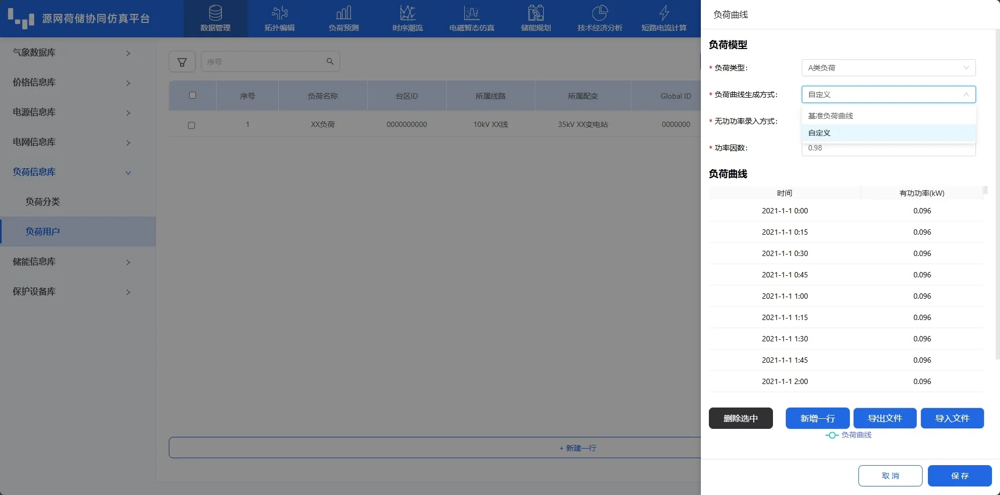

本节主要介绍负荷信息库的设备参数录入、编辑、导入及导出等功能使用方法，并对使用过程中遇到的常见问题进行解答。

## 功能定义

负荷信息库主要用于录入目标源网荷储系统中不同负荷的数据信息。为了方便用户对负荷模型进行快速构建，同时考虑到后期的仿真优化，用户需通过**负荷分类**与**负荷用户**两个子模块完成负荷配置。其中，**负荷分类**所建模型将用于**负荷用户**-**负荷曲线**-**负荷类型**参数绑定；**负荷分类**所建模型将用于后续拓扑建模时与元件的**设备待选类型**参数进行绑定，同一型号的设备参数可以绑定至多个元件的对应参数上，从而实现设备额定参数数据的复用，简化用户输入。

## 功能说明

本模块的界面的布局与基本功能与 [价格信息库](../20-price-info-database/index.md) 类似，此节不再赘述。

### 负荷分类

在**负荷分类**页面下方，点击**新建一行**新建一个负荷类型。

在新建行，用户可以采用类似编辑 excel 表格的形式编辑目标数据，编辑后平台回自动校验用户编辑的数据合法性，数据格式不对时会提示“验证错误，请检查格式!”。用户在编辑完数据后，单击空白区域，平台会自动保存编辑数据，如下图所示。

用户可通过点击目标行的**点击编辑**，可在弹窗中编辑相关参数，这里以编辑**负荷可调节时段**为例。在弹窗中，相似地，用户可以采用类似 excel 表格的形式编辑目标数据，或在含下拉箭头单元格通过选择下拉选项配置参数，如下图所示。用户将鼠标悬浮在展示区曲线图中，可查看单点数据。通过鼠标滚轮或拉动右侧和下方的缩放条，可对展示曲线进行缩放，以查看特定时间特定值区间的散点详情。确认无误后，用户点击**保存**或者**取消**退出弹窗，完成负荷分类建立与参数配置。

### 负荷用户

切换至**负荷用户**页面，在页面下方，点击**新建一行**新建一个负荷用户。

在新建行，用户可以采用类似编辑 excel 表格的形式编辑目标数据，编辑后平台回自动校验用户编辑的数据合法性，数据格式不对时会提示“验证错误，请检查格式!”。用户在编辑完数据后，单击空白区域，平台会自动保存编辑数据，如下图所示。

用户可通过点击负荷曲线列对应目标行的**点击编辑**，可在弹窗中负荷曲线编辑参数。**负荷类型**参数关联通过**用户分类**已建立的分类用户，用户可在下拉框中进行选择。**负荷曲线生成方式**可选择已建立的分类用户关联的**基础曲线**，如下图所示。

在弹窗中，相似地，用户可以采用类似 excel 表格的形式编辑其它目标数据，或在含下拉箭头单元格通过选择下拉选项配置参数，如下图所示。用户将鼠标悬浮在展示区曲线图中，可查看单点数据。通过鼠标滚轮或拉动右侧和下方的缩放条，可对展示曲线进行缩放，以查看特定时间特定值区间的散点详情。确认无误后，用户点击**保存**或者**取消**退出弹窗，完成负荷分类建立与参数配置。

## 常见问题
  
能否修改设备典型库？  
:   CloudPSS DSLab 官网的典型库不支持修改，对于服务器版本，管理员账户可以修改典型库，修改后该服务器下所有用户即可导入。