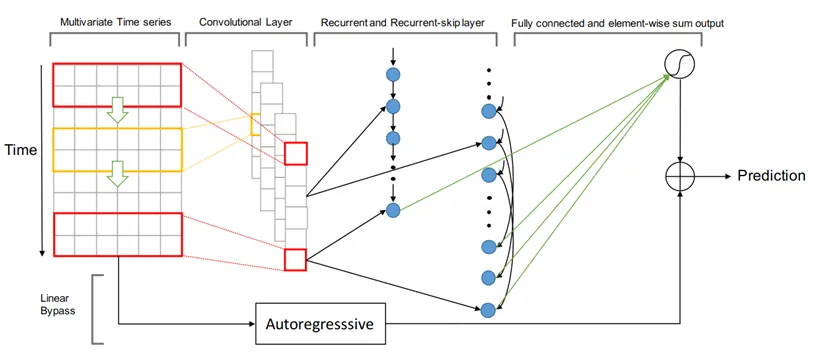

本节主要介绍 DSLab 平台源网荷储协同仿真平台负荷预测的基本原理。

## 功能定义

电力负荷预测是电力系统规划的重要组成部分，也是电力系统经济运行的基础，其对电力系统规划和运行都极其重要。

电力系统负荷预测是根据电力负荷、经济、社会、气象等的历史数据，探索电力负荷历史数据变化规律对未来负荷的影响，从而对未来的用电功率或用电量进行预测。为电力系统规划和运行提供可靠的决策依据。

DSLab 平台负荷预测主要针对用户在数据管理模块录入的各类电源和负荷，依靠历史数据进行预测，为后续规划和优化等功能提供基础数据。

## 功能说明

时间序列数据预测从不同角度看有不同分类：
1.	从实现原理的角度，可以分为传统统计学，机器学习（又分非深度学习和深度学习）以及多种方法混合。
2.	按输入变量区分，可以分为单变量（自回归）预测和多变量（协变量）进行预测，区别在于维度中是否含有协变量，例如预测未来销售量时，如果只接受时间和历史销售量数据，则是自回归预测；如果可以接受天气、负荷密度、经济指数、政策事件分类等其他相关变量（称为协变量），则称为使用协变量进行预测。
3.	按输出结果区分，可以分为确定性的点预测和概率预测，很多模型只提供了点预测而不提供概率预测，点预测模型后再加蒙特卡洛模拟（或其他转化为概率预测的方式）往往不能准确反映模型输出的预测概念，而在大多数场景下，概率预测更贴近事实情况，对于未来的预测本身就应该是一种概率分布。
4.	按照预测时间来分，有超短期、短期、中期、长期及超长期预测，具体的时间划分方法尚未有严格定义。一般短期指10点以内的预测，一般为1点的15min或1h预测；长期则是指预测未来某月、年等。
5.	在神经网络模型中，从算法实现的原理，按照输入与输出变量的特征来分类。1. 一般利用神经网络模型预测负荷时，输入的负荷数据为多个负荷的多维数据，此时如果要预测所有负荷，可以每次对每一个负荷训练一个模型，也可以利用一个神经网络同时预测所有负荷（增加神经网络的输出层维度，此时可能训练难度角度，精度可能降低，主要看输入数据的质量，若数据质量差，关联性低，多模型效果很差），分为单模型和多模型神经网络；2. 按照输出变量的长度来分类，可输出单个时间步的负荷数据，也可以输出多个时间步的负荷数据，分为单步预测和多步预测，一般来说，多部预测模型效果要差一些。若用单步预测模型预测多时间步时，可以循环滚动预测，其误差不断叠加，其预测效果在时间步多时难以控制；3. 按照输入与输出的关系来看：有利用多个历史数据预测未来1个时刻数据的“多对一”，也有预测未来多个时刻的“多对多”，利用“多对一”模型预测未来多个时刻数据时，需要循环滚动预测，误差叠加可能造成预测效果难以控制。
6.	能源电力负荷数据预测是时间序列数据预测的一种，既可以用传统的时间序列数据预测方法进行预测，如趋势外推法、回归分析法、灰色预测法、神经网络法及组合预测法等；也有适合能源电力负荷预测的算法，通过研究电力负荷数据特征，结合电网规划需求，常用的能源电力负荷预测方法有比例系数增长法、负荷密度法、最大负荷利用小时数法和大电力用户法等。

## 算法简介

### 传统预测方法

传统预测方法主要从研究负荷数据变化的规律趋势入手，结合统计概率和数学优化相关理论，构建负荷模型，通过模型进行负荷预测。主要有时序数据预测（建立负荷与时间的关系）、线性回归、自回归（负荷与历史负荷数据的关系）、灰色模型、时序分解（将负荷数据拆分成：长期趋势变动T、季节变动S(显式周期，固定幅度、长度的周期波动)、循环变动C(隐式周期，周期长不具严格规则的波动)和不规则变动I）方法等。下面对传统方法进行简单介绍：

1.	趋势外推法:趋势外推法预测是最为常见的一类方法，一般根据时间序列的历史值来预测其未来值。趋势外推法有多种不同的方法，如果预测对象的历史数据构成了基本的单调序列，则可采用基本预测方法，包括动平均法、指数平滑法等。其中，动平均法，又称滑动平均法(moving average)或移动平均法，是对一组时间序列数据进行算术平均值计算，并以此为依据进行预测，包括一次动平均法、加权动平均法和二次动平均法等。指数平滑法是一种序列分析法，其拟合值或预测值是对历史数据的加权算术平均值，并且近期数据权重大，远期权重小，因此对接近目前时刻的数据拟合较为精准，包括简单指数平滑法、二次指数平滑法等。

2.	灰色模型预测:灰色预测法建立在灰色系统理论基础上，该系统用颜色形象地描述模型信息的已知程度。一般意义上的灰色模型为GM(u,h)，表示对h个变量建立u阶微分方程。灰色模型具有建模所需信息较少、建模精度较高等特点。

3. 指数平滑方法:Holt-Winters 方法作为著名的指数平滑方法，Holt (1957) 和 Winters (1960) 将 Holt 方法进行拓展用来捕获季节因素。Holt-Winters 季节性方法包括预测方程和三个平滑方程：一个用于水平 ，一个用于趋势 ，另一个用于季节性分量。然后以累加或累乘的方式叠加分量组成预测。

4. 自回归方法:ARIMA是自回归方法的一种常见模型，是非常流行的时间序列预测统计方法，它是自回归综合移动平均（Auto-Regressive Integrated Moving Averages）的首字母缩写。ARIMA模型建立在以下假设的基础上： 数据序列是平稳的，这意味着均值和方差不应随时间而变化。 通过对数变换或差分可以使序列平稳。一般在数据平稳度好，波动小，数据质量高，用ARIMA模型预测效果很好。可以与数据处理相关方法结合起来使用，如滤波，小波分析等方法，提前将噪音数据、异常数据等进行识别处理分析。

### 传统机器学习  
传统机器学习根据使用的数据是否有标签，可以分为监督学习（包括支持向量机SVM、决策树、随机森林等）和无监督学习（包括聚类、主成分分析PCA等）。机器学习主要应用在分类、回归、聚类等场景，其中，主要用于分类和回归的机器学习模型也可以用来预测，常见的分类算法有逻辑回归、决策树和支持向量机等，分类模型更多应用在离散的结果预测，如单步预测；回归模型可以通过拟合函数来建立输入和输出之间的关系，以预测未知数据的数值结果，主要应用在连续预测如一段时间的多步预测，常见的回归算法有线性回归、多项式回归和决策树回归等。下面介绍在分类、回归和预测模型中应用较多的SVM和决策树模型。

1. 决策树
:决策树代表的是对象属性与对象值之间的一种映射关系。树中每个节点表示某个对象，而每个分叉路径则代表某个可能的属性值，而每个叶节点则对应从根节点到该叶节点所经历的路径所表示的对象的值。
从数据产生决策树的机器学习技术叫做决策树学习，通俗说就是决策树。
决策树由3个主要部分组成，分别为决策节点，分支和叶子节点。其中决策树最顶部的决策节点是根决策节点，每一个分支都有一个新的决策节点。决策节点下面是叶子节点。每个决策节点表示一个待分类的数据类别或属性，每个叶子节点表示一种结果，整个决策的过程从根决策节点开始，从上到下。根据数据的分类在每个决策节点给出不同的结果。

2. SVM 支撑向量机
:SVM（Support Vector Machine）是一种主要用于分类问题的机器学习算法。在SVM中，我们将数据映射到一个高维空间中，通过求解最大间隔超平面，将不同类别数据分开。其中，“支持向量”是指离超平面最近的数据点。SVM 的优点是对噪声敏感度低，泛化能力强，但不足的地方是对大数据集的处理会出现比较大的挑战。

### 浅层神经网络

神经网络模仿人脑的神经元，神经网络是模仿生物脑结构和功能的一种信息处理系统，具有大规模并行结构，信息的分布式存储和并行处理，具有良好的自适应性、自组织性和容错性，具有较强的学习、记忆、联想、识别功能等。
神经网络因其强大的学习能力和简单方便的模型得到了广泛应用。根据网络层的复杂程度可以分为浅层神经网络和深度神经网络。其中，浅层网络在传统的利用多历史数据预测单个负荷某时刻负荷数据的“多对一”领域具有优势。下面介绍浅层神经网络中应用广泛的线性模型、多层感知器MLP和BP神经网络。
1. 线性模型：线性模型的核心是感知器（Perception），它是基本的处理元素，具有输入、输出，每个输入关联一个连接权重（connection weight），然后输出是输入的加权和。主要求解任务就是通过数据训练确定参数权重。在训练神经网络时，通过不断调整网络参数，使得神经网络逐渐收敛。
2. 多层感知器MLP
：多层感知器(Multi-Layer Perceptron，MLP)作为最经典的神经网络模型，是一种趋向结构的人工神经网。MLP包含输入层、中间隐藏层和输出层。MLP中引入激活函数后，从单纯的线性学习模型变为能够学习非线性的神经网络模型。由输入层、节点层和输出层组成，每一层全连接到下一层，每个节点都是一个带有非线性激活函数的神经元。通过监督学习训练确定神经网络的参数权重后，可以逼近任意的非线性函数。
3. BP神经网络
：反向传播（Back-Propagation）网络（BP网络）是最常用的神经网络模型之一。就是在MLP的基础上，加入了BP（Back Propagation，反向传播）算法，采用了梯度下降等优化算法进行参数调优的神经网络。BP网络可以理解为是利用“BP算法”进行训练的“多层感知机模型MLP”。

### 神经网络混合模型
真实的负荷数据大多是不平稳的，存在噪声数据、毛刺数据和异常数据等，数据质量不高，利用真实负荷数据训练模型时，容易导致预测模型不准确；而利用处理后的平稳数据训练的神经网络模型虽然训练结果好，但利用真实数据预测时，可能因为噪声等预测效果不好。
将时序分解、自回归、RNN、CNN和Attention等算法进行融合，可以利用它们各自的优点，提高时序预测的准确性和稳定性。这种融合的方法通常被称为“混合模型”。其中，RNN能够自动学习时间序列数据中的长期依赖关系；CNN能够自动提取时间序列数据中的局部特征和空间特征；Attention机制能够自适应地关注时间序列数据中的重要部分。通过将这些算法进行融合，可以使得时序预测模型更加鲁棒和准确。在实际应用中，可以根据不同的时序预测场景，选择合适的算法融合方式，并进行模型的调试和优化。
1. Decomposition：传统预测方法在寻找时序负荷数据规律过程中产生了大量的经验方法，如时序分解技术，认为时序数据由趋势项trend、其他规律项和波动项组成。结合时序分解与神经网络的模型，可解释性较好。
2. Facebook Prophet：prophet 算法本质上是广义加法模型，是基于时间序列分解（季节项seasonal、趋势项 trend、剩余项 residual）和机器学习的拟合来做的，它最适用于具有强烈季节性影响和多个季节历史数据的时间序列。Prophet 对缺失数据和趋势变化具有稳健性，并且通常可以很好地处理异常值。
3. LSTNet
：LSTNet是一种用于时间序列预测的深度学习模型，其全称为Long- and Short-term Time-series Networks。LSTNet结合了长短期记忆网络（LSTM）和一维卷积神经网络（1D-CNN），能够有效地处理长期和短期时间序列信息，同时还能够捕捉序列中的季节性和周期性变化。
LSTNet模型的核心思想是利用CNN对时间序列数据进行特征提取，然后将提取的特征输入到LSTM中进行序列建模。LSTNet还包括一个自适应权重学习机制，可以有效地平衡长期和短期时间序列信息的重要性。LSTNet模型的输入是一个形状为(T, d)的时间序列矩阵，其中T表示时间步数，d表示每个时间步的特征维数。LSTNet的输出是一个长度为H的预测向量，其中H表示预测的时间步数。在训练过程中，LSTNet采用均方误差（MSE）作为损失函数，并使用反向传播算法进行优化。
4. DeepAR
：DeepAR 是一个自回归循环神经网络，使用递归神经网络 (RNN) 结合自回归 AR 来预测标量（一维）时间序列。在很多应用中，会有跨一组具有代表性单元的多个相似时间序列。DeepAR 会结合多个相似的时间序列，例如是不同方便面口味的销量数据，通过深度递归神经网络学习不同时间序列内部的关联特性，使用多元或多重的目标个数来提升整体的预测准确度。DeepAR 最后产生一个可选时间跨度的多步预测结果，单时间节点的预测为概率预测，默认输出P10，P50和P90三个值。这里的P10指的是概率分布，即10%的可能性会小于P10这个值。通过给出概率预测，既可以综合三个值给出一个值预测，也可以使用P10 – P90的区间做出相应的决策。
5. LSTM-Attention
：可考虑将LSTM和Attention机制结合起来，在LSTM的输出后增加Attention层，通过注意力机制加权，重新分配得到预测结果

###	深度学习预测
由于浅层学习的局限性，无法充分利用历史数据，在复杂多对多序列的多模型中难以满足精度预期。因此，深度学习神经网络预测方法在负荷预测领域取得了快速发展。其中，时序数据预测主要有循环神经网络系列和基于注意力机制的transformer系列。

算法示意图如下：

####	循环神经网络
RNN网络兼顾了时序时间的先后性和神经网络非线性学习能力，这种网络结构非常适合时序数据的分析。
1. 循环神经网络RNN
：时间序列数据中，时间顺序和数据标签同样重要，全连接的人工神经网络（如MLP）模型主要利用数据标签去训练模型，难以利用时间序列的上下文数据进行学习训练。循环神经网络RNN模型在输入和输出层的中间隐藏层引入了循环机制，其每一时刻的隐藏层不仅由该时刻的输入层决定，还由之前时刻的隐藏层决定。因此，RNN对具有序列特性的数据非常有效，能够更好地学习利用历史时间序列数据的上下文关系。
2. 长短时记忆网络LSTM
：循环神经网络RNN随着数据量增大，时间间隔的增长，在模型训练的过程中，RNN会丢失之前输入的重要信息，可能出现梯度爆炸和梯度消失从而导致预测模型失效。由于RNN只能对较短的时间序列数据进行记忆，并不能真正的处理好长距离的依赖，一种改进之后的循环神经网络出现了：长短时记忆网络(Long Short Term Memory Network, LSTM)，它成功的解决了原始循环神经网络的缺陷，成为当前最流行的RNN。
LSTM的基本单元是由遗忘门(forget gate)、输入门(input gate)和输出门(output gate)组成。输入门由上一个单元的输出h_(t-1)、状态C_(t-1)和本次的输入x_t共同构成。相比原始RNN的隐藏层只有一个状态h，它对于短期的输入非常敏感，之前长期输入数据的影响几乎可以忽略。LSTM增加了一个状态C来保存长期的状态，通过这条代表长期记忆的信息流来解决长距离依赖问题。
3. 门控循环单元GRU
：LSTM模型的成功也产生了很多变体，其中GRU (Gated Recurrent Unit)便是最简单最经典的一种。GRU对LSTM做了两个简化：1.将输入门、遗忘门、输出门变为两个门：更新门(Update Gate)和重置门(Reset Gate)。2.将单元状态与输出合并为一个状态。
LSTM最重要的贡献是引入状态门C_t来记忆长期的输入数据，既然状态门C_t已经包含了之前的输出h_(t-1)信息了，于是GRU就移除了h，合并为一个状态。尽管GRU对LSTM做了很多简化，但由于GRU参数更少，收敛速度更快，同时却保持着和LSTM相同的效果，开始逐渐取代LSTM。

####	注意力机制Attention
注意力机制（Attention）是一种用于解决序列输入数据中重要特征提取的机制，也被应用于时序预测领域。Attention机制可以自动关注时间序列数据中的重要部分，为模型提供更有用的信息，从而提高预测精度。在应用Attention进行时序预测时，需要利用Attention机制自适应地加权输入数据的各个部分，从而使得模型更加关注关键信息，同时减少无关信息的影响。Attention机制不仅可以应用于RNN等序列模型，也可以应用于CNN等非序列模型，是目前时序预测领域研究的热点之一。
1. 注意力机制Attention 
：随着数据的增多，神经网络要记住海量输入数据，模型就变得越来越复杂，且时序数据中不同位置的数据对预测数据的影程度可能并不相同。参考人脑在处理信息过程中的注意力聚焦机制，当人接收到大量信息时，往往会聚焦在重要的信息上，即人脑对所有信息的关注程度是不均衡的，是有一定的侧重点，会将主要的精力分配在重要信息上。对于时序负荷数据预测来说，下一个时刻的负荷受上一个时刻负荷和第前24h的负荷影响可能更大，而受前5天的负荷或者第前12h的负荷影响可能较小。Attention注意力机制的引入来提高神经网络处理复杂信息的能力，Attention的本质就是一个权重加权层，通过学习训练给予重要的数据一个大的权重，给予不重要的数据一个小的权重，从而实现注意力机制。
2. Transformer
：Transformer是一种广泛应用于自然语言处理（NLP）领域的神经网络模型，其本质是一种序列到序列（seq2seq）的模型。Transformer将序列中的每个位置视为一个向量，并使用多头自注意力机制和前馈神经网络来捕捉序列中的长程依赖性，从而使得模型能够处理变长序列和不定长序列。
在时序预测任务中，Transformer模型可以将输入序列的时间步作为位置信息，将每个时间步的特征表示为一个向量，并使用编码器-解码器框架进行预测。具体来说，可以将预测目标的前N个时间步作为编码器的输入，将预测目标的后M个时间步作为解码器的输入，并使用编码器-解码器框架进行预测。编码器和解码器都是由多个Transformer模块堆叠而成，每个模块由多头自注意力层和前馈神经网络层组成。
在训练过程中，可以使用均方误差（MSE）或平均绝对误差（MAE）等常见的损失函数来度量模型的预测性能，使用随机梯度下降（SGD）或Adam等优化算法来更新模型参数。在模型训练过程中，还可以使用学习率调整、梯度裁剪等技术来加速模型的训练和提高模型的性能。
3. Informer
：Informer是一种基于Transformer模型的时序预测方法，由北京大学深度学习与计算智能实验室于2020年提出。与传统的Transformer模型不同，Informer在Transformer模型的基础上引入了全新的结构和机制，以更好地适应时序预测任务。Informer方法的核心思想包括：  
长短时记忆（LSTM）编码器-解码器结构：Informer引入了LSTM编码器-解码器结构，可以在一定程度上缓解时间序列中的长期依赖问题。  
自适应长度注意力（AL）机制：Informer提出了自适应长度注意力机制，可以在不同时间尺度上自适应地捕捉序列中的重要信息。  
多尺度卷积核（MSCK）机制：Informer使用多尺度卷积核机制，可以同时考虑不同时间尺度上的特征。  
生成式对抗网络（GAN）框架：Informer使用GAN框架，可以通过对抗学习的方式进一步提高模型的预测精度。  
在训练阶段，Informer方法可以使用多种损失函数（如平均绝对误差、平均平方误差、L1-Loss等）来训练模型，并使用Adam优化算法来更新模型参数。在预测阶段，Informer方法可以使用滑动窗口技术来预测未来时间点的值。
4. AutoFormer
：AutoFormer是一种基于Transformer结构的时序预测模型。相比于传统的RNN、LSTM等模型，AutoFormer具有以下特点：  
自注意力机制：AutoFormer采用自注意力机制，可以同时捕捉时间序列的全局和局部关系，避免了长序列训练时的梯度消失问题。  
Transformer结构：AutoFormer使用了Transformer结构，可以实现并行计算，提高了训练效率。
多任务学习：AutoFormer还支持多任务学习，可以同时预测多个时间序列，提高了模型的效率和准确性。    
AutoFormer模型的具体结构类似于Transformer，包括编码器和解码器两部分。编码器由多个自注意力层和前馈神经网络层组成，用于从输入序列中提取特征。解码器同样由多个自注意力层和前馈神经网络层组成，用于将编码器的输出转化为预测序列。此外，AutoFormer还引入了跨时间步的注意力机制，可以在编码器和解码器中自适应地选择时间步长。总体而言，AutoFormer是一种高效、准确的时序预测模型，适用于多种类型的时间序列预测任务。
5. FEDformer
：FEDformer是一种基于Transformer模型的神经网络结构，专门用于分布式时序预测任务。该模型将时间序列数据分成多个小的分块，并通过分布式计算来加速训练过程。FEDformer引入了局部注意力机制和可逆注意力机制，使得模型能够更好地捕捉时序数据中的局部特征，并且具有更高的计算效率。此外，FEDformer还支持动态分区、异步训练和自适应分块等功能，使得模型具有更好的灵活性和可扩展性。

## 常见问题

预测是否可靠，准吗？
:   负荷预测同其他任何预测问题类似，是基于对过去和现在的认知，对未来进行预测，预测的可靠性取决于预测者对预测对象变化规律的认知熟悉情况，而预测对象未来的发展存在多种可能，预测本质也是对未来趋势的可能性预测。对电力负荷而言，负荷预测是电力系统规划和运行的重要前提，而系统的规划决策又会反过来影响负荷，因此未来负荷的变化是可以控制和干预的，受决策者执行、调整等控制影响。
对于风机、光伏出力等电源预测，其影响因素更多，如历史时序数据、设备模型、地理位置、气象数据等等，其预测难度更大。
预测的可靠性，跟数据本身、预测模型、预测时长等多个因素有关。一般而言，数据质量可靠（如110kV等高电压等级的电力负荷）的短时超短时预测精度很高。

如何提升负荷预测效果？
:   1. 确保基础数据的合理性，准确性和可靠性：预测是为了得到合理的，可信的，准确的结果，首先需要确保基础数据的可靠性，尽可能减少数据错误，如历史负荷数据的准确性，多变量预测时确保相关数据的可靠性、相关性和全面性，如温度，风速，雨量和辐照等；
:   2. 选取先进的预测方法：选择最适合当前负荷的预测算法，综合当前科学的预测模型，对模型参数进行合理估计，调试合理的模型参数，并对比多个预测模型，综合分析，组合优化，通过优中选优，找到最适合当前负荷的预测模型。
