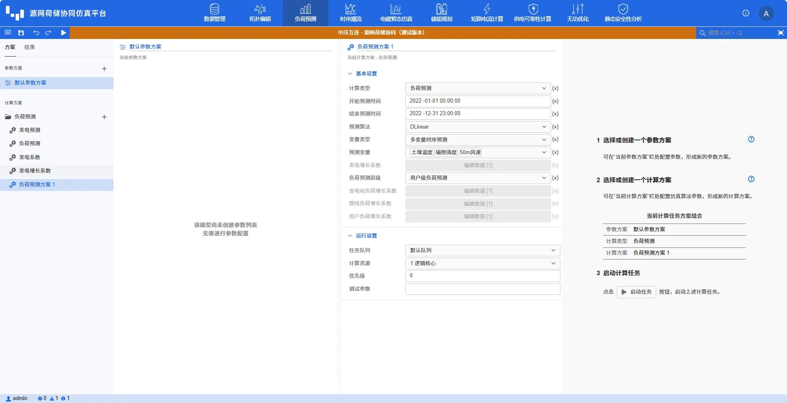
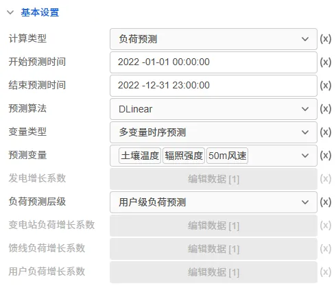
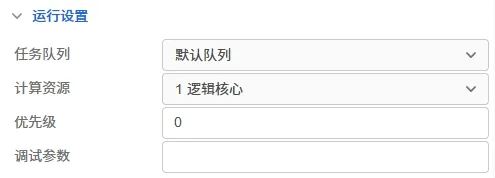

本节主要介绍 DSLab 源网荷储协同仿真平台进行负荷预测时需要设置的计算全局参数，包括开始与结束预测时间、预测模式、负荷预测算法以及相关运行参数设置等。

## 功能定义

设置 DSLab 负荷预测的一些计算全局参数。

## 功能说明

在运行标签页，选中计算方案中的**负荷预测方案**，可对负荷预测方案进行设置。目前源网荷储的负荷预测参数组分为基本设置和运行设置，下面分别对其进行介绍。

### 基本设置

负荷预测基本设置的参数如下图所示：

| 参数名 | 含义 | 说明 |
| :--- | :--- | :--- | 
| 计算方案类型 | 计算的功能类型 | 可选项为**负荷预测**（默认值）、**系统层级分析**；系统层级分析为负荷预测算法-增长因子法的前置数据预处理，分析生产配电系统的变压器、馈线和负荷的层级关系，方便用户编辑对应层级的增长因子 |
| 开始预测时间 | 系统负荷预测的开始时间 | 默认设置为 **2022-01-01 00:00:00** ，输入格式为 `yyyy-mm-dd hh:mm:ss` |
| 结束预测时间 | 系统负荷预测的结束时间 | 默认设置为 **2022-12-31 23:00:00** ，输入格式为 `yyyy-mm-dd hh:mm:ss` |
| 预测模式 | 指定预测层级 | 可选项为**变电站级负荷预测**(默认值)、**馈线级负荷预测**和**用户级负荷预测**|
| 负荷预测算法 | 负荷预测所选用的算法 | 可选项为**增长因子法**（默认值）、**神经网络**、**Prophet** 和 **ARIMA**；选择增长因子法时，使用默认增长因子，若用户需自定义增长因子，可先运行**系统层级分析**，然后对**变电站参数编辑**、**馈线参数编辑**和**用户参数编辑**进行编辑|
| 变电站参数编辑 | 指定变压器元件增长因子 | 默认为空 |
| 馈线参数编辑 | 指定馈线元件增长因子 | 默认为空 |
| 用户参数编辑 | 指定用户负荷元件增长因子 | 默认为空 |

### 运行设置

负荷预测运行设置的参数如下图所示：

| 参数名 | 含义 | 说明 |
| :--- | :--- | :--- | 
| 任务队列 | 任务运行使用的队列 | 默认设置为**默认队列** |
| 计算资源 | 任务运行使用的计算资源 | 默认设置为**1逻辑核心** |
| 优先级 | 任务运行的优先级 | 默认值为 0 |
| 调试参数 | 任务调试时使用的调试参数 | 默认为空 |

## 常见问题

什么时候需要进行**系统层级分析**?
:   系统层级分析为选择增长因子法时的前置数据预处理，分析生产配电系统的变压器、馈线和负荷的层级关系，方便用户编辑对应层级的增长因子。选择增长因子法时，建议用户先进行系统层级分析，系统会根据拓扑自动生成**变电站参数编辑**、**馈线参数编辑**和**用户参数编辑**的默认参数方案，用户可采用 excel 的编辑方式对默认参数方案进行修改，如下图所示。用户也可直接进行参数编辑，但需保证名称列的输入与对应拓扑元件名称一致。
