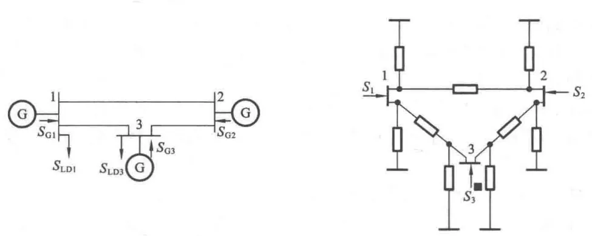

本节主要介绍潮流计算的基本概念以及 DSLab 平台时序潮流的基本原理。

## 功能定义

新型电力系统的源-网-荷-储的特征各异，各个方面的转变均会给电力系统带来巨大的影响。电力系统特别是配电网中存在大量随机性和不稳定性，且大电网+智能配网+多能微网使得能源网络高度灵活，严重影响配电网的电能质量、安全可靠性和调度运行。DSLab 平台时序潮流模块提供多种算法，支撑大电网 8760h+的全景动态潮流仿真模拟，分析电力系统中的风险点和各个工况下的应对策略。

对于潮流计算，平台提供牛顿法和隐 Zbus 法两种算法供选择。

## 功能说明

### 潮流计算的概念
**潮流**指电力系统中各个节点的电压和各支路的功率的稳态分布，而**潮流计算**是对给定系统运行条件（如各母线上的电压幅值及相角、网络中的功率分布及功率损耗等）计算系统运行状态。潮流计算是研究电流系统规划和运行方案的最基本的计算方法。

### 潮流计算模型
潮流计算的求解基于电路中的节点电压方程 $\dot{\mathbf{I}}_n=\mathbf{Y}_n\dot{\mathbf{U}}_n$ ：节点导纳矩阵 $\mathbf{Y}_n$ 描述了网络中的元件特性约束和网络拓扑的连接关系，节点电压方程描述了网络中各个节点的电流与电压关系。

但潮流计算的边界条件是复功率，需要建立功率与电压之间的关系，即功率方程（潮流方程）。可以将节点电流用节点功率和电压表示：

$$
\dot{I}_i=\frac{S_i^*}{U_i^*}=\frac{P_i-\mathrm{j}Q_i}{U_i^*}
$$

将电流表达式带入节点电压方程，可得到潮流方程：

$$
P_i-jQ_i=U_i^*\sum_{j=1}^nY_{ij}\dot{U}_j\left(i=1,2,\cdots,n\right)
$$

令 $Y_{ij}=G_{ij}+\mathrm{j}B_{ij}$，$\dot{U}_i=U_i\angle\delta_i=U_ie^{\mathrm{j}\delta i}$，带入潮流方程，将潮流方程用极坐标进行表示：

$$
\begin{aligned}
P_{i}-\mathrm{j}Q_{i}& =U_ie^{-\mathrm{j}\delta i}\sum_{j=1}^n\Bigl(G_{ij}+\mathrm{j}B_{ij}\Bigr)U_je^{\mathrm{j}\delta j}  \\
&=U_i\sum_{j=1}^nU_j\left(G_{ij}+\mathrm{j}B_{ij}\right)e^{-\mathrm{j}\delta ij}\\
&=U_i\sum_{j=1}^nU_j(G_{ij}+jB_{ij})(\cos\delta_{ij}+j\sin\delta_{ij})
\end{aligned}
$$

将实部虚部分开，得到潮流计算中的求解方程：

$$
\begin{cases}P_i=U_i\sum_{j=1}^nU_j(G_{ij}\cos\delta_{ij}+B_{ij}\sin\delta_{ij})\\
\\Q_i=U_i\sum_{j=1}^nU_j(G_{ij}\sin\delta_{ij}-B_{ij}\cos\delta_{ij})\end{cases}
$$

从以上分析可以看出，一个节点包含 4 个运行变量（$P$, $Q$, $U$, $\delta$），对应了 2 个方程。那么对 n 个节点的系统有 4n 个变量，2n 个方程，若每个节点给定 2 个变量值，可通过方程求解剩余的 2n 个未知量。

通过不同的节点变量给定方式，电力系统节点可分为 PQ、PV 和平衡节点
- PQ 节点：节点的有功功率 $P$ 和无功功率 $Q$ 是给定的，节点电压 $U$, $\delta$ 是待求量。
- PV 节点：节点的有功功率 $P$ 和电压幅值 $U$ 是给定的，节点的无功功率 $Q$ 和电压的相位 $\delta$ 是待求量。
- 平衡节点：由于全系统功率必须平衡，功率损耗 $P_{loss}$、$Q_{loss}$ 是状态变量的函数，事先未知。需要一个节点 $P$ 和 $Q$ 不能给定，给定 $U$，$\delta$ 的节点，用于全系统功率平衡，故称为平衡节点。

由于潮流计算方程是一个非线性方程组，直接求解非常困难，在计算机求解中会使用牛顿-拉夫逊法进行求解。

### 潮流计算基本原理
#### 牛顿-拉夫逊法求解潮流

 基于牛顿-拉夫逊的潮流算法的基本步骤可以总结如下：
- 形成节点导纳矩阵；
- 给各节点电压相角赋初值；
- 给各节点电压相角代入式 2、式 3，求出修正方程式的常数项向量；  
- 将节点电压相角带入式 5、式 6，求出雅可比矩阵元素； 
- 求解方程式 7，求节点各相电压相角修正向量；
- 根据式 8，求取节点电压的新值；
- 检查是否收敛，如不收敛，则以各节点电压的新值作为初值自第 3 步重新开始进行下一次迭代，否则转入下一步；
- 计算支路功率分布，PV 节点无功功率和平衡节点注入功率。  

**计算功率不平衡列向量**
$$
\Delta S = {[\Delta P,\Delta Q]^T}{\rm{ = }}{[\Delta {P_1},...,\Delta {P_{{\rm{n - }}1}},{\kern 1pt} \Delta {Q_1},...,\Delta {Q_m},]^T}{\kern 1pt} {\kern 1pt} {\kern 1pt} {\kern 1pt} {\kern 1pt} {\kern 1pt} {\kern 1pt} {\kern 1pt} {\kern 1pt} {\kern 1pt} {\kern 1pt} {\kern 1pt} {\kern 1pt} {\kern 1pt} {\kern 1pt} {\kern 1pt} {\kern 1pt} {\kern 1pt} {\kern 1pt} {\kern 1pt}
$$

上式表示了一个有 n 个母线的系统的功率不平衡矩阵，其中有 $m$ 个 PQ 母线，$n-m-1$ 个 PV 母线，1 个平衡母线。   

PQ 母线的功率不平衡量为该节点的功率给定值与用当前电压计算出来的实际功率的偏差，可表示为：

$$
\left\{ \begin{array}{l}
\Delta {P_i} = {P_i} - \left| {{V_i}} \right|\sum\limits_{j = 1}^n {\left| {{V_j}} \right|} ({G_{ij}}\cos {\theta_{ij}} + {B_{ij}}\sin {\theta_{ij}})\\
\Delta {Q_i} = {Q_i} - \left| {{V_i}} \right|\sum\limits_{j = 1}^n {\left| {{V_j}} \right|({G_{ij}}\sin {\theta_{ij}} - {B_{ij}}\cos {\theta_{ij}})} 
\end{array} \right.{\kern 1pt} {\kern 1pt} {\kern 1pt} {\kern 1pt} {\kern 1pt} {\kern 1pt} {\kern 1pt} {\kern 1pt} {\kern 1pt} {\kern 1pt} {\kern 1pt} {\kern 1pt} {\kern 1pt} {\kern 1pt} {\kern 1pt} {\kern 1pt} {\kern 1pt} {\kern 1pt} {\kern 1pt} {\kern 1pt}
$$

其中，$i=1,2,...,m.$

PV 节点电压幅值给定，不作为变量。同时，该点无法预先给定无功功率。PV 节点的无功功率不平衡量不作为约束条件，因此，在迭代过程中只列出 PV 节点的**有功功率偏差方程。**

$$
\Delta {P_i} = {P_i} - \left| {{V_i}} \right|\sum\limits_{j = 1}^n {\left| {{V_j}} \right|} ({G_{ij}}\cos {\theta_{ij}} + {B_{ij}}\sin {\theta_{ij}}){\kern 1pt} {\kern 1pt} {\kern 1pt} {\kern 1pt} {\kern 1pt} {\kern 1pt} {\kern 1pt} {\kern 1pt} {\kern 1pt} {\kern 1pt} {\kern 1pt} {\kern 1pt} {\kern 1pt}
$$

其中，$i=1,2,...,n-m-1.$

**计算雅可比矩阵**
$$
J=\begin{bmatrix}
H & N\\ 
J & L\\
\end{bmatrix} {\kern 1pt}
$$

雅可比矩阵的元素如下所示:

非对角元素：

$$
\left. \begin{array}{l}
{H_{ij}} =  - {V_i}{V_j}({G_{ij}}\sin {\theta_{ij}} - {B_{ij}}\sin {\theta_{ij}})\\
{N_{ij}} =  - {V_i}{V_j}({G_{ij}}\cos {\theta_{ij}} + {B_{ij}}\sin {\theta_{ij}})\\
{J_{ij}} = {V_i}{V_j}({G_{ij}}\cos {\theta_{ij}} + {B_{ij}}\sin {\theta_{ij}})\\
{L_{ij}} =  - {V_i}{V_j}({G_{ij}}\sin {\theta_{ij}} - {B_{ij}}\cos {\theta_{ij}})
\end{array} \right\}{\kern 1pt} {\kern 1pt} {\kern 1pt} {\kern 1pt} {\kern 1pt} {\kern 1pt} {\kern 1pt} {\kern 1pt} {\kern 1pt} {\kern 1pt} {\kern 1pt} {\kern 1pt} {\kern 1pt}
$$

对角元素：

$$
\left. \begin{array}{l}
{H_{ii}} = {Q_{\rm{i}}} + {B_{ii}}V_i^2\\
{N_{ii}} =  - {P_{\rm{i}}} - {G_{ii}}V_i^2\\
{J_{ii}} =  - {P_{\rm{i}}} + {G_{ii}}V_i^2\\
{L_{ii}} =  - {Q_{\rm{i}}} + {B_{ii}}V_i^2
\end{array} \right\}{\kern 1pt} {\kern 1pt} {\kern 1pt} {\kern 1pt} {\kern 1pt} {\kern 1pt} {\kern 1pt} {\kern 1pt}
$$

**基于牛顿-拉夫逊的潮流算法**  

$$
\begin{bmatrix}
{\Delta P}\\ 
{\Delta Q}\\
\end{bmatrix}=\begin{bmatrix}
H & N\\ 
J & L\\
\end{bmatrix}\begin{bmatrix}
{\Delta \theta }\\
{{V^{ - 1}}\Delta V}
\end{bmatrix} {\kern 1pt} {\kern 1pt} {\kern 1pt} {\kern 1pt} {\kern 1pt} {\kern 1pt} {\kern 1pt} {\kern 1pt} {\kern 1pt} {\kern 1pt} {\kern 1pt} {\kern 1pt}
$$

其中 $\Delta V$ 为节点电压幅值的修正量：

由上式可求得第 k + 1 次迭代的修正量：

$$
\begin{bmatrix}
{{\theta ^{(k + 1)}}}\\
{{V^{(k + 1)}}}
\end{bmatrix}=\begin{bmatrix}
{{\theta ^{(k)}}}\\
{{V^{(k)}}}
\end{bmatrix}\begin{bmatrix}
{\Delta {\theta ^{(k + 1)}}}\\
{\Delta {V^{(k + 1)}}}
\end{bmatrix} {\kern 1pt} {\kern 1pt} {\kern 1pt} {\kern 1pt} {\kern 1pt} {\kern 1pt} {\kern 1pt} {\kern 1pt} {\kern 1pt} {\kern 1pt} {\kern 1pt} {\kern 1pt}
$$

这样反复迭代计算，直至所有节点 $\Delta V < \varepsilon$ 和 $\Delta \theta<n$ 为止。

#### 隐Zbus法
隐式 Zbus 高斯法的求解步骤可以总结如下：  
1. 输入原始数据，并初始化各节点电压。  
2. 建立系统的节点导纳矩阵 $Y$，如果系统含有恒定阻抗负荷或并联电容器，则将导纳矩阵加入到节点导纳矩阵中。  
3. 将系统的平衡节点(一般为源点)和其余类型的节点(一般为负荷节点)进行分离，得到不包含平衡节点的 (n-1) 阶矩阵 $Y_{22}$。  
4. 对矩阵 $Y_{22}$ 进行矩阵 $LU$ 分解，其中($Y_{22}=LU$)。  
5. 利用功率和节点当前电压值(第一次迭代时取初始值)求出除平衡节点以外的其余节点的电流注入量 $I_2$。  
6. 由于直接求解矩阵 $Y_{22}$ 的逆矩阵较为困难。  
   构造中间变量 $y$
   $$
   y=UV_2
   $$
   式中，$U$ 为矩阵 $Y_{22}$ 矩阵 $LU$ 分解的 $U$
   因此，有：
   $$
   Y_{22} V_2=I_2 V_2- Y_{21} V_1
   $$
   $$
   LUV_2=I_2 V_2- Y_{21} V_1
   $$
   $$
   Ly=I_2 V_2- Y_{21} V_1
   $$
7. 通过等式向前迭代来求解 $y$。  
   $$
   y=L^{-1} (I_2 V_2- Y_{21} V_1)
   $$
8. 通过等式向后迭代来求解 $V_2$。  
   $$
   V_2=U^{-1} y
   $$
9. 计算同一节点前后两次迭代所得的电压差，将其与系统规定的收敛精度进行对比，如果小于收敛精度，则迭代结束。如果大于收敛精度，转入第5步。

当配电网中只有一个平衡节点，其余节点均为 PQ节点时，隐式Zbus高斯法具有良好的收敛性和有效性。但是当配电网中并入PV节点类型的DG时， 该方法可能会遇到潮流不收敛的问题，严重制约了隐式Zbus高斯法在潮流计算中的应用。