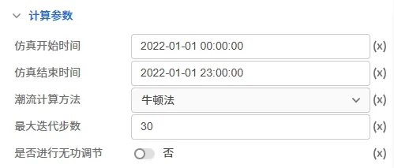
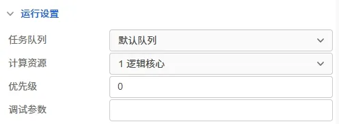

本节主要介绍 DSLab 源网荷储协同仿真平台进行时序潮流时需要设置的计算全局参数，包括开始与结束预测时间、预测模式、时序潮流算法以及相关运行参数设置等。

## 功能定义

设置 DSLab 时序潮流的一些计算全局参数。

## 功能说明

在运行标签页，选中计算方案中的**时序潮流方案**，可对时序潮流方案进行设置。目前源网荷储的时序潮流参数组分为计算参数和运行设置，下面分别对其进行介绍。

### 计算参数

时序潮流计算参数的参数如下图所示：

| 参数名 | 含义 | 说明 |
| :--- | :--- | :--- | 
| 仿真开始时间 | 仿真的开始时间 | 默认设置为 **2022-01-01 00:00:00** ，输入格式为 `yyyy-mm-dd hh:mm:ss` |
| 仿真结束时间 | 仿真的结束时间 | 默认设置为 **2022-01-01 23:00:00** ，输入格式为 `yyyy-mm-dd hh:mm:ss` |
| 潮流计算方法 | 潮流计算所使用的方法 | 可选项为**牛顿法**(默认值)和**隐Zbus法**|
| 最大迭代步数 | 系统/算法所允许的最大迭代次数 | 默认设置为 30|
| 是否进行无功调节 | 是否进行无功调节 | 可选项为**是**（默认值）和**否** |

### 运行设置

时序潮流运行设置的参数如下图所示：

| 参数名 | 含义 | 说明 |
| :--- | :--- | :--- | 
| 任务队列 | 任务运行使用的队列 | 默认设置为**默认队列** |
| 计算资源 | 任务运行使用的计算资源 | 默认设置为**1逻辑核心** |
| 优先级 | 任务运行的优先级 | 默认值为 0 |
| 调试参数 | 任务调试时使用的调试参数 | 默认为空 |

<!-- ## 常见问题 -->
