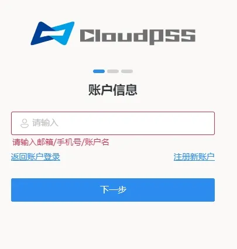
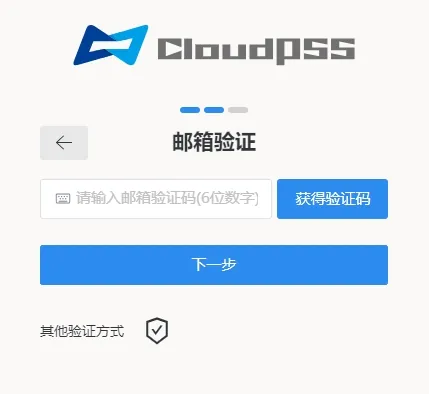
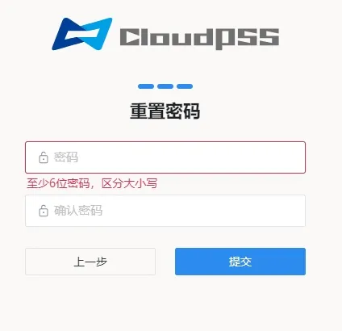

---

title: 注册并登录 CloudPSS 公网主站
description: 个人中心注册并登录 CloudPSS 公网主站文档

tags: 
- 个人中心

---

## 访问指南

打开浏览器，在浏览器地址栏输入 [www.cloudpss.net](https://www.cloudpss.net)，进入 **CloudPSS** 的网页主页。

> 为保证最佳显示效果，建议使用 **Chrome** 浏览器。

## 登录流程

如果您已经拥有账号，可按以下步骤登录：

1. 点击主页右上角的**登录**按钮，进入登录页面。
2. 在登录页面的相应位置填写您的用户邮箱/手机号/账户名，并点击**下一步**。
3. 输入您的登录密码，然后点击**登录**按钮，密码验证通过，即可成功登录。
4. 如您需要其他登录方式，也可以使用微信、邮箱、手机号、动态口令码、WebAuthn 来验证登录，该功能需要提前绑定用户的微信、邮箱、手机号、动态口令、WebAuthn，详情参见 [安全设置功能页](../../40-general-account-settings/20-account-security/index.md "安全设置")。

## 注册流程

如果您还没有账号，可以通过以下步骤注册新账户：

1. 从登录页面，点击**没有帐户？创建一个**进入注册页面。
2. 按照提示填写相应信息，并点击**下一步**按钮。
3. 输入您希望创建的密码，再次点击**下一步**按钮。
4. 进入身份验证界面，点击**获取验证码**以对注册所用的邮箱/手机进行验证。
5. 通过注册邮箱/手机获取注册码，并将其填入注册页面相应位置，点击**提交**完成注册。

:::tip 注册账户提醒
1. 注册账户的用户名为当前账户的唯一标识，不可重复，仅支持输入数字、字母、'-' 或 '_'，必须以字母开头，长度为 5 至 20 个字符。
2. 注册账户的密码至少 6 位，区分大小写。
:::

## 重置密码流程

如果您忘记了自己账号的密码，可以通过以下步骤来修改密码：

1. 从登录页面，点击**忘记了密码?** 进入重置密码页面。
2. 按照提示填写账户相应信息，并点击**下一步**按钮。
3. 进入身份验证界面，点击**获取验证码**以对注册所用的邮箱/手机/动态口令/ WebAuthn 进行验证。
4. 进入重置密码界面，按照要求重新输入新密码，点击**提交**完成修改密码。

## 常见问题

接收不到验证码怎么办？

:   若使用 QQ 邮箱、126 网易邮箱等进行注册，若无法接收到验证码，请使用注册邮箱发送一封任意内容邮件至 `<noreply@cloudpss.net>`，之后再尝试发送验证码。
