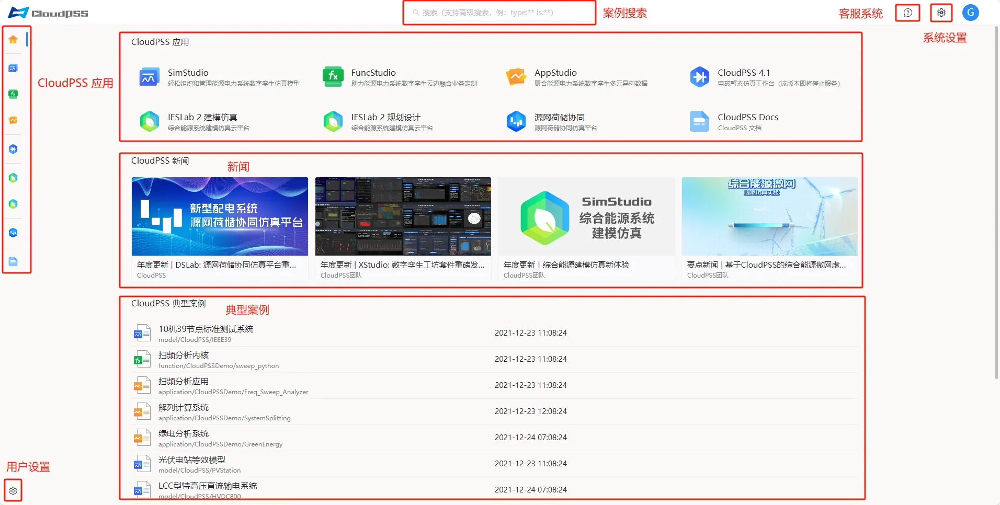
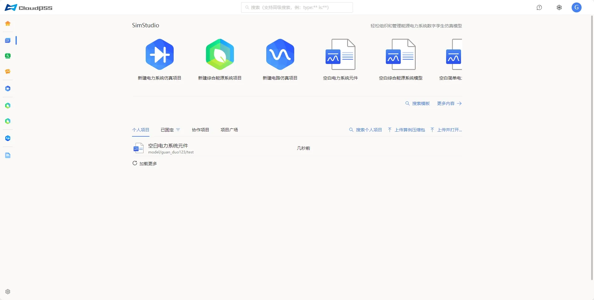
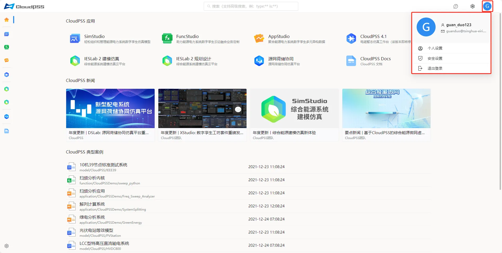
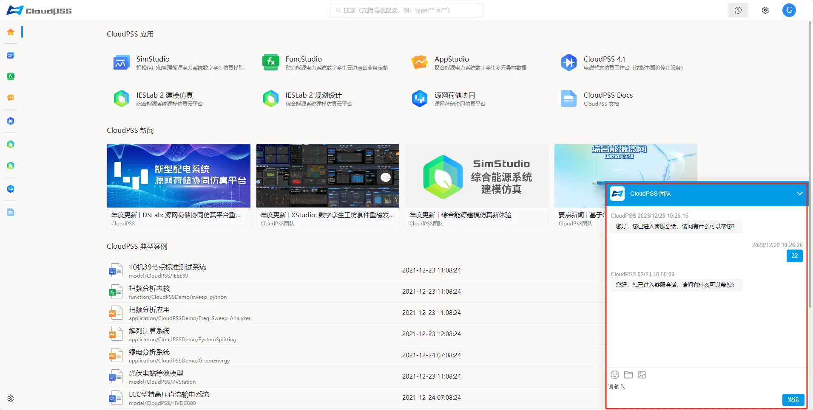

用户登录成功后，页面将跳转至 **CloudPSS 首页**，展示如下图所示。该界面包含了多个部分：**CloudPSS 应用**、**CloudPSS 新闻**、**CloudPSS 典型案例**、**案例搜索以及用户设置**、**系统设置**、**客服系统**等。

## CloudPSS 应用

**CloudPSS** 应用按顺序依次如下：

+ **SimStudio**

+ **FuncStudio**

+ **AppStudio**

+ **CloudPSS 4.1(该版本已停止更新)**

+ **IESLab 2 建模仿真** 

+ **IESLab 2 规划设计**

+ **源网荷储协同(DSLab)**

+ **CloudPSS Docs**

用户可以通过点击应用标签或左侧的功能按钮进行页面跳转，进入相应的应用中心，如下图所示。

## CloudPSS 新闻

**新闻动态**：展示由 **CloudPSS** 管理员发布的最新新闻信息。

## CloudPSS 典型案例

展示 **CloudPSS** 功能应用的典型案例项目。点击项目即可进入应用工作台。

## 案例搜索

用户可以在搜索栏内搜索 **CloudPSS** 的应用，包括典型案例项目和帮助文档。此外，支持 [高级搜索功能](../60-advanced-search/index.md "高级搜索功能")。

## 账户设置

通过点击页面左下角的**账户设置**按钮，用户可以进入账户设置页面修改**个人信息**，**账户安全设置**，**SDK token 管理**、**组织管理**和**任务管理**。

点击页面右上角用户头像，用户可以退出当前登录的账号或进行**账户设置**，如下图所示。

## 系统设置

点击用户头像左侧的**系统设置**按钮，用户可以切换软件系统语言和主题。用户首次登录时默认使用亮色主题，可以在此处切换为暗色主题，且该设置将在下次登录时保留。

## 客服系统

点击**系统设置**左侧的**客服系统**按钮，用户可以快速访问系统内置的**客服系统**。该功能为用户提供在线咨询服务。

