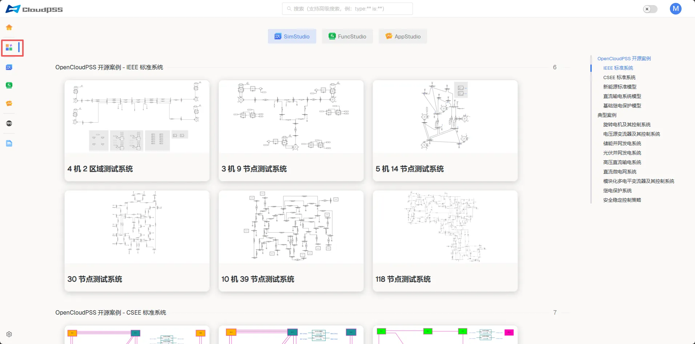
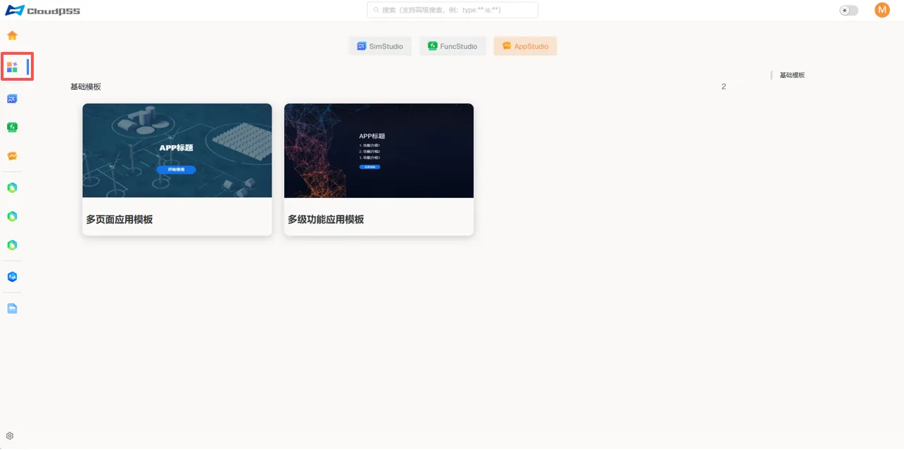

import Tabs from '@theme/Tabs'
import TabItem from '@theme/TabItem'

本节文档介绍 **个人中心-模板页** 的主要功能，包括 **SimStudio 模板**、**FuncStudio 模板** 和 **AppStudio 模板**。

:::tip
模板详情可以查看 [CloudPSS 案例](../../../../casehub/index.md)
:::

<Tabs>

<TabItem value="case1" label="SimStudio 模板">
**SimStudio 模板** 是 SimStudio 模型工坊的项目模板页面，是快速打开/新建 **SimStudio 模型** 的入口。

</TabItem>

<TabItem value="case2" label="FuncStudio 模板">
**FuncStudio 模板** 是 FuncStudio 函数工坊的项目模板页面，是快速打开/新建 **FuncStudio 函数** 的入口。

</TabItem>

<TabItem value="case3" label="AppStudio 模板">
**AppStudio 模板** 是 AppStudio 应用工坊的项目模板页面，是快速打开/新建 **AppStudio 应用** 的入口。

</TabItem>

</Tabs>
