---

title: SimStudio 云空间
description: CloudPSS 个人中心 SimStudio 云空间介绍
sidebar_position: 10

tags: 
- 个人中心

---

本文档介绍 **个人中心** - **SimStudio 云空间** 的主要功能，包括 新建项目、项目管理、项目导入/导出等功能。 

## 页面功能

**SimStudio 云空间**是 SimStudio 模型工坊的项目管理页面，是进入 **SimStudio 工作台** 的入口。

用户首先需注册并登录 **CloudPSS 个人中心**。根据 CloudPSS 平台部署方式的不同，注册及登录方法略有区别，具体如下

+ **CloudPSS公网主站（`www.cloudpss.net`）** 的用户，可参见 [注册并登录 CloudPSS 公网主站](../../10-register-and-login/10-cloudpss-public/index.md "注册并登录 CloudPSS 公网主站")。
+ **CloudPSS Mini、CloudPSS Pro** 等私有部署平台的用户，可参见 [登录 CloudPSS 私有部署平台](../../10-register-and-login/20-cloudpss-private/index.md "登录 CloudPSS 私有部署平台")。

成功登录后，在 **CloudPSS 个人中心** 点击 **SimStudio** 的图标后，页面将跳转至**SimStudio 云空间**。如图所示，该界面包含新建项目、项目管理两部分区域。

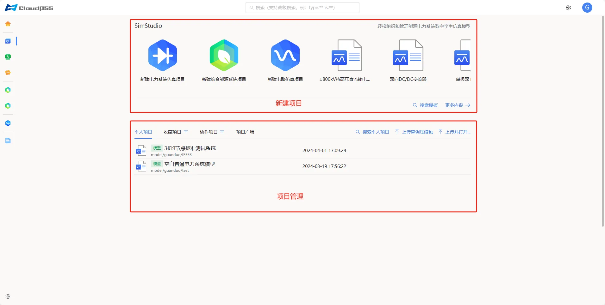

### 新建项目

**SimStudio 云空间** 提供了多种新建 SimStudio 项目的方法。

+ **从“模板案例”新建**：在新建项目区域包含了“新建电力系统仿真项目”、“新建综合能源系统项目”、“新建电路仿真项目”、“空白电力系统元件”等多种模型工坊项目模板。点击所选择的模板，进入工作台并自动以该模板为基础新建一个 SimStudio 项目。
+ **直接进入 SimStudio 工作台**：点击 **更多内容** 进入 **SimStudio 工作台** 并自动打开 **新建向导**。用户可进一步基于 **新建向导** 新建 SimStudio 项目。
+ **搜索模板新建**：点击**搜索模板**，用户可直接输入关键词查询相关模板，点击查询结果，进入工作台并自动以该模板为基础新建一个 SimStudio 项目。搜索功能详情参见 [高级搜索功能](../../60-advanced-search/index.md "高级搜索功能") 帮助页。

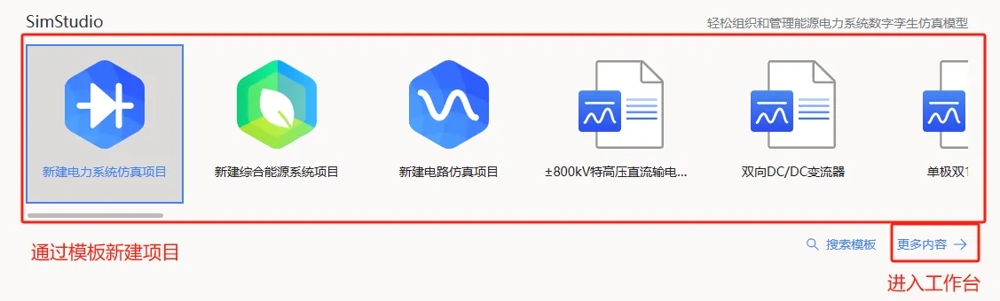

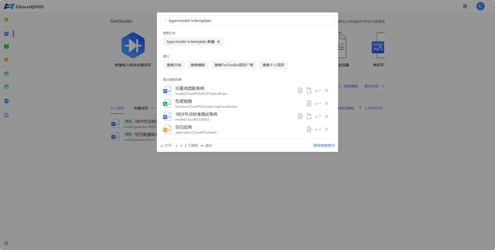

### 项目管理

**SimStudio 云空间** 的项目管理区以 **个人项目**、**收藏项目**、**协作项目** 和 **项目广场** 四个标签分组显示不同权限的项目，按照修改时间降序（最新优先）排列。

+ **个人项目**：显示当前用户创建的全部项目。
+ **收藏项目**：仅显示收藏的**个人项目**。点击**收藏项目**标签右侧的按钮，可切换显示不同收藏标签下的项目。
+ **协作项目**：显示当前用户所加入**协作组织**的协作项目。点击**协作项目**标签右侧的按钮，可切换显示不同组织管理的项目。有关协作组织的建立，可参见 [组织管理](../../40-general-account-settings/40-organization-management/index.md "组织管理") 帮助页。
+ **项目广场**：显示权限为**公开**的全部项目，包含其他用户创建的项目。

:::tip
+ 项目列表中，每个项目的名称前存在**元件**、**模型**标签，方便用户区分当前项目的类别。
+ 点击每个标签或分组列表下的**搜索个人项目/收藏项目/协作项目/项目广场**，可打开全局搜索，用于快速查找项目。**全局搜索** 功能详情参见 [高级搜索功能](../../60-advanced-search/index.md "高级搜索功能") 帮助页。
:::

## 项目管理功能

**SimStudio 云空间** 的项目管理区提供了项目打开、收藏、查看文档、删除、导入/导出、另存为等功能，方便用户高效管理大量模型项目。

### 项目基本操作

鼠标移至任一个项目文件，会显示 **打开** 和 **更多选项** 操作按钮。
+ 在项目文件上点击**打开**按钮，会跳转到工作台页面并打开该仿真项目。
+ 在项目列表中，任意点击一个项目，页面右侧会出现该项目的文档。项目文档可在 **SimStudio 工作台** - **概览** 页面进行编辑。

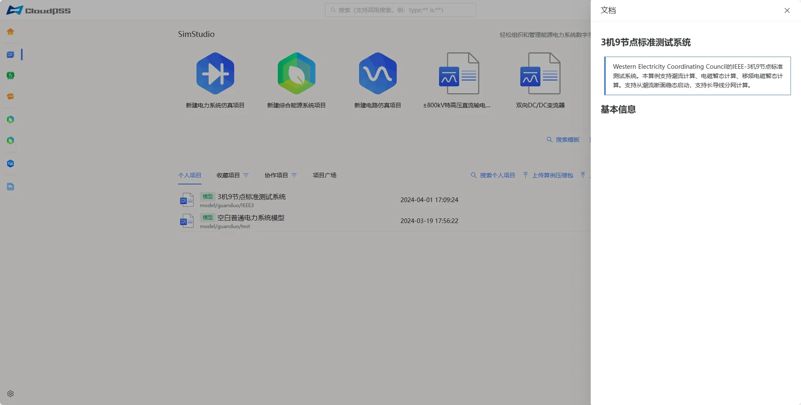

+ 在项目文件上点击**更多选项**按钮，可对项目文件进行如下操作
    + **打开**：点击跳转到工作台页面并打开该仿真项目。
    + **收藏**：用于收藏该项目，**仅限个人项目**。
    + **取消收藏**：用于取消收藏该项目，**仅限已收藏的项目**。
    + **查看文档**：点击可快速查看该项目文档。
    + **删除**：点击可删除该项目，**仅限个人项目**。
    + **导出**：用于导出项目。
    + **另存为**：点击可将当前项目另存为新项目。

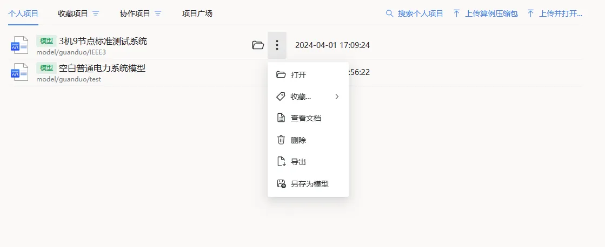

### 收藏项目

#### 收藏

在个人项目列表中选中某项目，点击 **更多选项** - **收藏** 按钮，会弹出**收藏至默认**、**收藏至XXX**（例如：测试分组、发布分组、展示分组等）、**收藏至新的分组**多个功能按钮。

+ 点击 **收藏至默认** 按钮，会把当前项目加入至 **默认分组**；
+ 点击 **收藏至XXX** 按钮（例如：测试分组、发布分组、展示分组等），会把当前项目文件加入名为“XXX”的收藏分组（该选项仅在当前用户下存在自定义收藏分组时可用）；
+ 点击 **收藏至新的分组**，弹出自定义名称对话框，输入分组名称，可创建新的收藏列表。

#### 取消收藏

在选中某个被收藏的项目，点击 **取消收藏** 按钮，即可将该项目移出收藏列表。

#### 收藏分组操作

收藏分组不支持手动删除，但是当分组内的收藏项目为空，该分组会自动解散；分组项目不支持重命名。

### 项目导出

在项目文件上点击**导出**按钮，输入压缩包密码（该密码用于**上传算例压缩包**），或者不设定密码，点击**确定**按钮，导出一个包含当前项目文件全部信息的 **zip** 压缩文件。

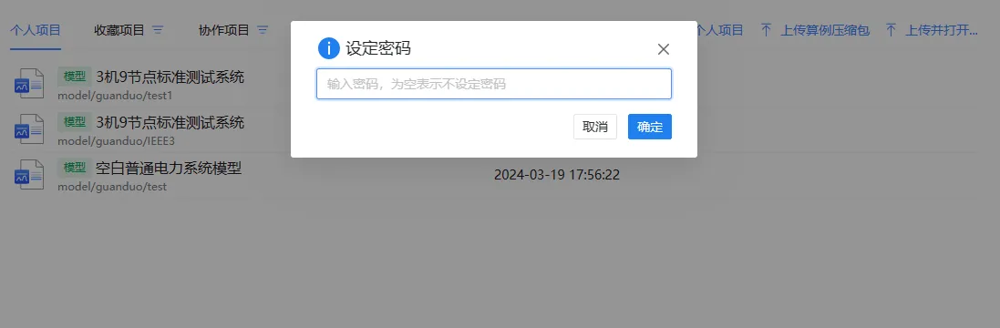

### 项目导入

SimStudio 支持两种项目导入方法。

+ **上传算例压缩包**：用于上传导出到本地的算例压缩包( **zip** 格式)。
+ **上传并打开**：用于上传并打开保存在本地的项目文件( **cmdl** 格式)。

#### 上传算例压缩包

1. 点击**上传算例压缩包**按钮，页面弹出如下界面可选：**上传至用户**或**上传至组织**

2. 选择待上传的算例压缩包。

3. 如果该压缩包在导出时设置了密码，需要在上传文件后输入该密码进行验证。

4. 密码验证成功，弹出**选择需要上传的模型**界面，允许用户自行选择需要上传的算例模型，点击**确定**。

5. 如果密码验证失败，弹出错误提示并取消本次上传服务。

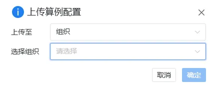

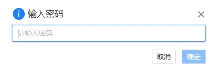

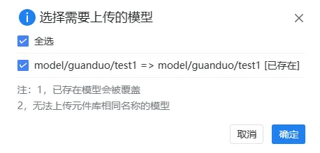

#### 上传并打开

1. 点击**上传并打开**按钮，选择待上传的算例文件。

2. 跳转到 SimStudio 工作台并直接打开该算例文件。

3. 如果该算例文件存在密码，需要在上传文件后输入该密码进行验证。

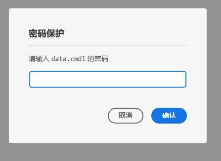

## 案例介绍

### 将个人项目另存为协作项目

协作项目是组织内成员间可共享的项目资源。以下案例以 **3 机 9 节点标准测试系统**为例：

1. 找到 **3 机 9 节点标准测试系统**算例点击另存为模型。
2. 在另存界面资源 ID 的**所有者**一栏中选择您的**协作组织**（默认设置为个人账户）。
3. 输入另存项目的资源 ID，系统会对该 ID 进行重复性检查。通过后，点击**确定**。
4. 另存成功后，您所在组织的其他成员便可以在协作项目中访问并查看此项目。

:::tip
用户可以自行设置另存项目的各种权限。
:::

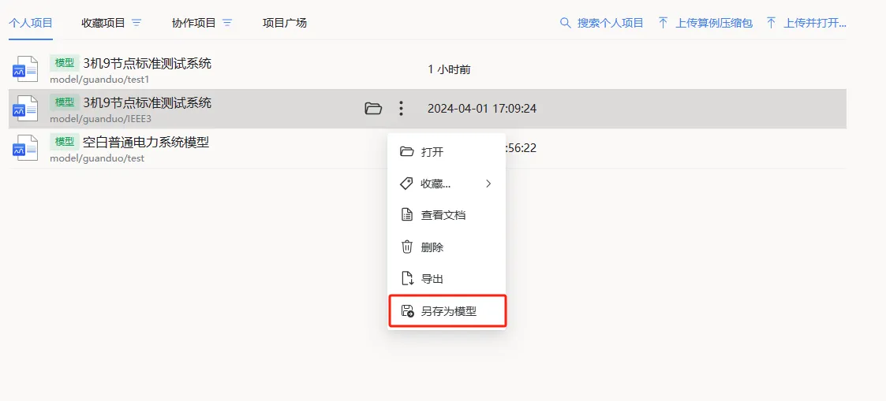

## 常见问题

**cmdl** 是什么格式？

:   **cmdl** 是 CloudPSS 团队为 SimStudio 算例设计的特殊文件格式，仅支持导出和导入到 SimStudio 中。

上传算例压缩包时重复的算例是否覆盖？

:   上传算例压缩包如果是重复的算例会覆盖原算例模型，用户可以自行选择是否覆盖。注意：无法上传元件库相同名称的模型

