---

title: FuncStudio 云空间
description: CloudPSS 个人中心 FuncStudio 云空间介绍

tags: 
- user-center

---

本文档介绍 **个人中心** - **FuncStudio 云空间** 的主要功能，包括打开空白项目、通过模板创建、上传文件、执行器下载等功能。

## 页面功能

**FuncStudio 云空间**是 FuncStudio 函数工坊的项目管理页面，是进入 **FuncStudio 工作台** 的入口。

用户首先需注册并登录 **CloudPSS 个人中心**。根据 CloudPSS 平台部署方式的不同，注册及登录方法略有区别，具体如下

+ **CloudPSS 公网主站**（`www.cloudpss.net`）的用户，可参见 [注册并登录 CloudPSS 公网主站](../../10-register-and-login/10-cloudpss-public/index.md "注册并登录 CloudPSS 公网主站")。
+ **CloudPSS Mini、CloudPSS Pro** 等私有部署平台的用户，可参见 [登录 CloudPSS 私有部署平台](../../10-register-and-login/20-cloudpss-private/index.md "登录 CloudPSS 私有部署平台")。

成功登录后，在 **CloudPSS 个人中心** 点击 **FuncStudio** 的图标后，页面将跳转至 **FuncStudio 云空间**。如图所示，该界面包含快速开始、项目中心两部分区域。

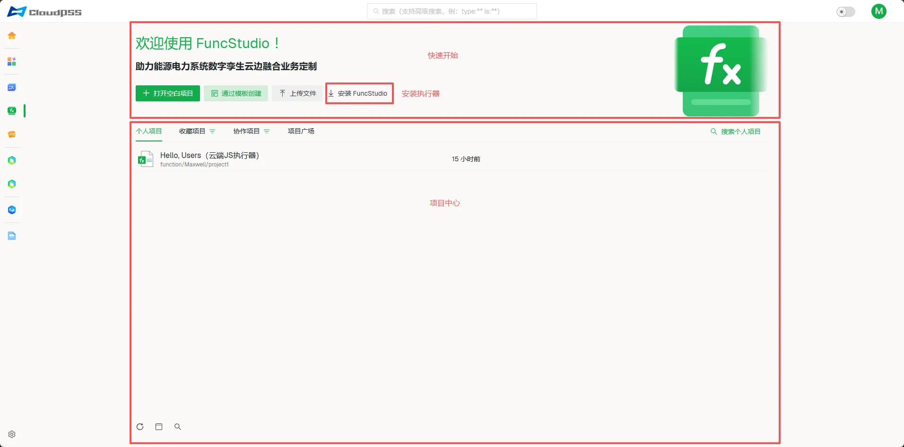

### 快速开始

**FuncStudio 云空间** 提供了多种快速开始 FuncStudio 项目的方法。

+ **打开空白项目**：点击**打开空白项目**，进入 **FuncStudio 工作台** 并自动打开 **欢迎使用向导**。用户可进一步基于向导新建/打开/快速入门 **FuncStudio** 项目。
+ **通过模板创建**：点击**通过模板创建**，进入 **FuncStudio** 模板页面选择模板，点击进入**FuncStudio 工作台**。
+ **上传文件**：点击**上传文件**，选择待上传的项目文件，文件支持 **zip** 和 **cfnc** 格式，详情参看[项目导入](#项目导入)。

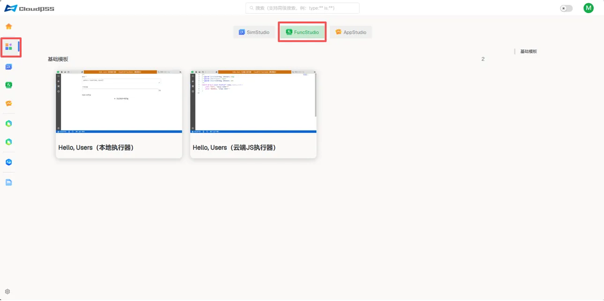

### 项目中心

**FuncStudio 云空间** 的项目管理区以 **个人项目**、**收藏项目**、**协作项目** 和 **项目广场** 四个标签分组显示不同权限的项目，按照修改时间降序（最新优先）排列。

+ **个人项目**：显示当前用户创建的全部项目。
+ **收藏项目/已固定**：仅显示收藏的**个人项目**。点击**收藏项目/已固定**标签右侧的按钮，可切换显示不同收藏标签下的项目。
+ **协作项目**：显示当前用户所加入**协作组织**的协作项目。点击**协作项目**标签右侧的按钮，可切换显示不同组织管理的项目。有关协作组织的建立，可参见 [组织管理](../../40-general-account-settings/40-organization-management/index.md "组织管理") 帮助页。
+ **项目广场**：显示权限为**公开**的全部项目，包含其他用户创建的项目。 

:::tip 使用技巧
+ 点击每个标签或分组列表下的**搜索个人项目/收藏项目/协作项目/项目广场**，可打开全局搜索，用于快速查找项目。**全局搜索** 功能详情参见 [高级搜索功能](../../60-advanced-search/index.md "高级搜索功能") 帮助页。
:::

## 项目中心功能

**FuncStudio 云空间** 的项目管理区提供了项目打开、收藏、查看历史版本、查看文档、删除、导入/导出、另存为等功能，方便用户高效管理大量函数项目。

### 项目基本操作

鼠标移至任一个项目文件，会显示**复制 rid**、**打开** 和 **更多选项** 操作按钮。
+ 在项目文件上点击**复制 rid** 按钮，复制当前项目的唯一标识符到剪贴板。
+ 在项目文件上点击**打开**按钮，会跳转到工作台页面并打开该仿真项目。
+ 在项目列表中，任意点击一个项目，页面右侧会出现该项目的文档。项目文档可在 **FuncStudio 工作台** - **概览** 页面进行编辑。
+ 在项目文件上点击**更多选项**按钮，可对项目文件进行如下操作
    + **打开**：点击跳转到工作台页面并打开该仿真项目。
    + **收藏**：用于收藏该项目，**仅限个人项目**。
    + **取消收藏**：用于取消收藏该项目，**仅限已收藏的项目**。
    + **查看历史版本**：用于查看该项目的历史版本记录。
    + **查看文档**：点击可快速查看该项目文档。
    + **删除**：点击可删除该项目，**仅限个人项目**。
    + **导出**：用于导出项目。

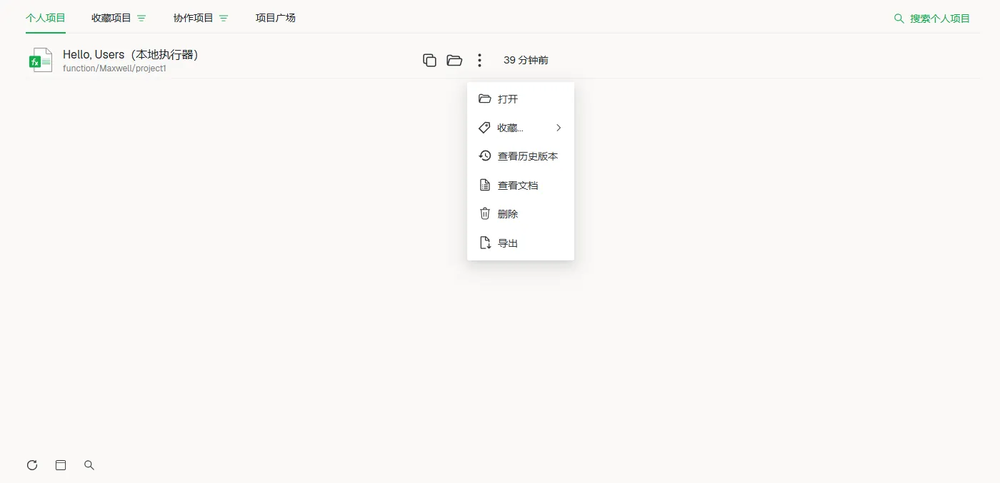
 

### 收藏项目

#### 收藏

在个人项目列表中选中某项目，点击 **更多选项** - **收藏** 按钮，会弹出**收藏**、**收藏至新的分组**功能按钮。

+ 点击 **收藏** 按钮，会把当前项目加入至 **默认分组**；
+ 点击 **收藏至新的分组**，弹出自定义名称对话框，输入分组名称，可创建新的收藏列表。

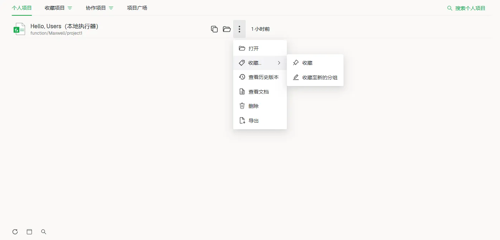

#### 取消收藏

在选中某个被收藏的项目，点击 **取消收藏** 按钮，即可将该项目移出收藏列表。

:::tip 提示
收藏分组不支持手动删除，但是当分组内的收藏项目为空，该分组会自动解散；分组项目不支持重命名。
:::

### 查看历史版本

项目列表中选中某项目，点击 **更多选项 - 查看历史版本** 按钮，弹出该项目的历史版本记录。点击任意一条历史版本记录可以进入 **FuncStudio 工作台**。

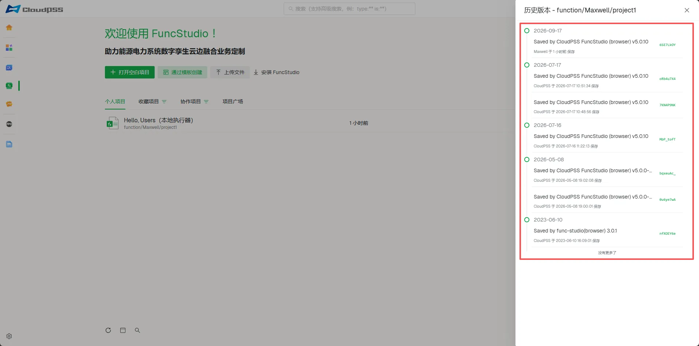

### 查看文档

项目列表中选中某项目，左键点击可快速查看该项目文档，或者点击 **更多选项 - 查看文档**按钮，弹出查看该项目的文档内容。

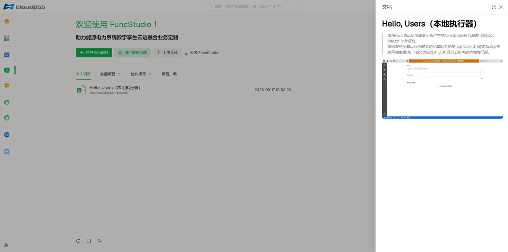

### 项目导出

在项目文件上点击**导出**按钮，输入压缩包密码（该密码用于**上传文件**），或者不设定密码，点击**确定**按钮，导出一个包含当前项目文件全部信息的 **zip** 压缩文件。

### 项目导入

**FuncStudio** 项目中心支持以下方法导入项目函数。

+ **上传函数压缩包**：用于上传导出到本地的函数压缩包( **zip** 格式)。
+ **上传函数文件**：用于上传并打开保存在本地的项目文件( **cfnc** 格式)。

#### 上传函数压缩包

1. 点击**上传文件**按钮，选择待上传的函数压缩包

2. 页面弹出如下界面可选：**上传至用户**或**上传至组织**

3. 如果该压缩包在导出时设置了密码，需要在上传文件后输入该密码进行验证。

4. 密码验证成功，弹出**选择需要上传的函数**界面，允许用户自行选择需要上传的函数模型，点击**确定**。

5. 如果密码验证失败，弹出错误提示并取消本次上传服务。

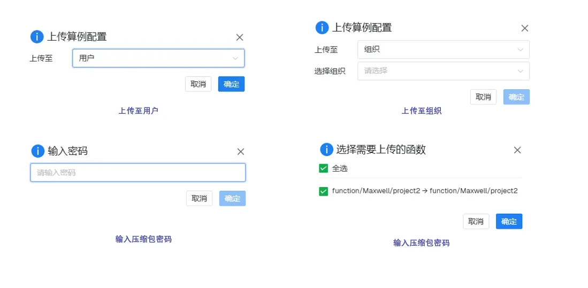

#### 上传并打开

1. 点击**上传文件**按钮，选择待上传的函数文件。

2. 跳转到 **FuncStudio 工作台**并直接打开该函数文件。

3. 如果该函数文件存在密码，需要在上传文件后输入该密码进行验证。

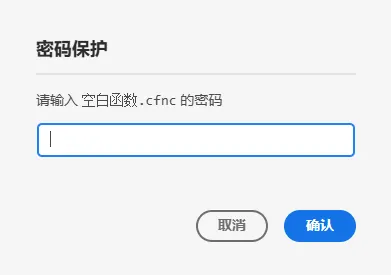

### 工具栏

**FuncStudio** 项目中心工具栏，包含以下三类工具按钮。

+ **数据刷新**：点击手动刷新项目中心数据
+ **根据日期筛选**：点击弹出日期选择框选择指定范围的日期筛选项目中心数据
+ **根据内容筛选**：点击弹出输入框输入内容，根据内容筛选项目中心数据

## 案例介绍

### 执行器下载

执行一个构建好的函数项目，首先要给其分配执行器，因此，需要在本地安装 **FuncStudio** 的执行器，点击**安装 FuncStudio**按钮下载程序按照引导逐步安装完成即可。执行器的工作页面和 **FuncStudio** 的工作台一致，也可以在执行器内实现函数，如下图所示：

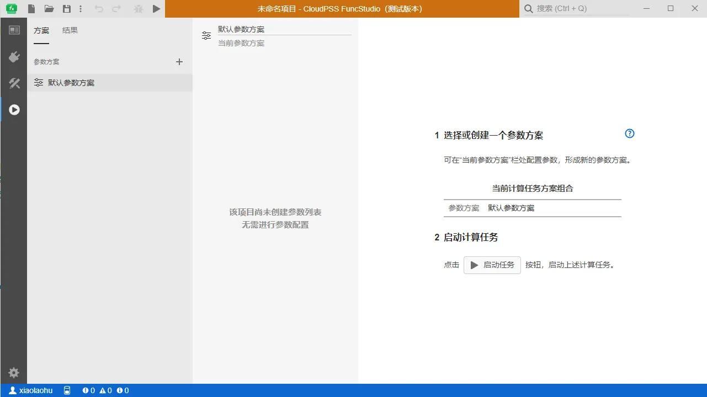

打开并登录执行器后，系统状态栏中会出现一个 **FuncStudio** 执行器的小图标，如下图所示：

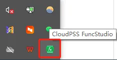

### 编辑配置文件

右击系统状态栏中 **FuncStudio** 执行器的小图标，选择**编辑配置文件**的选项，点击后打开配置文件进行编辑，如下图所示：

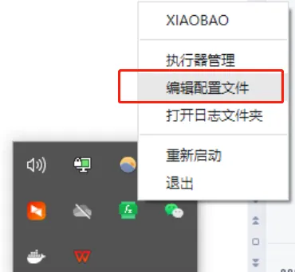

import Tabs from '@theme/Tabs';
import TabItem from '@theme/TabItem';

<Tabs>
<TabItem value="js" label="公网平台配置文件编辑">

对于公网平台用户，配置文件如下图所示，安装时已默认完成配置，用户无需自行更改。

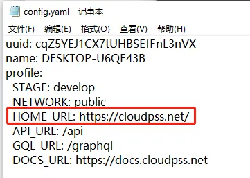

</TabItem>
<TabItem value="python" label="内网平台配置文件编辑">

对于非公网用户，如：**internal** 用户，需要将配置文件的 **HOME_URL** 配置为 `https://internal.cloudpss.net/`，如下图所示：

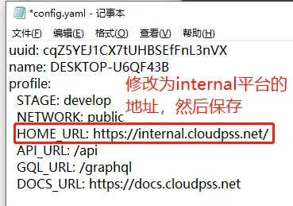

</TabItem>
<TabItem value="java" label="私有云平台配置文件编辑">

对于 **CloudPSS-Mini** 用户，需要将配置文件的 **HOME_URL** 配置为 **CloudPSS-Mini** 的 **IP 地址** 如下图所示：

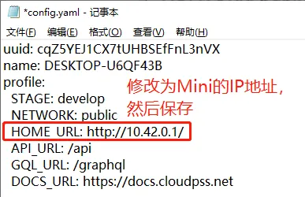

</TabItem>
</Tabs>

## 常见问题