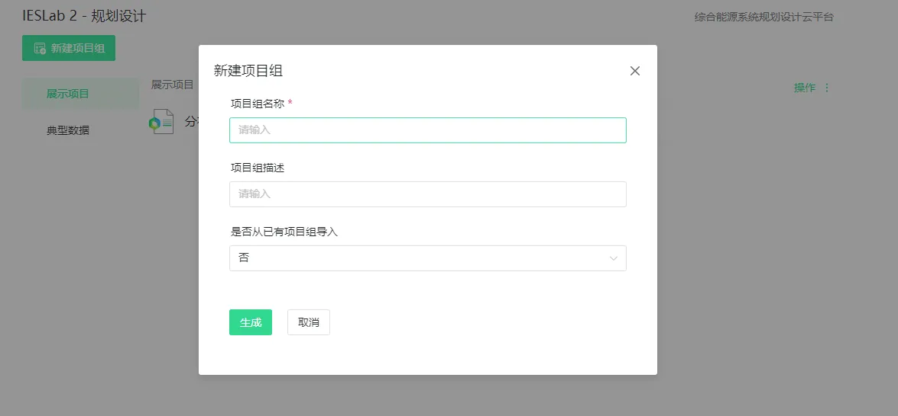
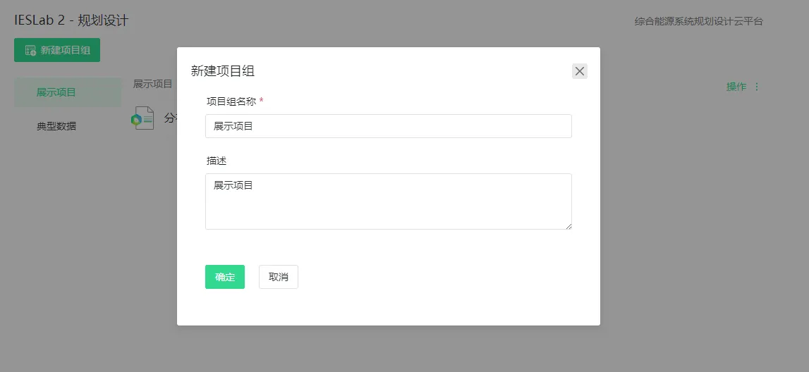
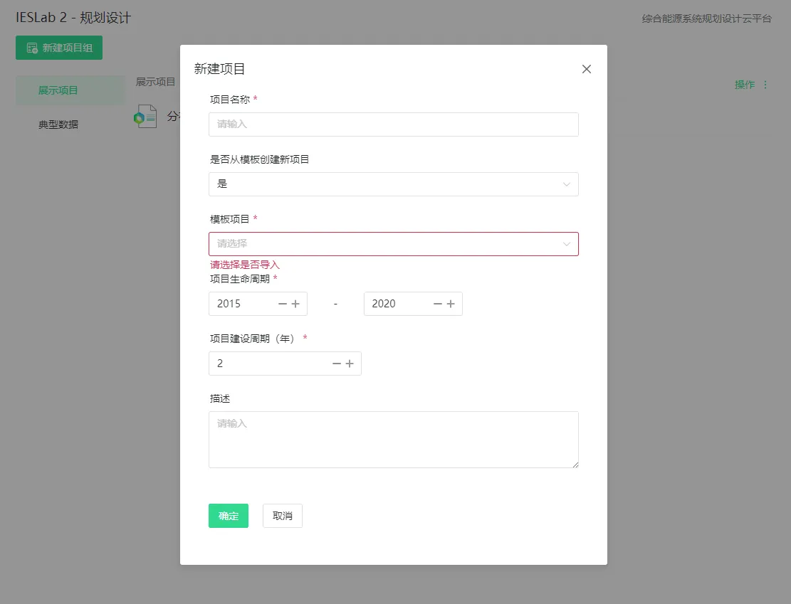
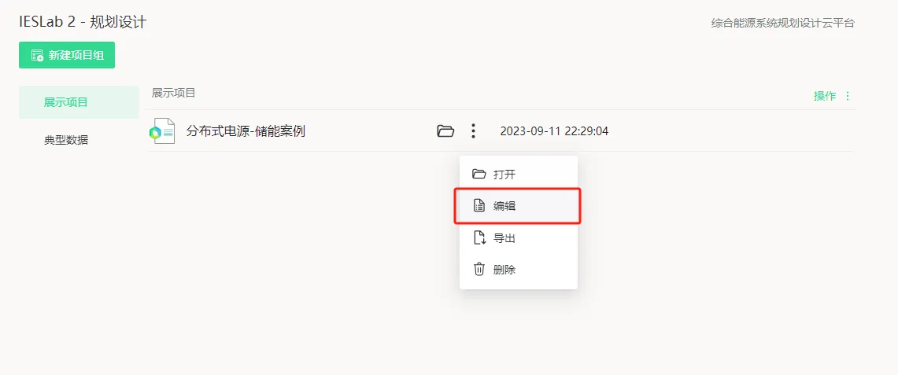

---

title: IESLab 规划设计云空间
description: CloudPSS 个人中心规划设计云空间介绍

tags: 
- 个人中心

---

用户成功登录后，在 **CloudPSS** 主页点击 **IESLab 2 规划设计**的图标后，页面跳转至 **IESLab 2 规划设计云空间**，该界面包含新建项目、项目管理等。

### 新建项目组

点击**新建项目组**，输入项目组名称及描述，**是否从已有项目组导入**选择**否**，创建一个空白项目组。

### 编辑项目组

点击**操作**，点击**编辑**，输入项目组名称及描述，更新项目组信息

### 从模板创建新项目

点击项目组右侧的**操作**，选择**新建项目**。

在弹出的**新建项目**对话框中，输入项目名称及描述，**是否从模板创建新项目**选择**是**，选择一个模板。

### 打开项目

点击项目所在行，或点击文件夹按钮打开；或点击**更多选项**打开按钮

### 编辑项目

选中项目所在行，点击**更多选项**编辑按钮

### 导出项目

选中项目所在行，点击**更多选项**导出按钮，导出 **zip** 压缩包文件，包括：项目基础数据、设备参数数据、拓扑信息、气象数据；导出可能耗时较长，请耐心等待。

### 导入项目

点击项目组右侧的**操作**，选择**导入**。导入 **zip** 压缩文件。

