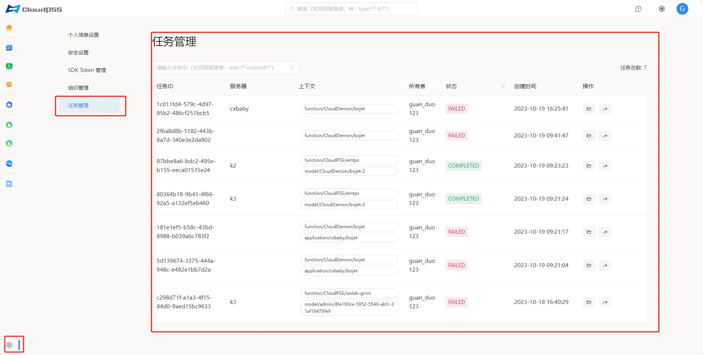
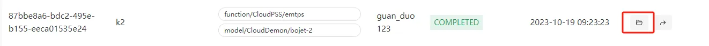
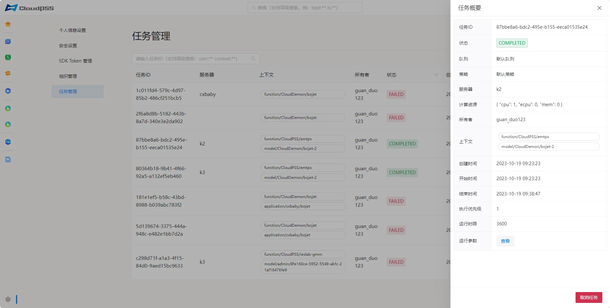
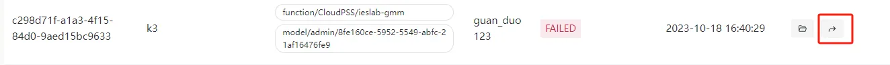

点击页面左下角的账户**设置**按钮，然后点击左侧的**任务管理**按钮，进入**任务管理**页面。此页面以表格的形式列出所有历史运行的算例任务。表格内容包括：

+ **任务ID**：任务运行的唯一标识

+ **服务器**：运行任务的服务器

+ **上下文**：任务执行的算例/函数

+ **所有者**：任务所有者(创建者)

+ **状态**：任务执行结束状态

+ **创建时间**: 任务创建时间

> 用户可以在任务管理页面对自己运行的任务进行管理。管理员可在此页查看并管理所有用户的任务。

## 任务概要

点击列表操作里的**文件图标**，打开任务概要界面如下图

## 任务跳转

点击列表操作里的**跳转图标**，进入该任务( **SimStudio** 或者 **FuncStudio** )

