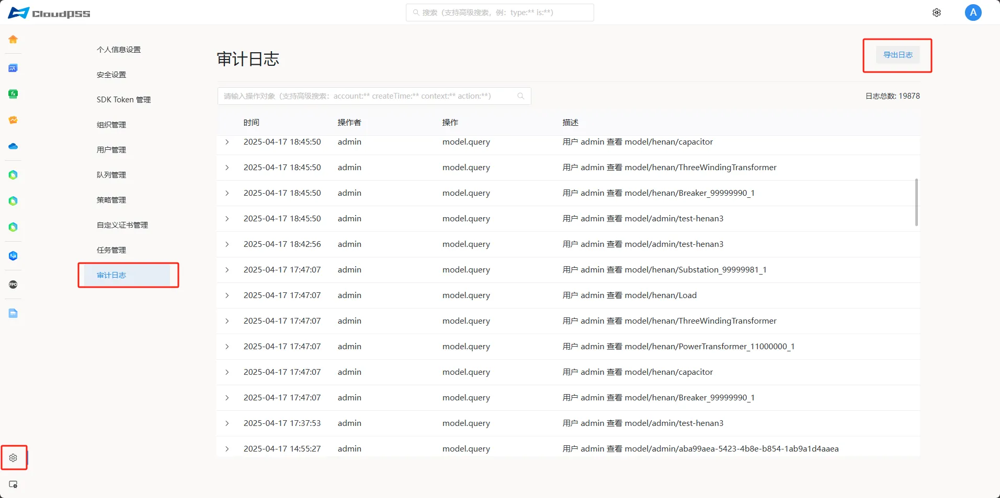
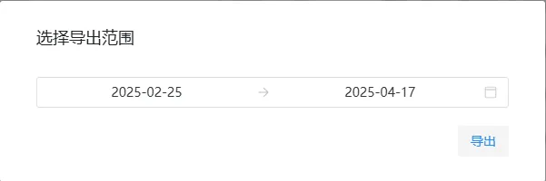

点击页面左下角的账户**设置**按钮，然后点击左侧的**审计日志**按钮，进入**审计日志**页面。此页面以表格的形式列出用户访问系统资源行为的操作历史记录。表格内容包括：

+ **时间**：用户操作发生时间

+ **操作者**：操作发起人员

+ **操作**：用户操作标识

+ **描述**：用户操作描述

> 单条日志可以点击打开查看详情

## 导出日志

点击页面右上角的**导出日志**按钮，点击日期选择框，选择导出日期范围，点击**导出**按钮。

