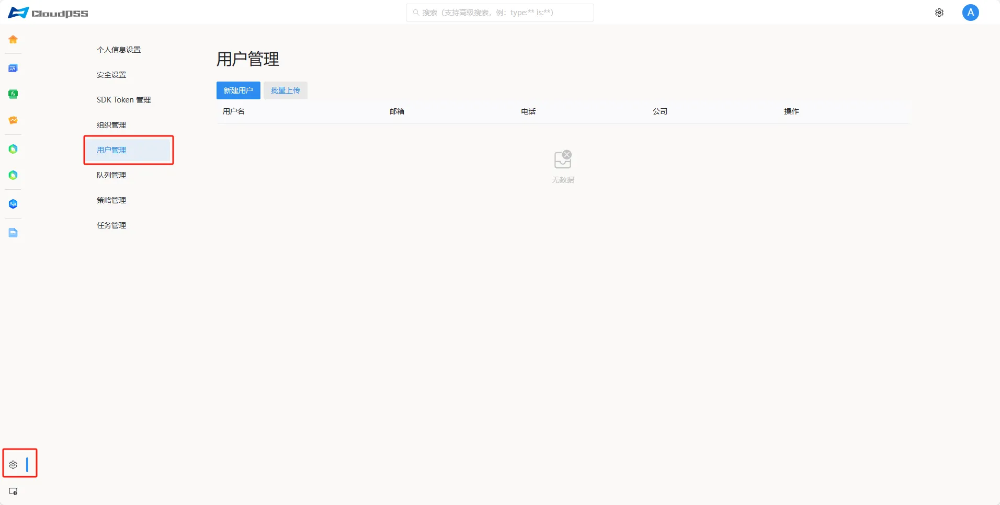
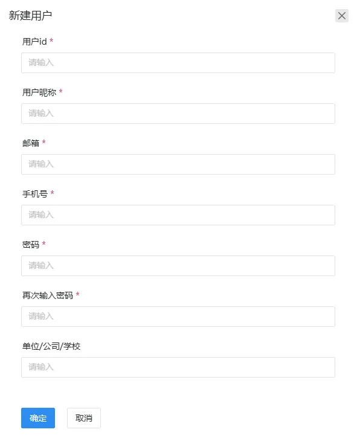
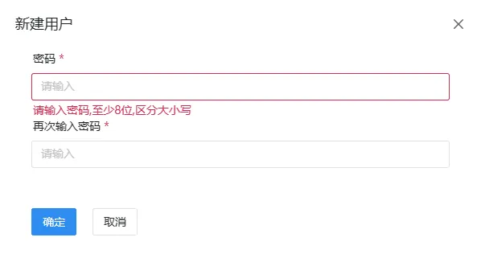
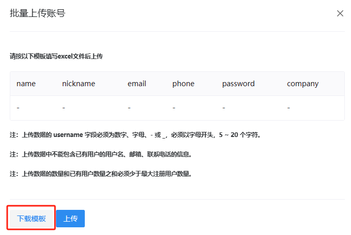

:::tip 权限提醒
此页面需要系统管理员权限。
:::

点击页面左下角的账户**设置**按钮，然后点击左侧的**用户管理**按钮，进入用户管理页面。此页面以表格的形式列出网站所有注册的用户。表格内容包括：

+ **用户名**：必填

+ **邮箱**：必填

+ **电话**：必填

+ **公司**：可缺省

+ **操作**：修改密码

| 用户名 | 邮箱 | 电话 | 公司 | 操作 |
| ------------ | ----------- | ----------- | ----------- | ----------- |
| 张三 | 123456789@qq.com |  12345678910 | xx公司 | 修改密码 |

## 新建用户

依次输入用户 id、用户昵称（用户名）、邮箱、手机号、密码、再次输入密码、单位/公司/学校，点击**确定**。

## 修改密码

输入新密码、再次输入新密码。

> 密码至少 8 位有效字符，区分大小写。

## 批量上传

批量上传功能是为了方便系统管理员按照一定的 excel 格式批量新建用户账号，系统管理员可以点击下图中的**下载模板**按钮下载 excel 模板文件。

上传的文件字段释义：

+ **name**：用户 id

+ **nickname**：用户昵称

+ **email**：邮箱

+ **phone**：手机号

+ **company**：公司

上传的文件需要注意一下事项：

+ 上传数据的用户 id 字段必须为数字、字母、- 或 _，必须以字母开头，5 ~ 20 个字符。

+ 上传数据中不能包含已有用户的用户名、邮箱、联系电话的信息。

+ 上传数据的数量和已有用户数量之和必须少于最大注册用户数量。