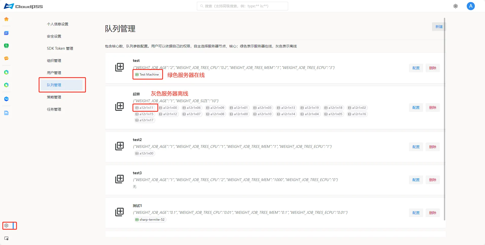
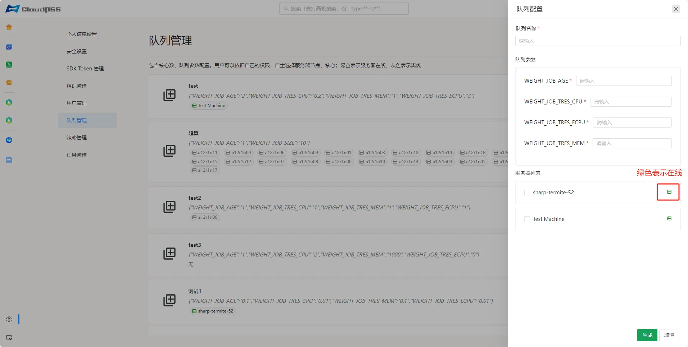
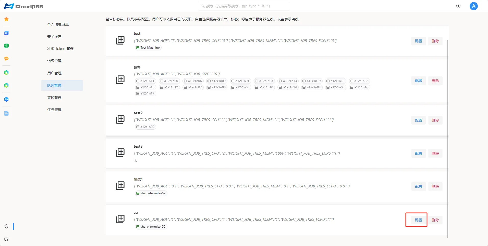
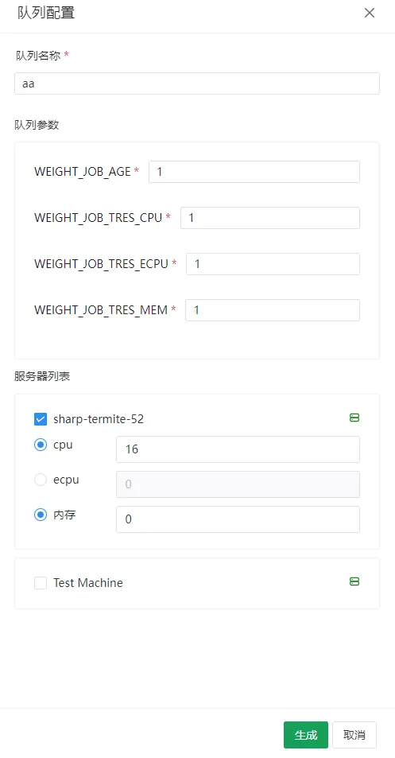

:::tip 权限提醒
此页面需要系统管理员权限。
:::

点击页面左下角的账户**设置**按钮，然后点击左侧的**队列管理**按钮，进入**队列管理**页面。

## 新建队列

按照以下步骤执行操作：

1. 点击页面右上角的**新建**按钮；弹出如下图所示列表按需填写。
   
2. 输入队列名称，配置队列参数，选择服务器(绿色表示服务器在线，灰色表示服务器离线)并配置CPU核数/ECPU核数和内存大小，点击**生成**按钮。

队列配置中的参数说明如下:

+ **WEIGHT_JOB_AGE**：任务等待时间权重，单位 s^-1，设为正值可以使在等待状态停留更长时间的任务获得更高的优先级；

+ **WEIGHT_JOB_TRES_CPU**：CPU权重，直接绑定物理 CPU/vCPU 核心，任务运行时指定的核心数为独占，单位 core^-1，设为正值可以使安排CPU资源更多的任务的获得更高的优先级（此项推荐设为负值）；

+ **WEIGHT_JOB_TRES_ECPU**：ECPU 权重，使用 CPU 占用率分配运行资源，单位 core^-1，设为正值可以使安排ECPU资源更多的任务的获得更高的优先级（此项推荐设为负值）；

+ **WEIGHT_JOB_TRES_MEM**：内存权重，最大可用内存 [MiB]，单位 MB^-1，设为 0 表示不限制此资源，设为正值可以使安排CPU资源更多的任务的获得更高的优先级（此项推荐设为负值）。

> 服务器列表：这部分参数配置加入队列的服务器及其加入队列的资源。注意配置时一台服务器在所有队列中配置的资源总和不应超过其能够提供的资源，否则任务运行时可能会由于服务器资源不足而失败。

## 配置队列

1. 点击所需配置队列的**配置**按钮；弹出如下图所示列表按需修改。
   
2. 输入队列名称，配置队列参数，选择服务器(绿色表示服务器在线，灰色表示服务器离线)并配置CPU核数/ECPU核数和内存大小，点击**生成**按钮。

## 删除队列

点击待删除队列的**删除**按钮。

