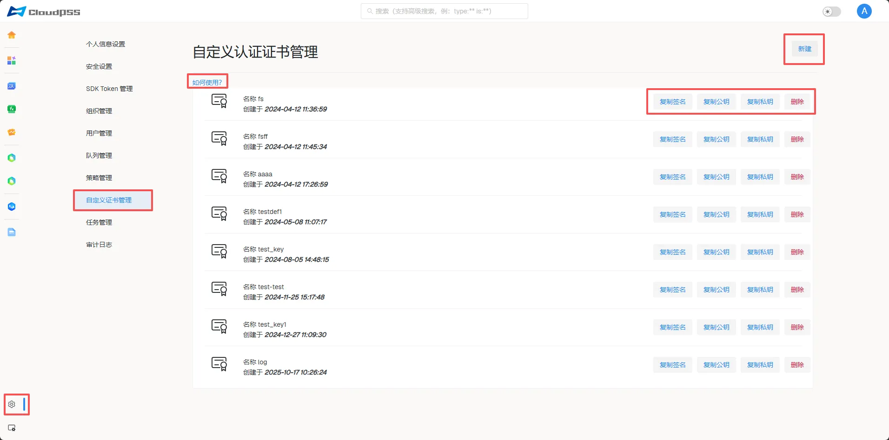
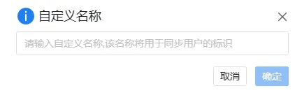
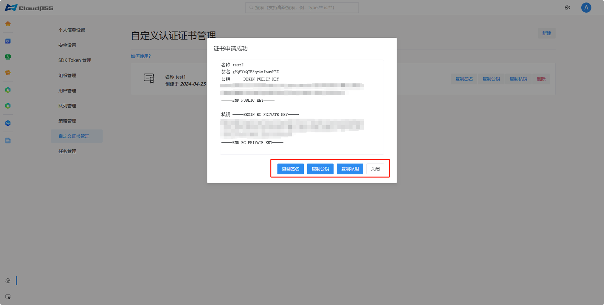

:::tip 权限提醒
此页面需要系统管理员权限。
:::

点击页面左下角的账户**设置**按钮，然后点击左侧的**自定义认证证书管理**按钮，进入自定义认证证书管理页面。

## 使用指南

点击**如何使用**查看使用指南：

### 功能概述 

本功能允许开发者通过自定义证书，在指定签名（Sign）下生成特殊用户。 

- 用户标识规则 ：生成用户的唯一 ID 格式为  **用户名**~**证书签名**。 

- 核心流程 ：开发者在本地使用私钥签发一个  客户端 JWT ，随后通过该 JWT 换取系统正式的  接入 Token ，从而实现身份委派。 

### 操作步骤 
1. 构造 Payload ：准备包含  sign（证书签名）、 username（自定义用户名）及  exp（过期时间）的载体。 

2. 本地签名 ：使用标准的 JWT 库（如  jsonwebtoken）及私钥，采用  ES256  算法签出原始 Token。 

3. 获取接入 Token ：通过 GraphQL 接口  _userToken 换取正式 Token，用于 SDK 初始化或 Runner-API 的 HTTP 请求。 

4. 免密登录（iframe） ：使用特定格式的 URL 拼接，可直接获取该用户的登录状态，适用于 Web 嵌入场景。 

## 功能介绍

### 新建签名证书

点击页面右上角的**新建**按钮。输入证书自定义名称，校验通过后，自动生成签名证书和密钥。

:::tip 证书名称规则
证书名称需要以数字、字母、- 或 _ 组成，必须以字母开头，5 ~ 20 个字符
:::

### 复制签名/复制公钥/复制私钥

点击页面签名右方的**复制签名**/**复制公钥**/**复制私钥**按钮，或者**新建签名证书**后在证书申请成功弹出框页面点击**复制签名**/**复制公钥**/**复制私钥**按钮。

### 删除签名证书

点击页面签名右方的**删除**按钮。