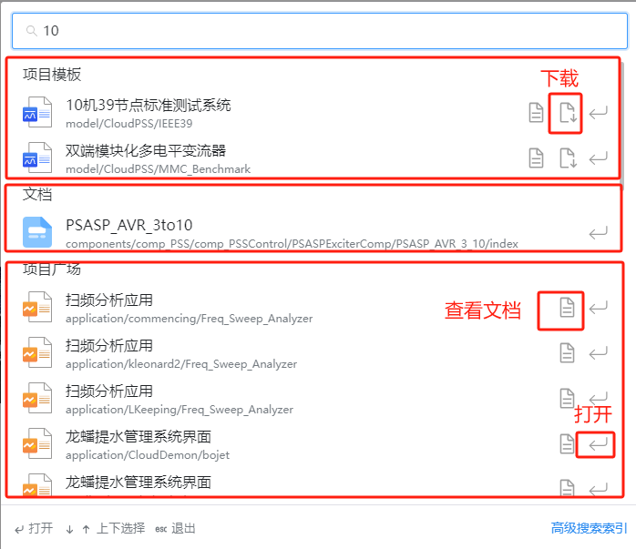

**CloudPSS** 支持**高级搜索**功能；高级搜索指定了一系列搜索条件来过滤搜索结果。

## 简介


搜索关键字：**is** 和 **type**

```
is:public 搜索项目为公开项目
 
is:private 搜索项目为个人项目

is:pinned 搜索项目为固定项目

is:template 搜索项目为模板案例

is:app 搜索 CloudPSS 应用

is:doc 搜索文档

type:model 搜索项目类型为 SimStudio 项目

type:application 搜索项目类型为 AppStudio 项目

type:function 搜索项目类型为 FuncStudio 项目

```

> 各关键字支持相互排列组合

搜索内容排列如下图所示：

+ **项目模板**

+ **个人项目**

+ **固定项目**

+ **协作项目**

+ **文档**

+ **项目广场**




**搜索结果页面支持使用键盘方向键上下切换、回车打开，按下 esc 退出搜索。**

## 案例

###  搜索模板案例10机39节点标准测试系统
```text
is:template 10机39节点
```


**注意: 搜索内容和关键字没有顺序要求，但是需要以空格分隔；关键字可以互相组合**


> **SimStudio**、**FuncStudio**、**AppStudio** 页面存在**搜索模板**，**搜索个人项目**，**搜索固定项目**，**搜索项目广场**按钮，点击自动填充关键字


###  点击搜索模板按钮，自动填充关键字
```text
type:model is:template
```


<!-- ### 快捷操作

键盘输入 `Ctrl + Shift + F`，打开搜索框界面 -->