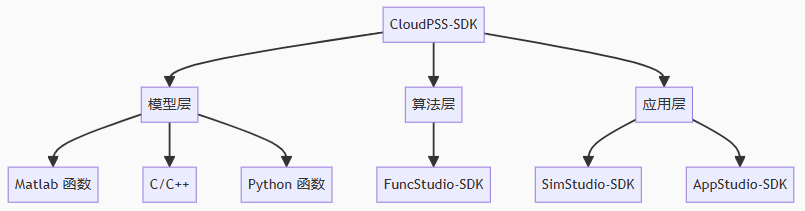

**CloudPSS SDK** 是基于 **CloudPSS-API** 封装的模型及软件开发套件。用户可通过编写 Python、Matlab 等脚本构建自定义模型，或是调用 **CloudPSS** 平台中的模型修改、仿真计算功能，实现诸如自动修改模型、批量仿真计算、自动化生成报告等复杂且繁琐的功能。用户也可在其自己的应用程序中调用 **CloudPSS** 仿真引擎，实现仿真驱动的高级分析应用。

**CloudPSS SDK** 包含模型层、算法层和应用层三种开发套件，其中：

1. 模型层开发套件帮助用户在 **CloudPSS SimStudio** 官方潮流计算、电磁暂态仿真、移频电磁暂态仿真、综合能源能量流计算等内核中开发第三方模型或用户自定义模型。目前，模型层 SDK 已开放基于 Matlab 函数的自定义控制元件接入，后续将进一步开放 Python、C/C++ 的标准元件开发套件。

2. 算法层开发套件帮助用户在 **CloudPSS FuncStudio** 中集成自己的算法内核，从而借助 **CloudPSS XStudio** 平台快速开发并部署自己的计算应用。

3. 应用层开发套件帮助用户在利用脚本的形式快速调用 **CloudPSS** 官方计算内核和第三方接入的计算内核，从而方便用户开发高级计算分析应用。其中，**SimStudio-SDK** 现已支持 **SimStudio** 中的模型修改和潮流计算、电磁暂态仿真、综合能源能量流计算三种计算内核。

