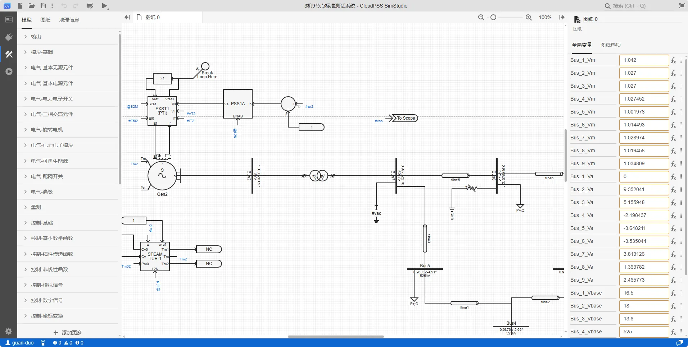
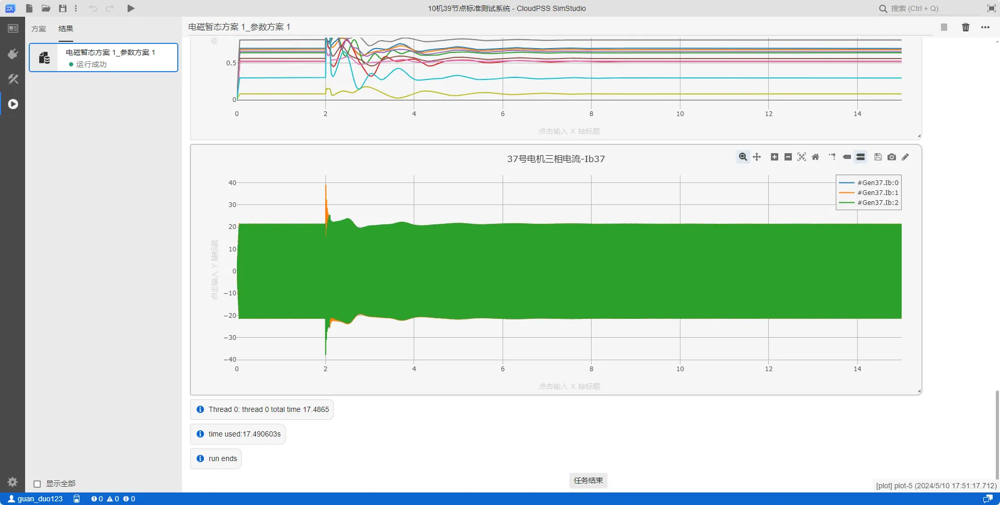
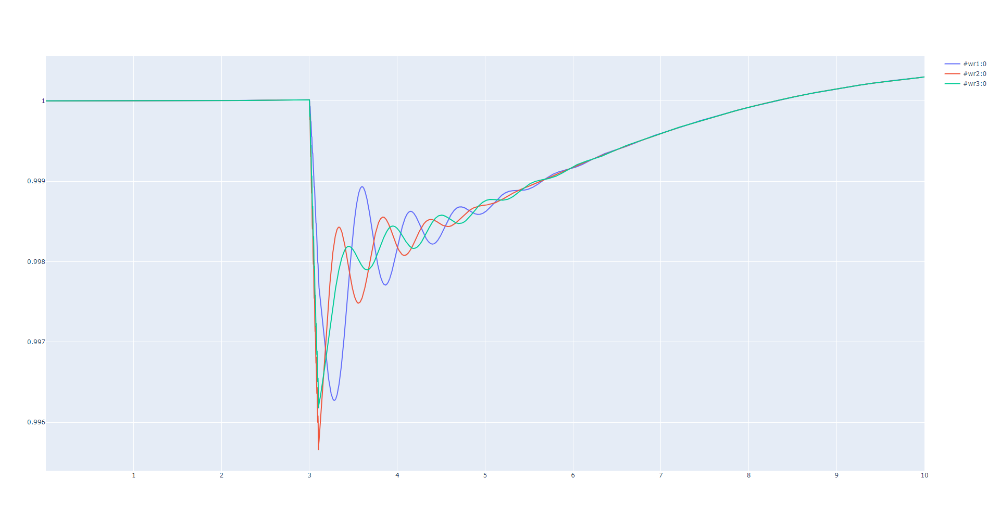
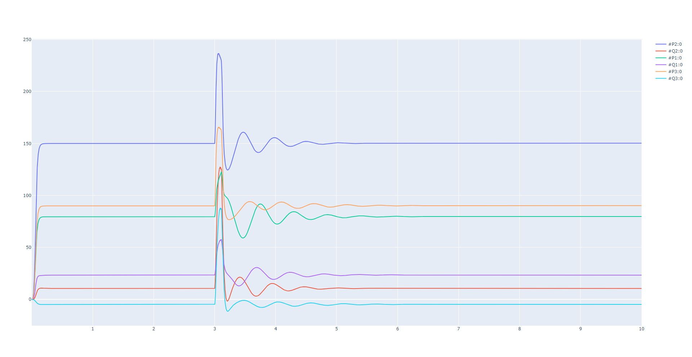

:::tip 快速入门
本例通过打开 **3 机 9 节点标准测试系统**算例，利用 Python 脚本修改参数，运行潮流，获取结果，写回断面，运行电磁暂态仿真，获取结果。帮助用户快速使用 **EMTLab SDK** 。
:::

## 潮流计算

### 选择示例算例

在 **CloudPSS Simstudio** 中打开[3 机 9 节点标准测试系统](https://cloudpss.net/model/songyankan/3_Gen_9_Bus)，算例**rid**为`model/CloudPSS/IEEE3`。



### 选择计算方案

点击**运行**标签页，在计算方案中选择默认的**潮流计算方案 1**。


### 启动任务

点击**启动任务**运行计算方案，在结果页面会生成潮流计算结果。


### 快速上手 sdk

创建 `test.py` 文件，输入以下示例代码：

```python title="3 机 9 节点标准测试系统潮流计算" showLineNumbers
import sys,os
import cloudpss # 引入 cloudpss 依赖
import json
import time

if __name__ == '__main__':
    
    # 申请 token
    cloudpss.setToken('{token}')

    # 设置算例所在的平台地址
    os.environ['CLOUDPSS_API_URL'] = 'https://cloudpss.net/'
    
    # 获取指定 rid 的算例项目
    model = cloudpss.Model.fetch('model/CloudPSS/IEEE3')
    
    # 选择参数方案，若未设置，则默认用 model 的第一个 config（参数方案）
    config = model.configs[0]

    # 选择计算方案，若未设置，则默认用 model 的第一个 job（潮流计算方案）
    job = model.jobs[0]

    # 启动计算任务
    runner = model.run(job,config) # 运行计算方案
    while not runner.status(): 
        logs = runner.result.getLogs() # 获得运行日志
        for log in logs: 
            print(log) #输出日志
        time.sleep(1)
    print('end') # 运行结束
    
    # 打印潮流计算结果
    print(runner.result.getBuses()) #节点电压表
    print(runner.result.getBranches()) #支路功率表
```
### 执行结果

```
[{'data': {'columns': [{'data': ['canvas_0_1065', 'canvas_0_1068', 'canvas_0_1071', 'canvas_0_1074', 'canvas_0_1077', 'canvas_0_1080', 'canvas_0_1087', 'canvas_0_1095', 'canvas_0_1096'], 'name': 'Branch', 'type': 'html'}, {'data': ['canvas_0_1060', 'canvas_0_1091', 'canvas_0_1088', 'canvas_0_1092', 'canvas_0_1091', 'canvas_0_1093', 'canvas_0_1054', 'canvas_0_1089', 'canvas_0_1093'], 'name': 'From bus', 'type': 'html'}, {'data': [72.28871738152132, -75.7639345814068, -28.161784807859004, -60.267887870119594, 
-49.23606011369125, 29.89560107441942, 150.0000000180821, -90.00000015291819, -79.46700797295708], 'name': '<i>P</i><sub>ij</sub> / MW', 'type': 'number'}, {'data': [0.7300026665096646, -15.360547411262578, -22.629497236598766, -16.360359524161808, -34.63943900921523, -0.7276152391705815, 10.551245630870294, 9.54439932706783, -19.43050006092399], 'name': '<i>Q</i><sub>ij</sub> / MVar', 'type': 'number'}, {'data': ['canvas_0_1088', 'canvas_0_1060', 'canvas_0_1089', 'canvas_0_1089', 'canvas_0_1093', 'canvas_0_1092', 'canvas_0_1060', 'canvas_0_1090', 'canvas_0_1094'], 'name': 'To bus', 'type': 'html'}, {'data': [-71.83820987328306, 77.71127707883484, 28.27648652932689, 61.723512007231186, 49.57140789511747, -29.732108951962122, -150.0000000180821, 90.00000015291819, 79.46700797295708], 'name': '<i>P</i><sub>ji</sub> / MW', 'type': 'number'}, {'data': [-12.370502570509586, -4.310831934664453, 2.8331554052088466, -12.377528232114683, 20.15812747545786, -13.6396393146035, 3.5808348627469484, -4.784385568610311, 23.382876274122356], 'name': '<i>Q</i><sub>ji</sub> / MVar', 'type': 'number'}, {'data': [0.4505075082382544, 1.9473424974280351, 0.114701721467885, 1.4556241371115963, 0.33534778142621724, 0.16349212245729727, 0, 0, 0], 'name': '<i>P</i><sub>loss</sub> / MW', 'type': 'number'}, {'data': [-11.640499903999924, -19.671379345927033, -19.796341831389917, -28.737887756276493, -14.481311533757376, -14.367254553774078, 14.132080493617243, 4.76001375845752, 3.952376213198365], 'name': '<i>Q</i><sub>loss</sub> / MVar', 'type': 'number'}], 'title': 'Branches'}, 'key': 'branches-table', 'type': 'table', 'version': 1}]
[{'data': {'columns': [{'data': ['canvas_0_1054', 'canvas_0_1060', 'canvas_0_1088', 'canvas_0_1089', 'canvas_0_1090', 'canvas_0_1091', 'canvas_0_1092', 'canvas_0_1093', 'canvas_0_1094'], 'name': 'Bus', 'type': 'html'}, {'data': ['canvas_0_757', '', '', '', 'canvas_0_762', '', '', '', 'canvas_0_766'], 'name': 'Node', 'type': 'html'}, {'data': [1, 0.9978193690593117, 0.9878296043857075, 1.0041895577772493, 1, 0.9633408585122871, 0.9763401685292369, 0.9875927780370882, 1], 'name': '<i>V</i><sub>m</sub> / pu', 'type': 'number'}, {'data': [8.092582031942275, 2.701412184678982, 0.32391306516573937, 1.8733292297119561, 4.883886655136845, -4.510454635452575, -4.216958618373644, -2.656499156368242, 0], 'name': '<i>V</i><sub>a</sub> / deg', 'type': 'number'}, {'data': [150, 0, 0, 0, 90, 0, 0, 0, 79.46700841579943], 'name': '<i>P</i><sub>gen</sub> / MW', 'type': 'number'}, {'data': [10.55124562797219, 0, 0, 0, -4.784385577514241, 0, 0, 0, 23.38287309068695], 'name': '<i>Q</i><sub>gen</sub> / MVar', 'type': 'number'}, {'data': [0, 0, 100, 0, 0, 125, 90, 0, 0], 'name': '<i>P</i><sub>load</sub> / MW', 'type': 'number'}, {'data': [0, 0, 35, 0, 0, 50, 30, 0, 0], 'name': '<i>Q</i><sub>load</sub> / MVar', 'type': 'number'}, {'data': [0, 0, 0, 0, 0, 0, 0, 0, 0], 'name': '<i>P</i><sub>shunt</sub> / MW', 'type': 'number'}, {'data': [0, 0, 0, 0, 0, 0, 0, 0, 0], 'name': '<i>Q</i><sub>shunt</sub> / MVar', 'type': 'number'}, {'data': [-1.8082090491589042e-08, 5.557725927474166e-06, -5.318857930092236e-06, 1.6163601088692303e-06, -1.529181901105403e-07, -5.304901947056351e-06, -3.1779182876334744e-06, -9.965798142275162e-07, 4.428423494573508e-07], 'name': '<i>P</i><sub>res</sub> / MW', 'type': 'number'}, {'data': [-2.898104867199436e-09, -5.594592160207412e-06, -1.9289164754354715e-07, -2.6500161993681104e-05, -8.903930037718055e-09, -1.3579522189388626e-05, -1.161234692403923e-06, -1.2175363288235985e-05, -3.1834354068394077e-06], 'name': '<i>Q</i><sub>res</sub> / MVar', 'type': 'number'}], 'title': 'Buses'}, 'key': 'buses-table', 'type': 'table', 'version': 1}]
```

## 电磁暂态计算

### 选择示例算例

同潮流计算选择示例算例

### 选择计算方案

点击**运行**标签页，在计算方案中选择默认的**电磁暂态方案 1**。


### 启动任务

点击**启动任务**运行仿真，在结果页面会生成电磁暂态计算结果。



### 快速上手 sdk

创建 `test2.py` 文件，输入以下示例代码：

```python title="3 机 9 节点标准测试系统电磁暂态计算" showLineNumbers
import sys,os
import cloudpss
import json
import time

if __name__ == '__main__':
    # 填写 token
    cloudpss.setToken('{token}')

    # 设置访问的地址
    os.environ['CLOUDPSS_API_URL'] = 'https://cloudpss.net/'
    
    # 选择算例，获取指定算例 rid 的项目
    model = cloudpss.Model.fetch('model/CloudPSS/IEEE3')

    # 选择参数方案，若未设置，则默认用 model 的第一个 config（参数方案）
    config = model.configs[0] 

    # 选择计算方案，若未设置，则默认用 model 的第一个 job（潮流计算方案），此处选择 jobs[1]，为电磁暂态仿真任务
    job = model.jobs[1]

    # 启动计算任务
    runner = model.run(job,config)
    while not runner.status():
        logs = runner.result.getLogs() # 获得运行日志
        for log in logs:
            print(log) #输出日志
        time.sleep(1)
    print('end') # 运行结束

    #获取全部输出通道
    plots = runner.result.getPlots()

    # 使用 plotly 绘制曲线
    import plotly.graph_objects as go
    for i in range(len(plots)):
        fig = go.Figure()
        channels= runner.result.getPlotChannelNames(i)
        for val in channels:
            channel=runner.result.getPlotChannelData(i,val)
            fig.add_trace(go.Scatter(channel))
        fig.show()
```
### 执行结果





## 常见问题

Token 从何而来？

:   用户示例代码中，需要用户填入自己申请的 **CloudPSS Token**，如何获取 **token** 参见[ SDK Token 管理](../../../../software/50-user-center/40-general-account-settings/30-sdk-token-managemment/index.md)。

:::warning 易错警告
该 **token** 来源需要与 **CLOUDPSS_API_URL** 设置的地址一致，否则程序运行会报错。
:::