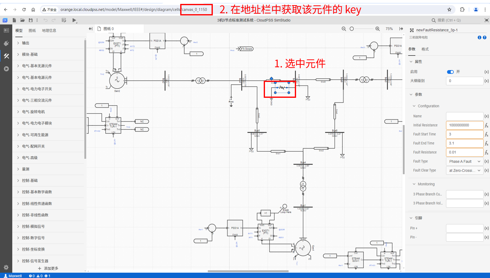
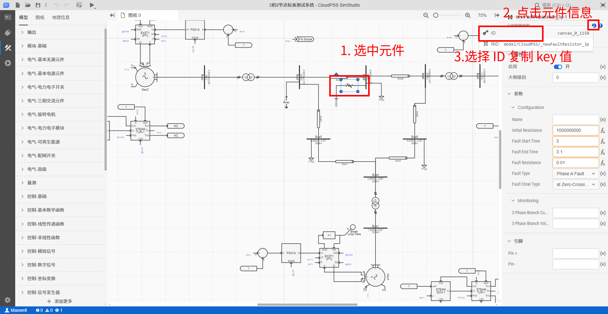
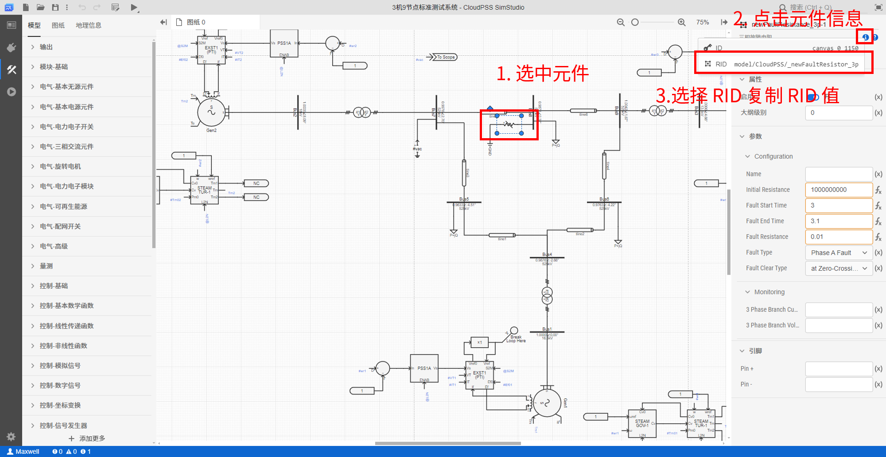
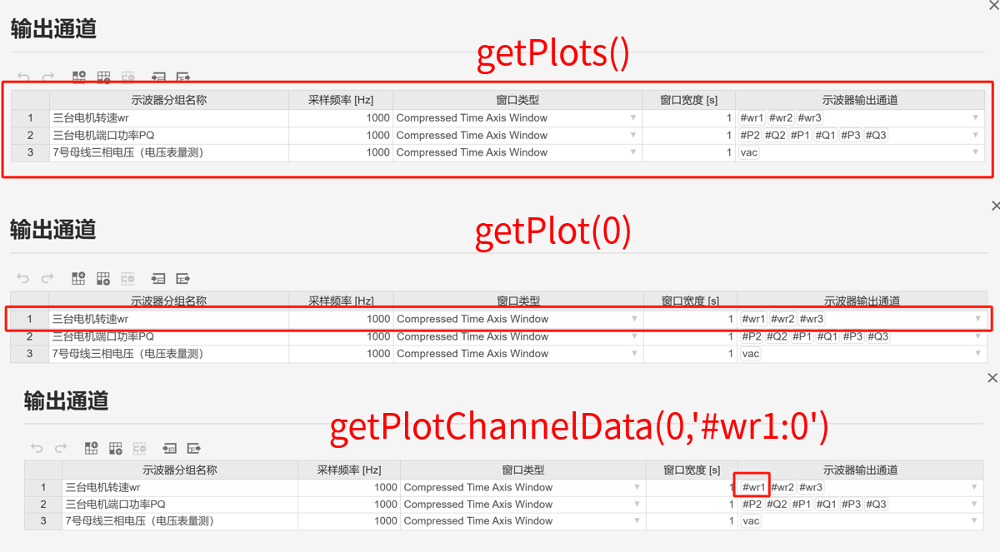

## 功能介绍

使用 EMTLab SDK 修改元件参数、调用潮流及电磁暂态仿真内核、获取并解析仿真结果。

## 使用说明

### 用到的 API

模型类：[`Class: Model`](../../../70-api/10-model/index.md#class-model)

+ 实例方法：
    | 方法     | 功能 | 
    | ---------------- | :-----------: | 
    | `model.getComponentByKey(componentKey)` |   获取指定key的元件    | 
    | `model.getComponentsByRid(rid)`                |  获取指定 rid 的所有元件  | 
    | `model.run(job=None, config=None)`                |  运行仿真任务  | 

结果类：[`Class: Result`](../../../70-api/40-result/index.md#class-result)

+ 实例方法：
    | 方法     | 功能 | 
    | ---------------- | :-----------: | 
    | `result.result` |   仿真完成后的结果缓存    | 

潮流结果类：[`Class: PowerFlowResult`](../../../70-api/40-result/index.md#class-powerflowresult)

+ 实例方法：
    | 方法     | 功能 | 
    | ---------------- | :-----------: | 
    | `powerflowResult.getBuses()` |   获取潮流结果 buses 数据    | 
    | `powerflowResult.getBranches()`                |  获取潮流结果 branches 数据  | 
    | `powerflowResult.powerFlowModify(model)`                |       潮流数据写入 model       | 

电磁暂态结果类：[`Class: EMTResult`](../../../70-api/40-result/index.md#class-emtresult)

+ 实例方法：
    | 方法     | 功能 | 
    | ---------------- | :-----------: | 
    | `emtResult.getPlots()` |   获取所有的 plots 数据    | 
    | `emtResult.getPlot(index)`                |  获取指定序号的数据分组  | 
    | `emtResult.getPlotChannelNames(index)`                |       获取一组输出分组下的所有通道名称       | 
    | `emtResult.getPlotChannelData(index, channelName)`         |      获取一组输出分组下某条通道的数据       |

### 调用方式

+ 使用 `model.getComponentByKey(componentKey)` 和`model.getComponentsByRid(rid)`方法，修改元件参数
+ 使用 `model.run(job=None, config=None)`方法，运行仿真任务
+ 使用 `powerflowResult.getBuses()`和`emtResult.getPlots()` 方法获取仿真结果

## 案例介绍

通过一个完整的案例来展示如何基于上述 API 编写 Python 脚本实现修改元件参数、调用潮流及电磁暂态仿真内核、获取并解析仿真结果的功能。

### 代码解析

以[IEEE-3机9节点项目](../../../../20-emtlab/30-quick-start/10-start-from-template/index.md)为例，使用`Model.fetch`方法获取该项目实例。

```python title="获取IEEE 3机9节点项目实例" showLineNumbers

import os
import cloudpss   

if __name__ == '__main__':
    os.environ['CLOUDPSS_API_URL'] = 'http://orange.local.cloudpss.net/'
    cloudpss.setToken('{token}')  
    # 获取IEEE 3机9节点项目实例
    model =  cloudpss.Model.fetch('model/Maxwell/IEEE')
```

修改该项目中三相故障电阻元件的**故障类型**参数，首先，需要获取三相故障电阻元件的 key，元件的 key 的获取方式：

+ 在 SimStuido 工作台打开该算例，选中元件，此时浏览器地址栏 cell 后面就是当前元件的 Key，在每个算例中，元件 Key 是唯一的。



+ 在 SimStuido 工作台打开该算例，选中元件，点击右上角的元件信息，选择元件 ID 即可复制该元件的 key 值。



获取三相故障电阻元件的 key 后，调用 `model.getComponentByKey(componentKey)` 方法，获取三相故障电阻元件实例，利用 agrs 方法获取元件实例对象中的参数信息，修改其中的故障类型参数。元件每个参数的键名可以在参数栏中查看到。

```python title="修改三相故障电阻元件故障类型参数" showLineNumbers
    comp_newFaultResistor_3p = model.getComponentByKey('canvas_0_1150')
    # 故障类型参数的键为 ft , '7'表示 Phase ABC Fault
    comp_newFaultResistor_3p.args['ft'] = '7'
```
调用 `model.getComponentsByRid(componentRid)` 方法，获取所有传输线元件实例，批量修改单位长度正序电阻参数。首先，需要获取传输线元件的 rid，元件的 rid 的获取方式：

+ 在 SimStuido 工作台打开该算例，选中元件，点击右上角的元件信息，选择元件 RID 即可复制该类元件的 RID 值。



```python title="批量修改传输线元件参数" showLineNumbers
    # 获取模型中所有传输线元件的实例
    comp_Tlines = model.getComponentsByRid('model/cloudpss/TranssmissionLineRouter')
    # 遍历每个传输线元件，利用 getComponetByKey 方法获取每个传输线元件实例
    for key in comp_Tlines.keys():
        comp = model.getComponentByKey(key)
        # 单位长度正序电阻参数的键为 R1pu ，从0.01修改为0.02
        comp.args['R1pu'] = 0.02
```
修改元件参数后，使用`model.run(job=None, config=None)`方法，通过指定参数方案和计算方案，来启动相应的计算任务，返回一个 `runner` 类的运行实例。
例如先启动一个潮流计算任务：

```python title="启动潮流计算任务" showLineNumbers
    config = model.configs[0] 
    # 获取计算方案，这里[0]表示第一个计算方案，为默认的潮流计算方案
    job = model.jobs[0]  
    # 启动潮流计算任务
    runner = model.runPowerFlow(job,config)
```

启动计算任务后，使用`runner.status()`方法，监听计算任务实例的运行状态，对于潮流计算任务，只有计算完成才能获取计算结果。例如，我们在脚本中可以这样使用status 方法，添加一个循环，判断 status 的值是否为0，若是0则任务还在运行中，可以输出运行日志，如果值是1，说明任务运行结束，跳出循环，输出任务计算结束的标志。

```python title="监听计算任务实例的运行状态" showLineNumbers
    import time
    # 监听计算任务实例的运行状态
    while not runner.status():
        # 获取运行日志
        logs = runner.result.getLogs()
        for log in logs:
            # 打印每一条日志
            print(log)
        # 每隔一秒判断一次运行状态
        time.sleep(1)
    print('end') # 运行结束后，输出结束标志
```

计算任务运行结束后，即可使用`runner.result`方法来获取计算结果，针对不同的仿真计算内核提供了相应的接口，潮流计算内核提供了节点电压和支路电流结果的获取接口。

```python title="获取潮流计算结果" showLineNumbers
    Buses = runner.result.getBuses() #获取节点电压的潮流计算结果
    print(f'节点电压表：{Buses}')
    Branches = runner.result.getBranches() #获取支路功率的潮流计算结果
    print(f'支路功率表：{Branches}')
    # 节点电压表中第二列的节点电压数据可以用如下的python切片方法获取
    Vm = Buses[0]['data']['columns'][2]
    print(f'节点电压数据：{Vm}')
```

潮流计算结束后，可以调用`runner.result.powerFlowModify(model)`方法将潮流数据写入项目实例，并在此潮流断面下启动电磁暂态仿真。

```python title="启动电磁暂态仿真计算任务" showLineNumbers
    # 将潮流数据写入项目实例
    runner.result.powerFlowModify(model)
    config = model.configs[0] 
    # 获取电磁暂态计算方案，这里[1]表示第二个方案为电磁暂态仿真计算方案
    job = model.jobs[1]  
    # 在此潮流断面下启动电磁暂态仿真
    runner = model.runEMT(job,config)
```

对于电磁暂态仿真计算任务，可以在仿真过程中持续获取仿真结果。

```python title="仿真过程中不断获取仿真结果" showLineNumbers
    while not runner.status():
        for message in runner.result:
            # 只输出仿真曲线
            if message['type'] != 'plot':
                continue
            else:
                # 输出时序波形数据
                print(message)
        # 每隔0.1秒输出一次
        time.sleep(0.1)
```

也可以在电磁暂态仿真任务计算结束后，即可使用`runner.result`方法来获取计算结果，针对电磁暂态仿真内核提供了输出通道暂态波形数据的获取接口。

```python title="仿真过程中不断获取仿真结果" showLineNumbers
    runner = model.runEMT(job,config)
    # 监听计算任务实例的运行状态
    while not runner.status():
        # 获取运行日志
        logs = runner.result.getLogs()
        for log in logs:
            # 打印每一条日志
            print(log)
        # 每隔一秒判断一次运行状态
        time.sleep(1)
    print('end') # 运行结束后，输出结束标志

    plots = runner.result.getPlots() # 获取全部输出通道数据
    print(plots)
    plots_1 = runner.result.getPlot(0) # 获取指定一组示波器分组中所有输出通道的数据
    print(plots_1)
    plots_1_1 = runner.result.getPlotChannelData(0,'#wr1:0') # 获取指定一组示波器分组中指定通道的数据
    print(plots_1_1)
```


`runner.result.getPlotChannelData(0,'#wr1:0')` 方法获取到的单个通道的数据结构如下：

| key     | value |  含义 |
| ---------------- | :-----------: | :-----------: | 
| `name` |   #wr1:0    | 通道名称 |
| `type` |   scatter    | 曲线类型为散点图 |
| `x` |   [0.0001,···,]    | 曲线的x轴数据列表, 以示波器采样周期为间隔(不是仿真步长) |
| `y` |   [1.0,···,]    | 曲线的y轴数据列表，仿真结果 |

### 结果展示

执行上述代码，获取的潮流计算结果数据如下所示：

```
节点电压表：[{'data': {'columns': [{'data': ['canvas_0_1054', 'canvas_0_1060', 'canvas_0_1088', 'canvas_0_1089', 'can0', 'canvas_0_1091', 'canvas_0_1092', 'canvas_0_1093', 'canvas_0_1094'], 'name': 'Bus', 'type': 'html'}, {'data': ['c57', '', '', '', 'canvas_0_762', '', '', '', 'canvas_0_766'], 'name': 'Node', 'type': 'html'}, {'data': [1, 0.9978193, 0.9878296043857075, 1.0041895577772493, 1, 0.9633408585122871, 0.9763401685292369, 0.9875927780370882, 1], 'name': <sub>m</sub> / pu', 'type': 'number'}, {'data': [8.092582031942275, 2.701412184678982, 0.32391306516573937, 1.8733292, 4.883886655136845, -4.510454635452575, -4.216958618373644, -2.656499156368242, 0], 'name': '<i>V</i><sub>a</sub> / pe': 'number'}, {'data': [150, 0, 0, 0, 90, 0, 0, 0, 79.46700841579943], 'name': '<i>P</i><sub>gen</sub> / MW', 'typer'}, {'data': [10.55124562797219, 0, 0, 0, -4.784385577514241, 0, 0, 0, 23.38287309068695], 'name': '<i>Q</i><sub>gen
MVar', 'type': 'number'}, {'data': [0, 0, 100, 0, 0, 125, 90, 0, 0], 'name': '<i>P</i><sub>load</sub> / MW', 'type': , {'data': [0, 0, 35, 0, 0, 50, 30, 0, 0], 'name': '<i>Q</i><sub>load</sub> / MVar', 'type': 'number'}, {'data': [0, 
0, 0, 0, 0, 0], 'name': '<i>P</i><sub>shunt</sub> / MW', 'type': 'number'}, {'data': [0, 0, 0, 0, 0, 0, 0, 0, 0], 'naQ</i><sub>shunt</sub> / MVar', 'type': 'number'}, {'data': [-1.8082090491589042e-08, 5.557725927474166e-06, -5.318857e-06, 1.6163601088692303e-06, -1.529181901105403e-07, -5.304901947056351e-06, -3.1779182876334744e-06, -9.96579814227 4.428423494573508e-07], 'name': '<i>P</i><sub>res</sub> / MW', 'type': 'number'}, {'data': [-2.898104867199436e-09, 160207412e-06, -1.9289164754354715e-07, -2.6500161993681104e-05, -8.903930037718055e-09, -1.3579522189388626e-05, -1.403923e-06, -1.2175363288235985e-05, -3.1834354068394077e-06], 'name': '<i>Q</i><sub>res</sub> / MVar', 'type': 'numbitle': 'Buses'}, 'key': 'buses-table', 'type': 'table', 'version': 1}]
支路功率表：[{'data': {'columns': [{'data': ['canvas_0_1065', 'canvas_0_1068', 'canvas_0_1071', 'canvas_0_1074', 'can7', 'canvas_0_1080', 'canvas_0_1087', 'canvas_0_1095', 'canvas_0_1096'], 'name': 'Branch', 'type': 'html'}, {'data': 0_1060', 'canvas_0_1091', 'canvas_0_1088', 'canvas_0_1092', 'canvas_0_1091', 'canvas_0_1093', 'canvas_0_1054', 'canva, 'canvas_0_1093'], 'name': 'From bus', 'type': 'html'}, {'data': [72.28871738152132, -75.7639345814068, -28.16178480
664453, 2.8331554052088466, -12.377528232114683, 20.15812747545786, -13.6396393146035, 3.5808348627469484, -4.784385568610311, 23.382876274122356], 'name': '<i>Q</i><sub>ji</sub> / MVar', 'type': 'number'}, {'data': [0.4505075082382544, 1.9473424974280351, 0.114701721467885, 1.4556241371115963, 0.33534778142621724, 0.16349212245729727, 0, 0, 0], 'name': '<i>P</i><sub>loss</sub> / MW', 'type': 'number'}, {'data': [-11.640499903999924, -19.671379345927033, -19.796341831389917, -28.737887756276493, -14.481311533757376, -14.367254553774078, 14.132080493617243, 4.76001375845752, 3.952376213198365], 'name': '<i>Q</i><sub>loss</sub> / MVar', 'type': 'number'}], 'title': 'Branches'}, 'key': 'branches-664453, 2.8331554052088466, -12.377528232114683, 20.15812747545786, -13.6396393146035, 3.5808348627469484, -4.784385568610311, 23.382876274122356], 'name': '<i>Q</i><sub>ji</sub> / MVar', 'type': 'number'}, {'data': [0.4505075082382544, 1.9473424974280351, 0.114701721467885, 1.4556241371115963, 0.33534778142621724, 0.16349212245729727, 0, 0, 0], 'name': '<i>P</i><sub>loss</sub> / MW', 'type': 'number'}, {'data': [-11.640499903999924, -19.671379345927033, -19.796341831389917, -28.737887756276493, -14.481311533757376, -14.367254553774078, 14.132080493617243, 4.76001375845752, 3.95664453, 2.8331554052088466, -12.377528232114683, 20.15812747545786, -13.6396393146035, 3.5808348627469484, -4.784385568610311, 23.382876274122356], 'name': '<i>Q</i><sub>ji</sub> / MVar', 'type': 'number'}, {'data': [0.4505075082382544, 1.9473424974280351, 0.114701721467885, 1.4556241371115963, 0.33534778142621724, 0.16349212245729727, 0, 0, 0], 'name': '<i>P</i><sub>loss</sub> / MW', 'type': 'number'}, {'data': [-11.640499903999924, -19.671379345927033, -19.79634664453, 2.8331554052088466, -12.377528232114683, 20.15812747545786, -13.6396393146035, 3.5808348627469484, -4.784385568610311, 23.382876274122356], 'name': '<i>Q</i><sub>ji</sub> / MVar', 'type': 'number'}, {'data': [0.4505075082382544, 1.9473424974280351, 0.114701721467885, 1.4556241371115963, 0.33534778142621724, 0.16349212245729727, 0, 0, 0], 'na664453, 2.8331554052088466, -12.377528232114683, 20.15812747545786, -13.6396393146035, 3.5808348627469484, -4.784385568610311, 23.382876274122356], 'name': '<i>Q</i><sub>ji</sub> / MVar', 'type': 'number'}, {'data': [0.450507508238254664453, 2.8331554052088466, -12.377528232114683, 20.15812747545786, -13.6396393146035, 3.5808348627469484, -4.784385568610311, 23.382876274122356], 'name': '<i>Q</i><sub>ji</sub> / MVar', 'type': 'number'}, {'data': [0.450507508238254664453, 2.8331554052088466, -12.377528232114683, 20.15812747545786, -13.6396393146035, 3.5808348627469484, -4.784385568610311, 23.382876274122356], 'name': '<i>Q</i><sub>ji</sub> / MVar', 'type': 'number'}, {'data': [0.4505075082382544, 1.9473424974280351, 0.114701721467885, 1.4556241371115963, 0.33534778142621724, 0.16349212245729727, 0, 0, 0], 'na, 'type': 'table', 'version': 1}]
节点电压数据：{'data': [1, 0.9978193690593117, 0.9878296043857075, 1.0041895577772493, 1, 0.9633408585122871, 0.9763401685292369, 0.9875927780370882, 1], 'name': '<i>V</i><sub>m</sub> / pu', 'type': 'number'}
```

获取的电磁暂态仿真结果数据如下所示：


## 调试技巧

若仿真结果获取失败，可采用如下调试流程检查脚本代码：

+ 在 SimStudio 平台检查项目拓扑，确保能正确运行计算内核
+ 检查计算方案是否配置正确
+ 检查获取计算结果的 API 接口是否正确调用，特别注意参数的顺序和必填项

## 常见问题


计算任务结束后，获取潮流计算结果时报`runner.result`没有`getBuses()`方法的错误。

:   检查计算方案，确保当前计算方案为潮流计算。

## 完整代码

```python title="完整代码" showLineNumbers

import time
import os
import cloudpss   

if __name__ == '__main__':
    os.environ['CLOUDPSS_API_URL'] = 'http://orange.local.cloudpss.net/'
    cloudpss.setToken('{token}')  
    # 获取IEEE 3机9节点项目实例
    model =  cloudpss.Model.fetch('model/Maxwell/IEEE')
    # 获取三相故障电阻元件实例
    comp_newFaultResistor_3p = model.getComponentByKey('canvas_0_1150')
    # 故障类型参数的键为 ft , '7'表示 Phase ABC Fault
    comp_newFaultResistor_3p.args['ft'] = '7'
    # 获取模型中所有传输线元件的实例
    comp_Tlines = model.getComponentsByRid('model/cloudpss/TranssmissionLineRouter')
    # 遍历每个传输线元件，利用 getComponetByKey 方法获取每个传输线元件实例
    for key in comp_Tlines.keys():
        comp = model.getComponentByKey(key)
        # 单位长度正序电阻参数的键为 R1pu ，从0.01修改为0.02
        comp.args['R1pu'] = 0.02

    config = model.configs[0] 
    # 获取计算方案，这里[0]表示第一个计算方案，为默认的潮流计算方案
    job = model.jobs[0]  
    # 启动潮流计算任务
    runner = model.runPowerFlow(job,config)
    
    # 监听计算任务实例的运行状态
    while not runner.status():
        # 获取运行日志
        logs = runner.result.getLogs()
        for log in logs:
            # 打印每一条日志
            print(log)
        # 每隔一秒判断一次运行状态
        time.sleep(1)
    print('end') # 运行结束后，输出结束标志

    Buses = runner.result.getBuses() #获取节点电压的潮流计算结果
    print(f'节点电压表：{Buses}')
    Branches = runner.result.getBranches() #获取支路功率的潮流计算结果
    print(f'支路功率表：{Branches}')
    # 节点电压表中第二列的节点电压数据可以用如下的python切片方法获取
    Vm = Buses[0]['data']['columns'][2]
    print(f'节点电压数据：{Vm}')

    # 将潮流数据写入项目实例
    runner.result.powerFlowModify(model)
    config = model.configs[0] 
    # 获取电磁暂态计算方案，这里[1]表示第二个方案为电磁暂态仿真计算方案
    job = model.jobs[1]  
    # 在此潮流断面下启动电磁暂态仿真
    runner = model.runEMT(job,config)
    # 仿真过程中输出结果
    while not runner.status():
        for message in runner.result:
            # 只输出仿真曲线
            if message['type'] != 'plot':
                continue
            else:
                # 输出时序波形数据
                print(message)
        # 每隔0.1秒输出一次
        time.sleep(0.1)
        
    runner = model.runEMT(job,config)
    # 仿真结束后输出结果
    while not runner.status():
        # 获取运行日志
        logs = runner.result.getLogs()
        for log in logs:
            # 打印每一条日志
            print(log)
        # 每隔一秒判断一次运行状态
        time.sleep(1)
    print('end') # 运行结束后，输出结束标志
    plots = runner.result.getPlots() # 获取全部输出通道数据
    print(plots)
    plots_1 = runner.result.getPlot(0) # 获取指定一组示波器分组中所有输出通道的数据
    print(plots_1)
    plots_1_1 = runner.result.getPlotChannelData(0,'#wr1:0') # 获取指定一组示波器分组中指定通道的数据
    print(plots_1_1)

```