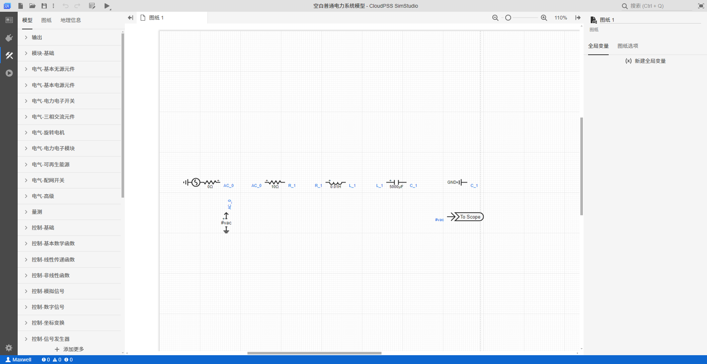
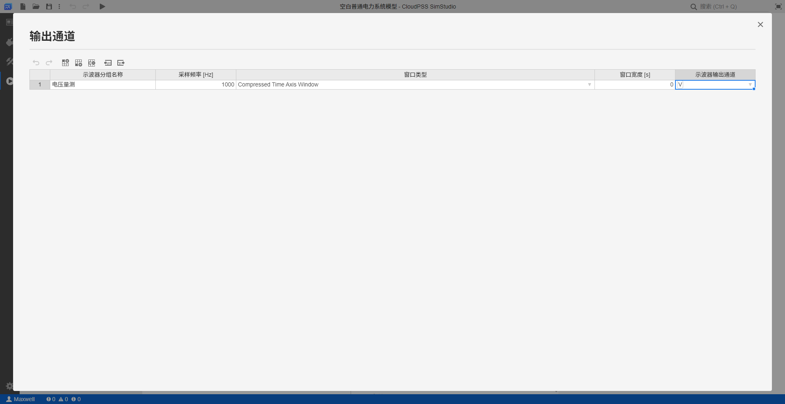
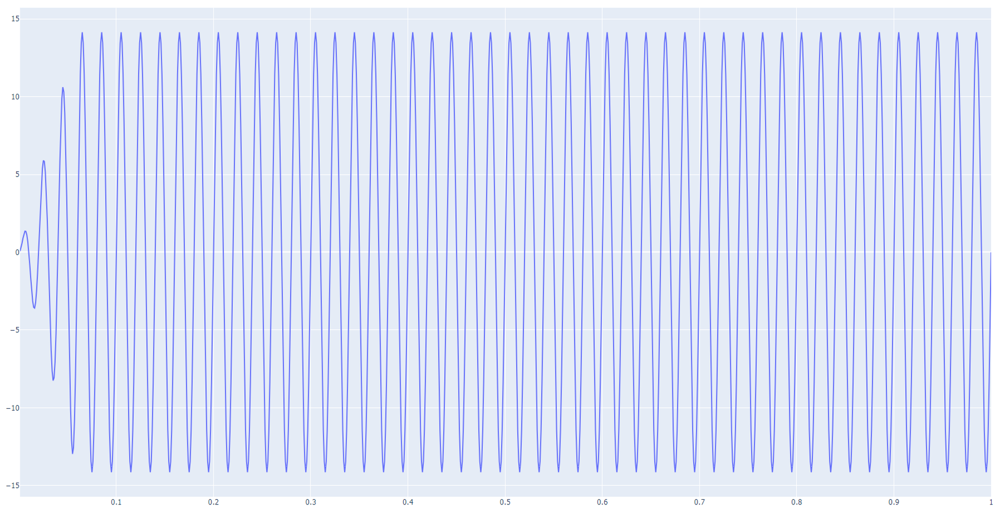

## 功能介绍

使用 EMTLab SDK 实现自动建模，利用脚本完成在 SimStudio 工作台上手动搭建项目拓扑的工作。

## 使用说明

### 用到的 API

模型类：[`Class: Model`](../../../70-api/10-model/index.md#class-model)

+ 实例方法：
    | 方法     | 功能 | 
    | ---------------- | :-----------: | 
    | `model.addComponent(definition, label, args, pins, canvas=None, position=None, size=None)` |   添加元件（创建一个新的元件并添加到拓扑中），需要安装 4.1.1.a20 及以上版本的 SDK    | 
    | `model.updateComponent(key, label=None, args=None, pins=None, canvas=None, position=None, size=None`                |  更新元件，需要安装 4.1.1.a20 及以上版本的 SDK   | 
    | `model.removeComponent(key)`                |  删除元件，需要安装 4.1.1.a20 及以上版本的 SDK   | 

### 调用方式

使用 `model.addComponent` 方法，给项目实例中添加元件，调用该方法时需要提供如下的元件参数：

    | 参数     | 含义 |  注意事项 |
    | ---------------- | :-----------: |  :-----------: |
    | `definition` |   元件的RID    |     每一类元件的 RID 是唯一且固定的，可在 SimStudio 工作台的**元件信息**中获取     | 
    | `label`                |  元件的标签  |  可置空，不可缺省    |
    | `args`                |       元件的参数       |   可在 SimStudio 工作台的**元件参数卡**中获取，只需要列写需要修改值的参数，其他参数为默认值    |
    | `pins`         |      元件的引脚       |  可以通过输入相同的引脚名来指定元件之间的连接关系    |
    | `canvas`         |      元件所在的图纸  ID       |  可缺省，默认为 `'canvas_0'`  |
    | `position`         |      元件的位置坐标       |  可缺省，默认为 `{'x': 0, 'y': 0}`  |
    | `size`         |      元件的大小       |  可缺省，但默认为`{'width': 1, 'height': 1}`，可在 SimStudio 工作台的**元件格式卡**中获取元件的默认大小数据进行配置  |

## 案例介绍

通过一个完整的案例来展示如何基于上述 API 编写 Python 脚本**自动构建电磁暂态仿真项目**，并**进行电磁暂态仿真输出波形**。

### 代码解析


使用`Model.fetch`方法获取一个空白普通电力系统模型项目实例（需要提前在 SimStudio 中提前构建空白的普通电力系统模型项目）

```python title="获取一个空白普通电力系统模型项目实例" showLineNumbers

import os
import cloudpss   

if __name__ == '__main__':
    os.environ['CLOUDPSS_API_URL'] = 'http://orange.local.cloudpss.net/'
    cloudpss.setToken('{token}')  
    # 获取一个空白普通电力系统模型项目实例（需要提前创建一个空白普通电力系统模型项目）
    model =  cloudpss.Model.fetch('model/Maxwell/BLank_Commom')
```

调用 `model.addComponent(definition, label, args, pins, canvas=None, position=None, size=None)` 方法给项目实例添加元件。以构建一个简单的[RLC电路的电磁暂态仿真模型](../../../../20-emtlab/30-quick-start/20-start-from-scratch/index.md)为例，添加单相交流电压源、电阻、电感、电容、接地点等电气元件。

```python title="添加电气元件代码" showLineNumbers

    # 添加单相交流电压源元件
    Component___newACVoltageSource_1p = model.addComponent(
        definition= 'model/CloudPSS/_newACVoltageSource_1p', # 单相交流电压源元件的 RID
        label='单相交流电压源1', # 配置元件的标签
        # 配置元件的参数,只需要列写需要修改的参数，其他参数为默认值
        args={
            'Vm': 10,  # 电压有效值为设置为 10 kV
        },
        pins={
            '1': 'AC_0'  # 单相交流电压源元件引脚编号
        },
        canvas='canvas_0', # 指定元件所在图纸 
        position={'x': 60, 'y': 360},  # 配置元件位置坐标
        size={'width': 90, 'height': 40}  # 配置元件的大小，这里采用的是单相交流电压源元件的默认大小
    )

    # 添加电阻元件
    Component___newResistorRouter = model.addComponent(
        definition= 'model/CloudPSS/newResistorRouter', # 电阻元件的 RID
        label='电阻1', # 配置元件的标签
        # 元件的参数,只需要列写需要修改的参数，其他参数为默认值
        args={
            'R': 10,  # 电阻为10Ω
        },
        pins={
            '0': 'AC_0',  # 配置引脚名称，首端与单相交流电压源元件相连
            '1': 'R_1'    # 末端与电感元件首端相连
        },
        canvas='canvas_0', # 指定元件所在图纸
        position={'x': 60+200, 'y': 360},  # 配置元件位置坐标，与单相交流电压源元件在同一水平位置，向右平移 200 单位
        size={'width': 50, 'height': 30}  # 配置元件的大小
    )

    # 添加电感元件
    Component___newInductorRouter = model.addComponent(
        definition= 'model/CloudPSS/newInductorRouter', # 电感元件的 RID
        label='电感1', # 配置元件的标签
        # 元件的参数,只需要列写需要修改的参数，其他参数为默认值
        args={
            'L': 0.01,  # 电感为0.01H
        },
        pins={
            '0': 'R_1',  # 首端与电阻元件末端相连
            '1': 'L_1'   # 末端与电容元件首端相连
        },
        canvas='canvas_0', # 指定元件所在图纸
        position={'x': 60+200+150, 'y': 360},  # 配置元件位置坐标，与其他元件在同一水平位置，向右平移 150 单位
        size={'width': 50, 'height': 30}  # 配置元件的大小 
    )

    # 添加电容元件
    Component___newCapacitorRouter = model.addComponent(
        definition= 'model/CloudPSS/newCapacitorRouter', # 电容元件的 RID
        label='电容1', # 配置元件的标签
        # 元件的参数,只需要列写需要修改的参数，其他参数为默认值
        args={
            'C': 1000,  # 电容为5000μF
        },
        pins={
            '0': 'L_1',  # 首端与电感元件末端相连
            '1': 'C_1'   # 末端与接地元件相连
        },
        canvas='canvas_0', # 指定元件所在图纸 
        position={'x': 60+200+150+150, 'y': 360},  # 配置元件位置坐标，与其他元件在同一水平位置，向右平移 150 单位
        size={'width': 50, 'height': 30}  # 配置元件的大小
    )

    # 添加接地点元件
    Component___GND = model.addComponent(
        definition= 'model/CloudPSS/GND', # 接地点元件的 RID
        label='接地点1', # 配置元件的标签
        # 元件的参数,只需要列写需要修改的参数，其他参数为默认值
        args={
        },
        pins={
            '0': 'C_1',  #  接地元件引脚编号
        },
        canvas='canvas_0', # 指定元件所在图纸
        position={'x': 60+200+150+150+150, 'y': 360},  # 配置元件位置坐标，与其他元件在同一水平位置，向右平移 150 单位
        size={'width': 50, 'height': 30}  # 配置元件的大小
    )

    # 更新电容元件
    model.updateComponent(Component___newCapacitorRouter.id, 
        args={
            'C': 5000,  # 电容的电阻值更新为5000μF
        },)
```

添加测量元件和输出通道元件，指定量测点位，绑定输出通道

```python title="添加测量元件和输出通道元件" showLineNumbers

     # 添加电压表元件
    Component__NewVoltageMeter = model.addComponent(
        definition= 'model/CloudPSS/_NewVoltageMeter', # 电压表元件的 RID
        label='电压表1', # 配置元件的标签
        # 元件的参数,只需要列写需要修改的参数，其他参数为默认值
        args={
            'Dim': '1', # 单相
            'V': '#vac' # 电压量测名称
        },
        pins={
            '0': 'AC_0'  # 测量点位为单相交流电压源的电压
        },
        canvas='canvas_0', # 指定元件所在图纸 
        position={'x': 60+90, 'y': 450}, # 配置元件位置坐标
        size={'width': 30, 'height': 50} # 配置元件的大小
    )

    # 添加输出通道元件
    Component__newChannel = model.addComponent(
        definition= 'model/CloudPSS/_newChannel', # 输出通道元件的 RID
        label='输出通道1',
        args={
            'Dim':  '1', # 单相
            'Name': 'V'}, # 输出通道名称
        pins={
            '0': '#vac'},  # 引脚名为电压表的电压量测名称，输出电压表的测量数据
        canvas='canvas_0', # 指定元件所在图纸
        position={'x': 60+200+150+150+150, 'y': 450}, # 配置元件位置坐标
        size={'width': 110, 'height': 20} # 配置元件的大小
    )
```

添加完元件后，在电磁暂态计算方案中配置输出通道，并保存项目实例，此时 SimStudio 工作台中该项目会同步更新。具体的，通过`model.jobs[0]['args']['output_channels']`来获取电磁暂态计算方案的输出通道，是一个含多个示波器分组的列表，每个示波器分组包含如下 5 个参数：

| 参数键名     | 含义 |  注意事项 |
| ---------------- | :-----------: |  :-----------: |
| `0` |   示波器分组名称    |     每一类元件的 RID 是唯一且固定的，可在 SimStudio 工作台的**元件信息**中获取     | 
| `1`                |  采样频率[Hz]  |  默认为 1000    |
| `2`                |       窗口类型       |   默认为 compressed    |
| `3`         |      窗口宽度[s]       |  默认为 0    |
| `4`         |      示波器输出通道      |  输出通道元件的 id 列表  |

```python title="计算方案中配置输出通道的示例代码" showLineNumbers
    # 获取默认的电磁暂态计算方案，这里[0]表示第一个方案为电磁暂态计算方案
    job = model.jobs[0]  
    # [0]表示电磁暂态计算方案会默认添加的第一个示波器分组，可添加多个示波器分组
    job['args']['output_channels'][0] = {
        '0': '电压量测',  # 配置示波器分组名称
        '1': 1000,  # 配置采样频率
        '2': 'compressed', # 配置窗口类型
        '3': 0,  # 配置窗口宽度
        '4': [Component__newChannel.id]  # 配置示波器输出通道，这里为添加输出通道元件的 id 
        } 
    # 在SimStudio工作台中同步更新
    model.save()
```

调用电磁暂态计算内核，获取仿真结果。

```python title="调用计算内核获取仿真结果示例代码" showLineNumbers
 # 启动计算任务
    config = model.configs[0] 
    job = model.jobs[0]  
    runner = model.run(job,config)
    while not runner.status():
        logs = runner.result.getLogs()
        for log in logs:
            print(log)
        time.sleep(1)
    print('end')
    # 打印结果
    plots = runner.result.getPlots() #获取全部输出通道

    # 使用 plotly 绘制曲线
    import plotly.graph_objects as go
    for i in range(len(plots)):
        fig = go.Figure()
        channels= runner.result.getPlotChannelNames(i)
        for val in channels:
            channel=runner.result.getPlotChannelData(i,val)
            fig.add_trace(go.Scatter(channel))
        fig.show()
```

### 结果展示

执行上述代码，可以看到在 SimStudio 工作台，该空白项目自动添加了如下的仿真拓扑结构，并在计算方案中添加了输出通道。





对该项目进行电磁暂态仿真，计算结果如下所示。




## 调试技巧

若自动构建模型失败，可采用如下调试流程检查脚本代码：

+ 检查元件 RID 是否正确，可直接在 SimStudio 工作台的元件信息中复制获取；
+ 检查元件参数的键名是否填写正确，可将鼠标悬停在 SimStudio 工作台的元件参数卡中查看每个参数的键名
+ 检查 API 接口是否正确调用，特别注意参数的顺序和必填项
+ 检查元件的引脚号是否配置正确，确保元件连接关系正确

## 常见问题

自动构建的模型不能进行电磁暂态仿真如何解决？

:   可以在 SimStuido  工作台打开该项目，检查状态栏是否有错误提示，根据错误提示修改脚本，确保构建的模型没有拓扑错误。

## 完整代码

```python title="完整代码" showLineNumbers

import os
import cloudpss   

if __name__ == '__main__':
    os.environ['CLOUDPSS_API_URL'] = 'http://orange.local.cloudpss.net/'
    cloudpss.setToken('{token}')  
    # 获取一个空白普通电力系统模型项目实例（需要提前创建一个空白普通电力系统模型项目）
    model =  cloudpss.Model.fetch('model/Maxwell/BLank_Commom')
    # 添加单相交流电压源元件
    Component___newACVoltageSource_1p = model.addComponent(
        definition= 'model/CloudPSS/_newACVoltageSource_1p', # 单相交流电压源元件的 RID
        label='单相交流电压源1', # 配置元件的标签
        # 配置元件的参数,只需要列写需要修改的参数，其他参数为默认值
        args={
            'Vm': 10,  # 电压有效值为设置为 10 kV
        },
        pins={
            '1': 'AC_0'  # 单相交流电压源元件引脚编号
        },
        canvas='canvas_0', # 指定元件所在图纸 
        position={'x': 60, 'y': 360},  # 配置元件位置坐标
        size={'width': 90, 'height': 40}  # 配置元件的大小，这里采用的是单相交流电压源元件的默认大小
    )
    # 添加电阻元件
    Component___newResistorRouter = model.addComponent(
        definition= 'model/CloudPSS/newResistorRouter', # 电阻元件的 RID
        label='电阻1', # 配置元件的标签
        # 元件的参数,只需要列写需要修改的参数，其他参数为默认值
        args={
            'R': 10,  # 电阻为10Ω
        },
        pins={
            '0': 'AC_0',  # 配置引脚名称，首端与单相交流电压源元件相连
            '1': 'R_1'    # 末端与电感元件首端相连
        },
        canvas='canvas_0', # 指定元件所在图纸
        position={'x': 60+200, 'y': 360},  # 配置元件位置坐标，与单相交流电压源元件在同一水平位置，向右平移 200 单位
        size={'width': 50, 'height': 30}  # 配置元件的大小
    )
    # 添加电感元件
    Component___newInductorRouter = model.addComponent(
        definition= 'model/CloudPSS/newInductorRouter', # 电感元件的 RID
        label='电感1', # 配置元件的标签
        # 元件的参数,只需要列写需要修改的参数，其他参数为默认值
        args={
            'L': 0.01,  # 电感为0.01H
        },
        pins={
            '0': 'R_1',  # 首端与电阻元件末端相连
            '1': 'L_1'   # 末端与电容元件首端相连
        },
        canvas='canvas_0', # 指定元件所在图纸
        position={'x': 60+200+150, 'y': 360},  # 配置元件位置坐标，与其他元件在同一水平位置，向右平移 150 单位
        size={'width': 50, 'height': 30}  # 配置元件的大小 
    )
    # 添加电容元件
    Component___newCapacitorRouter = model.addComponent(
        definition= 'model/CloudPSS/newCapacitorRouter', # 电容元件的 RID
        label='电容1', # 配置元件的标签
        # 元件的参数,只需要列写需要修改的参数，其他参数为默认值
        args={
            'C': 1000,  # 电容为5000μF
        },
        pins={
            '0': 'L_1',  # 首端与电感元件末端相连
            '1': 'C_1'   # 末端与接地元件相连
        },
        canvas='canvas_0', # 指定元件所在图纸 
        position={'x': 60+200+150+150, 'y': 360},  # 配置元件位置坐标，与其他元件在同一水平位置，向右平移 150 单位
        size={'width': 50, 'height': 30}  # 配置元件的大小
    )
    # 添加接地点元件
    Component___GND = model.addComponent(
        definition= 'model/CloudPSS/GND', # 接地点元件的 RID
        label='接地点1', # 配置元件的标签
        # 元件的参数,只需要列写需要修改的参数，其他参数为默认值
        args={
        },
        pins={
            '0': 'C_1',  #  接地元件引脚编号
        },
        canvas='canvas_0', # 指定元件所在图纸
        position={'x': 60+200+150+150+150, 'y': 360},  # 配置元件位置坐标，与其他元件在同一水平位置，向右平移 150 单位
        size={'width': 50, 'height': 30}  # 配置元件的大小
    )
    # 更新电容元件
    model.updateComponent(Component___newCapacitorRouter.id, 
        args={
            'C': 5000,  # 电容的电阻值更新为5000μF
        },)
     # 添加电压表元件
    Component__NewVoltageMeter = model.addComponent(
        definition= 'model/CloudPSS/_NewVoltageMeter', # 电压表元件的 RID
        label='电压表1', # 配置元件的标签
        # 元件的参数,只需要列写需要修改的参数，其他参数为默认值
        args={
            'Dim': '1', # 单相
            'V': '#vac' # 电压量测名称
        },
        pins={
            '0': 'AC_0'  # 测量点位为单相交流电压源的电压
        },
        canvas='canvas_0', # 指定元件所在图纸 
        position={'x': 60+90, 'y': 450}, # 配置元件位置坐标
        size={'width': 30, 'height': 50} # 配置元件的大小
    )
    # 添加输出通道元件
    Component__newChannel = model.addComponent(
        definition= 'model/CloudPSS/_newChannel', # 输出通道元件的 RID
        label='输出通道1',
        args={
            'Dim':  '1', # 单相
            'Name': 'V'}, # 输出通道名称
        pins={
            '0': '#vac'},  # 引脚名为电压表的电压量测名称，输出电压表的测量数据
        canvas='canvas_0', # 指定元件所在图纸
        position={'x': 60+200+150+150+150, 'y': 450}, # 配置元件位置坐标
        size={'width': 110, 'height': 20} # 配置元件的大小
    )
    # 获取默认的电磁暂态计算方案，这里[0]表示第一个方案为电磁暂态计算方案
    job = model.jobs[0]  
    # [0]表示电磁暂态计算方案会默认添加的第一个示波器分组，可添加多个示波器分组
    job['args']['output_channels'][0] = {
        '0': '电压量测',  # 配置示波器分组名称
        '1': 1000,  # 配置采样频率
        '2': 'compressed', # 配置窗口类型
        '3': 0,  # 配置窗口宽度
        '4': [Component__newChannel.id]  # 配置示波器输出通道，这里为添加输出通道元件的 id 
        } 
    # 在SimStudio工作台中同步更新
    model.save()
    # 启动计算任务
    config = model.configs[0] 
    job = model.jobs[0]  
    runner = model.run(job,config)
    while not runner.status():
        logs = runner.result.getLogs()
        for log in logs:
            print(log)
        time.sleep(1)
    print('end')
    plots = runner.result.getPlots() #获取全部输出通道
    # 使用 plotly 绘制曲线
    import plotly.graph_objects as go
    for i in range(len(plots)):
        fig = go.Figure()
        channels= runner.result.getPlotChannelNames(i)
        for val in channels:
            channel=runner.result.getPlotChannelData(i,val)
            fig.add_trace(go.Scatter(channel))
        fig.show()
```