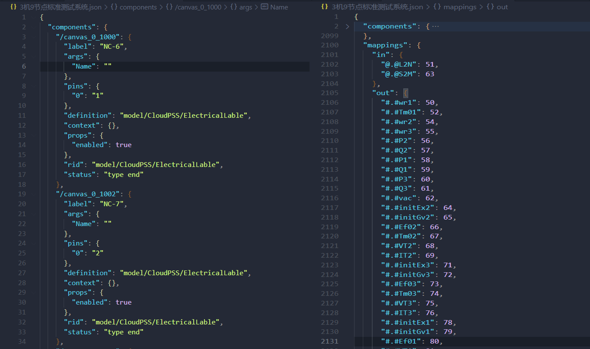

## 功能介绍

使用 EMTLab SDK 获取仿真模型项目的 JSON 拓扑文件，并进行解析。

## 使用说明

### 用到的 API

模型类：[`Class: Model`](../../../70-api/10-model/index.md#class-model)

+ 实例方法：
    | 方法     | 功能 | 
    | ---------------- | :-----------: | 
    | `model.revision` |   获取当前版本项目的版本信息    | 
    | `model.fetchTopology(implementType, config, maximumDepth=None)` |   获取项目拓扑实例    |

拓扑类：[`Class: ModelTopology`](../../../70-api/10-model/index.md#class-modeltopology)

+ 静态方法：
    | 方法     | 功能 | 
    | ---------------- | :-----------: | 
    | `ModelTopology.fetch(hash, implementType, config, maximumDepth=None)`                |  通过项目 hash,获取项目拓扑实例  | 
    | `ModelTopology.dump(topology, filePath, indent=None)`                |  保存拓扑到本地文件（JSON 格式）  | 


+ 实例方法：
    | 方法     | 功能 | 
    | ---------------- | :-----------: | 
    | `modelTopology.components` |   拓扑解析，摊平后的拓扑元件，参数和引脚不再保留表达式的形式，如果元件为拓扑实现，并有读取权限时将被展开    | 
    | `modelTopology.mappings` |   拓扑分析后的一些映射数据    | 

版本类：[`Class: ModelRevision`](../../../70-api/10-model/index.md#class-modelrevision)

+ 实例方法：
    | 方法     | 功能 | 
    | ---------------- | :-----------: | 
    | `modelRevision.fetchTopology(implementType, config, maximumDepth=None)` |  通过项目 hash，获取项目拓扑实例    | 


### 调用方式

#### 获取项目拓扑实例

获取项目拓扑实例的方式有以下三种

1. 通过模型类获取
   
 + 使用`model.fetch`方法，获取项目实例
 + 使用`model.fetchTopology()`方法，获取项目拓扑实例

2. 通过拓扑类获取
   
 + 使用`model.fetch`方法，获取项目实例
 + 使用`model.revision.hash`方法，获取当前版本项目的 hash
 + 使用`ModelTopology.fetch(hash, implementType, config, maximumDepth=None)`获取项目拓扑实例
  
3. 通过版本类获取
   
 + 使用`model.fetch`方法，获取项目实例
 + 使用`model.revision`方法，获取项目的版本信息
 + 使用`modelRevision.fetchTopology(implementType, config, maximumDepth)`获取项目拓扑实例

#### 拓扑实例解析

 + 使用`modelTopology.components`方法获取项目摊平后的拓扑元件的参数和引脚信息
 + 使用`modelTopology.mappings`方法获取项目虚拟输入和虚拟输出引脚信息

#### 拓扑 JSON 文件获取

 + 使用`ModelTopology.dump(topology, filePath, indent=None)`将拓扑实例保存为本地 JSON 文件
  

## 案例介绍

### 代码解析

以[IEEE-3机9节点项目](../../../../20-emtlab/30-quick-start/10-start-from-template/index.md)为例，通过三个完整的案例来介绍如何基于上述 API 编写 Python 脚本获取项目拓扑实例并进行解析。

import Tabs from '@theme/Tabs';
import TabItem from '@theme/TabItem';

<Tabs>
<TabItem value="js" label="通过模型类获取拓扑实例进行解析">

+ 使用`model.fetch`方法，获取项目实例

```python title="获取IEEE 3机9节点项目实例" showLineNumbers

import os
import cloudpss   

if __name__ == '__main__':
    os.environ['CLOUDPSS_API_URL'] = 'http://orange.local.cloudpss.net/'
    cloudpss.setToken('{token}')  
    # 获取IEEE 3机9节点项目实例
    model =  cloudpss.Model.fetch('model/Maxwell/IEEE')
    
```
+ 使用`model.fetchTopology()`方法，获取项目拓扑实例

```python title="" showLineNumbers
    # 获取电磁暂态实现方式下，参数方案为1，仅展开 1 层嵌套模块
    modelTopology = model.fetchTopology(implementType='emtp',config=model.configs[0], maximumDepth=1)
```

+ 拓扑实例解析

```python title="" showLineNumbers
    # 获取项目摊平后的拓扑元件的参数和引脚信息
    components = modelTopology.components
    print(components)
    # 获取项目虚拟输入和虚拟输出引脚信息
    mappings = modelTopology.mappings
    print(mappings)
```

+ 拓扑 JSON 文件获取

```python title="" showLineNumbers
    # 使用 ModelTopology.dump 将拓扑实例保存为本地 JSON 文件
    filePath = '{0}.json'.format(model.name)
    cloudpss.ModelTopology.dump(modelTopology, filePath, indent=2)
```

</TabItem>

<TabItem value="py" label="通过拓扑类获取拓扑实例进行解析">

+ 使用`model.fetch`方法，获取项目实例

```python title="获取IEEE 3机9节点项目实例" showLineNumbers

import os
import cloudpss   

if __name__ == '__main__':
    os.environ['CLOUDPSS_API_URL'] = 'http://orange.local.cloudpss.net/'
    cloudpss.setToken('{token}')  
    # 获取IEEE 3机9节点项目实例
    model =  cloudpss.Model.fetch('model/Maxwell/IEEE')
    
```
+ 使用`model.revision.hash`方法，获取项目当前版本的 hash

```python title="" showLineNumbers
    hash = model.revision.hash
```

+ 使用`ModelTopology.fetch()`方法，获取项目拓扑实例

```python title="" showLineNumbers
    # 获取潮流实现方式下，参数方案为1，仅展开 1 层嵌套模块
    modelTopology = cloudpss.ModelTopology.fetch(hash,implementType='powerFlow',config=model.configs[0], maximumDepth=1)
```

+ 拓扑实例解析

```python title="" showLineNumbers
    # 获取项目摊平后的拓扑元件的参数和引脚信息
    components = modelTopology.components
    print(components)
    # 获取项目虚拟输入和虚拟输出引脚信息
    mappings = modelTopology.mappings
    print(mappings)
```

+ 拓扑 JSON 文件获取

```python title="" showLineNumbers
    # 使用 ModelTopology.dump 将拓扑实例保存为本地 JSON 文件
    filePath = '{0}.json'.format(model.name)
    cloudpss.ModelTopology.dump(modelTopology, filePath, indent=2)
```

</TabItem>
<TabItem value="java" label="通过版本类获取拓扑实例进行解析">

+ 使用`model.fetch`方法，获取项目实例

```python title="获取IEEE 3机9节点项目实例" showLineNumbers

import os
import cloudpss   

if __name__ == '__main__':
    os.environ['CLOUDPSS_API_URL'] = 'http://orange.local.cloudpss.net/'
    cloudpss.setToken('{token}')  
    # 获取IEEE 3机9节点项目实例
    model =  cloudpss.Model.fetch('model/Maxwell/IEEE')
    
```
+ 使用`model.revision`方法，获取项目的版本信息

```python title="" showLineNumbers
    modelRevision = model.revision
```

+ 使用`modelRevision.fetchTopology()`方法，获取项目拓扑实例

```python title="" showLineNumbers
    # 获取潮流实现方式下，参数方案为1，仅展开 1 层嵌套模块
    modelTopology = modelRevision.fetchTopology(implementType='powerFlow',config=model.configs[0], maximumDepth=1)
```

+ 拓扑实例解析

```python title="" showLineNumbers
    # 获取项目摊平后的拓扑元件的参数和引脚信息
    components = modelTopology.components
    print(components)
    # 获取项目虚拟输入和虚拟输出引脚信息
    mappings = modelTopology.mappings
    print(mappings)
```

+ 拓扑 JSON 文件获取

```python title="" showLineNumbers
    # 使用 ModelTopology.dump 将拓扑实例保存为本地 JSON 文件
    filePath = '{0}.json'.format(model.name)
    cloudpss.ModelTopology.dump(modelTopology, filePath, indent=2)
```

</TabItem>
</Tabs>

### 结果展示

拓扑 JSON 文件包括`components`元件字典以及`mappings`虚拟引脚字典，如下图所示：



`components`获取到的是项目摊平后的所有元件字典，字典的 key 是每个元件的 key，value 是元件的参数和引脚信息字典，value 字典的数据结构如下：

| key     | value |  含义 |
| ---------------- | :-----------: | :-----------: | 
| `label` |   'NC-6'    | 元件的标签 |
| `args` |   `{'Name':''}`  | 元件的参数卡字典 |
| `pins` |   `{'0':'1'}`    | 元件每个引脚的编号字典，可通过搜索同名引脚，找到与该元件有连接关系的所有元件 |
| `definition` |   'model/CloudPSS/ElectricalLable'    | 元件的定义与**rid**一致 |
| `context` |   `{}`    | 元件的上下文信息 |
| `props` |   `{'enabled': True}`    | 元件是否显示 |
| `rid` |   'model/CloudPSS/ElectricalLable'   | 元件的**rid**与定义一致 |
| `status` |   'type end'   | 元件的状态 |

`mappings`获取到的项目虚拟输入和虚拟输出引脚字典数据结构如下：

| key     | value |  含义 |
| ---------------- | :-----------: | :-----------: | 
| `in` |   `{'@.@L2N': 51, '@.@S2M': 63}`    | 虚拟输入引脚的名称及引脚编号 |
| `args` |   `{'Name':''}`    | 元件的参数卡字典 |
| `pins` |   `{'0':'1'}`    | 元件的引脚卡字典 |
| `definition` |   'model/CloudPSS/ElectricalLable'    | 元件的定义与**rid**一致 |
| `context` |   `{}`    | 元件的上下文信息 |
| `props` |   `{'enabled': True}`    | 元件是否显示 |
| `rid` |   'model/CloudPSS/ElectricalLable'   | 元件的**rid**与定义一致 |
| `status` |   'type end'   | 元件的状态 |

## 调试技巧

若拓扑实例获取失败，请检查 API 接口是否正确调用，特别注意参数的顺序和必填项，可参考案例的完整代码。

## 常见问题


封装的模块内部的元件信息能获取吗？

:   如果封装的模块为拓扑实现，并有读取权限时可以获取。


最大递归深度`maximumDepth`参数默认多少？可以将多重嵌套的模块内部元件信息全部获取吗？

:   + `maximumDepth`参数默认为 None, 此时将项目中有读取权限的所有模块全部打开，摊平内部元件。
    + 也可以配置`maximumDepth`参数，例如`maximumDepth = 2`，仅展开 2 层，嵌套层数超过 2 的元件无论是否有读写权限都不会被打开。

## 完整代码

<Tabs>
<TabItem value="js" label="通过模型类获取拓扑实例进行解析">

```python showLineNumbers
import os
import cloudpss   
if __name__ == '__main__':
    os.environ['CLOUDPSS_API_URL'] = 'http://orange.local.cloudpss.net/'
    cloudpss.setToken('{token}')  
    # 获取IEEE 3机9节点项目实例
    model =  cloudpss.Model.fetch('model/Maxwell/IEEE')
    # 获取电磁暂态实现方式下，参数方案为1，仅展开 1 层嵌套模块
    modelTopology = model.fetchTopology(implementType='emtp',config=model.configs[0], maximumDepth=1)
    # 获取项目摊平后的拓扑元件的参数和引脚信息
    components = modelTopology.components
    print(components)
    # 获取项目虚拟输入和虚拟输出引脚信息
    mappings = modelTopology.mappings
    print(mappings)
    # 使用 ModelTopology.dump 将拓扑实例保存为本地 JSON 文件
    filePath = '{0}.json'.format(model.name)
    cloudpss.ModelTopology.dump(modelTopology, filePath, indent=2)
```

</TabItem>
<TabItem value="py" label="通过拓扑类获取拓扑实例进行解析">


```python showLineNumbers
import os
import cloudpss   
if __name__ == '__main__':
    os.environ['CLOUDPSS_API_URL'] = 'http://orange.local.cloudpss.net/'
    cloudpss.setToken('{token}')  
    # 获取IEEE 3机9节点项目实例
    model =  cloudpss.Model.fetch('model/Maxwell/IEEE')
    hash = model.revision.hash
    # 获取潮流实现方式下，参数方案为1，仅展开 1 层嵌套模块
    modelTopology = cloudpss.ModelTopology.fetch(hash,implementType='powerFlow',config=model.configs[0], maximumDepth=1)
    # 获取项目摊平后的拓扑元件的参数和引脚信息
    components = modelTopology.components
    print(components)
    # 获取项目虚拟输入和虚拟输出引脚信息
    mappings = modelTopology.mappings
    print(mappings)
    # 使用 ModelTopology.dump 将拓扑实例保存为本地 JSON 文件
    filePath = '{0}.json'.format(model.name)
    cloudpss.ModelTopology.dump(modelTopology, filePath, indent=2)
```
</TabItem>
<TabItem value="java" label="通过版本类获取拓扑实例进行解析">

```python showLineNumbers
import os
import cloudpss   
if __name__ == '__main__':
    os.environ['CLOUDPSS_API_URL'] = 'http://orange.local.cloudpss.net/'
    cloudpss.setToken('{token}')  
    # 获取IEEE 3机9节点项目实例
    model =  cloudpss.Model.fetch('model/Maxwell/IEEE')
    modelRevision = model.revision
    # 获取潮流实现方式下，参数方案为1，仅展开 1 层嵌套模块
    modelTopology = modelRevision.fetchTopology(implementType='powerFlow',config=model.configs[0], maximumDepth=1)
    # 获取项目摊平后的拓扑元件的参数和引脚信息
    components = modelTopology.components
    print(components)
    # 获取项目虚拟输入和虚拟输出引脚信息
    mappings = modelTopology.mappings
    print(mappings)
    # 使用 ModelTopology.dump 将拓扑实例保存为本地 JSON 文件
    filePath = '{0}.json'.format(model.name)
    cloudpss.ModelTopology.dump(modelTopology, filePath, indent=2)
```
</TabItem>
</Tabs>