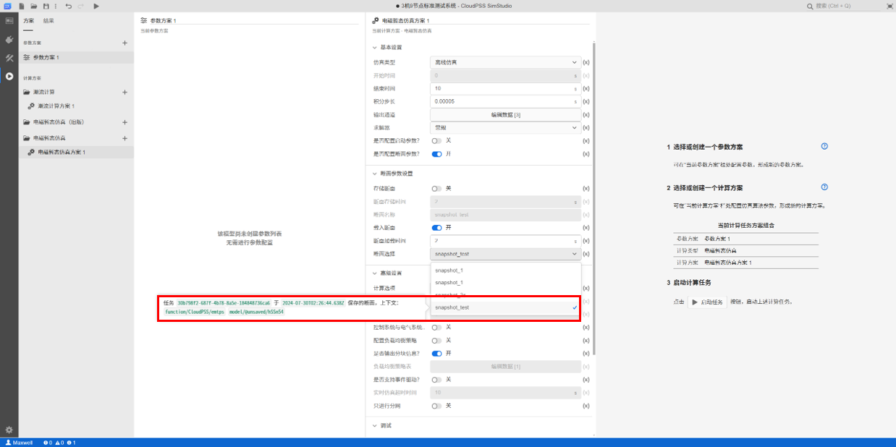
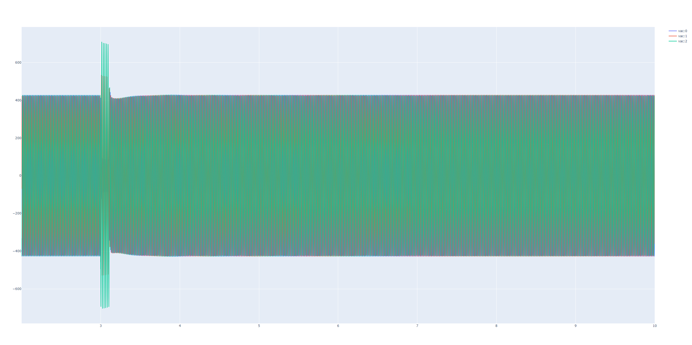

## 功能介绍
使用 EMTLab SDK 存储断面，通过载入断面实现电磁暂态仿真从给定断面开始仿真的功能。

## 使用说明

### 用到的 API
模型类：[`Class: Model`](../../../70-api/10-model/index.md#class-model)

+ 实例方法：
    | 方法     | 功能 | 
    | ---------------- | :-----------: | 
    | `model.configs` |   获取项目的所有参数方案    |
    | `model.jobs`                |  获取项目的所有计算方案  |
    | `model.run(job=None, config=None)`                |  运行仿真任务  | 
    | `model.save(key=None)`         |      保存/另存项目       |

+ 静态方法：
    | 方法     | 功能 | 
    | ---------------- | :-----------: | 
    | `Model.fetch(rid)` |   获取指定 rid 的项目    |

任务类：[`Class: Job`](../../../70-api/30-job/index.md#jobstatus)
+ 实例方法：
    | 方法     | 功能 | 
    | ---------------- | :-----------: | 
    | `job.status()` |   任务状态    |
    | `job.result` | 任务结果 |

结果类：[`Class: Result`](../../../70-api/40-result/index.md)
+ 实例方法：
    | 方法     | 功能 | 
    | ---------------- | :-----------: | 
    | `result.modify(data, model)` |   通过指定消息修改算例文件    |
    | `emtResult.getPlots()` | 获取所有的 plots 数据 |

### 调用方式
- 使用 `Model.fetch(rid)` 静态方法，获取项目实例。
- 使用 `model.configs` 和 `model.jobs` 示例方法获取项目的参数方案和计算方案，并对计算方案进行存储断面的相关设置。
- 使用 `model.run(job=None, config=None)` 运行仿真任务，使用 `job.status()` 判断任务状态，并获取仿真结果 `job.result`，在仿真结果中记录存储断面的 hash 值，可利用 hash 值进行载入断面的相关计算方案设置。
- 使用 `model.save(key=None)` 保存项目。

## 案例介绍
通过一个完整的案例来展示如何基于上述 API 编写 Python 脚本实现断面存储，以及通过断面载入实现电磁暂态仿真从给定断面开始仿真的功能。

### 代码解析
以 [IEEE-3机9节点项目](../../../../20-emtlab/30-quick-start/10-start-from-template/index.md#典型模板案例) 为例，使用 `Model.fetch` 方法获取该项目实例。

```python title="获取IEEE 3机9节点项目实例" showLineNumbers
import os
import cloudpss   

if __name__ == '__main__':
    os.environ['CLOUDPSS_API_URL'] = 'http://orange.local.cloudpss.net/'
    cloudpss.setToken('{token}')  
    # 获取IEEE 3机9节点项目实例
    model =  cloudpss.Model.fetch('model/Maxwell/IEEE')
```

使用 `model.jobs` 获取该项目的计算方案，`model.jobs[0]` 为默认的计算方案，修改计算方案里存储断面和载入断面的相关参数。

```python title="修改计算方案" showLineNumbers
job = model.jobs[1]                              # 获取计算方案
job['args']['snapshot_cfg'] = 1                  # 开启配置断面参数功能
job['args']['load_snapshot'] = 0                 # 关闭载入断面功能
job['args']['save_snapshot'] = 1                 # 开启存储断面功能
job['args']['save_snapshot_time'] = 2            # 设置断面存储时间
job['args']['save_snapshot_name'] = 'snapshot_test' # 设置断面名称
```

修改计算方案后，使用 `model.run(job=None, config=None)` 运行仿真任务，使用 `runner.status()` 判断任务状态（为了不混淆计算方案 `job` 和 任务实例 `job`，此处任务实例命名为 `runner`），并获取仿真结果 `runner.result`，遍历仿真结果，当仿真结果的消息类型为 `modify` 时，获取断面的 hash 值，并通过 `runner.result.modify(data, model)` 存储断面。任务运行结束后，使用 `model.save()` 保存项目。
 
```python title="存储断面" showLineNumbers
# 启动任务
runner = model.run(job, config)
# 监听计算任务实例的运行状态
while not runner.status():
    # 仿真过程中不断获取仿真结果
    for message in runner.result:
        if (message['type'] == 'plot') or (message['type'] == 'progress'):
            continue
        print(message)
        # 获取到 modify 类型信息
        if (message['type'] == 'modify'):
            if message['data']['payload']['context']['snapshots'] != '':
                # 获取断面的 hash 值
                snapshot_key = list(message['data']['payload']['context']['snapshots'].values())[0].get('key')
                # 存储断面
                runner.result.modify(message, model)
        time.sleep(0.05)
print("snapshot hash is: ", snapshot_key)
print('end')
# 项目另存为 snapshot_test
model.save('snapshot_test')
```

使用断面的 hash 值进行载入断面的相关计算方案设置。

```python title="修改计算方案" showLineNumbers
job['args']['save_snapshot'] = 0                    # 关闭存储断面功能
job['args']['load_snapshot'] = 1                    # 开启载入断面功能
job['args']['load_snapshot_time'] = 2               # 断面载入时间必须与断面存储时间相同
job['args']['load_snapshot_name'] = snapshot_key    # 断面选择，此处填入断面的 hash 值
```

再次启动任务，此时任务从给定断面开始仿真。任务运行结束后，使用 plotly 绘制曲线，查看最终的仿真波形曲线。

```python title="载入断面" showLineNumbers
runner = model.run(job, config)
while not runner.status():
    for message in runner.result:
        if (message['type'] == 'plot') or (message['type'] == 'progress'):
            continue
        print(message)
plots = runner.result.getPlots() # 获取全部输出通道的 plots 数据

# 使用 plotly 绘制曲线
import plotly.graph_objects as go
for i in range(len(plots)):
    fig = go.Figure()
    channels= runner.result.getPlotChannelNames(i)
    for val in channels:
        channel=runner.result.getPlotChannelData(i,val)
        fig.add_trace(go.Scatter(channel))
    fig.show()
```

### 结果展示
执行**存储断面**相关的代码， 以下为可以在终端查看到的部分日志：

```
{'data': {'content': 'Thread 0: snapshot saved at 2s \n', 'level': 'info'}, 'type': 'log', 'verb': 'create', 'version': 1, 'when': datetime.datetime(2024, 7, 30, 10, 14, 19, 602020)}
{'data': {'content': 'run ends', 'level': 'info'}, 'type': 'log', 'verb': 'create', 'version': 1, 'when': datetime.datetime(2024, 7, 30, 10, 14, 21, 538013)}
{'data': {'content': '将断面信息写入模型', 'payload': {'context': {'snapshots': {'f_nYKeOEHGJ3o78yrSGmb9WjBTp9Wd1jrRQlqPuo06sG1Eo9r4X9D6M4_VISaItt': {'by': 'function/CloudPSS/emtps', 'description': '任务 `60db7782-26f3-4056-ba75-aaaea3791803` 于 `2024-07-30T02:14:25.949Z` 保存的断面，上下文：`function/CloudPSS/emtps` `model/Maxwell/IEEE` `model/@sdk/172383863`', 'key': 'f_nYKeOEHGJ3o78yrSGmb9WjBTp9Wd1jrRQlqPuo06sG1Eo9r4X9D6M4_VISaItt', 'name': 'snapshot_test'}}}}, 'title': '断面信息'}, 'type': 'modify', 'version': 1, 'when': datetime.datetime(2024, 7, 30, 10, 14, 22, 658070)}
{'data': {'status': 'resolved'}, 'type': 'terminate', 'version': 1, 'when': datetime.datetime(2024, 7, 30, 10, 14, 22, 661077)}
snapshot hash is:  f_nYKeOEHGJ3o78yrSGmb9WjBTp9Wd1jrRQlqPuo06sG1Eo9r4X9D6M4_VISaItt
end
```
  
执行 `model.save('snapshot_test')` 后，在 SimStudio 平台打开新项目，可以在**计算方案 - 断面参数设置 - 断面选择**下拉框中看到存储的断面相关信息。



执行**载入断面**相关的代码，以下为可以在终端查看到的部分日志：
```
{'data': {'content': 'Thread 0: snapshot loaded at 2.00005s \n', 'level': 'info'}, 'type': 'log', 'verb': 'create', 'version': 1, 'when': datetime.datetime(2024, 7, 30, 11, 13, 9, 507069)}
{'data': {'content': 'Thread 0: thread 0 total time 1.73446 \n', 'level': 'info'}, 'type': 'log', 'verb': 'create', 'version': 1, 'when': datetime.datetime(2024, 7, 30, 11, 13, 11, 433070)}
{'data': {'content': 'time used:2.4294892742s\n', 'level': 'info'}, 'type': 'log', 'verb': 'create', 'version': 1, 'when': datetime.datetime(2024, 7, 30, 11, 13, 11, 433070)}
{'data': {'content': 'run ends', 'level': 'info'}, 'type': 'log', 'verb': 'create', 'version': 1, 'when': datetime.datetime(2024, 7, 30, 11, 13, 11, 433070)}
{'data': {'status': 'resolved'}, 'type': 'terminate', 'version': 1, 'when': datetime.datetime(2024, 7, 30, 11, 13, 12, 495069)}
```

使用 plotly 绘制电磁暂态仿真结果曲线，仿真结果如下所示。



## 调试技巧
假如存储断面或载入断面代码运行不成功，可以使用以下方法进行调试：

- 使用 `try...except` 捕获错误，并打印出错误，方便定位错误原因。
- 检查项目所在的平台地址、token、项目 rid 是否设置正确。
- 检查计算方案是否配置正确。
- 检查使用的 API 接口是否正确调用，特别注意参数的顺序和必填项。


## 常见问题
为什么没有获取到 modify 类型的信息，从而无法获取到断面的 hash 值

:   
用户需要检查 SDK 版本是否过旧，建议将 SDK 升级到 4.1.1.a20 及以上版本。


## 完整代码
```python title="存储断面和载入断面" showLineNumbers
import os
import cloudpss
import time

if __name__ == '__main__':
    try:  
        cloudpss.setToken('{token}')
        # 设置cloudpss_api_url环境变量
        os.environ['CLOUDPSS_API_URL'] = 'http://orange.local.cloudpss.net/'
        # 获取指定 rid 的项目
        model = cloudpss.Model.fetch('model/Maxwell/IEEE')

        # 修改计算方案
        config = model.configs[0]
        job = model.jobs[3] # 获取计算方案
        job['args']['snapshot_cfg'] = 1 # 开启配置断面参数功能
        job['args']['load_snapshot'] = 0 # 关闭载入断面功能
        job['args']['save_snapshot'] = 1 # 开启存储断面功能
        job['args']['save_snapshot_time'] = 2 # 设置断面存储时间
        job['args']['save_snapshot_name'] = 'snapshot_test' # 设置断面名称
       
       # 存储断面
        runner = model.run(job, config) # 启动任务
        while not runner.status(): # 监听计算任务实例的运行状态
            # 仿真过程中不断获取仿真结果
            for message in runner.result: 
                if (message['type'] == 'plot') or (message['type'] == 'progress'):
                    continue
                print(message)
                # 获取到 modify 类型信息
                if (message['type'] == 'modify'):
                    if message['data']['payload']['context']['snapshots'] != '':
                        # 获取断面的 hash 值
                        snapshot_key = list(message['data']['payload']['context']['snapshots'].values())[0].get('key')
                        # 存储断面
                        runner.result.modify(message, model)
                time.sleep(0.05)
        print("snapshot hash is: ", snapshot_key)
        print('end')
        # 项目另存为 snapshot_test
        model.save('snapshot_test')
        
        # 修改计算方案
        job['args']['save_snapshot'] = 0 # 关闭存储断面功能
        job['args']['load_snapshot'] = 1 # 开启载入断面功能
        job['args']['load_snapshot_time'] = 2 # 断面载入时间必须与断面存储时间相同
        job['args']['load_snapshot_name'] = snapshot_key # 断面选择，此处填入断面的 hash 值 
        # 载入断面
        runner = model.run(job, config)
        while not runner.status():
            for message in runner.result:
                if (message['type'] == 'plot') or (message['type'] == 'progress'):
                    continue
                print(message)
        
        plots = runner.result.getPlots() # 获取全部输出通道的 plots 数据

        # 使用 plotly 绘制曲线
        import plotly.graph_objects as go
        for i in range(len(plots)):
            fig = go.Figure()
            channels= runner.result.getPlotChannelNames(i)
            for val in channels:
                channel=runner.result.getPlotChannelData(i,val)
                fig.add_trace(go.Scatter(channel))
            fig.show()       
        
    except Exception as e:
        print("程序出错: ", e)
```