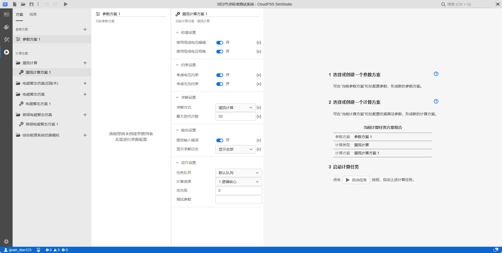
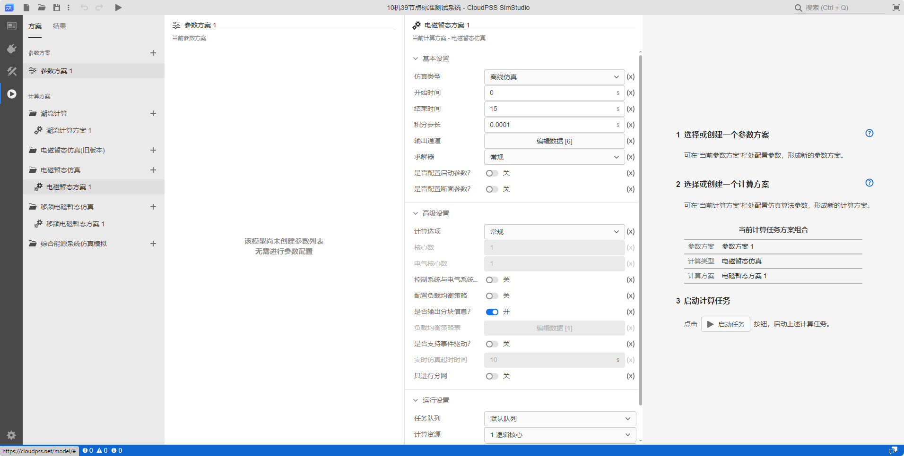
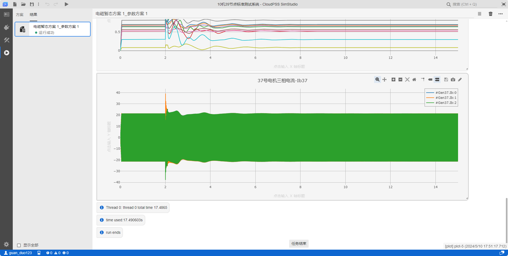

:::tip 快速入门
本例通过 **3 机 9 节点标准测试系统**算例进行 **潮流计算** 和 **电磁暂态计算** 为例，帮助用户快速入门 **CloudPSS SDK** 的使用。
:::

## 潮流计算

### 选择示例算例

在 **CloudPSS Simstudio** 中打开 **3 机 9 节点标准测试系统**算例（算例 rid：**model/CloudPSS/IEEE3**）。


### 选择计算方案

点击**运行**标签页，在计算方案中选择默认的**潮流计算方案 1**。



### 启动任务

点击**启动任务**运行仿真，在结果页面会生成潮流计算结果。


### 快速上手 sdk

创建 `test.py` 文件，输入以下示例代码：

```python title="3 机 9 节点标准测试系统潮流计算" showLineNumbers
import sys,os
import cloudpss # 引入 cloudpss 依赖
import json
import time

if __name__ == '__main__':
    
    # 填写 token
    cloudpss.setToken('{token}')

    # 设置访问的地址
    os.environ['CLOUDPSS_API_URL'] = 'https://cloudpss.net/'
    
    # 选择算例，获取指定算例 rid 的项目
    model = cloudpss.Model.fetch('model/CloudPSS/IEEE3')
    
    # 选择参数方案，若未设置，则默认用 model 的第一个 config（参数方案）
    config = model.configs[0]

    # 选择计算方案，若未设置，则默认用 model 的第一个 job（潮流计算方案）
    job = model.jobs[0]

    # 启动计算任务
    runner = model.run(job,config) # 运行算例
    while not runner.status(): 
        logs = runner.result.getLogs() # 获得运行日志
        for log in logs: 
            print(log) #输出日志
        time.sleep(1)
    print('end') # 运行结束
    
    # 打印潮流计算结果
    print(runner.result.getBranches())
    print(runner.result.getBuses())
```

## 电磁暂态计算

### 选择示例算例

同潮流计算选择示例算例

### 选择计算方案

点击**运行**标签页，在计算方案中选择默认的**电磁暂态方案 1**。



### 启动任务

点击**启动任务**运行仿真，在结果页面会生成电磁暂态计算结果。



### 快速上手 sdk

创建 `test2.py` 文件，输入以下示例代码：

```python title="3 机 9 节点标准测试系统电磁暂态计算" showLineNumbers
import sys,os
import cloudpss
import json
import time

if __name__ == '__main__':
    # 填写 token
    cloudpss.setToken('{token}')

    # 设置访问的地址
    os.environ['CLOUDPSS_API_URL'] = 'https://cloudpss.net/'
    
    # 选择算例，获取指定算例 rid 的项目
    model = cloudpss.Model.fetch('model/CloudPSS/IEEE3')

    # 选择参数方案，若未设置，则默认用 model 的第一个 config（参数方案）
    config = model.configs[0] 

    # 选择计算方案，若未设置，则默认用 model 的第一个 job（潮流计算方案），此处选择 jobs[1]，为电磁暂态仿真任务
    job = model.jobs[1]

    # 启动计算任务
    runner = model.run(job,config)
    while not runner.status():
        logs = runner.result.getLogs() # 获得运行日志
        for log in logs:
            print(log) #输出日志
        time.sleep(1)
    print('end') # 运行结束
    
    # 打印电磁暂态计算结果
    plots = runner.result.getPlots() #获取全部输出通道
```


## 常见问题

Token 从何而来？

:   用户示例代码中，需要用户填入自己申请的 **CloudPSS Token**，如何获取 **token** 参见[ SDK Token 管理](../../../software/50-user-center/40-general-account-settings/30-sdk-token-managemment/index.md)。

:::warning 易错警告
该 **token** 来源需要与 **CLOUDPSS_API_URL** 设置的地址一致，否则程序运行会报错。
:::