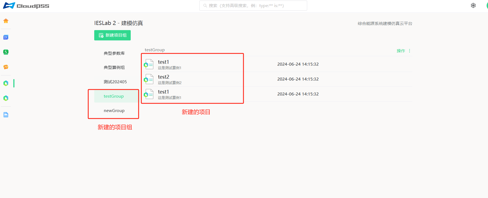

## 功能介绍
使用 IESLab SDK 新建项目组/项目，获取创建的算例信息。

## 使用说明

### 用到的 API

[Class: IESLabSimulation](../../../70-api/50-ieslab/index.md#class-ieslabsimulation) 
+ 静态方法
    | 方法     | 功能 | 
    | ---------------- | :-----------: | 
    | `IESLabSimulation.createProjectGroup(group_name, desc=None, createById=None) ` |   创建项目组    | 
    | `IESLabSimulation.createProject(name, project_group, desc=None, createById=None)`                |  创建项目  | 
    | `IESLabSimulation.fetch(simulationId) `                |       获取算例信息       |  
 
  
 
[Class: IESLabPlan](../../../70-api/50-ieslab/index.md#class-ieslabplan) 
+ 静态方法
    | 方法     | 功能 | 
    | ---------------- | :-----------: | 
    | `IESLabPlan.createProjectGroup(group_name, desc=None, createById=None) ` |   创建项目组    | 
    | `IESLabPlan.createProject(name, project_group, start_date, end_date, construction_cycle, desc=None, createById=None)`                |  创建项目  | 
    | `IESLabPlan.fetch(simulationId) `                |       获取算例信息       |    

### 调用方式
+ 使用 IESLabSimulation.createProjectGroup(group_name, desc=None, createById=None)方法，创建新项目组。可通过输入createById参数在已有项目组基础上新建项目组。    
+ 使用 IESLabSimulation.createProject(name, project_group, desc=None, createById=None)方法，创建新项目。注意，创建新项目需要已存在项目组下创建，可通过输入createById参数在已有项目基础上新建项目。
+ 通过IESLabSimulation.fetch(simulationId)方法可以可获取算例信息。

以上为IESLab仿真建模平台的项目管理方法，使用的类为IESLabSimulation。IESLab规划优化平台项目管理方法类似，使用的类为IESLabPlan。需注意，IESLab规划优化平台通过IESLabPlan.createProject(name, project_group, start_date, end_date, construction_cycle, desc=None, createById=None)方法创建项目时，需输入construction_cycle（项目建设周期）参数。
   
## 案例介绍
接下来，通过一个完整的案例来展示IESLab SDK的具体使用方法。

### 代码解析
首先，进行准备工作，设置网址和token。
```python showLineNumbers
import os
import cloudpss

if __name__ == '__main__':
    # 申请并设置自己账户的token
    cloudpss.setToken('{token}')  

    # 将地址替换为用户当前使用的平台网址地址
    os.environ['CLOUDPSS_API_URL'] = 'http://10.101.10.34/'
```
在仿真平台中，创建一个新的仿真算例组，名称为 'testGroup'，创建两个新的仿真项目，分别属于 'testGroup' 算例组，其中， 'test2'是在 'test1' 的基础上所创建的仿真项目。
```python showLineNumbers
    ## 仿真平台操作 ##
    # 创建一个新的仿真算例组，名称为 'testGroup'
    testGroup = cloudpss.IESLabSimulation.createProjectGroup('testGroup', '这是一个测试算例组')    
    # 创建两个新的仿真项目，分别属于 'testGroup' 算例组
    test1 = cloudpss.IESLabSimulation.createProject('test1', testGroup, '这是测试算例1')
    # 在 'test1' 的基础上创建一个新的仿真项目
    test2 = cloudpss.IESLabSimulation.createProject('test2', testGroup, '这是测试算例2',test1)
```
从 'testGroup' 算例组导入，并创建一个新的仿真算例组，名称为 'newGroup'。然后创建一个新的仿真项目'test3'，属于 'newGroup' 算例组。
```python showLineNumbers
    # 从 'testGroup' 算例组导入，并创建一个新的仿真算例组，名称为 'newGroup'。
    newGroup = cloudpss.IESLabSimulation.createProjectGroup('newGroup', '这是一个新的测试算例组,从testGroup算例组导入', testGroup)
    
    # 创建一个新的仿真项目，属于 'newGroup' 算例组
    test3 = cloudpss.IESLabSimulation.createProject('test3', newGroup, '这是测试算例3')
```
获取新建的仿真项目信息。
```python showLineNumbers
    # 获取新建的仿真项目信息
    iesProject = cloudpss.IESLabSimulation.fetch(test3) 
``` 

### 结果展示


## 调试技巧
若获取项目信息失败，可采用如下调试流程检查脚本代码：
+ 检查Token设置，确认网址设置是否正确。
+ 验证函数和方法调用，特别注意参数的顺序和必填项。确认每个API调用的返回值是否符合预期，比如IESLab规划优化平台在创建项目时必须要输入项目的起始、结束时间以及建设的项目周期。
+ 检查类名使用是否使用正确的类名。需特别注意仿真平台和规划平台新建项目组、项目以及获取算例信息的功能类似，但两者之间使用的类名不同，仿真平台使用IESLabSimulation，规划平台使用'IESLabSimulation'。

## 常见问题
1.出现"创建项目失败"，应该怎么办？  
请仔细检查常见项目所属的项目组是否已经创建。若是从其它项目基础上创建项目，同样需要保证所继承的项目存在。  
2.获取项目信息失败，无法返回项目的详细信息是什么原因？  
确认项目ID是否正确以及项目是否存在。  

## 完整代码

```python showLineNumbers
# -*- coding: utf-8 -*-
"""
Created on Thu Mar 21 16:58:59 2024

@author: W10
"""

import os
import cloudpss

if __name__ == '__main__':
    # 申请并设置自己账户的token
    cloudpss.setToken('{token}')  

    # 将地址替换为用户当前使用的平台网址地址
    os.environ['CLOUDPSS_API_URL'] = 'http://10.101.10.34/'

    ## 仿真平台操作 ##
    # 创建一个新的仿真算例组，名称为 'testGroup'
    testGroup = cloudpss.IESLabSimulation.createProjectGroup('testGroup', '这是一个测试算例组')
    
    # 创建两个新的仿真项目，分别属于 'testGroup' 算例组
    test1 = cloudpss.IESLabSimulation.createProject('test1', testGroup, '这是测试算例1')
    # 在 'test1' 的基础上创建一个新的仿真项目
    test2 = cloudpss.IESLabSimulation.createProject('test2', testGroup, '这是测试算例2',test1)
    
    # 从 'testGroup' 算例组导入，并创建一个新的仿真算例组，名称为 'newGroup'
    newGroup = cloudpss.IESLabSimulation.createProjectGroup('newGroup', '这是一个新的测试算例组,从testGroup算例组导入', testGroup)
    
    # 创建一个新的仿真项目，属于 'newGroup' 算例组
    test3 = cloudpss.IESLabSimulation.createProject('test3', newGroup, '这是测试算例3')

    # 获取新建的仿真项目信息
    iesProject = cloudpss.IESLabSimulation.fetch(test3) 
    # 获取新建的规划项目信息
    iesProject = cloudpss.IESLabPlan.fetch(test3)

    ## 规划平台操作 ##
    # 创建一个新的规划算例组，名称为 'testGroup'
    testGroup = cloudpss.IESLabPlan.createProjectGroup('testGroup', '这是一个测试算例组')
    
    # 创建两个新的规划项目，分别属于 'testGroup' 算例组，项目起止年份为 2024年 到 2044年，建设期为2年
    test1 = cloudpss.IESLabPlan.createProject('test1', testGroup, 2024, 2044, 2, '这是测试算例1')
    # 在 'test1' 的基础上创建一个新的规划项目
    test2 = cloudpss.IESLabPlan.createProject('test2', testGroup, 2024, 2044, 2, '这是测试算例2', test1)
    
    # 从 'testGroup' 算例组导入，并创建一个新的规划算例组，名称为 'newGroup'
    newGroup = cloudpss.IESLabPlan.createProjectGroup('newGroup', '这是一个新的测试算例组,从testGroup算例组导入', testGroup)
    
    # 创建一个新的规划项目，分别属于 'newGroup' 算例组，项目起止年份为 2024年 到 2044年，建设期为2年
    test3 = cloudpss.IESLabPlan.createProject('test3', newGroup, 2024, 2044, 2, '这是测试算例3')

    # 获取新建的规划项目信息
    iesProject = cloudpss.IESLabPlan.fetch(test3)
```