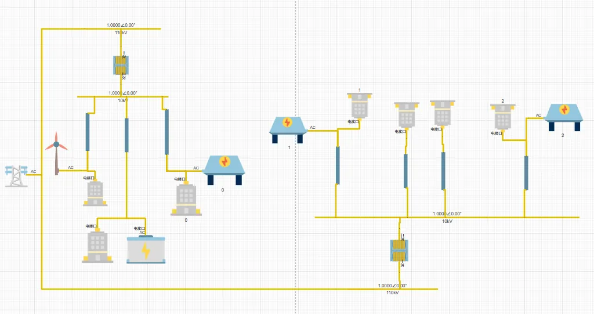

## 功能介绍

使用 IESLab SDK 实现获取获取算例拓扑、负荷、电价、设备模型等基础参数，借助 Pyomo 等建模工具建立优化模型，编写目标函数、约束条件等，利用 gurobi, cplex，scip, ipopt 等求解器优化计算， 并分析结果。

## 背景

在新电力系统转型建设的背景下，大量**分布式能源**涌入配电系统，充电汽车等可调负荷不断接入配电系统，使得电网越来越灵活，且近年来极端天气频发使得预测和控制各类负荷变得越来越困难，电力系统的**电力平衡困难、供电可靠性和电能质量下降**等问题越来越迫切，需要提高系统的灵活性和可靠性，控制可调资源。

在此背景下，具有灵活资源协调和控制的**虚拟电厂**（VPP ，Virtual power plant）已成为新型电力系统提高灵活性和电能质量的关键技术和研究方向。虚拟电厂通过通信技术和软件实现了需求响应和协调控制，汇集了许多分散的柔性负载、储能系统和分布式资源，具有大容量统一灵活的调节能力。

VPP 可简单分为技术 VPP 和商业 VPP ，技术 VPP 主要侧重于供电质量和满足电网调度要求，参与辅助服务市场（ASM），以确保配电网的稳定运行；商业 VPP 主要关注交易系统中的能源和其他电力市场。目前，国内的 VPP 主要是基于技术的，对 VPP 的商业价值关注较少。主要功能是需求响应，主要利用分时电价等价格因素，在极端条件下及时实现有序用电，保证供电可靠性和电网稳定运行。

## 项目介绍

项目位于江南某光伏示范地区，项目地的配电网主要有两个 110kV 变电站。1 号变电站有 1 个分布式光伏电站、风力发电机和用户负荷，主要是光伏溢出区。变电站 2 有 2 个光伏电站和一些用户负荷。三个光伏场站都存在严重的**源荷不平衡**现象。

配电系统的拓扑结构如所示：



该地配电网光伏消纳能力有限，发送电功率有限，线路最大负荷容量 7.5 M，主要存在电能质量低，负载率高等供电可靠性隐患。  
光伏场站 VPP0 最大反向功率 0.55 MW（反向负荷比 7.3%），光伏场站 VPP1 最大反向功率 1.16 MW（反向负荷率 15%），光伏场站 VPP2 无反向功率，光伏线路反向功率导致电能质量下降；  
光伏场站 VPP0 的负荷为 2.03 MW（负荷比率 27.07%），光伏场站 VPP1的最高负荷为 5.40MW（负荷率 72%），光伏场站 VPP2 的最高负荷为 3.62 MW（负荷比 48.27%），部分线路的高负荷率对供电可靠性构成隐患。

拟连通三个光伏场站，通过建设 VPP 进行灵活调配，解决该地的源荷不平衡问题。

## 结果分析


优化结果表明：  
+ P2P VPP 交易有助于将峰值负载从 VPP1 转移到负担较轻的 VPP2，有效地缓解了电力消耗的急剧飙升。这确保了每条线路的负载系数不超过 60%，减轻了峰值转移期间外部电网的压力，减轻了配电网负载压力，并抑制了电压波动。  
+ 经济分析显示，通过 VPP 优化，该配电系统的电费从 85482 元/天减少到 81400元/天，每天节省 4081 元，VPP 明显提升了经济效益。  
+ 此外，通过 VPP 能源交易提高了系统供电可靠性。由于两条线路的总输电容量为 15MW，三个负载的峰值电力需求仅达到 10.5MW，该系统即使在重负荷期或故障期间也能保持稳定运行和供电可靠性。
+ 借助 IESLab 平台和 SDK，不仅可以实现规划优化，还可以进行仿真验证；不仅可以使用 IESLab 平台提供的丰富设备模型，还可以自定义设备模型。 IESLab 平台和 SDK，可以帮助用户**实现无限可能**。


## 常见问题

为什么不直接写优化程序，而是需要借助 IESLab 平台和 SDK？

:   IESLab 平台提供了可视化的拓扑展示界面，提供了丰富的设备模型及参数，能够分类录入管理基础项目数据， SDK 可以便捷获取平台参数，且规划后的结果可以通过 SDK 返回到IESLab 平台进行仿真计算，来验证规划优化结果，这是独立编程规划优化并仿真验证很难做到的； 此外，IESLab 平台提供了原生的稳态设备模型，用户可以直接调用计算结果，无需编写设备模型；同理，IESLab 平台提供的稳态设备模型无法满足需求，也可以自定义设备模型进行编程实现，如在本示例代码中，没有使用平台光伏计算结果，而是自行编写了计算光伏出力曲线的算法。

## 示例代码


```python title="准备工作示例代码" showLineNumbers
import os
import sys
import time
import cloudpss
import math
import numpy as np
import pyomo.environ as pyo


sys.path.append(solver_path) # Gurobi，Cplex，SCIP，GLPK，COPT

def calc_pv_output(dict_comp,curve_atmos):#计算光伏出力曲线
    curve_photovoltaic=[]
    for pv in dict_comp['photovoltaic']:
        curve_photovoltaic.append([])
        for i in range(24):
            MINIVALUE=10**(-6)
            dirSunshineIntensity = float(curve_atmos[i]['adj_sfc_sw_direct_all_1h'])    
            diffSunshineIntensity = float(curve_atmos[i]['adj_sfc_sw_diff_all_1h']) 
            airTemp = float(curve_atmos[i]['t10m']) -273.15
            zennithAngle = float(curve_atmos[i]['solar_zen_angle_1h']) 
            conversionEfficiency=1
            for LossCoe_info in pv['args']['LossCoes']:
                LossCoe = float(LossCoe_info['1'])*0.01
                conversionEfficiency *= LossCoe
            dipAnlge = float(pv['args']['DipAngle']) if float(pv['args']['TrackingMethod'])==0 else zennithAngle
            hAngle = 90 - zennithAngle
            panelDirSunIntense = (dirSunshineIntensity / (math.sin(hAngle * math.pi / 180.0) + MINIVALUE)) * math.sin((hAngle + dipAnlge) * math.pi / 180.0) + diffSunshineIntensity
            cellTemperature = airTemp + 0.03 * panelDirSunIntense
            deltaI = panelDirSunIntense / 1000.0 * (1.0 + float(pv['model']['ratedParam']['TemperatureCoefficientsofIsc'])*0.01* (cellTemperature - 25.0))
            deltaU = (1.0 + float(pv['model']['ratedParam']['TemperatureCoefficientsofVoc'])*0.01 * (cellTemperature - 25.0)) * math.log((math.exp(1.0) + 0.000288 * (panelDirSunIntense - 1000.0)))
            power = float(pv['model']['ratedParam']['MaximumPowerVoltage'] )* deltaU * float(pv['model']['ratedParam']['MaximumPowerCurrent']) * deltaI *conversionEfficiency / 1000.0
            curve_photovoltaic[-1].append(power)
    return curve_photovoltaic

if __name__ == '__main__':
    #设置网站环境
    os.environ['CLOUDPSS_API_URL'] = 'https://cloudpss.net/'
    #申请并设置自己账户的token
    cloudpss.setToken(token)
    # 规获取指定 simuid 的项目
    plan_project = cloudpss.IESLabPlan.fetch(simuid)
    #获取算例的基础数据
    plan_data_manage = plan_project.dataManageModel
    #获取算例拓扑文件
    plan_model = plan_project.model
    plan_topology = plan_model.fetchTopology().components
    
    # 遍历拓扑文件，根据绑定的设备id，后续可从数据管理模块获取设备参数
    map_comp = {'photovoltaic':'DeviceSelection','battery':'DeviceSelection','power_source':'DeviceSelection','electric_load':'ElectricalLoad'}
    dict_comp = {comp: [] for comp in map_comp.keys()}  
    for key_topo, value_topo in plan_topology.items():
        for key,value in map_comp.items():
            if key in key_topo:
                dict_comp[key].append({'args':{},'model':{}})
                dict_comp[key][-1]['args'] = value_topo.get('args')
                model = value_topo['args'].get(value)
                if model:
                    dict_comp[key][-1]['model'] = plan_data_manage.GetDataItem(model)
                break

                
    dict_curve = {}  
    # 获取购电价格与负荷的售电价格
    map_curve = {'PurchasePriceModel':'power_source','PowerPriceModel':'electric_load'}#分时电价
    for key, value in map_curve.items():
        dict_curve.update({key: [float(plan_data_manage.GetDataItem(dict_comp.get(value)[0]['args'][key])
                                            ['purchasePriceModel']['params'][0]['value'][i][0]) for i in range(24)]})
    # 获取电负荷曲线    
    load_param = plan_data_manage.GetDataItem(dict_comp['electric_load'][0]['args']['ElectricalLoad'])['loadParam']
    if load_param['model'] == 'rough':
        dict_curve.update({'electric_load':[float(load_param['rough_load']['loadcurvedata'][0][0][i]) for i in range(24)] })
    elif load_param['model'] == 'custom':
        dict_curve.update({'electric_load':[float(load_param['custom_load']['data'][i][1]) for i in range(24)] })
    elif load_param['model'] == 'detail':
        dict_curve.update({'electric_load':[float(load_param['detail_load']['workAndOFF_Load'][8]['work'][i]) for i in range(24)] })
    # 获取气象数据及光伏出力计算曲线    
    curve_atmos=plan_data_manage.GetAtmosData('2021-09-01', '2021-09-01')
    #取一个光伏元件的出力曲线
    dict_curve.update({'photovoltaic':[power*1000 for power in calc_pv_output(dict_comp,curve_atmos)[0]]})
    
    
    # Pyomo 优化建模
    model = pyo.ConcreteModel()
    # 声明index集合
    model.N24Set = pyo.Set(initialize=range(24)) #24 hour optimization
    model.N1Set  = pyo.RangeSet(0, 0, 1) # 仅需一个索引引脚即可
     
    # 参数,主要是电池和电价
    param = {}
    param['max_power_supply'] = (float(dict_comp['power_source'][0]['args']['MaxiumPowerSupply']))   
    
    param['charge_efficiency'] = (float(dict_comp['battery'][0]['model']['ratedParam']['ChargingEfficiency'])) # charge effiency
    param['charge_max'] = (float(dict_comp['battery'][0]['model']['operationalConstraints']['MaxChargingPower'])) 
    param['cap_batt'] = ( float(dict_comp['battery'][0]['model']['operationalConstraints']['PowerStorageLimit']))
    param['cost_batt_purchase'] = ( float(dict_comp['battery'][0]['model']['economicParam']['PurchaseCost'])*10000)
    param['cost_batt_fix'] = ( float(dict_comp['battery'][0]['model']['economicParam']['FixedOMCost']))
    param['cost_batt_var'] = ( float(dict_comp['battery'][0]['model']['economicParam']['VariableOMCost']))

    param['cap_batt_max'] = ( min (5000,float(dict_comp['battery'][0]['args']['MaxStorageCapacity']))) 
    param['soc_ini'] = (float(dict_comp['battery'][0]['args']['InitialPowerStorage']))
    param['soc_max'] = (float(dict_comp['battery'][0]['args']['maxlPowerStorage']))
    param['soc_min'] = (float(dict_comp['battery'][0]['args']['miniPowerStorage']))
    
    param['pv'] = (dict_curve['photovoltaic'])  
    param['purchas_price'] = (dict_curve['PurchasePriceModel'])  
    param['sale_price'] = (dict_curve['PowerPriceModel'])  
    param['load_elec'] = (dict_curve['electric_load'])  
        
    # 定义变量  
    # 考虑储能台数配置  
    model.num_batt = pyo.Var(model.N1Set, within=pyo.NonNegativeIntegers,initialize = int(param['cap_batt_max'] / param['cap_batt']),
                             bounds=(0, int(param['cap_batt_max'] / param['cap_batt'])))
    
    
    model.charge = pyo.Var(model.N24Set, domain=pyo.Reals,initialize = 0)


    # 考虑储能的SOC（荷电状态），定义一个SOC变量  
    model.soc = pyo.Var(model.N24Set, domain=pyo.NonNegativeReals,initialize = param['soc_ini'] * param['cap_batt_max'])  
    model.power_supply = pyo.Var(model.N24Set, domain=pyo.Reals,initialize =[a - b for a, b in zip(param['load_elec'], param['pv'])], bounds=(-param['max_power_supply'], param['max_power_supply'])) 
    # SOC（荷电状态）和外部供电量的松弛变量
    model.soc_end_slack = pyo.Var(model.N1Set, domain=pyo.Reals, bounds=(-0.1,0.1),initialize =0)  

      
    # 定义目标函数,最小化成本  
    def cost_rule(model,t):  # 购电费-售电+最大供电量越限惩罚+充放电运维成本+电池投资 + SOC始末不等惩罚
        return sum(param['purchas_price'][t] * model.power_supply[t] - param['sale_price'][t] * param['load_elec'][t]   
               # + 100 * model.power_supply_slack[t] 
               + abs(model.charge[t]* param['cost_batt_var'])
               for t in model.N24Set) + param['cost_batt_purchase'] * model.num_batt[0] / 10 / 365 + model.soc_end_slack[0] * param['cap_batt'] * 100  
    
    model.obj = pyo.Objective(rule=cost_rule, sense=pyo.minimize)  
      
    # 定义约束  
    # 充放电功率,负荷，外部电源之间的关系  
    def c1_energy_balance(model, t):  
        return param['load_elec'][t] + model.charge[t] - param['pv'][t] - model.power_supply[t] == 0 
    model.c1 = pyo.Constraint(model.N24Set, rule = c1_energy_balance)
    
    #SOC的计算
    def c2_soc(model, t):  
        if t == 0:  
            return model.soc[0] == param['soc_ini'] * model.num_batt[0] * param['cap_batt']
        else:  
            return model.soc[t] == model.soc[t-1] + model.charge[t]* param['charge_efficiency']
    model.c2 = pyo.Constraint(model.N24Set, rule = c2_soc)      
    # SOC始末相等的松弛 
    def soc_end(model):  
        return model.soc[model.N24Set.last()] == (param['soc_ini'] + model.soc_end_slack[0]) * param['cap_batt']  
    model.c3 = pyo.Constraint(rule = soc_end)

    # 充放电功率上下限
    def charge_limit(model, t):  
        return model.charge[t] <= param['charge_max'] * model.num_batt[0] *param['cap_batt']
    model.c5 = pyo.Constraint(model.N24Set, rule = charge_limit)
    def charge_limit_min(model, t):  
        return -param['charge_max'] * model.num_batt[0] *param['cap_batt'] <= model.charge[t]
    model.c4 = pyo.Constraint(model.N24Set, rule = charge_limit_min)
    def discharge_limit(model, t):  
        return model.discharge[t] <= param['charge_max'] * model.num_batt[0] *param['cap_batt']
    model.c6 = pyo.Constraint(model.N24Set, rule = discharge_limit) 
    #SOC上下限
    def soc_min_limit(model, t):  
        return param['soc_min'] * model.num_batt[0] * param['cap_batt'] <= model.soc[t]
    model.c7 = pyo.Constraint(model.N24Set, rule = soc_min_limit) 
    def soc_max_limit(model, t):  
        return model.soc[t] <= param['soc_max'] * model.num_batt[0] * param['cap_batt']
    model.c8 = pyo.Constraint(model.N24Set, rule = soc_max_limit) 
    # 储能不能同时充放电的约束  
    def charge_binary(model,t):  
        return model.charge[t] * model.discharge[t] == 0  
    model.c4 = pyo.Constraint(model.N24Set, rule = charge_binary)

        
    # 指定并调用求解器求解：gurobi，cplex，scip,ipopt
    solvername='scip'
    pyo.SolverFactory(solvername,solver_io="python").solve(model).write()
    # model.pprint()
    result = {}
    result['charge'] = [model.charge[i]() for i in model.N24Set]
    result['power_supply'] = [model.power_supply[i]() for i in model.N24Set]
    result['soc'] = [model.soc[i]() for i in model.N24Set]
    # 结果分析处理
    obj_values = model.obj() # 提取最优目标函数值
    print("optimal objective: {}".format(model.obj()))
    
    
    # 也可以后续再读取结果文件，并分析结果
    time_result = time.time()
    filename= 'id{}_34_result_{}.txt'.format(simuid,time.strftime('%Y-%m-%d-%H-%M-%S'))
    with open(filename, 'w', encoding='utf-8') as f:
        model.pprint(f)
```