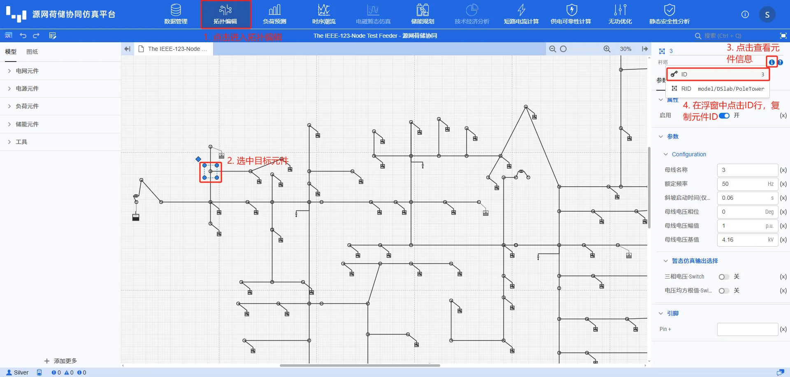

### 1.1 案例概述
本案例利用 CloudPSS 平台提供的 SDK，展示如何对系统进行时序潮流计算，并获取系统的时序潮流结果数据。


### 1.2 代码解析
导入必要的库。确保已安装 `cloudpss` 库。 `cloudpss` 库的更新可参考 [SDK升级](../../../30-installation-and-uninstallation/index.md#升级)。
```python showLineNumbers  
import time
import os
import cloudpss
from cloudpss.job.DSLabPowerFlowResult import DSLabPowerFlowResult
```
使用 `cloudpss.setToken()` 方法设置有效的 API 访问令牌。通过 `os.environ['CLOUDPSS_API_URL']` 设置正确的 API 地址。  
:::warning  
注意令牌需要是有效且未过期的,否则无法调用云端时序潮流服务。地址 URL 需要准确，并以 '/' 结尾。  
::: 
```python showLineNumbers
if __name__ == '__main__':    
    # 设置API访问令牌和API地址
    cloudpss.setToken('{token}')
    os.environ['CLOUDPSS_API_URL'] = 'https://cloudpss.net/'
```
使用 `cloudpss.DSLab.fetch()` 方法获取指定 ID 的算例（本例中为 '8fe959a5-d8a5-4e9e-ba0c-f93468'）。确保使用的算例 ID 存在，否则将无法获取算例。
```python showLineNumbers
    # 获取算例
    project = cloudpss.DSLab.fetch('8fe959a5-d8a5-4e9e-ba0c-f93468')    
```
通过调用 `project.runIESPowerFlow()` 方法启动时序潮流计算。使用 `job.result.waitFor()` 等待计算完成。
```python showLineNumbers
    # 时序潮流计算测试
    jobConfig = dsProject.model.jobs[1] # 1表示时序潮流
    job = project.runIESPowerFlow(job=jobConfig)
    job.result.waitFor() # 等待计算完成
    print("计算完成")
    result = job._resultView(DSLabPowerFlowResult)
```
指定组件 ID 为 `component_pole_tower_65`。调用 `result.getComponentPlot()` 方法获取指定组件的绘图数据。  
组件 ID 的精确性非常重要。任何拼写错误或格式错误都可能导致无法获取预期的绘图数据。
```python showLineNumbers
    # 示例：使用 getComponentPlot 方法
    plot_data = =result.getComponentPlot("component_pole_tower_65")
    print("Plot data: ", plot_data) 
```

### 1.3 结果展示
以下为案例运行的结果
```python showLineNumbers
计算完成
Plot data:  [{'verb': 'append', 'data': {'title': '3电压(kV)', 'traces': [{'name': '实际电压', 'type': 'scatter', 'x': ['2021-01-01 00:00:00', '2021-01-01 01:00:00', '2021-01-01 02:00:00', '2021-01-01 03:00:00', '2021-01-01 04:00:00', '2021-01-01 05:00:00', '2021-01-01 06:00:00', '2021-01-01 07:00:00', '2021-01-01 08:00:00', '2021-01-01 09:00:00', '2021-01-01 10:00:00', '2021-01-01 11:00:00', '2021-01-01 12:00:00', '2021-01-01 13:00:00', '2021-01-01 14:00:00', '2021-01-01 15:00:00', '2021-01-01 16:00:00', '2021-01-01 17:00:00', '2021-01-01 18:00:00', '2021-01-01 19:00:00', '2021-01-01 20:00:00', '2021-01-01 21:00:00', '2021-01-01 22:00:00', '2021-01-01 23:00:00'], 'y': [4.158417362390491, 4.17081967515126, 4.165885440910795, 4.1648024157429955, 4.1653152087421, 4.1645342559973235, 4.165249929127439, 4.166853743796981, 4.172489996439613, 4.184914045205737, 4.194647449831736, 4.192861385872321, 4.192538595075212, 4.19264091490988, 4.1893410824391735, 4.186364542866612, 4.177218647009252, 4.175909193982583, 4.17539787405482, 4.174194524270468, 4.174068807030388, 4.174898783907437, 4.1772158698613975, 4.173584992652894]}, {'name': '基准电压', 'type': 'scatter', 'x': ['2021-01-01 00:00:00', '2021-01-01 01:00:00', '2021-01-01 02:00:00', '2021-01-01 03:00:00', '2021-01-01 04:00:00', '2021-01-01 05:00:00', '2021-01-01 06:00:00', '2021-01-01 07:00:00', '2021-01-01 08:00:00', '2021-01-01 09:00:00', '2021-01-01 10:00:00', '2021-01-01 11:00:00', '2021-01-01 12:00:00', '2021-01-01 13:00:00', '2021-01-01 14:00:00', '2021-01-01 15:00:00', '2021-01-01 16:00:00', '2021-01-01 17:00:00', '2021-01-01 18:00:00', '2021-01-01 19:00:00', '2021-01-01 20:00:00', '2021-01-01 21:00:00', '2021-01-01 22:00:00', '2021-01-01 23:00:00'], 'y': [4.16, 4.16, 4.16, 4.16, 4.16, 4.16, 4.16, 4.16, 4.16, 4.16, 4.16, 4.16, 4.16, 4.16, 4.16, 4.16, 4.16, 4.16, 4.16, 4.16, 4.16, 4.16, 4.16, 4.16]}], 'xAxis': {'title': 'time'}, 'yAxis': {'title': '电压(kV)'}}, 'key': '/3_电压(kV)', 'type': 'plot', 'version': 1}, {'verb': 'append', 'data': {'title': '3相角(deg)', 'traces': [{'name': '相角', 'type': 'scatter', 'x': ['2021-01-01 00:00:00', '2021-01-01 01:00:00', '2021-01-01 02:00:00', '2021-01-01 03:00:00', '2021-01-01 04:00:00', '2021-01-01 05:00:00', '2021-01-01 06:00:00', '2021-01-01 07:00:00', '2021-01-01 08:00:00', '2021-01-01 09:00:00', '2021-01-01 10:00:00', '2021-01-01 11:00:00', '2021-01-01 12:00:00', '2021-01-01 13:00:00', '2021-01-01 14:00:00', '2021-01-01 15:00:00', '2021-01-01 16:00:00', '2021-01-01 17:00:00', '2021-01-01 18:00:00', '2021-01-01 19:00:00', '2021-01-01 20:00:00', '2021-01-01 21:00:00', '2021-01-01 22:00:00', '2021-01-01 23:00:00'], 'y': [-0.044098847002808916, -0.4078294356585931, -0.31067275684282414, -0.2857229577417044, -0.2983671351956264, -0.28419562206135657, -0.29956699835144035, -0.35227034273907326, -0.4737017584493729, -0.4337493658783135, -0.2693940077080032, 0.0038511666511679087, 0.07313824985253788, 0.07609234182331748, 0.0642207622244163, -0.013637493708460029, -0.14748114646189237, -0.5227275506164304, -0.6656505669163769, -0.7043805823276846, -0.7049065463798848, -0.7011066450301354, -0.6891211430338402, -0.5500853819675272]}], 'xAxis': {'title': 'time'}, 'yAxis': {'title': '相角(deg)'}}, 'key': '/3_相角(deg)', 'type': 'plot', 'version': 1}, {'verb': 'append', 'data': {'title': '3注入无功(kVar)', 'traces': [{'name': '注入无功', 'type': 'scatter', 'x': ['2021-01-01 00:00:00', '2021-01-01 01:00:00', '2021-01-01 02:00:00', '2021-01-01 03:00:00', '2021-01-01 04:00:00', '2021-01-01 05:00:00', '2021-01-01 06:00:00', '2021-01-01 07:00:00', '2021-01-01 08:00:00', '2021-01-01 09:00:00', '2021-01-01 10:00:00', '2021-01-01 11:00:00', '2021-01-01 12:00:00', '2021-01-01 13:00:00', '2021-01-01 14:00:00', '2021-01-01 15:00:00', '2021-01-01 16:00:00', '2021-01-01 17:00:00', '2021-01-01 18:00:00', '2021-01-01 19:00:00', '2021-01-01 20:00:00', '2021-01-01 21:00:00', '2021-01-01 22:00:00', '2021-01-01 23:00:00'], 'y': [0, 0, 0, 0, 0, 0, 0, 0, 0, 0, 0, 0, 0, 0, 0, 0, 0, 0, 0, 0, 0, 0, 0, 0]}], 'xAxis': {'title': 'time'}, 'yAxis': {'title': '注入无功(kVar)'}}, 'key': '/3_注入无功(kVar)', 'type': 'plot', 'version': 1}]
```

### 1.4 完整代码
```python showLineNumbers
import time
import os
import cloudpss
from cloudpss.job.DSLabPowerFlowResult import DSLabPowerFlowResult

if __name__ == '__main__':    
    # 设置API访问令牌和API地址
    cloudpss.setToken('{token}')
    os.environ['CLOUDPSS_API_URL'] = 'https://cloudpss.net/'
    
    # 获取模型对象
    project = cloudpss.DSLab.fetch('8fe959a5-d8a5-4e9e-ba0c-f93468')    

    # 时序潮流计算测试
    jobConfig = dsProject.model.jobs[1] # 1表示时序潮流
    job = project.runIESPowerFlow(job=jobConfig)
    job.result.waitFor() # 等待主流获取计算结果
    print("计算完成")
    result = job._resultView(DSLabPowerFlowResult)

    # 示例：使用 getComponentPlot 方法
    plot_data = =result.getComponentPlot("3")
    print("Plot data: ", plot_data) 
```


常见问题
如何解决 "API 访问令牌无效或过期" 的问题？
:   如果您的令牌已过期，您需要重新获取一个有效的 API 令牌。具体获取方法可以参考 [SDK Token管理](../../../../50-user-center/40-general-account-settings/30-sdk-token-managemment/index.md)。

我不知道算例ID，在哪里可以获取我的算例ID？
:   如果您不知道具体的算例 ID，可以通过**查看算例上方的 URL 地址**，如本算例 URL 地址 https://cloudpss.net/dslab/diagram?simu_id=8fe959a5-d8a5-4e9e-ba0c-f93468 中的 '8fe959a5-d8a5-4e9e-ba0c-f93468' 即为算例 ID。

时序潮流一直在 "running" 状态，没有完成，我该怎么办？
:   如果时序潮流在长时间内仍未完成，可能是因为模型过于复杂或者服务器负载过高。首先，检查您的模型配置是否正确，并尝试简化模型。如果问题仍然存在，请联系运维人员获取帮助。

为什么我无法获取到我想要的绘图数据？
:   确保您传入 `getComponentPlot` 方法的元件 ID 与模型中定义的完全一致。任何拼写错误或格式错误都可能导致无法检索到数据。**如果您确认信息无误但仍然无法获取数据，可能是因为模型时序潮流结果中不存在该数据**。组件 ID 和标签名称获取方法如下：
