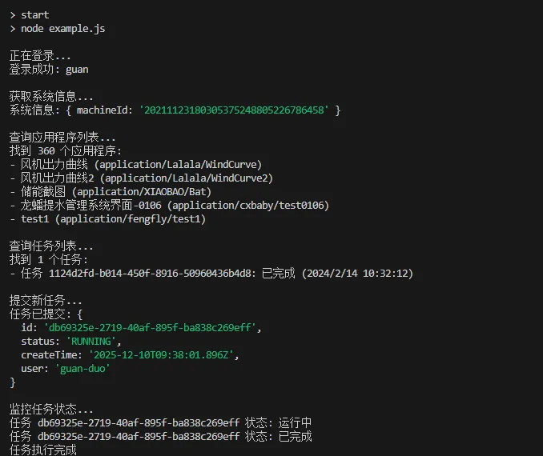
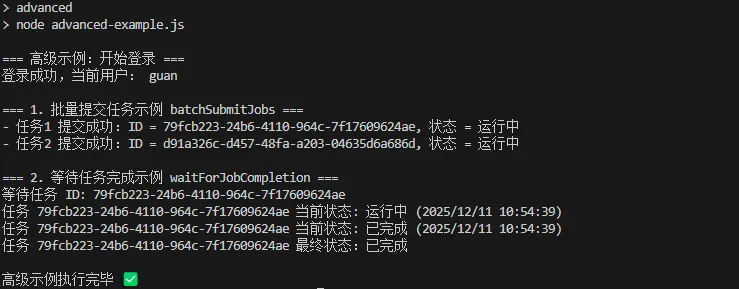

import Tabs from '@theme/Tabs';
import TabItem from '@theme/TabItem';

本文档展示如何在 **Node.js** 环境中快速接入 **CloudPSS XStudio GraphQL API**，完成：

- 登录认证
- 查询系统与账户信息
- 查询 / 提交 / 监控任务
- 批量任务

:::tip 
本文采用 **ES Module** 写法（`import / export`），建议 Node.js 版本 ≥ 18。
:::

##  前置条件

- Node.js ≥ 18
- 已注册的 CloudPSS 账户（用户名 / 密码）
- 可以访问的 GraphQL 接口地址（默认示例为 `https://cloudpss.net/graphql`）


##  安装依赖

```bash showLineNumbers
mkdir cloudpss-graphql-demo
cd cloudpss-graphql-demo

# 初始化项目
npm init -y

# 安装依赖
npm install graphql-request dotenv
```

## 环境配置

1. 创建 .env 文件

```env showLineNumbers
CLOUDPSS_GQL_URL=https://cloudpss.net/graphql
CLOUDPSS_USERNAME=your_username
CLOUDPSS_PASSWORD=your_password
```

:::warning
实际项目中请使用更安全的方式管理凭据（如 CI/CD 密钥管理、环境变量注入等），不要把 .env 提交到公开仓库。
:::

2. 创建 package.json 文件

```json showLineNumbers
{
  "type": "module",
  "scripts": {
    "start": "node example.js",
    "advanced": "node advanced-examples.js"
  }
}
```

## 推荐目录结构

```text 
cloudpss-graphql-demo/
├─ .env
├─ package.json
├─ cloudpss-client.js        # 基础 GraphQL 客户端封装
├─ example.js                # 快速开始示例
├─ advanced-examples.js      # 高级功能示例（可选）
└─ utils.js                  # 工具函数
```

## 代码示例

### 工具函数（utils.js）

```js showLineNumbers
// utils.js

// 构建资源ID，例如：application/userName/myApp
export function buildResourceId(type, owner, key) {
  return `${type}/${owner}/${key}`;
}

// 解析资源ID
export function parseResourceId(rid) {
  const parts = rid.split('/');
  if (parts.length !== 3) {
    throw new Error('Invalid resource ID format');
  }
  return {
    type: parts[0],
    owner: parts[1],
    key: parts[2],
  };
}

// 格式化任务状态（转为中文描述）
export function formatJobStatus(status) {
  const statusMap = {
    WAITING: '等待中',
    RUNNING: '运行中',
    COMPLETED: '已完成',
    FAILED: '失败',
    ABORTED: '已中止',
    CANCELED: '已取消',
    TIMED_OUT: '超时',
    ABORTING: '中止中',
    KILLED: '被终止',
  };
  return statusMap[status] || status;
}

// GraphQL 错误处理器（将多条 error 合并到 message 中）
export function handleGraphQLError(error) {
  if (error.response && error.response.errors) {
    const messages = error.response.errors.map((err) => err.message).join(', ');
    throw new Error(`GraphQL Error: ${messages}`);
  }
  throw error;
}
```

### GraphQL API 客户端实现（cloudpss-client.js）

```js showLineNumbers
// cloudpss-client.js
import 'dotenv/config';
import { GraphQLClient } from 'graphql-request';
import { handleGraphQLError } from './utils.js';

class CloudPSSClient {
  constructor() {
    this.apiUrl = process.env.CLOUDPSS_GQL_URL;
    if (!this.apiUrl) {
      throw new Error('CLOUDPSS_GQL_URL 未配置');
    }
    this.client = new GraphQLClient(this.apiUrl);
    this.token = null;
  }

  // 身份验证
  async authenticate(username, password) {
    try {
      // 1. 创建账户质询
      const challengeQuery = `
        query accountChallenge($input: AccountChallengeInput!) {
          accountChallenge(input: $input) {
            id
            groups {
              items {
                id
                type
              }
            }
          }
        }
      `;

      const challengeResult = await this.client.request(challengeQuery, {
        input: {
          name: username,
        },
      });

      if (!challengeResult.accountChallenge) {
        throw new Error('未获取到账户质询信息');
      }

      const challengeGroups = challengeResult.accountChallenge.groups ?? [];
      const firstGroup = challengeGroups[0];

      if (!firstGroup || !Array.isArray(firstGroup.items)) {
        throw new Error('未找到有效的质询分组');
      }

      const passwordItem = firstGroup.items.find(
        (item) => item.type === 'PASSWORD',
      );

      if (!passwordItem) {
        throw new Error('当前账户未配置密码登录方式');
      }

      const challengeId = passwordItem.id;

      // 2. 响应质询获取令牌
      const tokenQuery = `
        mutation CreateToken($input: CreateAccountTokenInput!) {
          createAccountToken(input: $input) {
            token
            expirationTime
            user {
              name
              displayName
            }
          }
        }
      `;

      const tokenResult = await this.client.request(tokenQuery, {
        input: {
          id: challengeResult.accountChallenge.id,
          answers: [
            {
              id: challengeId,
              answer: { password },
            },
          ],
        },
      });

      if (!tokenResult.createAccountToken?.token) {
        throw new Error('获取账号令牌失败');
      }

      this.token = tokenResult.createAccountToken.token;

      // 设置认证头
      this.client.setHeader('Authorization', `Bearer ${this.token}`);

      return tokenResult.createAccountToken;
    } catch (error) {
      handleGraphQLError(error);
    }
  }

  // 获取系统信息
  async getSystemInfo() {
    const query = `
      query SystemInfo {
        systemInfo {
          machineId
        }
      }
    `;

    return await this.client.request(query);
  }

  // 查询用户信息
  async getAccount(name, type = 'USER') {
    const query = `
      query GetAccount($input: AccountInput!) {
        account(input: $input) {
          name
          displayName
          type
          ... on AccountUser {
            email
            phone
            bio
            company
          }
        }
      }
    `;

    return await this.client.request(query, {
      input: { name, type },
    });
  }

  // 查询应用程序列表
  async getApplications(options = {}) {
    const query = `
      query GetApplications($input: ApplicationsInput!) {
        applications(input: $input) {
          items {
            rid
            name
            description
            owner
            updatedAt
            tags
          }
          cursor
          count
          total
        }
      }
    `;

    const input = {
      orderBy: options.orderBy || ['updatedAt>'],
      limit: options.limit || 20,
      ...options,
    };

    return await this.client.request(query, { input });
  }

  // 创建应用程序
  async createApplication(appData) {
    const mutation = `
      mutation CreateApplication($input: CreateApplicationInput!) {
        createApplication(input: $input) {
          rid
          name
          description
          owner
        }
      }
    `;

    return await this.client.request(mutation, {
      input: appData,
    });
  }

  // 提交任务
  async submitJob(jobData) {
    const mutation = `
      mutation CreateJob($input: CreateJobInput!) {
        createJob(input: $input) {
          id
          status
          createTime
          user
        }
      }
    `;

    return await this.client.request(mutation, {
      input: jobData,
    });
  }

  // 查询任务状态
  async getJobStatus(jobId) {
    const query = `
      query GetJob($input: JobInput!) {
        job(input: $input) {
          id
          status
          createTime
          startTime
          endTime
          args
          context
          priority
        }
      }
    `;

    return await this.client.request(query, {
      input: { id: jobId },
    });
  }

  // 查询任务列表
  async getJobs(options = {}) {
    const query = `
      query GetJobs($input: JobsInput!) {
        jobs(input: $input) {
          items {
            id
            status
            createTime
            startTime
            endTime
            user
          }
          cursor
          count
          total
        }
      }
    `;

    const input = {
      orderBy: options.orderBy || ['createTime<'],
      limit: options.limit || 20,
      ...options,
    };

    return await this.client.request(query, { input });
  }

  // 终止任务
  async abortJob(jobId, timeout = 30) {
    const mutation = `
      mutation AbortJob($input: AbortJobInput!) {
        abortJob(input: $input) {
          id
          status
        }
      }
    `;

    return await this.client.request(mutation, {
      input: { id: jobId, timeout },
    });
  }
}

export default CloudPSSClient;
```

<Tabs>
<TabItem value="case1" label="快速开始示例">

### 快速开始示例（example.js）

```js showLineNumbers
// example.js
import CloudPSSClient from './cloudpss-client.js';
import { formatJobStatus } from './utils.js';

async function main() {
  const client = new CloudPSSClient();

  try {
    // 1. 身份验证
    console.log('正在登录...');
    const authResult = await client.authenticate(
      process.env.CLOUDPSS_USERNAME,
      process.env.CLOUDPSS_PASSWORD,
    );
    console.log('登录成功:', authResult.user.displayName);

    // 2. 获取系统信息
    console.log('\n获取系统信息...');
    const systemInfo = await client.getSystemInfo();
    console.log('系统信息:', systemInfo.systemInfo);

    // 3. 查询应用程序列表
    console.log('\n查询应用程序列表...');
    const apps = await client.getApplications({ limit: 5 });
    console.log(`找到 ${apps.applications.total} 个应用程序:`);
    apps.applications.items.forEach((app) => {
      console.log(`- ${app.name} (${app.rid})`);
    });

    // 4. 查询当前用户的任务
    console.log('\n查询任务列表...');
    const user = authResult.user.name;
    const jobs = await client.getJobs({
      limit: 10,
      user: ['or', user],
    });
    console.log(`找到 ${jobs.jobs.total} 个任务:`);
    jobs.jobs.items.forEach((job) => {
      console.log(
        `- 任务 ${job.id}: ${formatJobStatus(job.status)} (${new Date(
          job.createTime,
        ).toLocaleString()})`,
      );
    });

    // 5. 提交新任务示例
    console.log('\n提交新任务...');
    const newJob = await client.submitJob({
      context: ['function/CloudPSS/hello'],
      args: {
        message: 'Hello from Node.js!',
        timestamp: Date.now(),
      },
      policy: {
        queue: 1,
        tres: {
          cpu: 1,
          ecpu: 0,
          mem: 0,
        },
        priority: 0,
      },
    });

    console.log('任务已提交:', newJob.createJob);

    // 6. 监控任务状态（简单轮询）
    console.log('\n监控任务状态...');
    const jobId = newJob.createJob.id;
    let completed = false;

    while (!completed) {
      const jobStatus = await client.getJobStatus(jobId);

      console.log(
        `任务 ${jobId} 状态: ${formatJobStatus(jobStatus.job.status)}`,
      );

      if (
        ['COMPLETED', 'FAILED', 'ABORTED', 'CANCELED'].includes(
          jobStatus.job.status,
        )
      ) {
        completed = true;
        console.log('任务执行完成');
      } else {
        // 等待 5 秒后再次检查
        await new Promise((resolve) => setTimeout(resolve, 5000));
      }
    }
  } catch (error) {
    console.error('错误:', error.message);
    if (error.response) {
      console.error('响应详情:', error.response.errors);
    }
  }
}


// 运行示例
main().catch(console.error);

```


### 运行快速开始示例

```bash showLineNumbers
npm run start
```



</TabItem>

<TabItem value="case2" label="高级功能示例">

### 高级功能示例（advanced-examples.js）

```js showLineNumbers
// advanced-examples.js
import CloudPSSClient from './cloudpss-client.js';
import {
  formatJobStatus,
  handleGraphQLError,
} from './utils.js';

class CloudPSSAdvanced extends CloudPSSClient {
  // 批量任务管理
  async batchSubmitJobs(jobsData) {
    const results = [];
    for (const jobData of jobsData) {
      try {
        const result = await this.submitJob(jobData);
        results.push({ success: true, job: result.createJob });
      } catch (error) {
        results.push({ success: false, error: error.message });
      }
    }
    return results;
  }

  // 等待任务完成（默认 5 分钟超时）
  async waitForJobCompletion(jobId, maxWaitTime = 300000) {
    const startTime = Date.now();

    while (Date.now() - startTime < maxWaitTime) {
      const { job } = await this.getJobStatus(jobId);
      const status = job.status;

      console.log(
        `任务 ${jobId} 当前状态: ${formatJobStatus(status)} (${new Date(
          job.createTime,
        ).toLocaleString()})`,
      );

      if (['COMPLETED', 'FAILED', 'ABORTED', 'CANCELED'].includes(status)) {
        return job;
      }

      // 等待 3 秒
      await new Promise((resolve) => setTimeout(resolve, 3000));
    }

    throw new Error(`Job ${jobId} did not complete within ${maxWaitTime} ms`);
  }

  // 资源权限管理
  async updateResourcePermissions(resourceId, permissions) {
    const mutation = `
      mutation UpdateResource($input: UpdateResourceInput!) {
        updateResource(input: $input) {
          rid
          permissions {
            owner
            moderator
            member
            everyone
          }
        }
      }
    `;

    try {
      return await this.client.request(mutation, {
        input: { rid: resourceId, permissions },
      });
    } catch (error) {
      handleGraphQLError(error);
    }
  }
}

/** 
 * Advanced 示例
 * - 登录
 * - 批量提交两个任务
 */
async function runAdvancedDemo() {
  const client = new CloudPSSAdvanced();

  console.log('=== 高级示例：开始登录 ===');
  const auth = await client.authenticate(
    process.env.CLOUDPSS_USERNAME,
    process.env.CLOUDPSS_PASSWORD,
  );
  console.log('登录成功，当前用户：', auth.user.displayName);

  // 1. 批量提交任务示例
  console.log('\n=== 1. 批量提交任务示例 batchSubmitJobs ===');

  const baseJob = {
    context: ['function/CloudPSS/hello'], // 视你实际环境调整
    policy: {
      queue: 1,
      tres: {
        cpu: 1,
        ecpu: 0,
        mem: 0,
      },
      priority: 0,
    },
  };

  const jobsData = [
    {
      ...baseJob,
      args: {
        message: 'Hello from advanced job #1',
        index: 1,
        timestamp: Date.now(),
      },
    },
    {
      ...baseJob,
      args: {
        message: 'Hello from advanced job #2',
        index: 2,
        timestamp: Date.now(),
      },
    },
  ];

  const batchResults = await client.batchSubmitJobs(jobsData);

  batchResults.forEach((res, idx) => {
    if (res.success) {
      console.log(
        `- 任务${idx + 1} 提交成功：ID = ${res.job.id}, 状态 = ${formatJobStatus(
          res.job.status,
        )}`,
      );
    } else {
      console.log(`- 任务${idx + 1} 提交失败：${res.error}`);
    }
  });

  const firstSuccess = batchResults.find((r) => r.success);

  if (!firstSuccess) {
    console.log('\n批量任务全部提交失败，后续示例无法继续执行。');
  } else {
    console.log(
      '\n=== 2. 等待任务完成示例 waitForJobCompletion ===',
    );
    const jobId = firstSuccess.job.id;
    console.log('等待任务 ID:', jobId);

    const finalJob = await client.waitForJobCompletion(jobId, 60000);
    console.log(
      `任务 ${jobId} 最终状态：${formatJobStatus(finalJob.status)}`,
    );
  }

  console.log('\n高级示例执行完毕 ✅');
}

runAdvancedDemo().catch((err) => {
  console.error('高级示例执行出错:', err.message);
  if (err.response?.errors) {
    console.error('GraphQL 详细错误:', err.response.errors);
  }
});

export default CloudPSSAdvanced;

```

### 运行高级示例
```bash showLineNumbers
npm run advanced
```



</TabItem>
</Tabs>

## 常见问题

报错 SyntaxError: Cannot use import statement outside a module？
:   请确认 package.json 中包含 "type": "module"，并使用 node example.js 命令可以直接运行。

提示 CLOUDPSS_GQL_URL 未配置？

:   检查 .env 是否存在且与项目根目录同级；运行前确保环境变量已被 dotenv 正确加载（本示例在 cloudpss-client.js 中使用了 import 'dotenv/config'）。