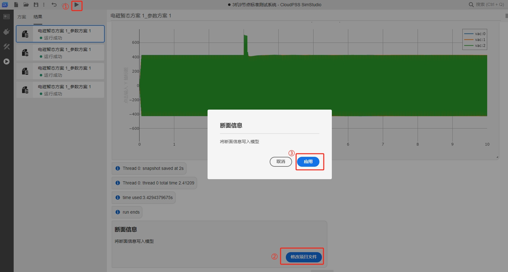

EMTLab 提供从给定断面开始仿真的功能，本节介绍断面存储和断面导入的设置方法，然后以模板算例进行演示。

## 功能定义
EMTLab 的断面功能。

## 功能说明
EMTLab 供了电磁暂态仿真过程中的断面保存和断面导入功能。可在**运行**标签页的**电磁暂态仿真方案**下的**断面参数**处设置。


### 存储断面
电磁暂态仿真仿真前，开启**是否配置断面参数**和**存储断面**，填写断面存储时间和断面名称。运行电磁暂态仿真过程中，达到断面存储时间时会保存该次仿真在该时刻的全部数据。


:::tip
只有**保存后**的算例项目才可进行存储断面操作。
:::

### 载入断面
电磁暂态仿真仿真前，开启**是否配置断面参数**和**载入断面**，并选择所导入的断面名称，设置仿真开始时间与断面载入时间相同。运行电磁暂态仿真时可直接从断面加载时间开始仿真。


:::tip
如果**仿真开始时间**与**断面载入时间**不一致，会导致仿真失败或者引发错误的断面导入。
:::


## 案例
import Tabs from '@theme/Tabs';
import TabItem from '@theme/TabItem';

<Tabs>
<TabItem value="case1" label="3 机 9 节点算例从给定断面开始仿真">
本案例使用 IEEE 9 节点模板算例，介绍断面参数设置并演示从给定断面开始仿真。

- 首先在 CloudPSS SimStudio 工作台，点击新建电力系统仿真项目。  


- 点击左上角的新建图标，选中 IEEE 标准系统，再选择 3 机 9 节点标准测试系统，最后点击新建。
  


- 点击**运行**标签页，新建电磁暂态仿真计算方案，选中并开始设置仿真方案：开启**是否配置断面参数**和**存储断面**，填写断面存储时间为 2s ，填写断面名称为 snapshot_1。


- 点击**启动任务**按钮，在结果页面可以看到**断面信息**的提示框，点击**修改项目文件**，在弹出的确认框中点击**应用**。需要说明的是，如果遗漏了应用断面信息的步骤，开启**载入断面**后，无法在断面选择中找到存储的断面。



- 回到**方案**页面，关闭**存储断面**并开启**载入断面**，填写断面加载时间为 2s，断面选择为 snapshot_1。


- 点击**启动任务**按钮，在结果页面可以看到断面加载成功的信息，仿真从断面加载时间开始启动。


</TabItem>
</Tabs>


## 常见问题 Q&A
可以存储断面后，修改算例的参数，然后再从断面启动吗
:
   对于**控制元件**，修改后元件参数，断面启动后使用的控制元件参数为修改后的参数。  
   对于**电气元件**，导纳矩阵在存储断面时进行了保存，因为一些电气元件参数在初始化导纳后不会主动更改导纳矩阵，比如电阻的阻值，变压器额定容量等，所以修改这些电气参数从断面启动不会生效；同理，修改初始化后还会主动更改导纳矩阵的电气元件参数，比如可变电阻的阻值，断面启动后该修改可以生效；另外，和导纳矩阵无关的电气参数，比如修改故障电阻的故障类型，断面启动后该修改可以生效。

如何使用 SimStudio SDK 实现断面启动功能
:
  使用 SDK 实现断面启动功能，需要将 cloudpss SDK 更新到最新版本。 本节案例的断面启动的 SDK demo 如下：
   ``` Python
    import os
    import cloudpss
    import time

    if __name__ == '__main__':
        try:  
            cloudpss.setToken('token')

            # 设置cloudpss_api_url环境变量
            os.environ['CLOUDPSS_API_URL'] = 'http://10.101.10.46/'
            
            # 获取指定 rid 的项目
            model = cloudpss.Model.fetch('model/icepoooo/snapshot_test')

            # 保存断面
            config = model.configs[0]
            job = model.jobs[3]
            job['args']['snapshot_cfg'] = 1
            job['args']['load_snapshot'] = 0
            job['args']['save_snapshot'] = 1
            job['args']['save_snapshot_name'] = 'snapshot_1'
            job['args']['save_snapshot_time'] = 2
            print(job)

            snapshot_key = ''
            runner = model.run(job, config)

            while not runner.status():
                for message in runner.result:
                    if (message['type'] == 'plot') or (message['type'] == 'progress'):
                        continue
                    print(message)
                    time.sleep(0.3)

                    if (message['type'] == 'modify'):
                        if message['data']['payload']['context']['snapshots'] != '':
                            snapshot_key = list(message['data']['payload']['context']['snapshots'].values())[0].get('key')
                    
            print('message end')
            print(snapshot_key)
            
            # 载入断面
            job['args']['save_snapshot'] = 0
            job['args']['load_snapshot'] = 1
            job['args']['load_snapshot_time'] = 2
            job['args']['load_snapshot_name'] = snapshot_key
            print(job)
            runner = model.run(job, config)
            while not runner.status():
                for message in runner.result:
                    if (message['type'] == 'plot') or (message['type'] == 'progress'):
                        continue
                    print(message)

            except Exception as e:
            print("程序出错，重启中")
   ```