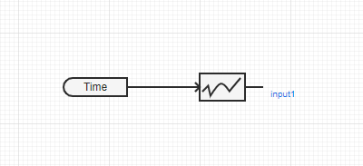
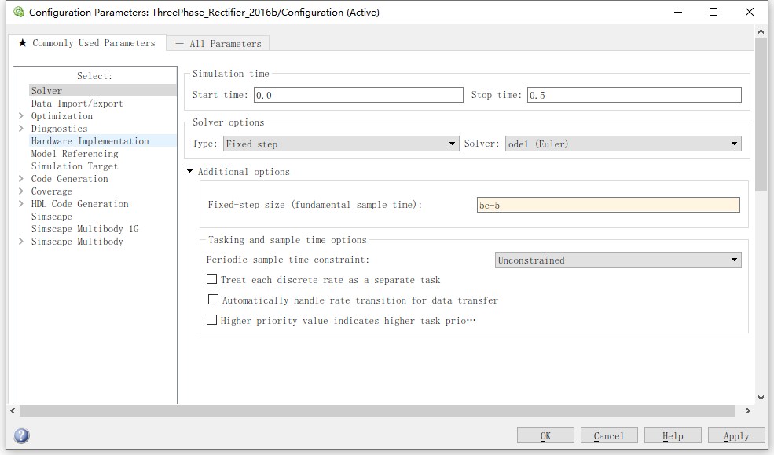
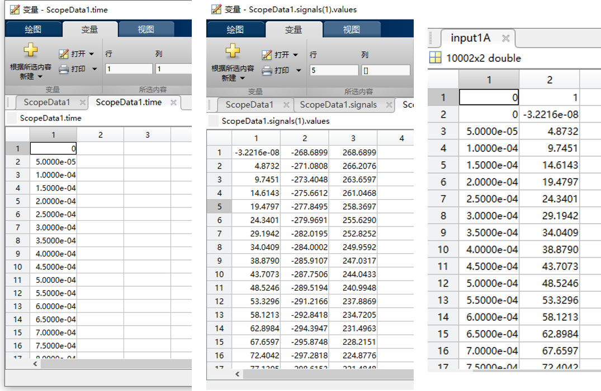
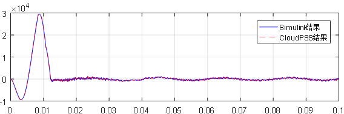

本文档主要介绍自定义 S-Function 元件的创建和实现方法。为实现该功能，用户需提前准备封装好的二进制模型 `.so` 文件。本文档也将从**白盒模型封装**和**黑盒模型封装**两种实现方式介绍生成 `.so` 的具体步骤，并通过一个白盒模型实现的案例介绍 S-Function 元件的构建、调试方法。

## 功能定义
该功能支持将封装的二进制模型导入平台，构建自定义 S-Function 电磁暂态仿真元件。

## 功能说明

自定义 S-Function 元件具有以下几个功能特点：

- 控制模型构建方便、高效，可降低模型搭建和参数校验的时间成本。  
  
- 控制策略与真实控制器的保持高度一致，仿真结果更接近实际情况。  
  
- 控制器开发者不需要公开具体的控制策略和核心算法，可满足保密需求。

### 适用模型
需提前准备 **Linux 64 位**系统环境下编译生成的 `.so` 文件。  

编译来源可以有以下两种：

1. MATLAB/Simulink 子系统编译生成 S-Function 时自动生成的代码文件。  

2. 用户自定义函数和接口的代码文件。  

### 整体流程


用户可将 Simulink 白箱模型封装成 S-Function 子系统，利用 MATLAB 的自动代码生成功能，得到 `*.c` 和 `*.h` 文件，在 Linux 环境中编译生成 `.so` 文件；也可以将包含自定义函数和接口的 `.c` 或 `.cpp`、`.h` 文件，或 `.a` 二进制文件，在 Linux 环境中编译生成 `.so` 文件。  

用户需要获取 Simulink 子系统或自定义代码文件的**全局参数**、**输入/输出接口**信息，并根据信息定义 S-Function 元件的**参数**和**引脚**，在平台导入 `.so` 文件，完成自定义 S-Function 元件的构建。

### 具体步骤
本文档根据**白盒模型封装**和**黑盒模型封装**两种方式介绍自定义 S-Function 元件实现的具体步骤。

若用户需要构建白盒模型的 S-Function 元件，`.so` 的编译来源为 MATLAB/Simulink 自动生成的代码，请参见**白盒模型 S-Function 实现**标签。

若用户需要构建黑盒模型的 S-Function 元件，`.so` 的编译来源为用户自定义的函数和接口代码，请参见**黑盒模型 S-Function 实现**标签。

<Tabs>
<TabItem value="method1" label="白盒模型 S-Function 实现">

#### 步骤 1. 将 Simulink 模型封装为 S-Function 并自动生成代码

- a. 解算器设置

    模型设置为固定步长，解算器设置为 `discrete`，确保模型在当前设置下能正常运行。  

    

    CloudPSS 中的系统均为离散系统，因此建议 S-Function 也使用离散解算器。

    :::warning
    若 S-Function 子系统中存在难以离散化的连续状态，也可选用连续积分解算器，目前支持的有 ode1、ode2、ode3、ode4、ode5 和 ode8，不同的积分方式会影响仿真结果准确度和仿真计算时间。
    :::

- b. 子系统封装

    将控制模型封装为一个子系统。子系统中可以引用全局参数，若子系统的顶层有参数封装，并且希望这些参数在生成 S-Function 后可调，请将这些参数也通过全局参数定义，否则将被视为固定值而不可调。  

      

    例如上图中，**Parameter1** 与 **Parameter2** 分别用全局参数 **a** 和 **b** 定义，则在生成 S-Function 后，这两个参数仍可在子系统顶层设置，而 **Parameter3** 为固定值 **0**，在生成 S-Function 时将以固定值写入。

    :::warning
    S-Function 参数必须以字母开头（不能是数字或下划线），目前仅支持 **double** 型，若是一个矩阵，在 CloudPSS 中对应表格型参数。
    :::

- c. 生成 S-Function  

    右键子系统，依次选择 **C/C++ Code**、**Generate S-Function** 选项。

      

- d. 设置 S-Function 参数

    勾选列出的全局参数中需要可调的，未勾选的参数将以固定值写入。

      

- e. S-Function 自动代码生成

    自动代码生成，**sfcn_rtw** 文件夹中包含 `*.c` 与 `*.h` 文件。

     

    :::tip
    若提示无编译器，则需下载并安装一个 **MingGW64** 编译器，流程可参考：https://zhuanlan.zhihu.com/p/359962279?ivk_sa=1024320u
    :::

     


#### 步骤 2. 在 Linux 环境编译生成 .so 文件

- a. 添加接口定义  
  
    在步骤 1 生成的 **sfcn_rtw** 文件夹中找到以 **S-Function 名称**命名的 `.c` 文件，在 **#include** 之后添加如下接口定义并保存：

    ```c
    #define ssSetInputPortVectorDimension(S, port, d)   \
    (ssSetInputPortWidth(S, port, d))
    #define ssSetOutputPortVectorDimension(S, port, d)   \
    (ssSetOutputPortWidth(S, port, d))
    ```

    :::warning
    此函数定义是为识别 S-Function 的输入输出引脚，若每个输入输出引脚维数均为 1，则不用添加；若有引脚维数大于 1，则必须添加。
    :::

- b. 运行编译指令  

    将 **sfcn_rtw** 文件夹复制到 Linux 环境，在其路径下输入以下编译命令：

    ```
    gcc -Wall -DRT -DRT_MALLOC -fPIC -lm -shared *.c -o xxxx.so
    ```  
    其中，`xxxx` 为用户自定义的 `.so` 文件名，与内部函数名（S-Function 名）无关。Linux 环境必须是 **64 位**系统。


    若出现缺少 `*.h` 头文件的报错，需要手动添加相应文件。不同版本的 MATLAB 所调用的头文件不同，获取路径可参考：

    ```
    安装路径\MATLAB\Rxxxxx\simulink\include
    安装路径\MATLAB\Rxxxxx\extern\include
    安装路径\MATLAB\Rxxxxx\rtw\c\src
    ```  
    其中，`xxxxx` 为 MATLAB 版本。
 
  
#### 步骤 3：根据全局参数和输入输出接口信息构建 S-Function 实现元件  

- a. 新建空白 S-Function 实现元件  
    
    在工作台点击**新建**按钮，新建一个**空白普通电力系统模型**。

      

    选择**总览**标签页，将**模型类型**切换为**元件**。
    
      

    此时，在**实现**标签页中将出现**拓扑**、**电磁暂态**等子标签页。选中**电磁暂态**子标签页，点击**创建电磁暂态 - S-Function 实现**按钮，即可创建自定义 S-Function 元件。

      

- b. 参数引脚列表定义  

    选择**接口**标签页，在参数列表添加参数，在引脚列表添加引脚，并绘制元件图形。参数键名必须与 S-Function 引用的全局参数名一致；引脚键名不作要求，但顺序必须分别与 S-Function 的输入输出引脚对应。  

       

- c. 导入 .so 文件  

    在**实现**标签页导入步骤 2 生成的 `.so` 文件，并填写**入口函数名**。  

       

    :::warning
    入口函数名是 **S-Function 名称**，不是 `.so` 的文件名。
    :::

- d. 元件名称与权限设置  

    切换到**总览**标签页，输入元件的名称，并设置元件的**权限**和**元件标签**。

     

</TabItem>


<TabItem value="method2" label="黑盒模型 S-Function 实现">

#### 步骤 1. 在 Linux 环境编译生成 .so 文件

- a. 运行编译指令

    将代码文件 `*.cpp` 及其头文件 `*.h` 复制到 Linux 环境，使用以下指令编译：  

    ```
    gcc -Wall -fPIC -s -lm -shared -DRT xx1.cpp xx2.cpp -o xx.so
    ```
    
    :::warning
    Linux 环境必须是 **64 位**系统
    :::
    
    对于已经编译为 `.a` 的文件，使用以下指令编译：  

    ```
    gcc -Wall -fPIC -s -lm -shared xx.a -o xx.so -u <entry_name>
    ```

    其中，`<entry_name>` 是入口函数名。


#### 步骤 2：根据全局参数和输入输出接口信息构建 S-Function 实现元件  

- a. 新建空白 S-Function 实现元件  
    
    在工作台点击**新建**按钮，新建一个**空白普通电力系统模型**。

      

    选择**总览**标签页，将**模型类型**切换为**元件**。
    
      

    此时，在**实现**标签页中将出现**拓扑**、**电磁暂态**等子标签页。选中**电磁暂态**子标签页，点击**创建电磁暂态 - S-Function 实现**按钮，即可创建自定义 S-Function 元件。

      

- b. 参数引脚列表定义  

    选择**接口**标签页，在参数列表添加参数，在引脚列表添加引脚，并绘制元件图形。参数键名必须与 S-Function 引用的全局参数名一致；引脚键名不作要求，但顺序必须分别与 S-Function 的输入输出引脚对应。  

       

- c. 导入 .so 文件  

    在**实现**标签页导入步骤 2 生成的 `.so` 文件，并填写**入口函数名**。  

       

    :::warning
    入口函数名是 **S-Function 名称**，不是 `.so` 的文件名。
    :::

- d. 元件名称与权限设置  

    切换到**总览**标签页，输入元件的名称，并设置元件的**权限**和**元件标签**。

     

</TabItem>
</Tabs>


### 调试方法

在完成自定义 S-Function 元件的构建后，可以使用**开环测试**的方式，调试并验证元件的正确性。

#### 步骤 1：获取 S-Function 正常运行时的输入数据  

- a. 添加示波器

    在 Simulink 中闭环运行原模型，使用示波器观测 S-Function 所有输入引脚。  

       

- b. 保存数据  

    设置示波器保存数据到 MATLAB 工作区。

       

#### 步骤 2：数据处理并导出为 .csv 格式文件 

- a. 数据处理  

    在 MATLAB 中处理示波器保存的数据，将每一路引脚的数据按照第一列**时间**、第二列**数据**的方式另存。  

    :::warning
    需要在每组数据的第一行添加一个索引号，第一列是 **0**，第二列是 **1**。将数据导入 CloudPSS 时，会根据索引号判断数据内容。
    :::  

       

- b. 导出 .csv  

    使用 `dlmwrite` 命令将每路输入引脚的数据导出为 `.csv` 格式，命令参考如下：

    ```
    dlmwrite('input1.csv', input1, 'delimiter', ',', 'precision', 9);  
    ```

    :::warning
    为保证导出的 `.csv` 文件中数据的精度，请使用 `dlmwrite` 而不使用 `csvwrite`。
    :::  

#### 步骤 3：利用自定义曲线元件导入 .csv 格式文件 

- a. 自定义曲线元件导入 .csv   

    使用 **CloudPSS 控制-非线性函数**库中的**自定义曲线**元件，在元件参数面板的**编辑数据**中直接导入刚才生成的 `.csv` 文件。  

       

- b. 数据输入  

    自定义曲线的输入是**控制-基础**库中的**时间输入**元件，输出连到 S-Function 元件的对应引脚。  

         

- c. 对比开环测试结果  
  
    将 S-Function 元件的所有输入引脚都以 **.csv 导入**的形式输入数据。

    在**运行**标签页中，配置电磁暂态仿真方案。
    
         
    
    设置与生成 S-Function 时固定步长相同的积分步长，并根据输入数据的长度，设置合适的仿真结束时间。
    
    运行仿真得到开环测试结果。


## 案例

本文档提供一个白盒模型 S-Function 实现的案例，展示自定义 S-Function 元件的创建和使用方法。

import Tabs from '@theme/Tabs';
import TabItem from '@theme/TabItem';

<Tabs>
<TabItem value="case1" label="三相整流器控制的 S-Function 实现">

- a. 封装白盒模型  

    在 Simulink 中构建一个三相整流器模型，如下图所示。  

      

    将控制部分封装成一个子系统，并命名为 **Control** 。子系统有 3 个输入，维数分别是 3、3、1，和 1 个输出，维数是 3。  

      

    将子系统中的锁相环比例系数 **Kp_PLL**、锁相环积分系数 **Ki_PLL**、电压环比例系数 **Kp_V**、电压环积分系数 **Ki_V**、电流环比例系数 **Kp_I**、电流环积分系数 **Ki_I**、直流电压参考值 **Vdc_ref** 和交流滤波电感值 **Lf** 定义为全局参数，并在模型初始化页面赋值。  

      

    也可以对子系统进行参数封装后再引用全局参数。若封装后的参数未使用全局参数，将作为固定值写入 S-Function，不可调。  

       

    本案例中的解算器设置如下图所示，固定步长 **50 us**，采用 **ode1** 积分方式（欧拉积分）。
    
    运行仿真，确认当前设置下模型无报错。  

       

- b. 自动代码生成  

    右键子系统，选择 **C/C++ Code**，点击 **Generate S-Function**，在弹出的对话框中勾选可调参数，点击 **Build**，开始自动生成代码并编译 S-Function。  

       

    编译成功后，会弹出封装好的 S-Function 模块，以及自动生成的包含 `*.c`、`*.h` 文件的 **sfcn_rtw** 文件夹。  

       

- c. 编译生成 .so  

    打开 **sfcn_rtw** 文件夹中的 `Control_sf.c` 文件，添加接口函数定义。由于引脚维数不为 1，此步骤不可省略。  

       

    在 MATLAB 安装路径的 **simulink\include** 和 **extern\include** 文件夹中，将所需 `*.h` 头文件复制到 **sfcn_rtw** 文件夹。  

       

    将整个 **sfcn_rtw** 文件夹复制到 **64 位** Linux 系统。  

       

    在路径下输入命令:  

    ```
    gcc -Wall -DRT -DRT_MALLOC -fPIC -lm -shared *.c -o Control.so
    ```
    完成编译。

       

    编译成功后，会在路径下生成 `.so` 文件，将 `.so` 文件复制到本地。   

       

- d. 构建自定义 S-Function 元件  

    在 CloudPSS 平台新建自定义 S-Function 元件。在工作台点击**新建**按钮，新建一个**空白普通电力系统模型**。

      

    选择**总览**标签页，将**模型类型**切换为**元件**。
    
      

    切换到**实现**标签页，选中**电磁暂态**子标签页，点击**创建电磁暂态 - S-Function 实现**按钮。

      

    在**接口**标签页的参数列表定义栏，新建参数组，并添加参数，参数键名与 S-Function 的可调参数名一致，参数类型设为**实数**，输入类型为**常量**，默认值可与 Simulink 模型初始化页面的赋值一致。  

    在引脚列表定义栏，添加 **input1**、**input2**、**input3** 和 **output1** 引脚，按照对应的**数据维数**和**连接类型**设置。  

    在参数和引脚定义好后，可点击元件图形设计窗口右上角的**直接导入**按钮，根据引脚类型和数量生成一个默认图形，在默认图形基础上自定义元件图形。  

       

    在**实现**标签页，导入 `.so` 文件，填写**入口函数名**。注意，入口函数名不是 `.so` 文件的名称，而是 S-Function 的名称，本案例中是 **Control_sf**。  

       

- e. 开环测试  

    在 Simulink 模型的 S-Function 输入引脚处添加示波器，并设置录波。  

       

    运行仿真，整理录波数据，将每一路输入引脚处理成第一列时间、第二列数据，并在第一行添加索引。  

      

    使用 `dlmwrite` 命令将整理后的数据导出为 `.csv` 文件。  

      

    在 CloudPSS 平台利用**自定义曲线**元件导入每一路输入引脚的数据，导入成功后如下图所示。

      

    完成所有输入引脚的数据导入后，开环测试模型如下图所示。  

       

    运行仿真，对比 CloudPSS 与 Simulink 的开环测试结果，验证所构建的 S-Function 元件的正确性。  

       

- f. 构建电气系统模型，完成闭环测试  

    搭建三相整流器的电气系统模型，并添加构建好的 S-Function 控制元件，S-Function 元件的输入引脚连接量测信号，运行仿真完成闭环测试。  

       

    闭环测试结果如下图所示。  

       

       

</TabItem>
</Tabs>


## 常见问题
如何设置控制器的采样步长？

:   
    S-Function 封装的采样步长固定为生成 S-Function 时控制器子系统的采样步长。在某些应用场景，控制器的采样步长可能与仿真步长不一致。Simulink 中，要求控制器采样步长为仿真步长的**整数倍**，如仿真步长为 **10 us**，而控制器以 **50 us**（仿真步长的 **5** 倍）进行采样和计算。  

    CloudPSS 中内置了**采样倍率参数**来应对这种情况。用户可根据控制器需求选择是否添加这个参数，当不添加这个参数时，其值默认为 **1**，即控制器采样步长与仿真步长一致。  

    该参数键名为：**__SFUNC_STEP**，添加方法如下：

       

    :::warning
    参数以两个下划线开头。为避免系统识别错误，用户自定义的其它全局参数名只能以字母开头，不能以数字或下划线开头。
    :::  


如何选择控制器求解的积分方式？

:   
    针对 Simulink 中不同阶数的连续积分解算器，CloudPSS 进行了适配，目前支持的有 ode1、ode2、ode3、ode4、ode5 和 ode8。  

       

    在 CloudPSS 中，内置了定义**解算器类型**的参数，参数键名为：**__SFUNC_SOLVER**，参数值为与目标解算器类型同名的**字符串**。例如，可将该参数定义为**选择型**参数，其键值分别为 **ode1**、**ode2**、**ode3**、**ode4**、**ode5** 和 **ode8**。  

       

    当模型中不存在连续积分时，解算器默认为离散解算器 **discrete**，该参数的设置无效；当模型中存在连续积分时，该参数值默认为 **ode3**。 


如何输入矩阵类型的参数？

:   
    若 S-Function 的全局参数是一个矩阵，在 CloudPSS 中，需要用**表格型**参数与之对应。  

    例如，全局参数 **a** 是一个 1×3 的矩阵，其值为 **[1, 2, 3]**。在 CloudPSS 中构建自定义 S-Function 元件时，添加一个表格型参数，在列定义选项中新建 1 个列定义，在默认值选项中添加 3 行，并分别设置为 1、2、3，如下图所示。  

       

    在元件参数面板设置或修改表格型参数时，也可以点击参数框右侧的 **(x)** 按钮切换为表达式输入形式，再输入 **[1, 2, 3]**，完成数据编辑。

      

    若全局参数 **a** 是一个 3×3 的矩阵，其值为 **[1, 2, 3; 4, 5, 6; 7, 8, 9]**，则在 CloudPSS 中，按照先行后列的顺序，填入所有矩阵元素。例如，将表格型参数切换为表达式输入形式，再输入 **[1, 2, 3, 4, 5, 6, 7, 8, 9]**。