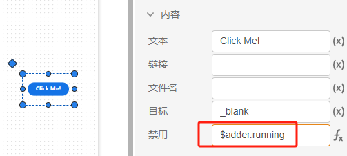

本文档为 AppStudio 资源及控件体系的介绍文档，用户可阅读该文档学习资源及控件之间的区别和联系，利用资源及控件体系灵活、快速地构建应用。

AppStudio 提供了一套以**资源**、**控件**为核心的应用构建系统。用户可使用资源、控件对应用的灵活维护和管理，进而实现各种高级应用功能。

## 资源

资源即资源标签页中的变量和函数资源。

### 变量

变量是指作用于整个应用的全局变量。

### 函数

函数是指 FuncStudio 中的函数项目，函数的输入参数和输出结果可以和控件属性绑定，实现在 AppStudio 中远程调用函数并展示计算结果。

## 控件

控件是构建应用场景时所用到的可交互组件，通过拖拽控件在场景中构建用户可交互和数据可视化面板，控件的可配置项包括属性和[布局](../../workbench/function/sence/font/index.md)。

### 属性

属性是定义及描述控件交互及可视化效果的度量数据，控件的属性主要有样式、内容、事件三部分。

- 样式属性：包括通用样式、样式、标签样式、内容样式四部分，用于指定控件的大小、外观、颜色及字体；

- 内容属性：内容属性是一个控件的核心，用于指定控件具备的功能参数，比如**输入框控件中输入的值**，**选择器的可选项**，**盒子控件中展示的内容**等。

 

- 事件参数：包括控件支持的事件，如点击事件、更改事件等，当这些事件触发后，开始执行事件属性栏内的表达式，实现控件赋值、回调资源数据、切换场景等目的，详见[事件触发机制](../event/index.md)。

## 资源、控件设置

变量资源的值和函数资源的参数在资源标签页里设置；每一个控件都有一个属性配置面板，可以对它的样式、内容、事件等属性进行设置，控件属性的值支持 **(x)**“值”模式和**f(x)**“表达式” 模式这两种输入类型，用户可随时切换输入类型，适配不同场景构建需求。

### “值”模式

点击控件属性值输入框右侧，切换到显示 **(x)** 时，此时为“值”模式输入，只能输入一个常量。

### “表达式”模式

切换到显示**f(x)**时，此时为“表达式”模式输入，可以**直接引用其他的控件属性或资源的值**作为属性值，同时表达式也支持`math.js`数学库。

关于更多的`math.js`用法可以学习[math.js 表达式](https://mathjs.org/)。

在表达式输入模式下，选中输入框后，按 Ctrl 键可呼出输入框的**扩展编辑界面**。在扩展编辑界面中，支持输入和编辑多行复杂表达式。

:::tip

切换到表达式模式下输入栏的边框会变成黄色，边框为黄色的输入栏只能输入表达式。

从表达式模式切换回值模式时原本输入的表达式会丢失。

输入框会自动检查表达式的状态，若表达式输入有误，选中输入栏后，会在最右侧出现报错提示，鼠标悬浮到上面会显示报错信息；若表达式输入正确，会在最右侧自动计算出表达式的当前值。
:::

### 变量资源设置

点击资源标签页，点击新建资源，选择变量资源，然后填写变量名和变量的值即可。变量的值可以被控件的属性引用或修改。

变量设置需要注意以下几点要求：

- 变量名应以字母或`_`符号开头，每个变量名称都应是唯一的；
  
- 变量的值仅支持**值模式输入**。

### 函数资源设置

点击资源标签页，点击新建资源，选择函数资源，然后填写函数名，选择函数 RID ，配置函数的参数方案的值。函数输出参数的值可以被控件的属性引用或修改。

函数设置需要注意以下几点要求：

- 函数名应以字母或`_`符号开头，每个函数名都应是唯一的；
  
- 函数输入参数值支持**值/表达式模式输入**，不能引用变量的值进行赋值；

### 控件属性设置

在场景标签页选中控件后，在右侧的属性标签，即可对控件属性进行设置。

控件属性设置需要注意以下几点要求：

- 控件名应以字母或`_`符号开头，同一场景下不同控件的名称必须唯一，不场景下的控件名称可以重复；
  
- 控件属性值支持**值/表达式模式输入**，被引用属性的控件必须命名。

可以**引用资源或者其他属性**作为控件属性值。
  
#### 引用变量设置属性

在控件属性中引用变量值作为属性值时，输入栏应切换到**表达式形式**，且在变量前冠以`$`标识符为前缀，例如变量名为`a`时，引用该变量值时应切换为表达式输入模式填写`$a.value`的表达式。
  

#### 引用函数设置属性

##### 引用函数输入参数值

在控件属性中引用函数输入参数的值作为属性值时，输入栏应切换到**表达式形式**，且在变量前冠以`$`标识符为前缀，例如函数名为`adder`时，引用键为 a 的参数值时应切换为表达式输入模式填写`$adder.args.a`的表达式。
  

##### 引用函数输出结果

函数输出结果有 log、plot 和 table 三种类型，对于 log 类型的输出结果，可以被直接引用为控件属性。

例如，在 Markdown 文本框控件的值属性或盒子控件的内容属性中，输入`$函数名称.value.key.content`的表达式，其中 key 为 log 消息的 key 参数，此时 Markdown 文本框和盒子内展示内容就是函数的文本结果。

对于plot 和 table 类型的结果，只能用**运行结果**控件来引用展示。

将运行结果控件的**内容/结果 ID**属性的输入框切换到**表达式模式**，输入`$函数名称.job.id`的表达式，绑定为某函数结果的展示面板；

**消息 key**和**消息类型**属性用于过滤输入结果，如果函数的输出结果的有很多条，并且给每条都设定了一个 key, 为了快捷输出特定的输出结果，可以在**消息 key**属性中输入该结果的 key 值。

也可在**消息类型**属性中配置结果类型，将 log、plot、table 中某一类结果全部展示。

#### 引用函数运行信息

`$函数名称.running`→函数是否在运行中，值为 0 或 1;

`$函数名称.progress`→获取函数的执行进度；

`$函数名称.status`→获取函数运行结状态，返回 waiting/resolved/rejected。

例如：在按钮控件的内容/禁用属性输入框中输入`$资源函数名.running`的表达式，如果函数正在执行，则返回值为 1，此时禁用生效，用户无法再次点击按钮；

待函数运行结束，值变为 0，不再禁用，用户可以再次点击按钮启动函数，避免用户短时间内多次点击按钮执行计算。

#### 引用属性设置属性
  
控件属性值可以通过`控件名.属性键值`的表达式来获取，将鼠标悬停在控件属性栏上，属性的键值会自动显示在左侧，例如在盒子控件的内容属性中引用名为`InputBox1`的输入框控件的**值属性**作为内容属性的当前值。

## 常见问题

为什么输入的表达式无效？

:   表达式必须在 f(x) 模式下输入，引用控件属性时确保控件名和属性键名正确。

引用函数资源的任务实例的表达式校验不通过，影响函数的执行吗？

:   由于函数还没被执行，暂时无法被识别。因此，即便此处报错，表达式本身是正确的，不影响执行。

常见的调试技巧

:   - 善用控件属性栏的实时计算功能，利用提示信息，对除函数输出结果以外其他数据绑定关系进行快速调试；

    - 善用消息过滤调试技巧，在运行结果框中不指定 key 和类型的话，会输出全部执行结果，因此，再调试状态下可以不过滤任何信息，先把全部结果信息输出。
  
