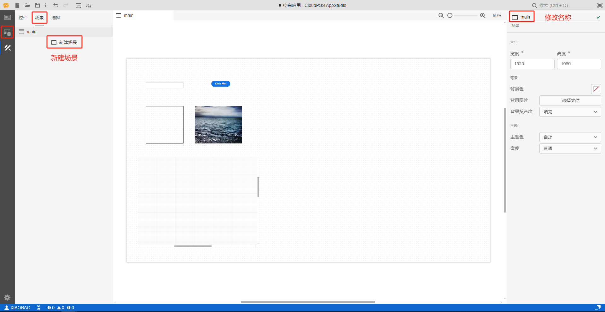

## 页面功能

当用户需要构建一个含多个子页面的复杂应用时，考虑到美观和便捷性，可利用场景功能将子页面放置到不同的场景中，类似于 SimStudio 的图纸功能，每个应用至少包含一个场景。

## 功能说明

### 添加场景

对任意的应用都可添加任意数量的场景。操作方法如下图所示，首先点击实现场景页的场景选项，然后点击**新建场景**即可。

:::warning
新添加的场景名称不能重复，否则会报错。
:::

### 场景操作

选中场景，鼠标右键点击场景，可对场景进行**剪切**、**复制**、**创建副本**、**删除**等操作。场景删除后，该场景内的所有控件也将随之删除。

:::info

鼠标左键常按场景上下拖动可以调整场景顺序，预览模式下显示的是最上面的场景。

:::

### 场景属性

选中场景后可以在标签页右侧的属性编辑板块编辑**场景属性**。

#### 大小

用户可通过宽度和高度设置场景的大小，默认是`1920*1080`的分辨率。

#### 背景

##### 背景色

配置背景颜色。

##### 背景图片

点击**选择文件**上传本地图片作为背景图片。

:::info
图片的大小应与场景大小一致，避免图片显示不全。
:::

##### 背景图片

点击**选择文件**上传本地图片作为背景图片。

##### 背景契合度

用户可以根据场景和图片之间的大小关系自主选择契合方式。

- 填充：图片等比缩放，按照最小边来适应场景的最大边，以达到填充场景的效果；
  
- 适应：图片等比缩放，图片的最大边和场景的最小边契合，也就是保持图片比例的同时最大化显示图片；

- 拉伸: 图片不按比例缩放，而是根据场景大小拉伸，占满场景；

- 平铺：把图片铺满场景，图片小的时候挨个排列，直到排满整个场景；
  
- 居中：图片保留原大小处于场景中间。

#### 主题

##### 主题色

可以设置场景的主题颜色，默认是自动，和 CloudPSS 工作台的主题保持一致。

##### 密度

密度：默认是普通，针对 PC 端用户，为方便在触摸设备上使用，可以选择触摸选项，用户界面会变大。

