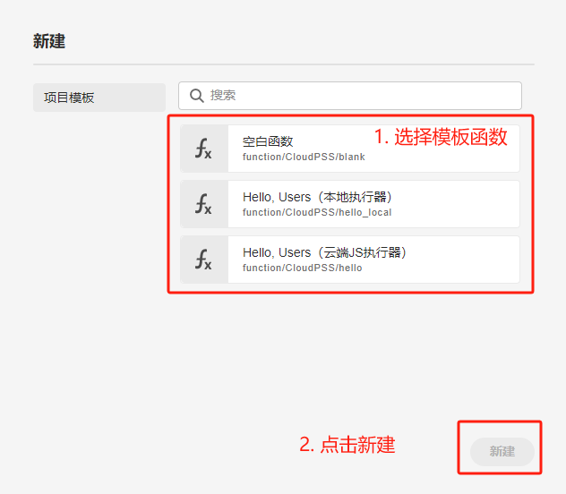
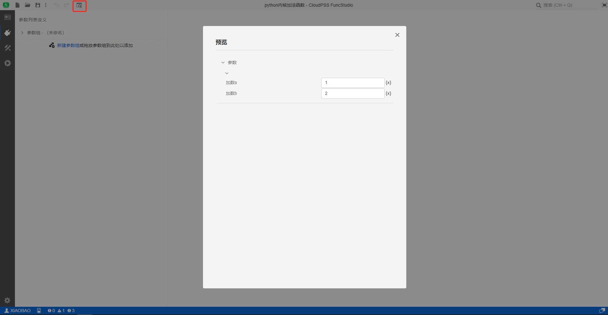

本文档主要介绍 **FuncStudio 工作台** - **工具栏** 的各项功能。

## 页面功能

工具栏主要集成了对 FuncStudio 项目的基本操作和快捷按钮两类功能。
+ **基本操作**：包括项目层面的**新建**、**打开**、**保存**和**另存为**功能，编辑层面的**撤销/重做**功能，以及**搜索**和**全屏**两项辅助功能。
+ **快捷按钮**：根据当前标签页的不同，工具栏会显示不同的特殊快捷按钮，如接口标签页下的**预览**、实现标签页下的**更改实现类型**、运行标签页下的**调试执行**和**启动任务**。

:::tip 不同平台的快捷按钮
+ 对于网页版 FuncStudio ，运行标签页下仅提供**启动任务**快捷按钮。
+ 对于 FuncStudio 本地执行器，运行标签页下同时提供**调试执行**和**启动任务**快捷按钮。
:::
  

## 基本操作

### 新建

点击工作栏左上侧**新建**按钮，会弹出新建项目对话框。用户可以选择任一项目模板，点击**新建**即可创建项目。点击对话框外任意空白处，可关闭该窗口。

:::info 项目模板
CloudPSS FuncStudio 函数工坊预置了空白函数模板、本地执行器模板、云端 JS 执行器模板。

+ 对于在本地执行的`Python`和`Matlab`内核函数，用户可选择空白函数模板或本地执行器模板来快速构建本地实现类型的函数项目；
  
+ 对于在云端执行的`JavaScripts`代码内核，用户可选择空白函数模板或本地执行器模板来快速构建云端实现类型的函数项目。

:::

### 打开

点击工作栏左上侧**打开**按钮，会弹出打开项目对话框，用户可分别从云空间中的**个人仿真**、**协作项目**、**仿真广场**打开以及从**本地文件**上传 FuncStudio 项目。
+ **个人项目**：云空间中保存的当前用户创建的全部项目。
+ **协作项目**：云空间中保存的当前用户所加入**协作组织**的协作项目。有关协作组织的建立，可参见 [组织管理](../../settings/organization/index.md "组织管理") 帮助页。
+ **项目广场**：云空间中保存的权限为**公开**的全部项目，包含所有用户创建的项目。
+ **本地文件**：保存在用户本地设备上的项目文件（**cfnc**格式）。通过“**拖放文件到此处**”或“**点击以打开文件选择对话框**”选择本地函数文件上传。

:::warning 支持的本地文件类型
+ **FuncStudio 工作台** 内的 **打开本地文件** 功能，与 **FuncStudio 云空间** 的 **上传并打开...** 功能相同，仅支持 FuncStudio 导出的**cfnc**格式函数文件。
:::

### 另存为

对于**新建项目**，点击工作栏左上侧**保存**按钮、或右边**更多**弹出的**另存为**按钮后，会弹出另存为对话框，选择保存位置为云空间的**个人项目**、**协作项目**，或下载至**本地文件**。

#### 1. 保存至个人项目

选择保存在**个人项目**时，必须填写**资源 ID**（`RID`）中的**项目ID**和**名称**，点击保存按钮即可实现项目文件的保存。

:::info 资源 ID（或 `RID` ）

**资源 ID**（或 **RID** ）是在 CloudPSS XStudio 中标识项目的**唯一**、**不可重复**的标识符。

完整的 **FuncStudio 项目 `RID`** 格式：**`function/用户名/项目ID`**

为保证 CloudPSS XStudio 中每个项目 `RID` 的唯一性，同一用户输入的**项目ID**不可重复。
:::

#### 2. 保存至协作项目

选择保存在**协作项目**时，必须在**资源 ID** 中选择**协作组织 ID**，填入**项目ID** 和**名称**，点击保存按钮即可实现项目文件的保存。

:::info

保存云空间项目（选择**个人项目**、**协作项目**）时，可选择性配置项目**权限**、**类型**和**描述**，也可留空或保持默认选项。

其中，**权限**、**类型**和**描述**配置与**总览标签页**配置项一致，其配置方法参见[总览](../function/summary/index.md) 帮助页。

:::

#### 3. 保存为本地文件

选择保存在**本地文件**时，点击保存即可将**cfnc**格式的模型文件下载至本地设备。

### 保存

对于**已保存过的项目**，再次点击**保存**按钮，新的修改将会覆盖旧的项目。

:::info 修改未保存的提示
当前项目存在**修改未保存**的操作时，工具栏的项目名称前面会出现**提示符号**，请注意随手保存。

:::

### 撤销/重做

点击工作栏左上侧**撤销**按钮，撤回上一步操作。

点击工作栏左上侧**重做**按钮，重做上一步操作。

支持对用户**打开项目后所有操作**的撤销的重做，无次数限制。

### 搜索

工作栏右上侧提供**搜索框**，可用于搜索命令、页面元素等。用户在搜索框内输入搜索内容，可以搜索出**当前项目**与包含**用户搜索内容**的全部元素。

### 全屏

点击工作栏右上侧搜索栏旁边的**全屏**按钮，FuncStudio 工作台将进入全屏模式，全屏模式下再次点击该按钮将退出全屏。

## 快捷按钮

### 预览

当功能区切换到**接口标签页**时，工具栏会出现**预览**快捷按钮，点击**预览**按钮，弹出预览对话框，预览功能用于对实现对函数定义参数列表的预览。

### 更改实现类型

当功能区切换到**实现标签页**时，工具栏会出现**更改实现类型**，点击更改实现类型按钮来选择实现类型。

实现类型有**云端：自定义命令**、**云端：JavaScript 模块**、**云端：Docker 模块**以及**本地：自定义命令**，选择不同的实现方式将会进入不同的实现页面。

:::info
对于 CloudPSS 公网平台，仅有**云端：JavaScript 模块**、以及**本地：自定义命令**两种实现类型。
:::

### 调试执行

当功能区切换到**运行标签页**时，工具栏会出现**调试执行**工具，点击调试执行按钮，对函数的算法内核在本地进行调试执行，相当于对算法程序`Debug`，通过点击 * 号查看更多的信息。调试的优点在于会把所有的信息都输出，包括结果、提示、警告和报错。

:::info
调试执行功能只在**FuncStudio 本地执行器**里有，网页版 FuncStudio 没有。
:::

### 启动任务

当功能区切换到**运行标签页**时，工具栏会出现**启动任务**工具，点击启动任务按钮，会根据当前的参数方案远程调用函数的算法内核，获取函数输出结果。

:::info

启动任务功能网页版 FuncStudio 和FuncStudio 本地执行器里都有。

一般的，对于**本地实现类**型的函数，需要先在**本地执行器**里将函数**调试成功**后，才能在网页版 FuncStudio 中**远程调用**函数内核，获取函数**运行结果**。
:::

