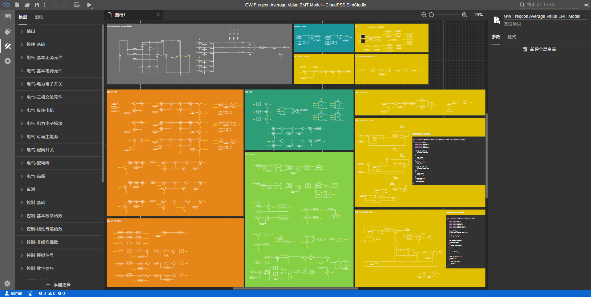
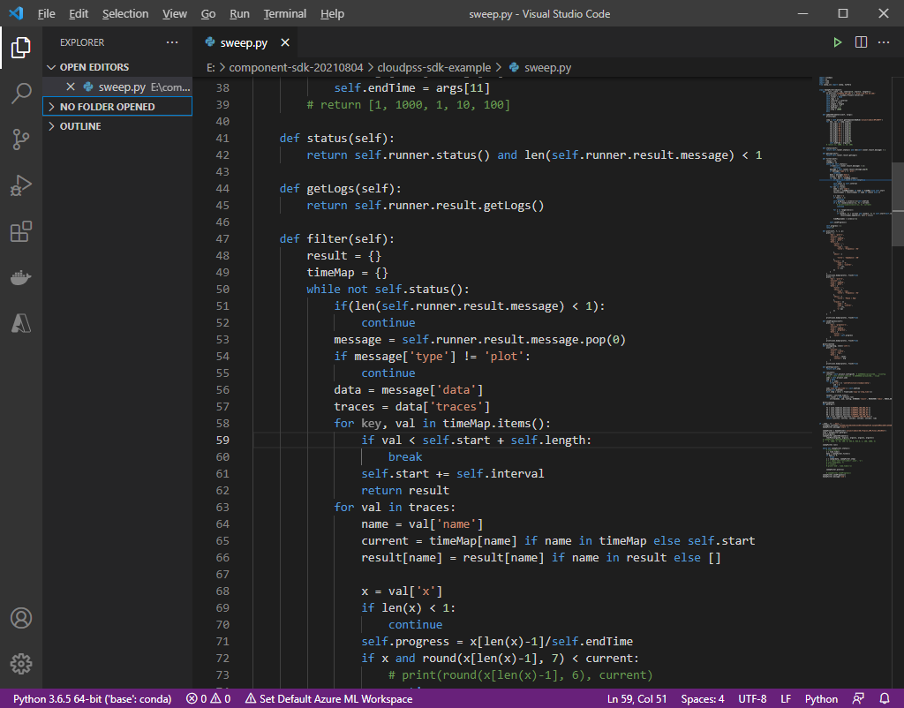
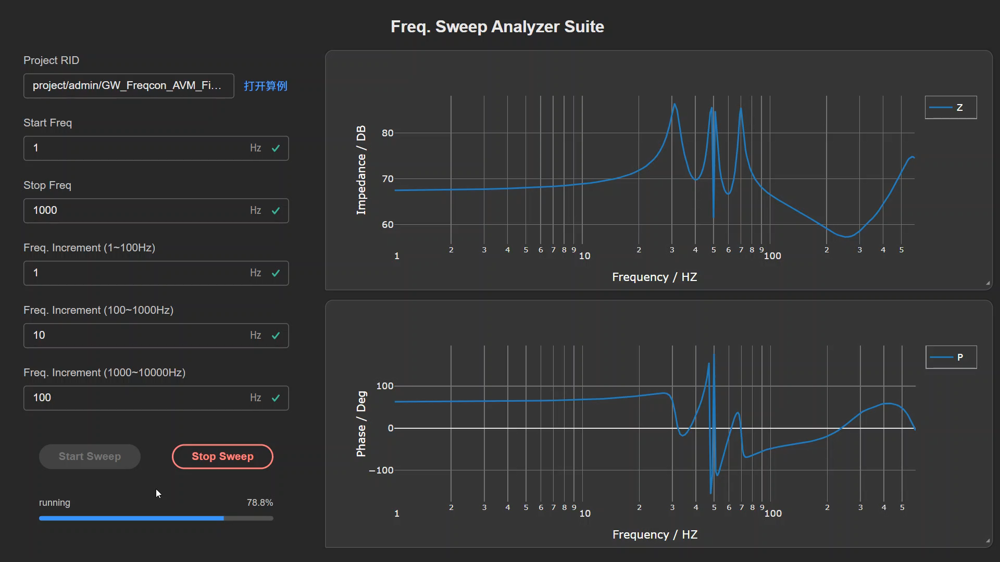

使用 CloudPSS XStudio 平台构建一个完整的数字孪生应用，只需以下4个步骤。此处以`风电机组数字孪生体的在线扫频应用`为例，介绍数字孪生应用的构建流程。

## 在 SimStudio 中构建能源电力系统模型

若所构建的数字孪生应用依赖物理模型，则需要在 SimStudio 中创建相应的能源电力系统模型。在本案例中，

- 首先应在 SimStudio 中构建风电机组的电磁暂态仿真模型；

- 然后配置好适用于端口频率扫描的仿真参数和监控通道，将模型仿真调试通过后备用。

## 编写算法内核，并接入 FuncStudio

- 首先，借助 SimStudio SDK，构建扫频分析内核 `sweep.py`，即：获取实测数据对风机仿真模型进行初始化，进而通过多次调用仿真内核实现不同注入频率的端口阻抗计算，最终形成端口阻抗曲线;

- 进一步，在部署环境安装 FuncStudio 本地执行器，将编写好的扫频分析内核接入 FuncStudio ，配置好执行环境和执行命令、输入和输出数据格式;

- 最后，在 FuncStudio 中将上述内核调试通过。

## 在 AppStudio 中设计UI和可视化面板，绑定函数与数据

- 首先，在 AppStudio 中设计扫频分析 APP 的用户交互面板和数据可视化面板；

- 然后，将 FuncStudio 中 sweep 函数的输入输出数据与 AppStudio 交互面板上的控件数据和事件绑定。

## 调试、运行及发布

借助 AppStudio 的预览功能，对所构建的应用界面、数据绑定关系和数据可视化效果进行调试；待调试通过，即可发布至 CloudPSS 数字孪生平台中。

- 若在私有环境中部署，则用户可在浏览器中输入IP地址即可访问所发布的应用；

- 若在公有云（cloudpss.net）中部署，CloudPSS会为每个公开应用分配独立的域名。

:::tip
本案例中所构建的示例案例现已发布至公网平台，用户可访问[https://freqsweepanalyzer.pub.cloudpss.net/](https://freqsweepanalyzer.pub.cloudpss.net/)查看。
::: 

