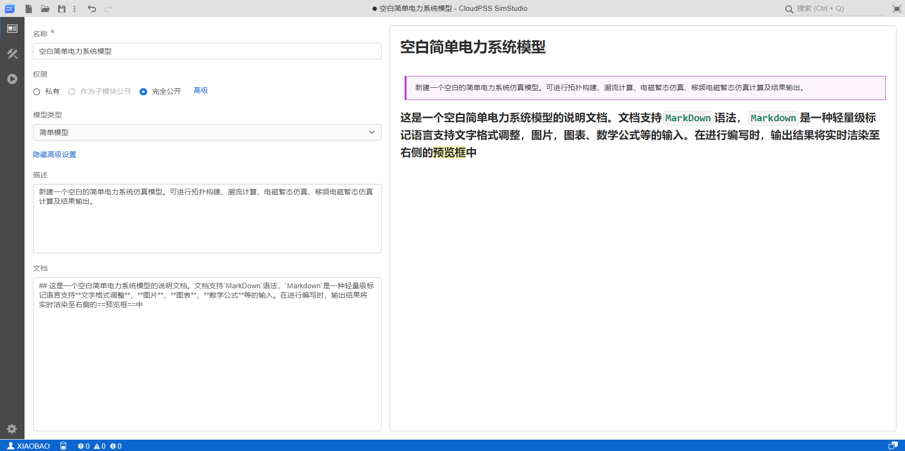

本文档介绍 **SimStudio 工作台** - **总览标签页** 的各项功能，包括项目基本信息、模型类型、元件标签和简单权限的配置方法。

## 页面功能

总览标签页用于管理和配置当前项目的基本信息，包括**名称**、**描述**和**文档**，以及**权限**、**模型类型**等高级设置。
+ 通过点击 **显示/隐藏高级设置**，可展开或隐藏**权限**、**模型类型**配置项。
+ 通过点击 **权限** - **高级/隐藏高级权限设置**，可进一步展开或隐藏**高级权限设置**配置项。
上述配置中，除**名称**为必填项外，其余均可留空或保留默认选项。

在**总览标签页**的右侧，会实时显示当前项目**描述**与**文档**的预览。

### 名称

编辑当前项目的名称。项目名称不可留空，可任意修改，且可与其它项目重名。

### 描述

编辑当前项目的添加描述性文字，可留空，支持 **Markdown** 语法，主要用于描述模型的功能、用途。该部分文字会在 **SimStudio 云空间**的**项目列表**、**SimStudio 工作台**的**打开**对话框中显示，便于用户对模型进行简要注释。

### 文档

编辑当前项目的说明文档、帮助文档或开发文档，可留空，支持**Markdown**语法，主要用于详细介绍模型的使用用法、版本、更新记录等信息。该部分文字会在 **SimStudio 云空间**的**项目列表**、**SimStudio 工作台**的**打开**对话框中显示，便于用户撰写或查看文档。

:::info Markdown 语法
描述及文档内容的编写支持 **MarkDown** 语法，**Markdown** 是一种轻量级标记语言，支持文字格式调整，图片、图表、数学公式等的输入。

具体用法参见 [MarkDown 语法介绍](/docs/meta/edit-help/markdown-intro/index.md)。
:::

### 预览

预览区会自动生成当前项目的介绍文档，对于SimStudio项目，文档由4部分构成：
+ **名称**
+ **描述**
+ **参数列表**和**引脚列表**
    + 对于简单模型，该部分为空；
    + 对于普通模型项目，预览框会显示**接口标签页**的**参数列表**；
    + 对于元件项目，预览框会显示**接口标签页**的**参数列表**和**引脚列表**。
+ **文档**

项目信息变更时，文档将实时渲染至右侧的预览框中。

## 高级设置

SimStudio 项目的高级设置包括模型**类型**、**元件标签**和**权限**三部分。高级设置仅影响项目分享相关的配置，可留空。

### 模型类型

模型类型表示当前 SimStudio 项目所管理的模型种类，分为**简单模型**、**普通模型**和**元件**三种。模型类型的选择会影响**功能区**标签页的布局。默认选择为**普通模型**。
+ **简单模型**：功能区仅包含**总览标签页**、**实现标签页**、**运行标签页**，主要用于构建简单仿真模型。适合初次接触 SimStudio 的学习型用户、普通用户。
+ **普通模型**：在**简单模型**的基础上，进一步包含**接口标签页**，用于为模型添加**全局参数**。适合绝大多数用户，可支持大规模模型管理、多场景分析、参数优化等类型的工作。
+ **元件**：功能区包含完整版本的 4 个标签页，支持将当前模型封装为**元件**，从而可被其他模型调用。适合专业型用户，主要用于模型封装测试、用户自定义元件等场景。

### 元件标签

当**模型类型**选择为**元件**时，会显示**元件标签**选项，仅用于元件类型的项目。若用户填写了**元件标签**，则该元件将被加入到模型库中以该标签命名的分组。若**元件标签**为空，则默认不将该元件放置于模型库。

在**实现标签页** > **模型** > **添加更多**处查找**用户名/元件标签**可以订阅并使用此元件。

例如：
+ 用户`usr1`建立了一个元件，填写**元件标签**为`dev`，则该元件将被加入到`usr1/dev`这个模型库分组中。
+ 用户`usr2`建立了一个元件，填写**元件标签**为`测试`，则该元件将被加入到`usr2/测试`这个模型库分组中。

### 权限

CloudPSS SimStudio 设置了丰富的权限类型，方便项目的协作与分享。配置方法分为简单和高级两种。通过点击 **权限** - **高级/隐藏高级权限设置**，可进一步展开或隐藏**高级权限设置**配置项。

简单权限设置包括**私有**、**作为子模块公开**和**完全公开**三种。不同权限的具体含义如下：

+ 项目被保存为**个人项目**时
    + **私有**：该项目仅当前用户自己可见，对其他用户隐藏，在 **SimStudio 云空间**的**项目广场**中不可见。当前用户具备完全的读/写（修改）权限。
    + **作为子模块公开**：仅对**元件类**项目有效。该项目内部细节仅对当前用户可见，在 **SimStudio 云空间**的**项目广场**中不可见。当前用户具备完全的读/写（修改）权限。除当前用户外的其他用户其他用户仅可查看元件的接口定义，可在其他项目中使用该元件。
    + **完全公开**：该项目对所在CloudPSS平台的全部用户可见，在 **SimStudio 云空间**的**项目广场**中可见。除当前用户外的其他用户仅具备读权限，不能修改。

+ 项目被保存为**协作项目**时
    + **私有**：该项目仅当前协作组内的用户可见，对组外用户隐藏，在 **SimStudio 云空间**的**项目广场**中不可见。当前协作组的用户具备完全的读/写（修改）权限。
    + **作为子模块公开**：仅对**元件类**项目有效。该项目内部细节仅对当前协作组内的用户可见，在 **SimStudio 云空间**的**项目广场**中不可见。当前协作组的用户具备完全的读/写（修改）权限。除当前协作组外的其他用户仅可查看元件的接口定义，可在其他项目中使用该元件。
    + **完全公开**：该项目对所在CloudPSS平台的全部用户可见，在 **SimStudio 云空间**的**项目广场**中可见。除当前协作组外的其他用户仅具备读权限，不能修改。

除了上述简单权限外，点击 **权限** - **高级**，切换高级权限配置面板，可配置更多自定义权限。有关更多高级权限配置方法可参见 [高级权限配置](../../../../../account/settings/sdk-token/index.md) 帮助页。

<!-- ## 案例

:::warning
这里可以不放案例！
:::

import Tabs from '@theme/Tabs';
import TabItem from '@theme/TabItem';

<Tabs>
<TabItem value="js" label="简单模型项目信息配置">

</TabItem>
<TabItem value="java" label="普通模型项目信息配置">

</TabItem>
<TabItem value="py" label="元件模型项目信息配置">

</TabItem>
</Tabs> -->

