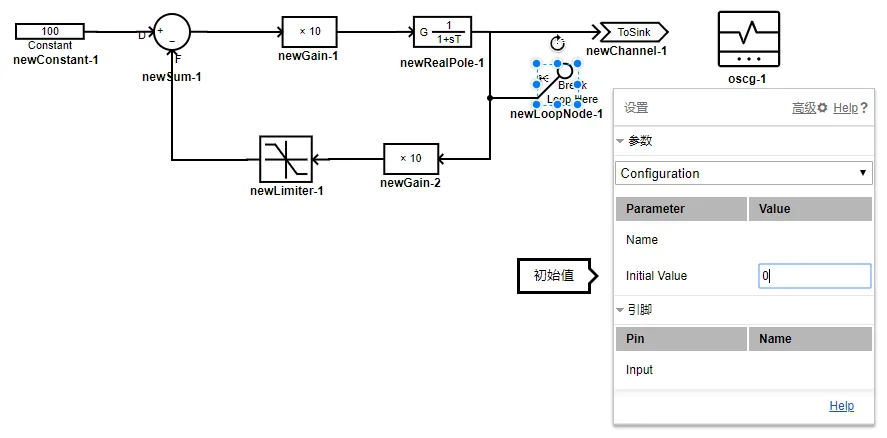

## Basic Description



> **This component is used to implement the algebraic loop break function.**

## Parameter

### Configuration

| Parameter name | Unit | Remark            |        Type         | Description                           |
| :------------- | :--- | :---------------- | :-----------------: | :------------------------------------ |
| Name           |      | Name of component |        Text         | Enter the name of this component      |
| Initial Value  |      | Initial value     | Real number (Const) | Initial output value of the component |

## Pin List

| Pin name | Dimension | Description |
| :------- | :-------: | :---------- |
| Input    |    1×1    | Input pin   |

## Using Instructions

This component is used to solve the loop in the simulation example where the Control loop (algebraic loop) appears by adding a one-step delay method, so that the simulation can continue.

Usually, if a system with a feedback loop (as shown in the figure) is set up, when clicking `Start Simulation`, the `system information` will report multiple `warnings`.



1. **[warning]** There are loop nodes in system!You can use Component 'LoopNode' to specify the loop nodes and the initial value, or the program will choose random loop nodes.
2. **[warning]** Node 1 in component newGain-1 will be chosen as loop node with initial value 0.
3. **[warning]** Node 1 in component newGain-2 will be chosen as loop node with initial value 0.
   

At this time, CloudPSS adds a delay to each of the `newGain-1` component and the `newGain-2` component through the built-in loop-solving algorithm. And the feedback loop of the system is broken, so that the simulation performs normally.

However, the automatic loop-solving algorithm is often not optimal. Therefore, users are advised to use this component to break the loop. For example, for the control loop shown above, the feedback loop could be solved by adding a one-step delay to the output position. It is also possible to set an initial value for the feedback path after the loop is solved to reduce the error caused by the loop-solving algorithm.

## See Also
