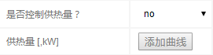
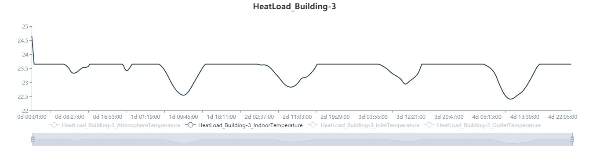

## Description

There are 12 preset examples of this simulation module, all of which are under winter heating conditions. Based on the example case, the user can further modify the simulation parameters, network topology, equipment parameters, and meteorological conditions according to their own needs, so as to realize the simulation of the heating system operation under specific scenarios (such as summer cooling). A schematic diagram of the simulation study form is as follows.

## Application Scenario

According to different boundary conditions setting and combination mode, the application scenarios of regional central heating system operation simulation are different. The two typical application scenarios are heating plan formulation and indoor temperature prediction. The preset 12 heating networks example cases are also based on these two application scenarios. When setting the boundary conditions, it should be noted that the total number of boundary conditions should enable the system to solve the solution.

### Scenario1：Heating plan formulation

The application scenario of the heating plan formulation refers to obtaining the heat supply change of the heat source in the future for a certain period of time in order to maintain the constant temperature of each load node (building) in a certain meteorological condition. At this time, the simulation module is used. It is necessary to control the indoor temperature of each load, and the heat supply parameter of the heat source does not need to be controlled, and then other control conditions are set according to actual needs.

### Scenario2：Indoor temperature prediction

The application scenario of indoor temperature prediction refers to predicting the change of indoor temperature of each load in the future period according to the actual meteorological conditions in the case of known heating plan. At this time, when using the simulation module, it is necessary to control the heat supply of the heat source without controlling the indoor temperature of the load, and then setting other control conditions according to actual needs.

## Simulation

In the regional central heating system example case, select the corresponding number of nodes, simulation time and heating scenario according to the needs. Click `Finish` to enter the corresponding example case, or directly open the corresponding example case link. Then click `Simulation Parameters`->`Start` and select the computation node to get the simulation results. After the calculation is completed, select each component to check the predicted heating, indoor temperature, heating temperature, pressure, flow and other parameters in the system monitoring panel.

### Test1：Heating plan formulation

Take the system with one heat source and three loads an example, and formulate a heat supply plan for the next five days. The heat supply of the heat source is shown in the following figure. It can be seen that at the beginning, the initial temperature of the room is greater than the indoor control temperature. At this time, the heat supply is small. After the indoor temperature is lowered to the control temperature, the heat supply starts to increase, and then as the meteorological conditions change, it basically fluctuates between 900kw and 1200kw. The large fluctuations in heat supply at around 17h , mainly due to the sharp change in the outdoor wind speed.

It can be found from the variation of the indoor temperature of the load node 3 that although the indoor temperature is a control condition, the indoor temperature still fluctuates, which is mainly because the water supply temperature and the water supply flow rate of the heat source are constant values, and the load node 3 is far away from the heat source, so that the water supply temperature is lower at some moments, and at this time, the heating demand of the load node cannot be satisfied anyway, so indoors The temperature has dropped.

### Test2：Indoor temperature prediction

Taking a case of indoor temperature prediction for the next 3 days in 1 heat source and 3 loads system as an example, the indoor temperature change of the load node 2 is as shown in the following figure. It can be seen that under the current heating plan, the indoor temperature of the load node 2 is maintained substantially between 27 and 30 degrees, for which the current heating plan is satisfactory. 

