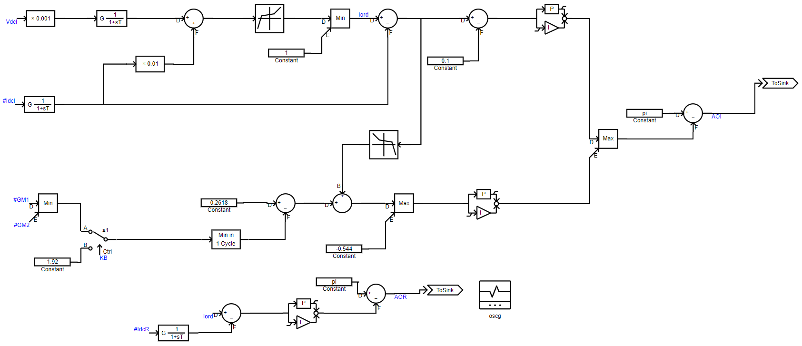
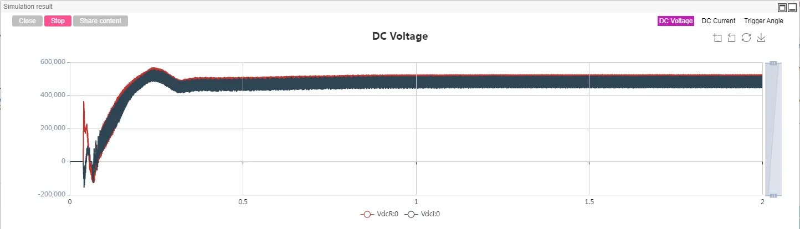
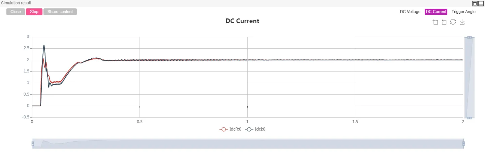
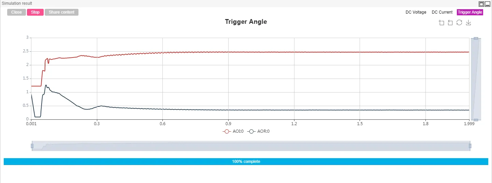
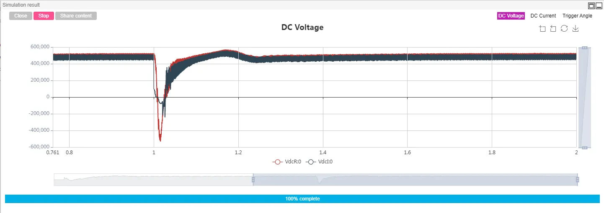
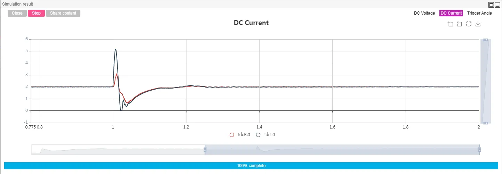
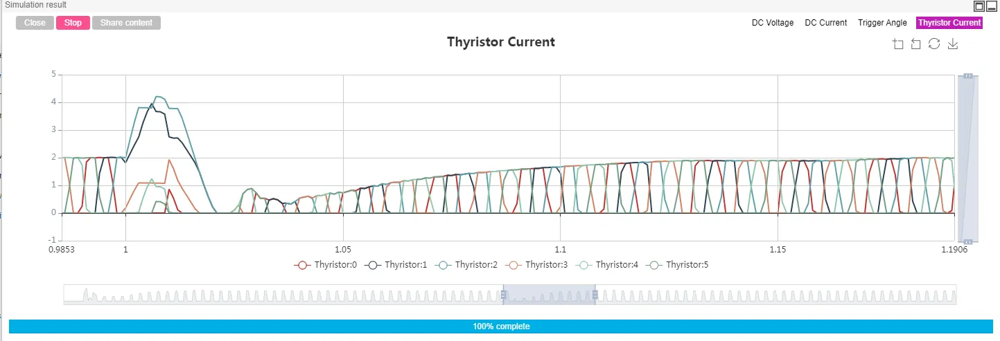

## Description

The line commutated converter high voltage direct current (LCC-HVDC) transmission system based on the power converter has the advantages of large transmission power and mature technology, and has played an increasingly important role in the power system in recent years.

CloudPSS provides the LCC-HVDC standard test system provided by the international large power grid organization. On the standard test system, CloudPSS further provides four LCC-HVDC simulation models for monopolar 12-pulse, monopolar dual 12-pulse, bipolar 12-pulse, and bipolar dual 12-pulse. Users can select them according to their needs. The simulation model is introduced with the monopolar 12-pulse as an example. The monopolar dual 12-pulse, bipolar 12-pulse and bipolar dual 12-pulse electrical and control systems are similar, and the descriptions of them are omitted.

## Model Introduction

The monopolar 12-pulse LCC-HVDC model is shown in the figure, in which each 6-pulse bridge converter is connected to a corresponding converter transformer and further connected to the AC side bus. On the AC bus, there are AC filter bank and capacitor bank in parallel. The capacitor bank is mainly used for reactive power compensation on the AC side; the filter bank is used to filter the harmonics of the AC measurement, and also has a certain reactive power compensation effect. The rectifier side and the inverter side are connected by a DC transmission line.

In the control system model of the DC system, the rectifier side adopts constant current control, and the inverter side generally adopts the constant arc extinction angle control and is equipped with a low voltage current limiting protection, as shown in the following figure.

## Simulation

Set the appropriate simulation step size (10μs or 20μs) for electromagnetic transient simulation of the LCC-HVDC system.

### Test1：Steady-state operation test

Set basic information such as start time, end time and integration step size of the example case. Click `Format Panel`->`Electromagnetic Transient`>`Simulation Control`>`Start` and select the corresponding calculation node to get the simulation result. In the example, the DC voltage, DC current and trigger angle waveforms of the rectifier side and the inverter side have been output, and the user can set the output waveform according to ones’ needs. Through the simulation results, we can see that the DC system quickly enters the steady-state operation state.

### Test2：Commutation failure test

Commutation failure is the most common type of failure in LCC-HVDC. A three-phase short-circuit fault is set on the inverter side AC bus. The fault time in the example case is controlled by the global variable. The fault start and end time can be set by setting $FaultStart and $FaultEnd in the global parameter option. This AC fault can cause a commutation failure failure in the DC system.

By measuring the thyristor current of the inverter side six-pulse converter bridge component, it is also possible to draw a detailed current of the six thyristors inside the bridge.

