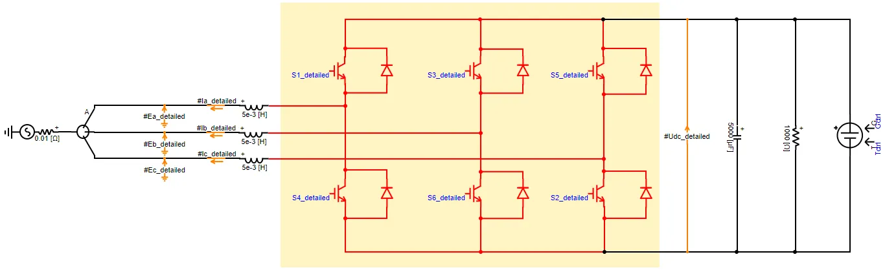
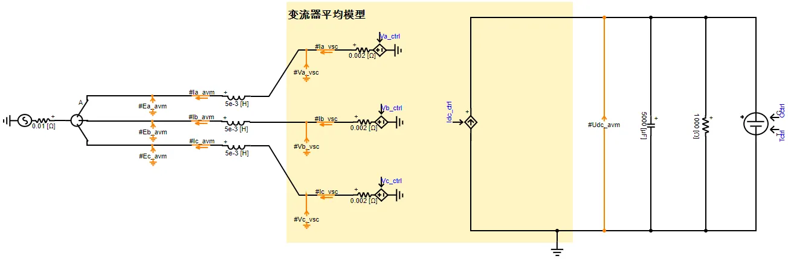
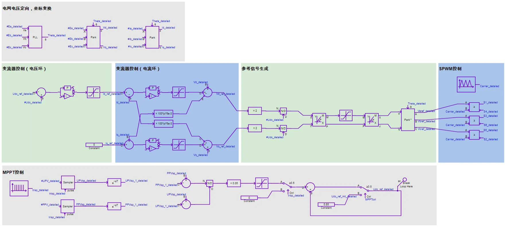
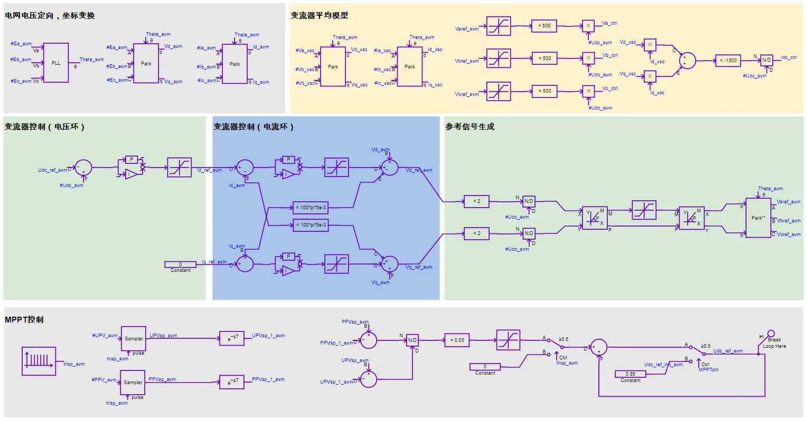
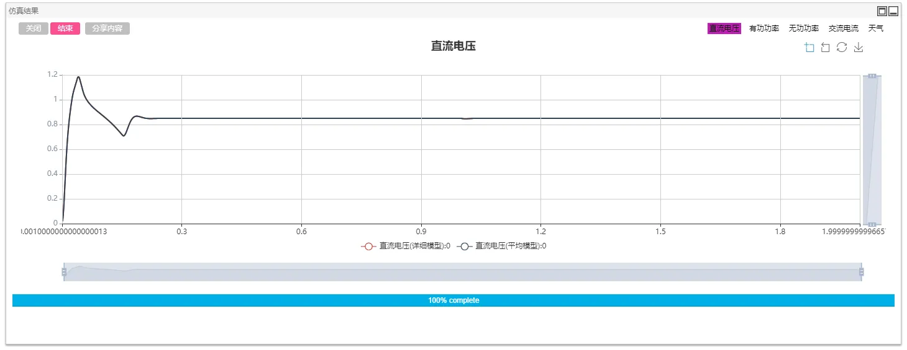
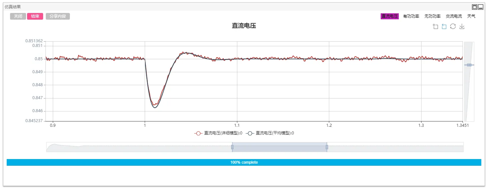
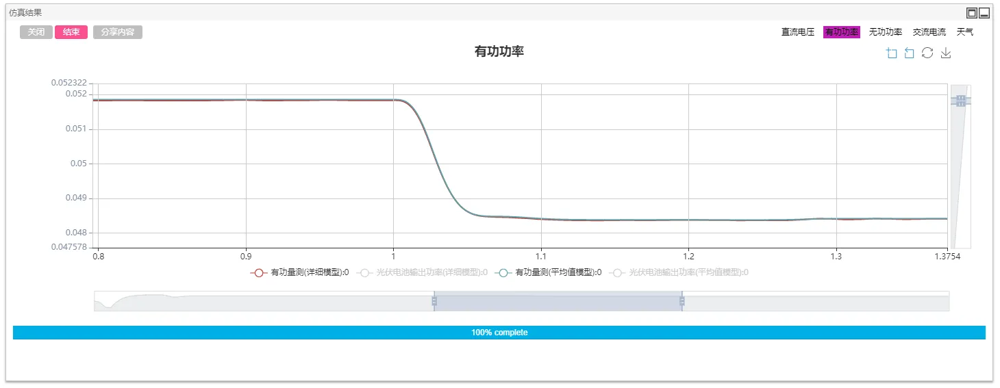
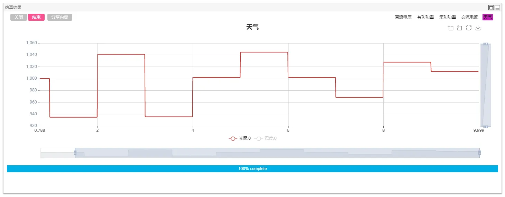
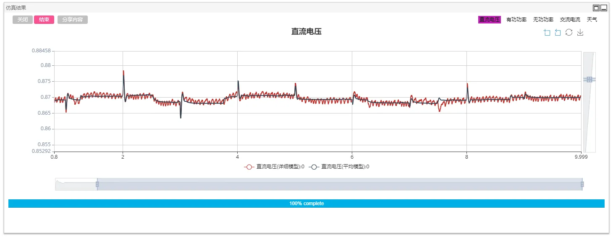
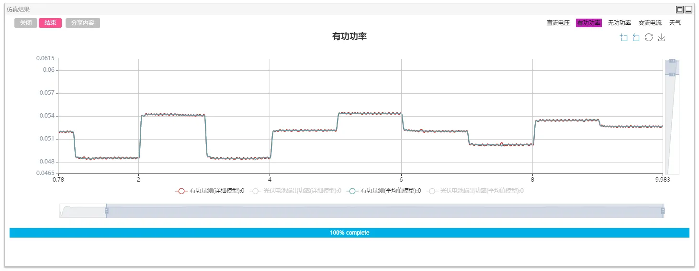

## Description

With the advancement of power electronic conversion technology, the proportion of Photovoltaic grid-connected generation system has gradually increased. Detailed modeling and simulation of centralized and distributed photovoltaic generation systems is of great significance for studying the impact of photovoltaic grid-connected.

CloudPSS provides a detailed model and average model of a PV grid-connected generation system and provides a comparison of the two models. Users can select the corresponding model according to their needs, and modify and research on the basis.

## Model Introduction

The photovoltaic grid-connected generation system consists of an engineering parameter model of the photovoltaic cell stack (parameters are more easily available), a voltage source converter (detailed/average model), a converter control system, and a maximum power point tracking (MPPT) algorithm.

Among them, the detailed model of the voltage source converter is composed of six discrete IGBTs and their anti-parallel diodes, as shown below.

The average model of the converter consists of three controlled voltage sources on the AC side and one controlled current source on the DC side, as shown below.

The converter's control system uses constant DC voltage-reactive power control (VQ control). Among them, the DC voltage reference value is specified by the MPPT control module. The control system of detailed model consists of four parts: grid voltage orientation, voltage-loop & current-loop double closed loop control, reference signal generation, and SPWM control. MPPT uses a perturbation algorithm.

The average model's control system omits the SPWM control, but adds the averager model control of the converter (the main function is to ensure the power balance between the AC side and the DC side).

## Simulation

The simulation step size is set according to the selected model, and the electromagnetic transient simulation of the photovoltaic grid-connected generation system is performed. Among them, the detailed model has discrete switching events. It is recommended to check the `Switch/Discrete Event Processing Enhancement` option in the `Format Panel`->`Electromagnetic Transient`->`Solver Settings` and simulate with a smaller simulation step. If the PWM carrier frequency is $f_c$, it is recommended that the simulation step size be less than $1/({20f_c})$. When using the average model, since there is no switching event, the `Normal (default)` option can be selected to set a higher simulation step size (50 μs is recommended, usually no more than 100 μs).

### Test1：Illumination, and temperature change

The detailed model and the average model are built in the unified example project, and the external conditions such as illumination and temperature of the detailed model and the average model are kept constant, and MPPT control is disabled. (In the example, the use of MPPT algorithm is controlled by a step signal from 0 to 1 at 0.2s. Change the Final Value of the step signal to 0 to disable the MPPT algorithm), and set basic information such as the start and end time of the example case and the integration step (5μs). Click `Format Panel`->`Electromagnetic Transient`->`Simulation Control`->`Start` and select the corresponding calculation node to get the simulation result. Draw a comparison figure of DC voltage and active/reactive power.

The illumination and temperature have changed at 1s. It can be seen that the DC voltage and active power are slightly adjusted.

### Test2：MPPT control under illumination and temperature change

The illumination and temperature are randomly fluctuated according to the frequency of 1 Hz and 0.8 Hz respectively, and the MPPT algorithm is started to compare the simulation results of the detailed model and the average model.

It can be seen that the detailed model and the average model result are consistent. In practical applications, if you need to study control algorithms and system-level dynamics, to improve simulation efficiency, an average model can be used.
