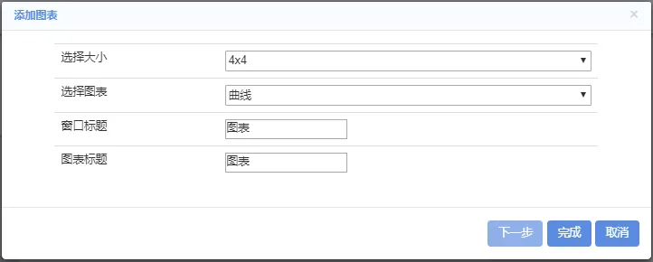
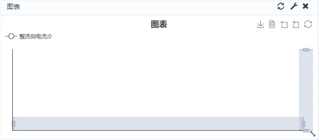
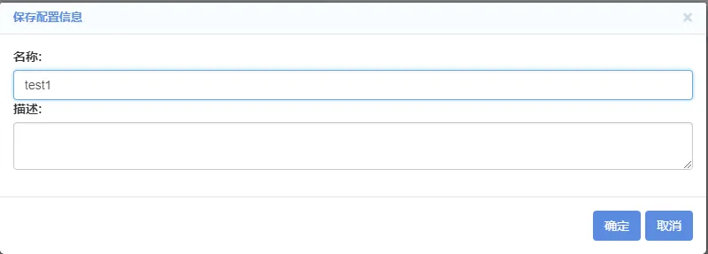
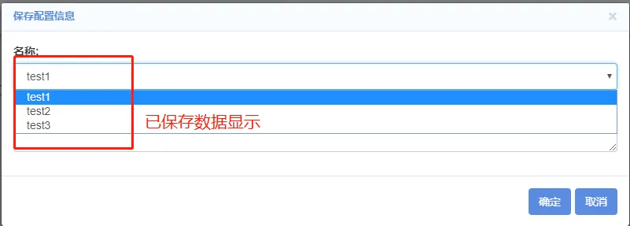

The dashboard function of CloudPSS provides the visualization function of simulation data. With the help of graphical display, users can view the simulation result information more clearly and effectively. For any simulation file with `Output Channel` component, the dashboard function can be used to dynamically display the simulation data.

This chapter takes the [Two Ports MMC HVDC Test System](../examples/MMC.md) as an example to introduce the use of dashboard.

## Opening Dashboard

Open the simulation file, click `Electromagnetic Transient->Simulation Control->Open Dashboard`, and a new page will pop up, as shown below:

The top of the page contains edit, lock mode, start and stop, and the bottom is the log bar. Click the '<' symbol in the upper right corner of the log bar to hide it in small icon on the left. 

## Add Chart

Click `Edit->Add Chart` to open the following dialog box, which defines the size, type, title and other information of the chart to be added.

+ Select Size: predefined chart size, which can be 4x4, 4x6, 5x5, 6x4.
+ Select Chart: the chart type can be curve, histogram, pie and user-defined type.
+ Window Title: the title of the window where the chart is located.
+ Chart Title: the title of the chart created.

In this example, the simulation data generated by MMC simulation test system will be added with curve chart, histogram and pie chart respectively.

### Adding Curve Chart

In the figure below, select the chart type as `Curve Chart`, and click `Next` button to open the configuration table dialog box, as shown in the figure below. The abscissa type can be selected as linear or logarithmic. Click the Add button, first fill in the curve name, and then select the data source of the x-axis. You can choose default (time) or other data (the data option of the drop-down box comes from the "output channel" of the simulation workspace). Next, select the data source for the y-axis (the data options for this drop-down box come from the output channel of the simulation workspace). In this example, the abscissa type is selected as linear, Line1 is named rectifier side current, the data source of x-axis is default and the data source of y-axis is rectifier side current; Line2 is named inverter side current, the data source of x-axis is default, and the data source of Y-axis is inverter side current.

Click the `Edit` button on the right to further set the style characteristics of the curve, such as icon, size, line width, color, etc., as shown in the figure below.

Click `OK` to display the chart on the dashboard page, as shown in the figure. The top right corner of the window is the refresh, set, and delete buttons.

### Add Histogram

Similarly, in the figure, select the chart type as `Histogram`, and click `Next` to open the configuration table dialog box, as shown in the figure below. In this example, the label name of bar1 is 'P of the rectifier side', and the data source is 'P of the rectifier side'. The label name of bar2 is 'Q of the rectifier side', and the data source is 'Q of the rectifier side'. The label name of bar3 is 'P of the inverter side', and the data source is 'P of the inverter side'. The label name of bar4 is 'Q of the inverter side', and the data source is 'Q of the inverter side'.

### Adding Pie Chart

Similarly, in the figure, select the chart type as `Pie Chart`, and click `Next` to open the configuration table dialog box, as shown in the figure below. In this example, the label name of Pie 1 is 'capacitor voltage of the inverter side', and the data source is 'VC at the inverter side'. The label name of Pie 2 is 'capacitor voltage of the rectifier side', and the data source is Vc1.

## Chart Position and Size Adjustment

On the main page of dashboard, click the window title and move the mouse to move the window. Click the zoom button in the lower right corner of the window to adjust the size of the chart.

## Remove Chart

There are two ways to remove a chart: the first is to click the delete button at the top right of the chart to delete the chart. Or click `Edit->Remove All Charts` to delete all charts.

## Save and Load Chart

Click `Edit->Save`, the following window will pop up, fill in the name and click `OK`. Users can save multiple dashboard files.

Click `Edit->Load`. The following dialog box will appear. Click the name drop-down box to display the list of saved files. Select the corresponding name and click `OK` to load the saved files.

## Lock/Edit Mode

Click the `Lock/Edit Mode` of the menu page to switch between each other. In the `Lock Mode`, users can't modify the position and size of the chart, which is helpful to avoid the user's misoperation when displaying the visual data.

## Start/Stop

Click `Start/Stop` of menu page to control data display of dashboard. The stable operation of the dashboard is shown in the figure, which has the advantages of dynamic, concise and beautiful for the display of simulation data.

