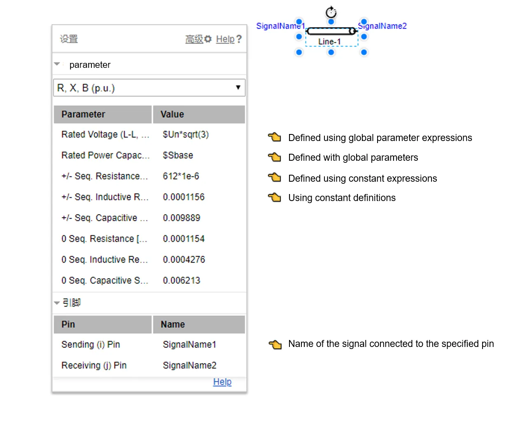
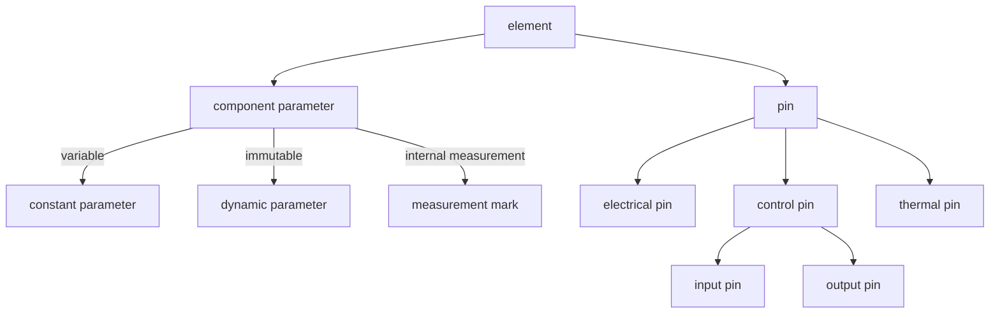
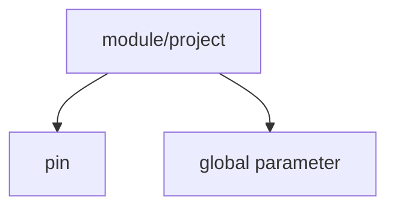
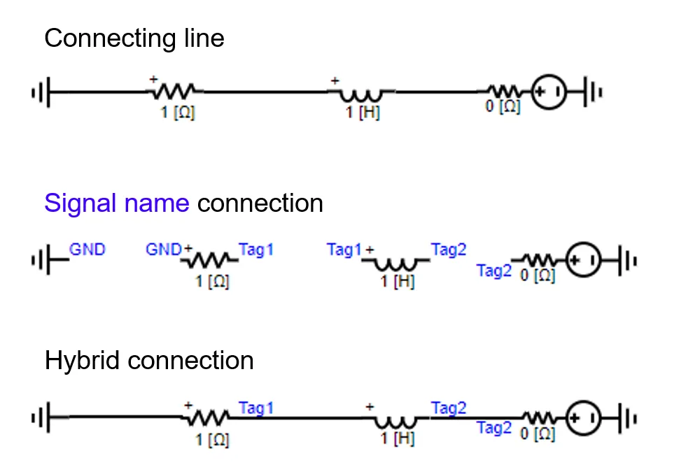
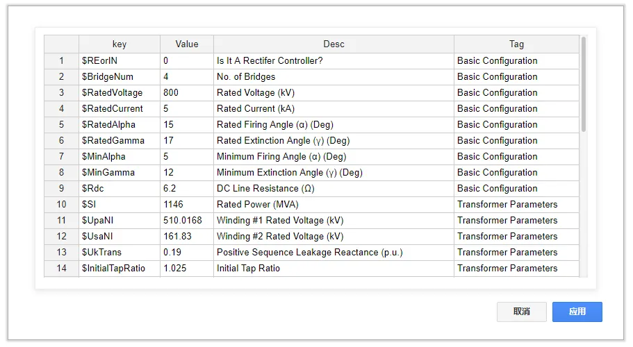
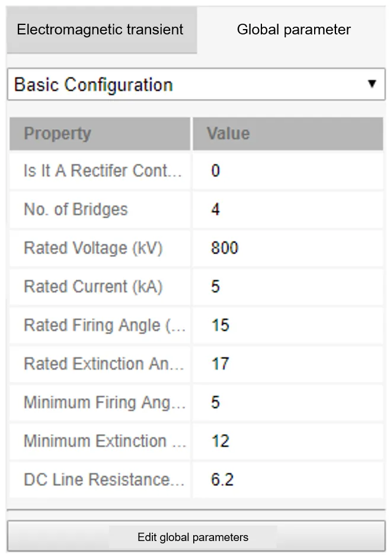
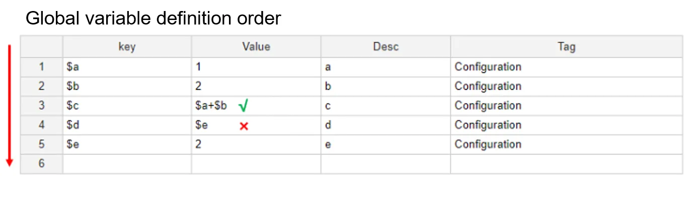
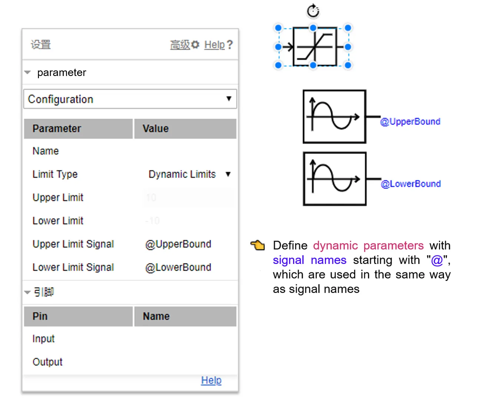
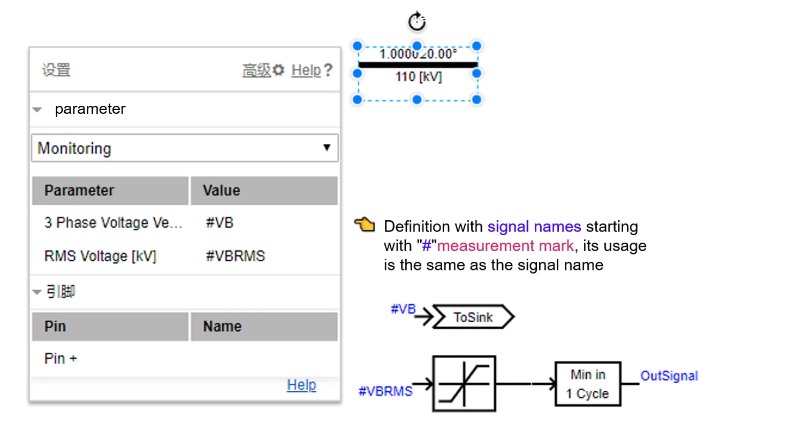

CloudPSS provides a special parameters and pins definition methods to flexibly maintain and manage simulation components, modules and examples, and thus achieve a variety of advanced simulation functions.

As shown in the figure above, `parameters` and `pins` definition are contained in the configuration panel of each component and module in CloudPSS.

1. `Parameters` are information (such as rated voltage, resistance, etc.) that define and describe the characteristics of components or modules. According to whether the parameters are variable in the simulation process, they can be divided into two categories: `constant` and `variable`. In addition, according to the different scope of parameters, the parameters that act on the scope of module and calculation example are defined as `global parameters`, and the parameters that act only on component are defined as `component parameters`
2. `Pins` are the input and output interface between the components (or modules) and the external system. According to different types of components, pins can be divided into `electrical pins`, `control pins` and `thermal pin`. Pins of different types cannot be connected. According to the direction of data flow, the control pins can be divided into `input pins` and `output pins`.

## Constant Parameter

The constant parameter can be divided into five types: Integer, Double, Dictionary, Text, and Table. Users can directly enter / select the corresponding type of parameter value in the parameter pane of the component. **Global parameter identifier** and [math.js expression](https://mathjs.org/) are supported when setting double type parameters. Some double type parameters have specific unit, please pay attention to unit conversion.

## Pins of Components and Modules

There are three pin connection modes between components and modules: wire connection, signal name connection and hybrid connection, as shown in the figure below.

1. **Wire Connection**：directly connect pins using "connection line".
2. **Signal Name Connection**：Users can set the `pin identification name` on the parameter configuration page. `Pins` with the same identification are physically connected together.
3. **Mixed Connection**：The above two connection modes can be used at the same time.

## Global Parameter

Global parameters are prefixed with marker "\$" and can be used by all the components within the scope of simulation projects. Global parameters are stored as a dictionary and can be edited at the `Control Board`->`Global Parameters`->`Edit Global Parameters`.

Each global parameter contains four options: `Global Parameter Identifier`, `Value/Expression`, `Global Parameter Description `, and `Global Parameter Group Name` .

1. `Global Parameter Identifier` The name of the global parameter.
2. `Value/Expression` The value or [math.js expression](https://mathjs.org/) of the global parameter.
3. `Global Parameter Description ` Description text for global parameters.
4. `Global Parameter Group Name`Group definition of global parameters.

After configuring the global parameters, click the `Apply` button.

Note:

1. The global parameters must be assigned before the start of simulation and cannot be changed during the simulation.
2. The global parameter table supports copy, paste, and fill functions.
3. The later defined global parameter can use the earlier defined global parameter, otherwise it is not allowed.

   

## Dynamic Parameter

Dynamic parameters are prefixed with marker `@` and can be used in the parameter configuration pane of the components.

## Measurement Identifier

Measurement parameters are prefixed with marker "#" and can be used in the `Monitoring` page of the parameter configuration pane or the measurement component.


**Note:**

The `electrical pins` can be connected to `control-input pins`. In this case, the value passed to the control system is the **node voltage (Unit: V)** of the `electrical pins`. However, CloudPSS does not recommend such usage. The better operation is to measure the node voltage with a measurement component and use the measured signal to pass to the control system.

