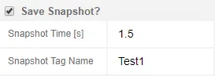
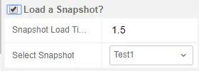
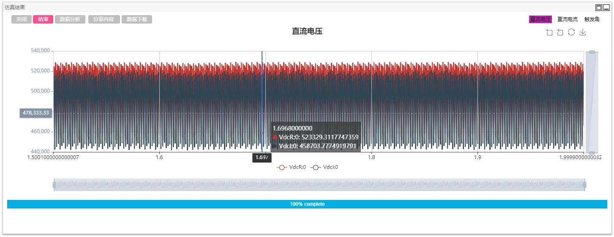

 
 
CloudPSS provides the function of snapshot saving and importing in the process of electromagnetic transient simulation. It can be set in `Format panel`->`Electromagnetic Transient`->`Snapshot Parameter`.

## Snapshot Saving

Before simulation, select `whether to save the snapshot` and fill in the `snapshot saving time` and `snapshot name`, then all data of the simulation at that time can be saved when the electromagnetic transient simulation reaches the `snapshot saving time`.

As shown in the figure below, set the `simulation end time` as 2S, and the `snapshot saving time` as 1.5s. Click `start`. After the simulation, the following information can be seen in the `system information`, indicating that the snapshot saving is successful.

::: success
[info] Snapshot saved at 1.5 s.
:::

::: tip
Snapshot saving can only be available for **the saved project**.
:::

## Snapshot Importing

Before simulation, select `whether to import the snapshot` and select the imported `snapshot name`. Set the `simulation start time` to be the same as the `snapshot importing time`, the system will start simulation from the section importing time.

As shown in the figure below, set the `simulation end time` to 2s, select the `Stable snapshot`, and the `snapshot importing time` will be automatically filled to 1.5s.

Set the `simulation start time` to be the same as the `snapshot importing time`, which is 1.5s. Click `start` and then the following information can be seen in the `system information` window, indicating that the snapshot is loaded successfully.

::: success
[info] Snapshot loaded at 1.50001 s.
:::

In the display window of simulation results, the simulaton start directly from the importing time of the snapshot.

::: tip
If the `simulation start time` is not consistent with the `snapshot importing time`, an incorrect section import may be caused.
:::