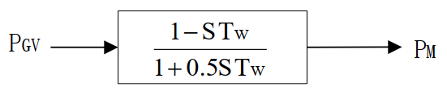

## 基本描述



## 参数列表

### 水轮机模型（TW）

| 参数名 | 单位 | 备注                   |     类型     | 描述 |
| :----- | :--- | :--------------------- | :----------: | :--- |
| TW     | s    | 水锤效应时间常数（秒） | 实数（常量） |      |

## 端口列表

| 端口名 | 数据维数 | 描述 |
| :----- | :------: | :--- |
| Pm0    |   1×1    |      |
| Pgv    |   1×1    |      |
| L2N    |   1×1    |      |
| PM     |   1×1    |      |

## 使用说明

BPA 的 TW 原动机控制框图如下所示。

## 相关元件
