## 源网荷储协同仿真背景

双碳背景下，传统电力系统正在不断向新型电力系统转变，**源-网-荷-储**呈现各侧不同变化趋势，同时又协调发展等特点。其中，`电源侧`仍以传统火电为主体，风光储大基地与分布式能源并驾齐驱，`分布式能源`呈现绿色清洁化：风电/光伏/光热等新能源相结合，常规水电/抽蓄/核电等常规清洁能源协同配合；在能源网络方面呈现`大电网枢纽化`特征：大电网+主动配网+多能微网结合，大量高端装备器件(IGBT、FACTS)提升了网络中电力电子设备占比，增强了电网的灵活可控性；在负荷侧呈现`多元协同弹性化`特征：出现了大量的产销者一体负荷，工业互动负荷、BIPV、电动汽车等需求可调节负荷；在`储能侧`也呈现多元化特征：储电、储氢、储热、储冷等多种能源形式储能，集中式分布式储能等。

目前源-网-荷-储的特征各异，各个方面的转变均会给电力系统带来巨大的影响。分布式电源在电网中的大量接入带来了`随机性和不稳定性`，大电网+智能配网+多能微网使得能源网络`高度灵活`，严重影响配电网的电能质量、安全可靠性、规划和调度运行；大量`需求可调节负荷`的出现使得负荷数据难以预测，特别是中长期的负荷预测，给电力系统的规划设计和稳定发展带来了巨大困难；在越来越复杂的新型电力系统中，储能配置方案和运行优化也越来越困难。由于源-网-荷-储的建设运营发展方向不一致，规划发展不协同，给电力系统的规划设计和稳定发展带来了很大的困难。

## 平台介绍

源网荷储协同仿真平台主要面向区域级、城市级的**新型电力系统**，实现源-网-荷-储的`建模仿真、规划设计、运行优化与综合评估`。源网荷储协同仿真平台基于Web技术、数据中台、云计算等相关技术，由三个子系统组成，分别为Web工作区、数据交换平台和仿真引擎。用户在Web工作区构建源-网-荷-储模型，通过数据交换平台将每个仿真任务都打包为Docker容器，即虚拟仿真引擎（VSE）。源网荷储协同仿真平台部署后，用户`只需一台安装有浏览器的终端`（PC/Mac/平板/手机）即可访问，其友好的用户界面和帮助系统使得用户可以迅速上手。系统软件进行了数据稳定安全设计和全面保护，所有数据均存储在本地，真正做到数据隐私的全面保护，安全可靠。

平台允许用户分类管理新型电力系统的各类项目数据，以图形化的方式灵活搭建源-网-荷-储拓扑，利用数字孪生计算对系统进行分析。`数据管理模块`提供了气象-电价-源-网-荷-储等类型数据的录入，编辑和管理功能，`拓扑编辑模块`集成了常见的搭建源-网-荷-储设备模型，提供功能强大的建模工作台；`负荷预测模块`提供了多种预测方法进行中长期的负荷预测；`时序潮流模块`允许用户对多个潮流断面进行仿真计算，`技术经济分析模块`则根据当前潮流计算结果对当项目方案进行全方面的财务评估。主要应用场景有：

1.	新型电力系统源-网-荷-储建模、潮流计算、负荷预测、规划设计、运行优化和综合评估。

2.	潮流计算：支持超5000节点的区域级、城市级新型电力系统，8760h+的全景动态潮流仿真模拟，分析电力系统中的风险点和各个工况下的应对策略。

3.	负荷预测：支持增长因子、自回归、机器学习、神经网络等预测模型，对新型电力系统的变电站、馈线和用户级负荷进行8760h+中长期的预测。

4.	技术经济分析：利用工程财务模型对技术方案进行全方面的财务评价，计算工程动态投资、内部收益率IRR、净现值NPV和投资回报期等指标，并生成利润、现金流、资产负债表等常见报表。

## 平台仿真使用步骤

首次使用请注册，支持用户用手机号、邮箱等方式注册。

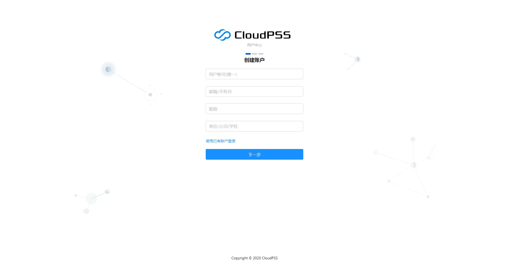

> 1.	注册登录平台，进入源网荷储协同仿真平台
> 2.	建立项目，可从本地或模板导入
> 3.	数据管理模块：录入编辑项目基础参数
> 4.	拓扑编辑模块：搭建拓扑，设置约束条件
> 5.	负荷预测模块：选择录入预测时间段、层级和算法并进行预测
> 6.	时序潮流模块：输入参数并计算潮流断面
> 7.	技术经济分析：录入基础财务参数并进行财务计算评价。

## 建立项目

1. 新建项目组，项目组类似文件夹，参考了PMI中项目 Project与项目集 Program，项目组下可以有多个互相关联的项目。用户新建项目组时可以从已有项目组导入，直接复制该项目组。

在项目组下新建项目，用户可以编辑修改项目名称，在描述里添加编辑修改项目信息。

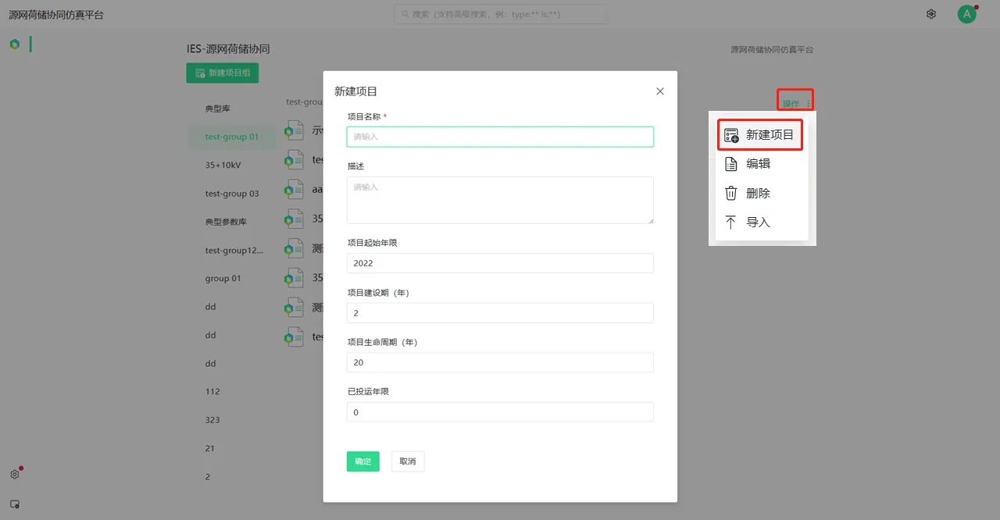

为方便算例移植拷贝，平台支持将算例导出到本地和从本地文件导入功能：点击算例的点号可以将算例导出为本地文件，点击项目组右侧的“操作”或点号可以将本地文件导入到平台。由于算例文件中的多年气象数据较多，导入导出时加载较慢，请耐心等待。

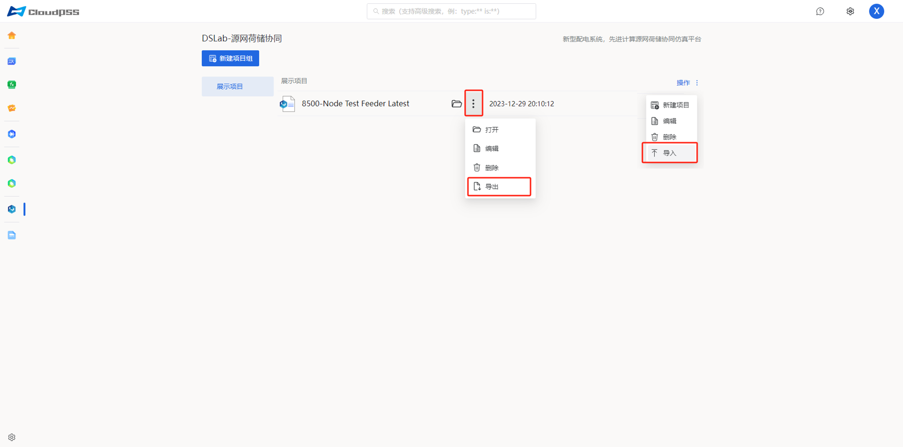

2. 打开已有项目：选中项目点击所在行，或点击“文件夹”按钮打开；通过“更多选型”按钮打开、编辑或删除。
   

## 数据管理模块

**在数据管理模块输入等气象-电价-源-网-荷-储基础参数，参数信息将在平台内自动关联**

### 功能简介

数据管理模块提供了友好的可视化界面，方便用户进行各类数据的录入、管理和浏览。

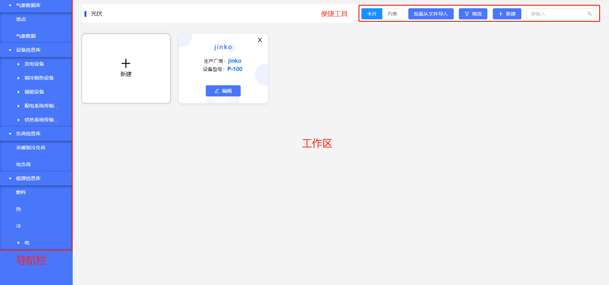

工作区上方的便捷工具主要有：加载实验平台数据、导出模板、导出所有数据、批量从文件导入、批量删除、筛选和搜索。

`数据管理模块`提供了友好的可视化界面，方便用户进行各类数据的录入、编辑和浏览，该模块主要由`气象数据库`、`价格信息库`、`电源信息库`、`电网信息库`、`负荷信息库`和`储能信息库`组成。

### 气象数据

气象数据库内置中国大陆区域近几年的8760小时数据，如`环境温度、太阳辐射强度、风速等气象数据`，主要用于新能源如光伏风电的计算，计算前需载入气象数据。地点模块内置地图插件，在后台服务器联网时可以对地图进行拖曳平移缩放等，支持搜索项目地点所在城市切换地图。

平台支持录入管理多个项目地点，点击“新增定位点”后，通过输入项目GPS经纬度坐标，或打开定位开关后通过地图选点定位等方式选择项目地点，确定定位点后可以保存该地点，定位点支持编辑和删除。所有定位点确认后，点击“载入气象数据”按钮载入各定位点的气象数据。因数据量大，等待一段时间后载入气象数据成功后回自动进入“气象数据”模块展示。

*气象数据库：*

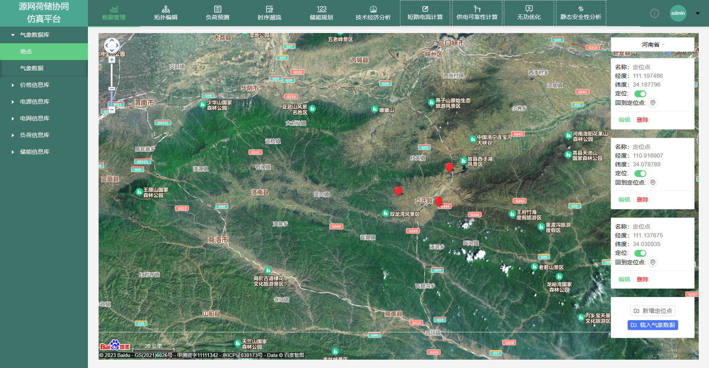

通过“气象数据”模块左上方的工具栏可以气象数据导出为excel文件，并支持`用户上传气象数据`，参考导出文件的格式。右侧的下拉框可以便捷选择日期。打开“编辑”按钮后，气象数据表格为可编辑状态，用户编辑后平台回自动校验用户编辑的数据合法性，数据格式不对时会提示“验证错误，请检查格式!”，关闭“编辑”按钮后，平台会自动更新并提示“更新数据成功”。

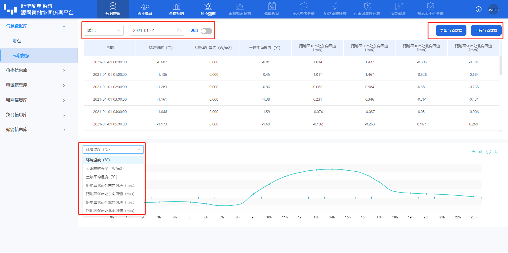

气象数据模块下方为图表展示区，用户选择数据类目查看曲线及保存图片等。

### 价格信息库

用户可在价格信息库中录入管理`上网电价、输配电价和销售电价数据`，用于计算系统经济性。拓扑编辑模块可以选择对应价格模型，用户绑定该能源信息后平台将自动关联并纳入技术经济性的计算中，并在技术经济分析模块对项目方案进行经济性评价。其中，销售电价提供了`分月常数电价、分时电价、阶梯电价和分时阶梯电价`。

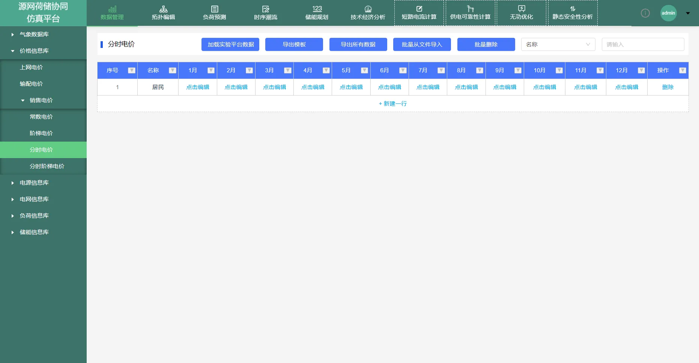

### 电源信息库

电源信息库可以录入管理`光伏、风机、燃气、水电、常规小火电、生物质发电和垃圾电厂等电源信息`，需录入各电源的`基准出力曲线和定位信息（Global ID）`，平台通过定位信息绑定到相应定位点的网架拓扑中。

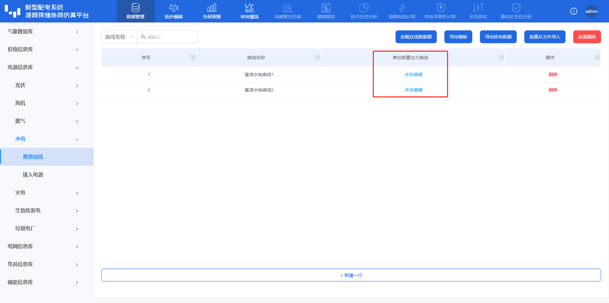

### 电网信息库

电源信息库主要功能有：上传电网网架拓扑图（SVG格式），解析图纸并生成仿真拓扑模型；录入管理传输线、变压器和开关等电网设备信息。

*负荷参数填写：*

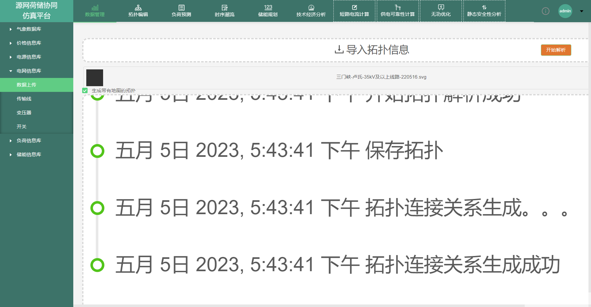

其中，传输线和变压器平台内置了典型库，支持从典型库快速导入数据。

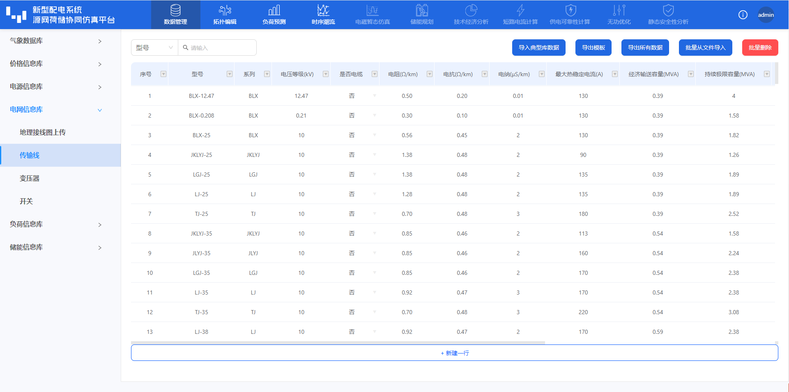

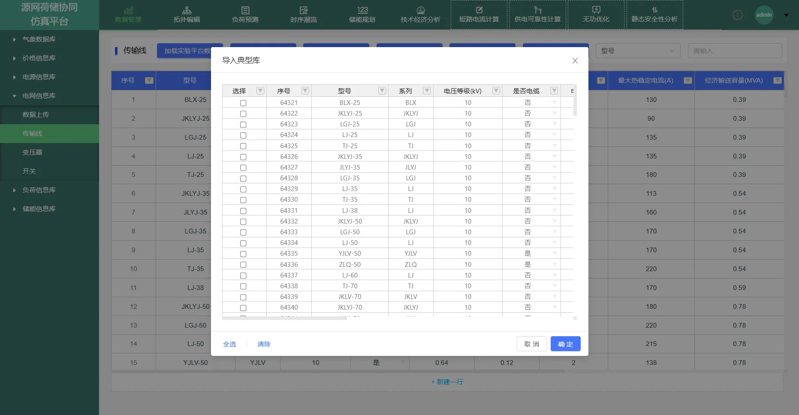

### 负荷信息库

负荷信息库可以录入管理`负荷分类信息和负荷用户信息`。其中，`负荷分类`主要是针对需求可调节负荷，负荷用户信息主要包含`负荷名称、所属线路、所属配变、定位点信息、关联气象数据和负荷曲线`，平台根据定位点信息绑定到相应定位点的负荷。点击负荷曲线列的“编辑”，可以导出和导入负荷曲线文件（excel文件），需按照平台给定的格式（时间和负荷数据格式）上传负荷曲线文件，平台会自动校验文件中数据格式问题。

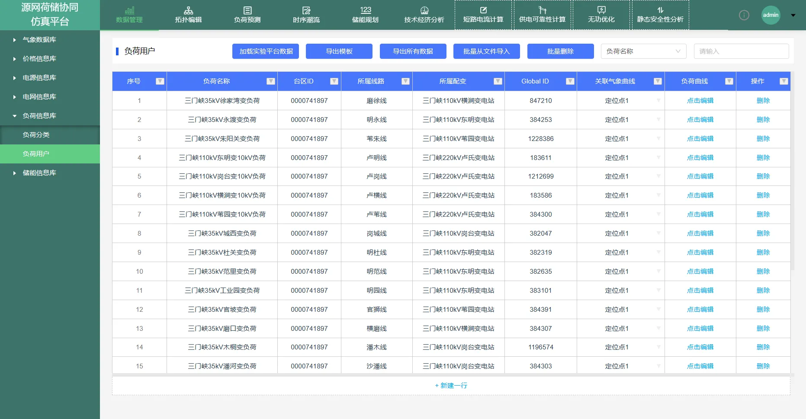

当用户上传的负荷曲线中时间与仿真时间不一致时，平台采用了插值算法计算仿真时间电对应的负荷。用户录入的负荷数据包含时间和负荷数据两列，可兼容常见的时间格式、时间间隔；时间顺序不做要求；各负荷数据的时间长度可不相同。

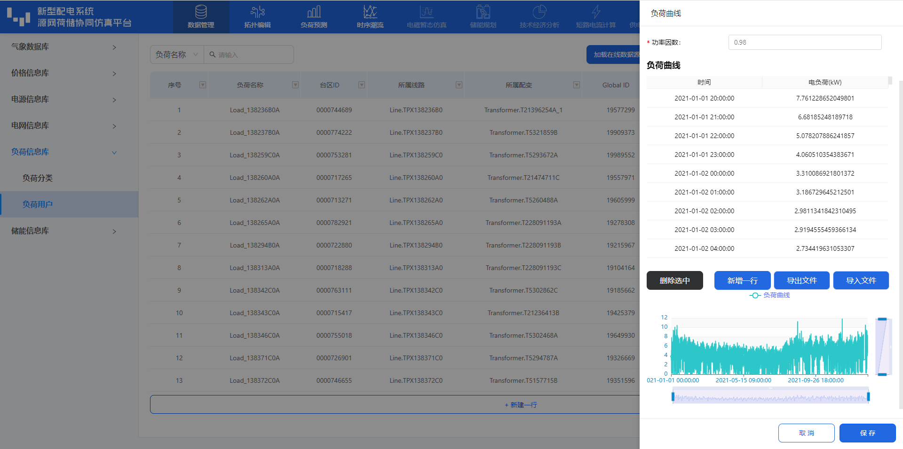

### 储能信息库

储能信息库可以录入管理储能接入点信息、储能参数和运行策略曲线。

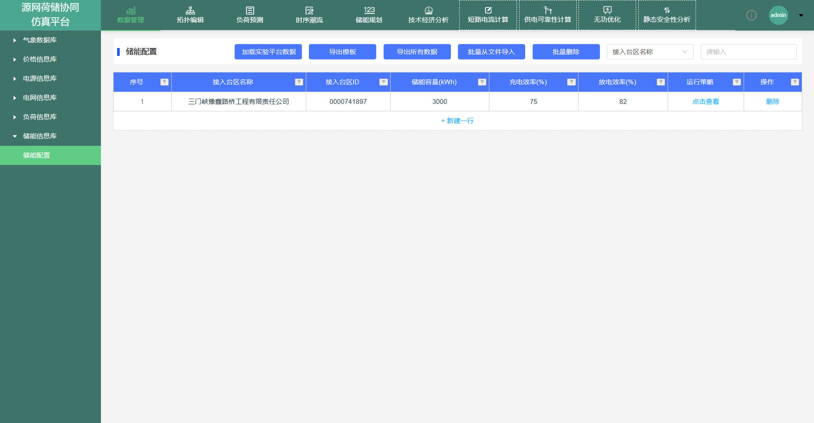

## 拓扑编辑模块

### 工作台简介

`拓扑编辑模块`用于系统拓扑结构的搭建、计算参数设置以及计算结果的展示。用户在此可以根据需要灵活搭建综合能源系统的拓扑结构、图纸和元件格式的调整、选择设备元件（或设备类型待选，此时设备型号和设备容量由规划算法计算）、约束条件（主要是设备容量范围、储能始末蓄电量偏差、柔性负荷范围等）

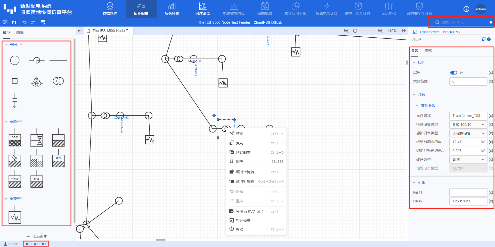
### 功能特性

> 1) **模型**
> 模型标签内放置了仿真拓扑构建中所需要的典型综合能源系统元件，主要包括电源设备、制冷制热设备、储能设备、电力传输设备、热力传输设备和负荷。
为更好地管理算例拓扑，模型新增工具：超链接、分割线和Markdown文本。超链接于指向平台系统内部的链接，如算例和元件链接等，一般应使用相对路径。如：ieslab/ies/diagram?simu_id=XXX，点击该超链接即可跳转到相应的算例。Markdown文本内容的编写支持MarkDown语法，Markdown是一种轻量级标记语言，支持文字格式调整，图片、图表、数学公式等的输入。在进行参数编写时，输出结果将实时渲染至工作台的显示框中。
> 2) **拓扑编辑窗口**
> 拓扑编辑窗口是进行仿真拓扑构建的编辑区域。用户可将模型库中的元件拖拽至拓扑编辑窗口内，进行元件连线及配置，并组织成完整的仿真拓扑。
鼠标右键可以选择剪切、复制、粘贴、创建副本、删除、全选、撤销、重做、顺时针旋转、逆时针旋转、导出为SVG图片、更新元件、元件表操作，或者通过快捷键实现上述操作。
> 为方便搭建算例，平台支持跨网页复制。可以将单个或多个元件复制到不同的算例中（即，不同的网页），实现单个或多个元件构成的复杂参数和拓扑的复制使用。
> 3) **快捷工具**：
> 拓扑编辑模块左上角的快捷工具主要有保存、撤销、恢复和元件表。其中，元件表提供了当前项目中，拓扑编辑窗口内所有的元件的信息列表，包括元件名称、参数以及引脚信息。元件表可用于批量化管理元件信息，例如复制粘贴元件参数、统一修改元件参数等操作。
> 4) **校验信息**
> 平台支持实时对算例拓扑的连接关系等进行合法性校验，并在校验信息处提供错误、警告和信息，点击信息平台会自动跳转到该错误源。
> 5) **图纸**
> 当仿真拓扑图过大时，可以使用图纸功能来对拓扑图进行分区划分及管理，不同的图纸间可通过引脚标号进行连接。一个项目内不同图纸上的拓扑，本质上为同一级别。
> 6) **参数栏**
> 参数栏用于对元件特性进行配置。一个典型的参数栏由参数和引脚两部分组成，参数部分可有多个分组，每个分组下可有多个参数。
> 7) **格式栏**
> 格式栏用于对元件或页面进行格式配置。支持配置拓扑编辑窗口的网格、视图、尺寸等显示特性，支持配置元件的排列、样式、字体等显示特性。
> 8) **搜索**
> 搜索框支持对元件、参数、文字、图纸、引脚名称等内容的智能搜索。

## 负荷预测

### 模块简介

随着新型电力系统的稳定建设和发展，`负荷侧`发生了巨大的变化，呈现多元协同弹性化特征：出现了大量的产销者一体负荷，工业互动负荷、BIPV、电动汽车等需求可调节负荷。而大量需求可调节负荷的出现使得`负荷数据难以预测`，针对新型电力系统的负荷预测研究较少，目前大多数研究是针对电力负荷的短时预测，而`中长期预测`的研究较少。中长期的负荷预测对于电力系统规划和电力市场交易至关重要，一般中长期负荷预测主要基于负荷指标等经验方法。模块提供了`多层级的多种算法`，进行中长期负荷预测，给电力系统的运行优化和规划设计提供数据支撑和参考。。

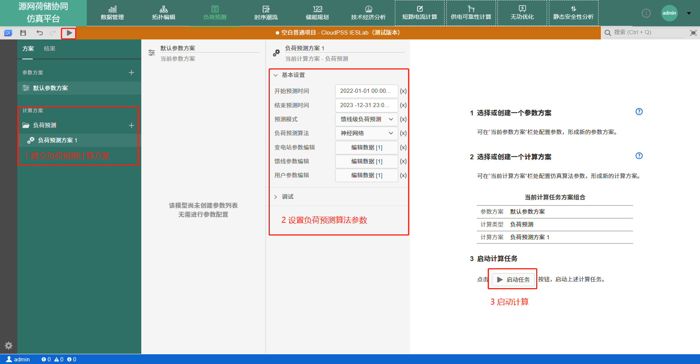

### 功能特性

预测层级为**变电站、馈线和用户级**；选择预测层级后，计算结果仅对当前选择的层级进行预测并展示。一般而言，变电站级为35kV及以上的变电站负荷，其负荷曲线变化较为平滑，季节变化规律性较为明显，长期负荷数据呈周期性变化；用户级负荷曲线变化大，规律性很差，波动性随机性强，数据质量差，很难建立其预测模型，预测难度很高。馈线级负荷预测的数据质量介于用户级和变电站级之间，预测难度居中。

预测算法包括：**增长因子、神经网络、Prophet模型和ARIMA模型**

**增长因子**：用户输入的增长率进行负荷预测，适合中长期负荷预测。当用户选择增长因子法和预测层级后，需要录入当前层级需预测的负荷的增长因子。

**神经网络**：利用多层感知机MLP神经网络通过训练，几乎可以模拟各类负荷模型并进行预测，其预测模型训练时间速度较快。

**Prophet模型**：基于时间序列分解和机器学习拟合的Prophet模型对数据质量要求不高，几乎全自动地预测时间序列未来的走势，其预测模型训练时间受数据质量影响，数据质量高时，模型很快迭代收敛，当负荷数据质量差时，模型可能无法收敛。

**ARIMA模型**：整合移动平均自回归ARIMA模型是时序数据预测的经典方法之一，在数据平滑质量高时预测效果很好。其预测模型训练时间受数据质量影响极大，数据质量高时，模型很快迭代收敛，当负荷数据质量差时，需不断调整数据平滑度等以提高数据质量，模型训练耗时很长甚至无法收敛。

当用户选择神经网络、Prophet模型或ARIMA模型时，若当前负荷的数据质量差，无法满足模型最低精度要求时，平台将自动为当前负荷选择对应预测层级的增长因子法，并默认增长因子。
负荷预测完成后，平台对预测结果进行多级可视化，直观高效。

## 时序潮流

### 模块简介

新型电力系统的源-网-荷-储的特征各异，各个方面的转变均会给电力系统带来巨大的影响。电力系统特别是配电网中存在大量随机性和不稳定性，且大电网+智能配网+多能微网使得能源网络高度灵活，严重影响配电网的电能质量、安全可靠性和调度运行。平台潮流计算模块提供多种算法，支撑大电网8760h+的全景动态潮流仿真模拟，分析电力系统中的风险点和各个工况下的应对策略。

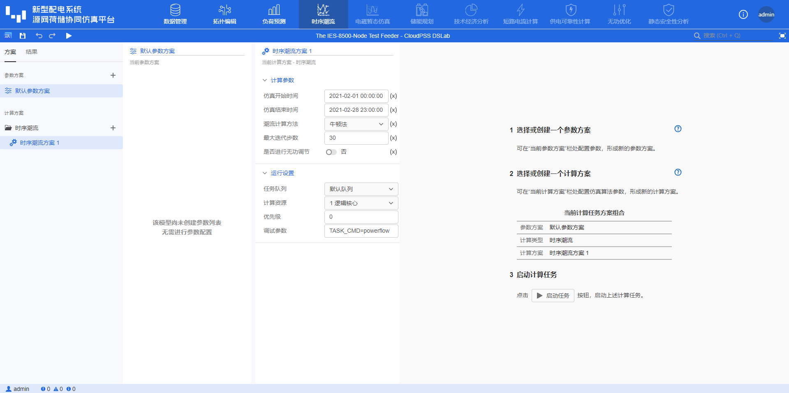

### 功能特性

对于潮流计算，平台提供**牛顿法、隐Zbus法和同伦法**三种算法供选择

潮流计算完成后，平台提供可视化页面对计算结果进行展示。主要分为结`果统计概览和潮流断面结果`两部分组成。

结果统计概览包含`仿真计算报错信息和计算结果统计`指标分析。当仿真出现不收敛等错误情况时，报错信息将会给出相应的提示；

结果统计概览会将仿真结果进行分析，统计各个时间段的`节点电压、节点越限电压、主配变负载情况、越限主配变、线路潮流、越限线路和大馈线线路表`等。并对这些计算指标进行多级展示，直观高效。

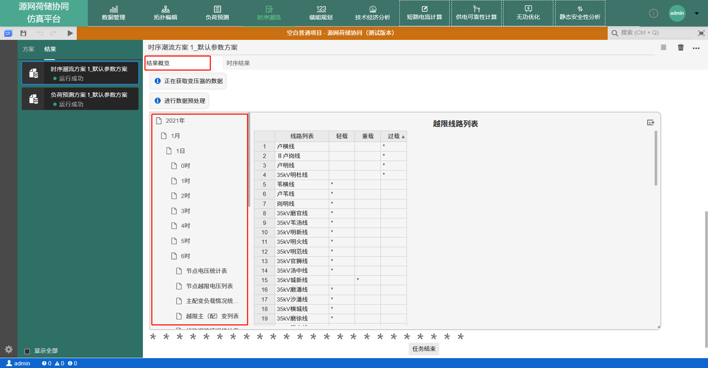

潮流断面结果页面支持用户选择元件并查看相应的结果数据曲线。数据结果图形支持缩放、平移、重命名坐标轴名称、重命名标题名称、数据下载、图像下载等操作。

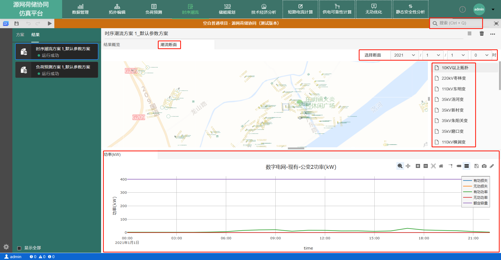

## 技术经济分析模块

用户设定基础财务参数后，平台算法会根据财务模型和工程经济学等相关模型自动计算评价指标，并显示计算得到的评价指标，平台支持将结果导出。

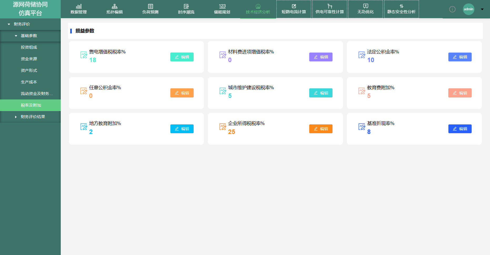

技术经济评价基于工程经济学，通过财务模型对项目进行综合评价，主要有以下3个方面：
综合能源项目的**投资估算**：固定资产投资估算和流动资金的估算；
综合能源项目的**收益估算**：工程项目成本费用估算和税金估算；
综合能源项目的**投资估算**：主要包含`静态指标和动态指标`。静态指标有静态投资回收期、简单投资收益率、静态计算费用等。动态指标有净现值、净年值、费用现值、费用年值、将来值、内部收益率、外部收益率、净现值指数等。

财务综合评价还包括三大基本报表（**利润表，现金流量表，资产负债表**）和辅助报表，供项目投资决策时参考。若用户已有财务模型，平台也提供了**SDK**，可以根据SDK将优化方案结果数据（如设备型号参数、成本、配置、典型日运行曲线、统计数据等）导出后，利用用户的财务模型进行评价。

技术经济评价结果支持导出为excel文件

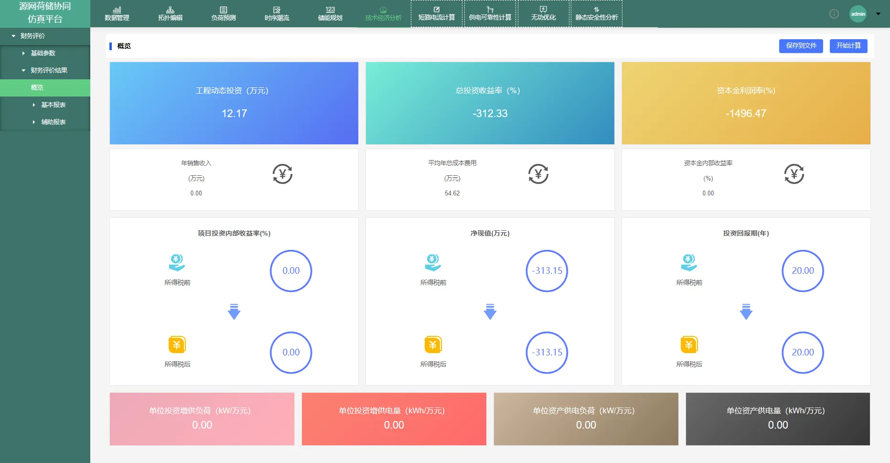

