:::question
**目前分网功能仅在私有服务器上可用，[公网](https://cloudpss.net/)暂未开放使用。**
:::

:::info
本例以通过对**IEEE39节点标准测试系统算例**为例，帮助用户快速入门电磁暂态仿真计算方案的配置。
:::
## 一、电磁暂态仿真方案配置介绍
首先，在 `CloudPSS Simstudio 个人中心`打开`IEEE-39节点标准测试系统算例`，选择`运行`标签页新建电磁暂态仿真方案进行参数配置。

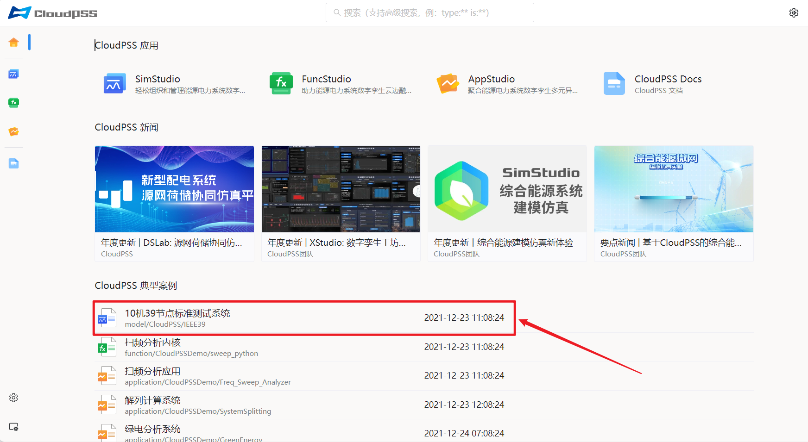

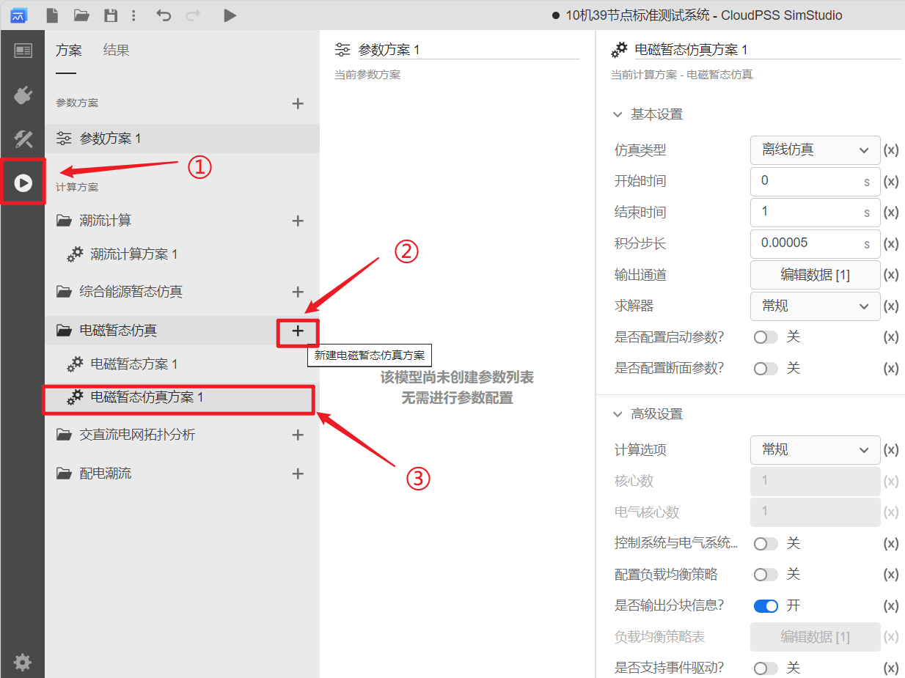

在高级设置中，CloudPSS提供了4种可选计算选项，包括`常规`、`分网并行`、`CPU Turbo`与`CPU Super Turbo`。

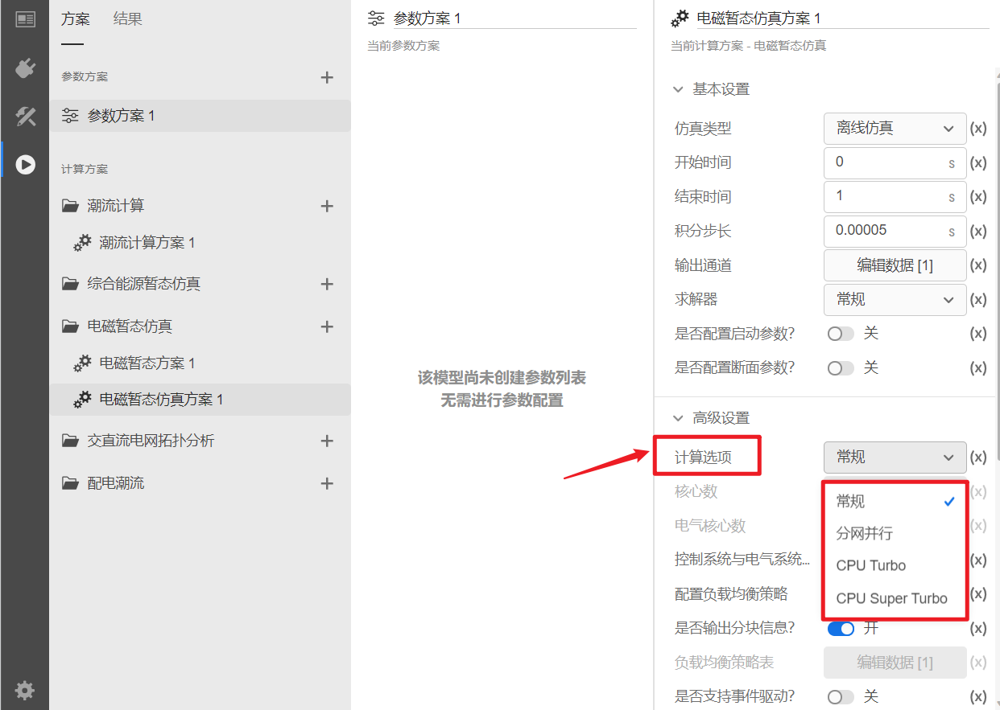

:::tip

**常规：利用单核CPU完成全部计算**

**分网并行：每个电网分区在一个CPU核心中完成计算，利用多核CPU加速仿真**

**CPU Turbo：多核间执行自动负载均衡策略**

**CPU Super Turbo：在CPU Turbo的基础上优化计算流程，进一步提升计算效率**

:::

系统默认配置为`常规`计算方案，即仅利用单核CPU完成全部计算。针对大规模算例，可选择`分网并行`、`CPU Turbo`与`CPU Super Turbo`进行仿真加速。

## 二、分网并行计算方案配置

首先，点击`运行设置`中`计算资源配置`选项，根据仿真效率需求选择需要使用的CPU核数。

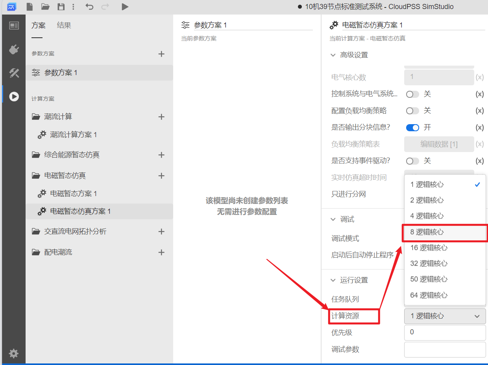

然后，在`高级设置`中选择`分网并行`，并填写使用的核心数，**核心数需要小于等于计算资源中配置的值**。

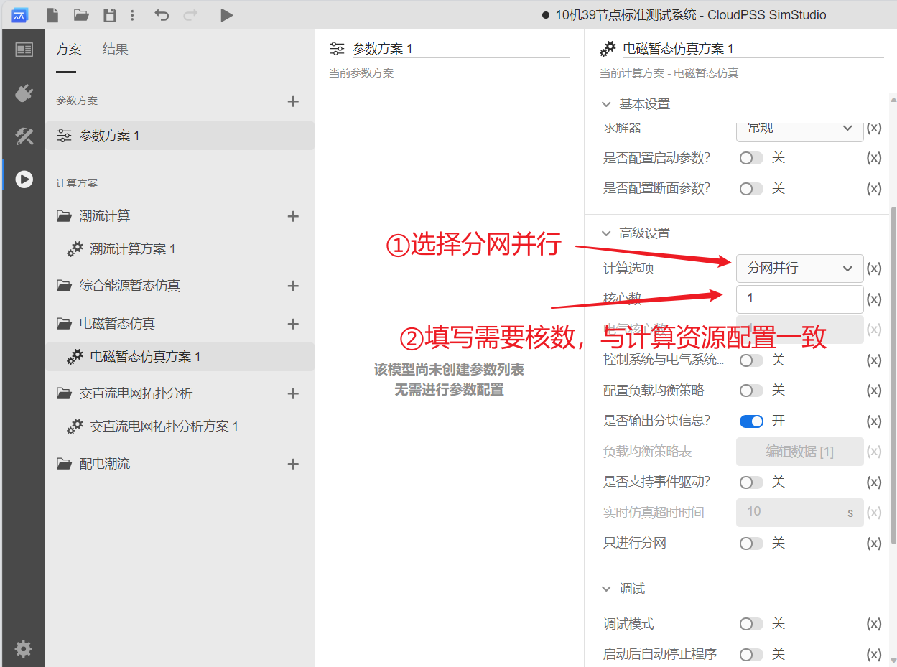

进一步，新建交直流电网拓扑分析方案，并在`基本设置`中选择需要进行分网的电磁暂态仿真计算方案

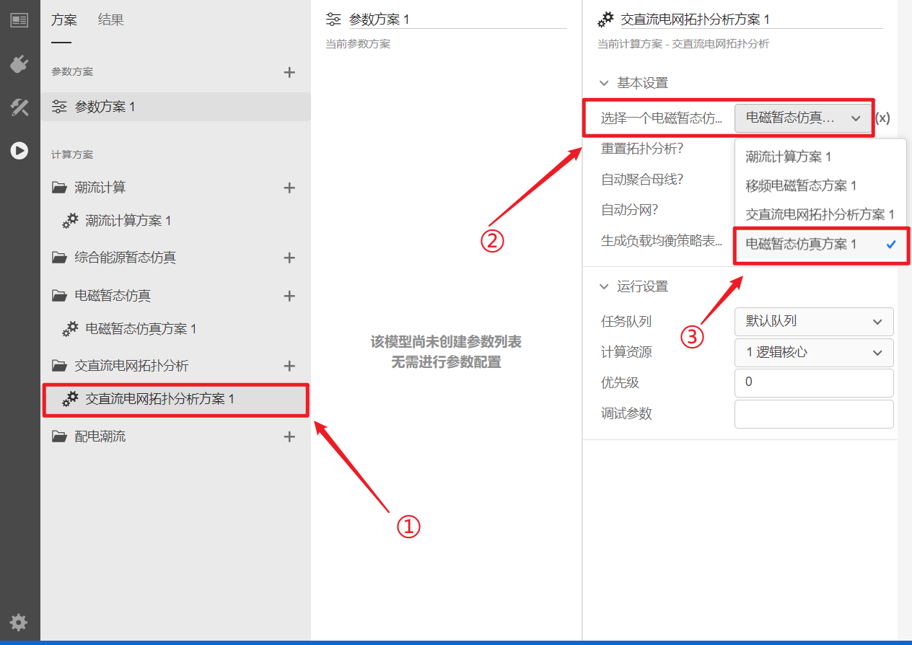

在交直流电网拓扑分析方案中，CloudPSS提供了4种可选设置，包括`重置拓扑分析`、`自动聚合母线`、`自动分网`与`生成负载均衡策略表`。

:::tip

**重置拓扑分析**：开启此选项，程序将重置当前工程的母线聚合信息、分网信息和负载均衡信息。其中，拓扑图中现有母线聚合信息将丢失;将取消全部传输线的分网设置;分区染色信息将被去除。

**自动聚合母线**：开启此选项，程序将对大规模电网中的悬空节点进行自动节点收缩聚合，缩减模型规模.

**自动分网**：开启此选项，程序将根据线路参数和所选计算方案的仿真步长，自动配置 Bergeron 模型分网参数，对大规模电网进行分网分区。

**生成负载均衡策略表**：开启此选项，程序将自动获取分网分区信息，并生成“分区-核心”负载均衡策略表

:::

### 1、自动分网

首先，选择`自动分网`并点击启动任务开始分网，在结果标签页点击修改项目文件，即可将分网结果应用到电磁暂态仿真方案中。

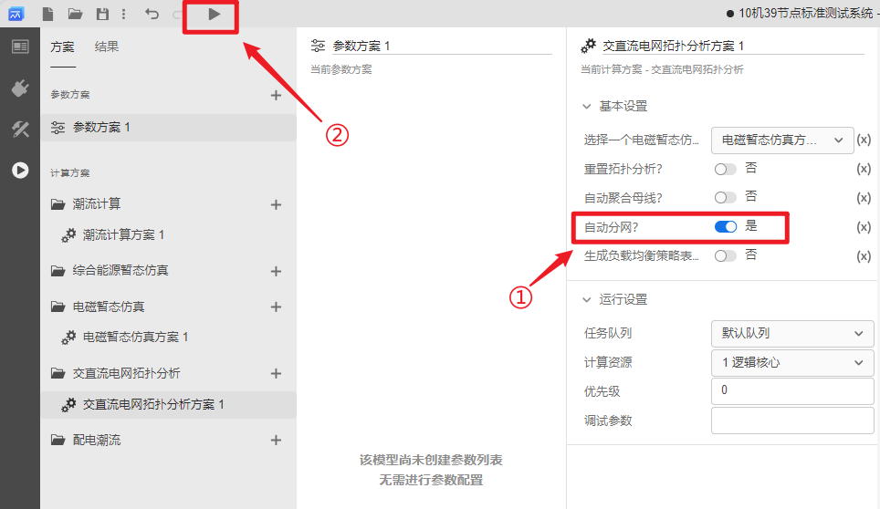

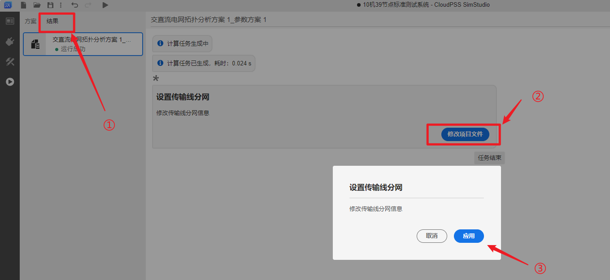

此时，点击`启动`电磁暂态仿真即可实现并行仿真加速。**一般算例仿真规模越大，分网并行加速效果越好**。
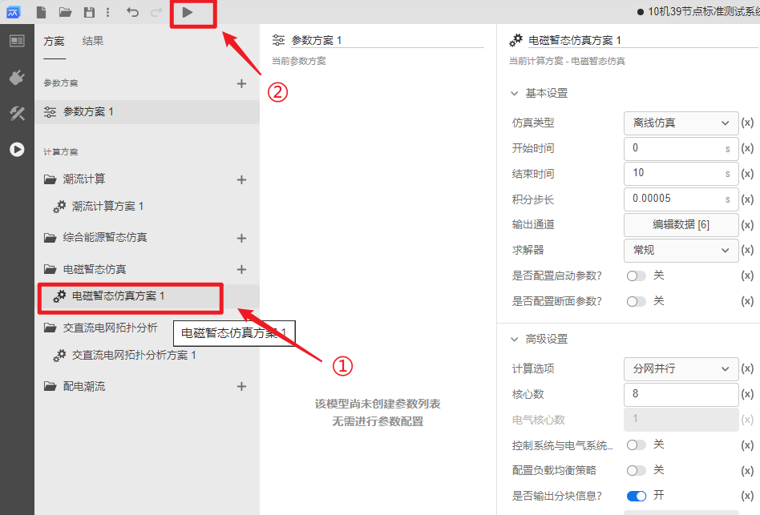

:::info
**对于IEEE39节点标准测试算例，由于CPU单核性能已经足够，因此采用并行仿真的加速比仅为1.5左右。**
:::

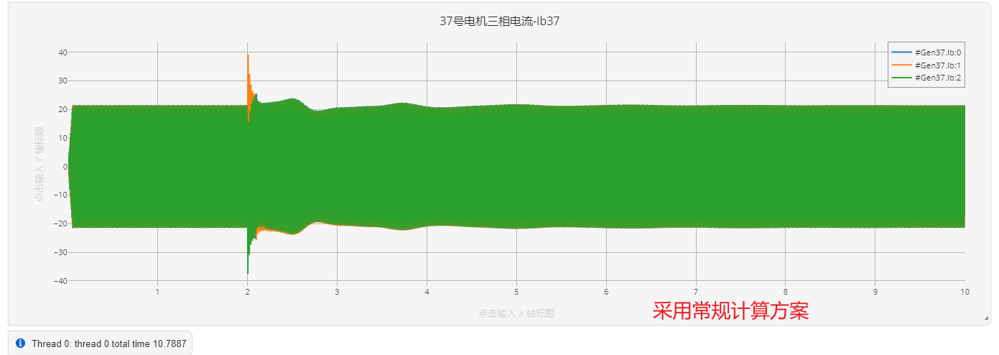

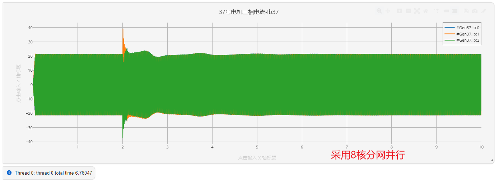

:::info
**针对包含十一万电气与控制节点的大规模交直流电网算例，分网后1s仿真的物理过程从884s提升到了30s左右，加速比约为29。**
:::

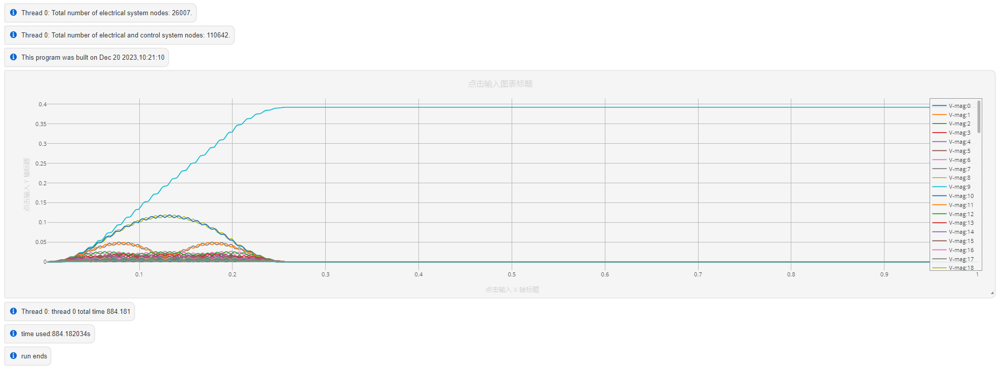

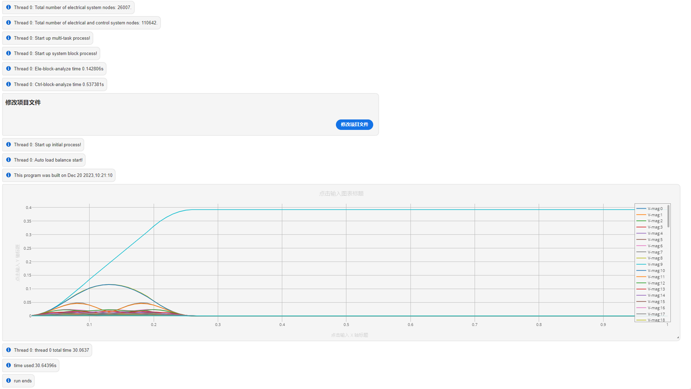

### 2、生成负载均衡策略表

首先，选择`生成负载均衡策略表`并点击`启动任务`开始分网，在`结果`标签页可以查看`分网结果`、`电气结果统计`、`控制结果统计`以及`CPU分区表`。

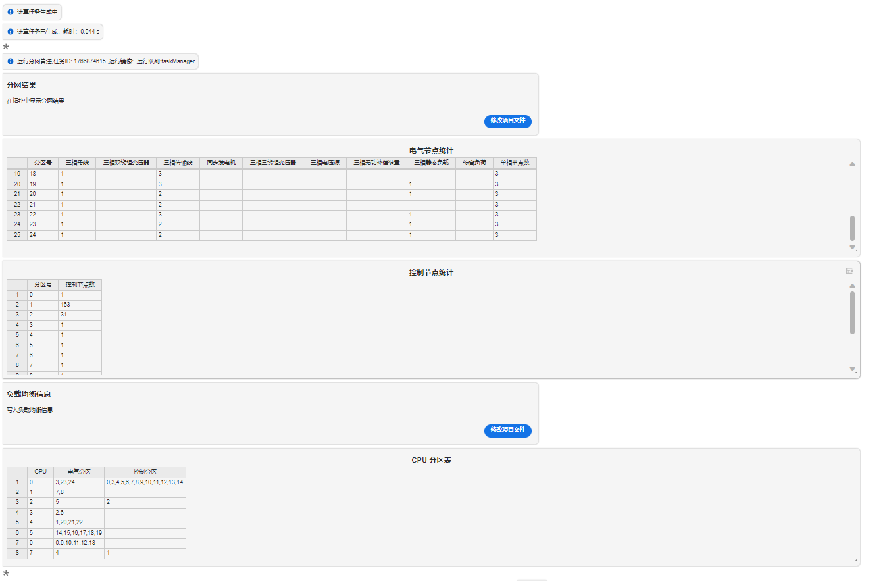

在`分网结果`界面点击修改项目文件，即可将分网结果应用到电磁暂态仿真方案中，并在拓扑中显示分网结果。

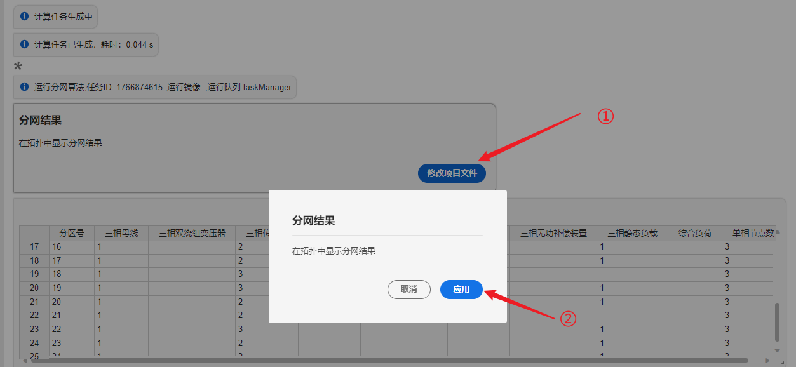

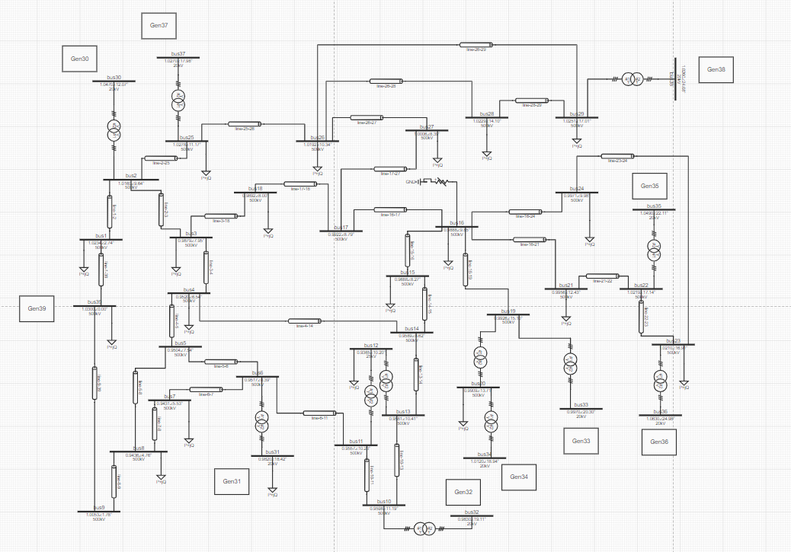

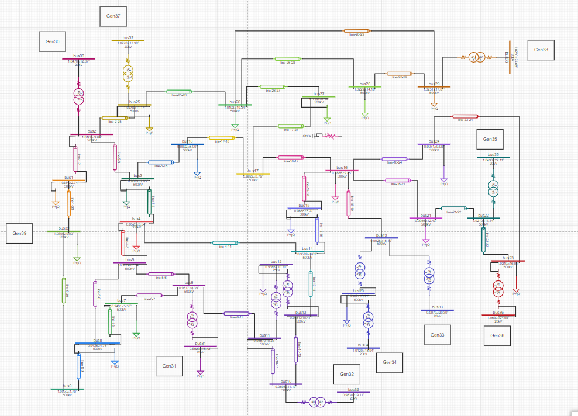

在`结果`标签页的`负载均衡界面`点击修改项目文件，即可将负载均衡信息到电磁暂态仿真方案中。此时，点击`启动`电磁暂态仿真即可实现负载均衡仿真加速。

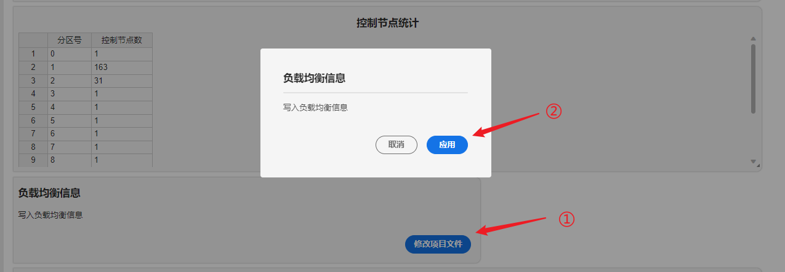

## 三、CPU Turbo与CPU Super Turbo计算方案配置

首先，点击`运行设置`中`计算资源配置`选项，根据仿真效率需求选择需要使用的CPU核数。

然后，在`高级设置`中选择`CPU Turbo`或`CPU Super Turbo`，并填写使用的核心数，**核心数需要小于等于计算资源中配置的值**。此时，点击`启动`电磁暂态仿真即可实现CPU Turbo仿真加速。
:::info
**对于IEEE39节点标准测试算例，由于CPU单核性能已经足够，因此采用并行仿真的加速比仅为1.5左右。**
:::

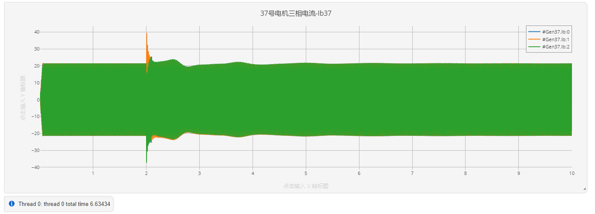

:::info
**针对包含十一万电气与控制节点的大规模交直流电网算例，采用CPU Turbo加速后1s仿真的物理过程从884s提升到了22s左右，加速比约为40。**
:::

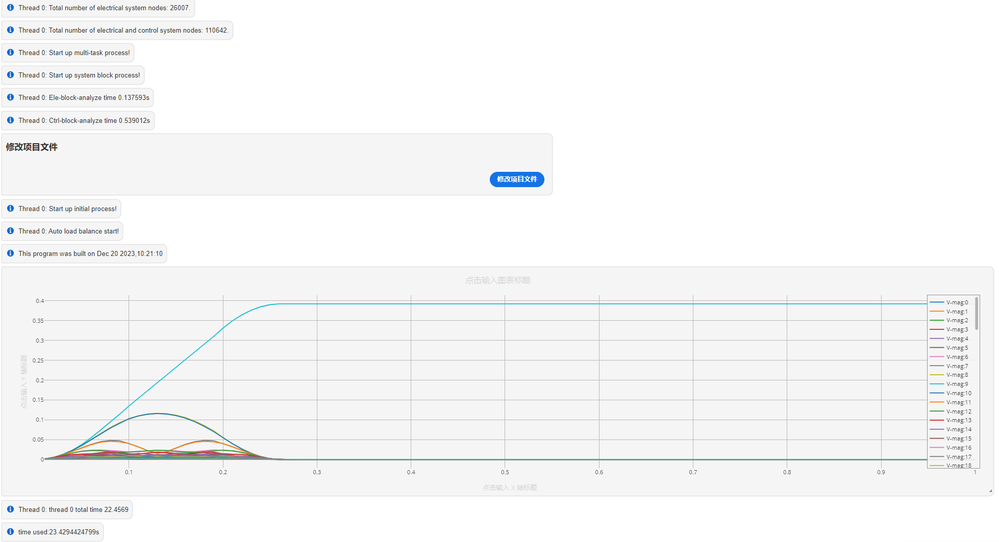

