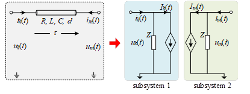

**传输线解耦法**是最经典的接口解耦方法之一。在电磁暂态仿真中，如果电气信号在传输线中的传播延时τ大于一个仿真步长ΔT，则传输线两边的子网可以被划分为相对独立的子系统。传输线的等效方法如图所示，传输线的每一端口都被等效为阻抗和受控电流源并联的形式。

上图中，L和C分别为传输线单位长度的电感及电容，R为传输线总电阻，d为传输线总长度。传输线的传播延时τ及等效波阻抗Z为：

$$
\begin{aligned}
& \tau=d \sqrt{L C} \\
& Z=\sqrt{L C}+\frac{R}{4}
\end{aligned}
$$ 

在t时刻两端口处受控源的表达式Ik(t)和Im(t)分别为：

$$
\begin{aligned}
& I_k(t)=-\frac{1+h}{2}\left(\frac{u_m\left(t_1\right)}{Z}+h i_m\left(t_1\right)\right)-\frac{1-h}{2}\left(\frac{u_k\left(t_1\right)}{Z}+h i_k\left(t_1\right)\right) \\
& I_m(t)=-\frac{1+h}{2}\left(\frac{u_k\left(t_1\right)}{Z}+h i_k\left(t_1\right)\right)-\frac{1-h}{2}\left(\frac{u_m\left(t_1\right)}{Z}+h i_m\left(t_1\right)\right)
\end{aligned}
$$

此时：

$$
\begin{aligned}
&t_1=t-\tau\\
\end{aligned}
$$

$$
\begin{aligned}
&h=\left(\sqrt{\frac{L}{C}-\frac{R}{4}}\right) /\left(\sqrt{\frac{L}{C}+\frac{R}{4}}\right)\\
\end{aligned}
$$

式中：uk(t1)和um(t1)分别为t1时刻端口k和m的端电压，ik(t1)和im(t1)分别为t1时刻端口k和m的端电流。从表达式Ik(t)和Im(t)可以看出，受控电流源在t时刻的值与t1时刻的端电压和端电流有关。该特性是实现系统分网的关键，即传输线两端的子系统可以独立地进行计算，并将本时步得到的端电压、端电流传递给对侧端口，用于后续时刻的受控源的计算。

