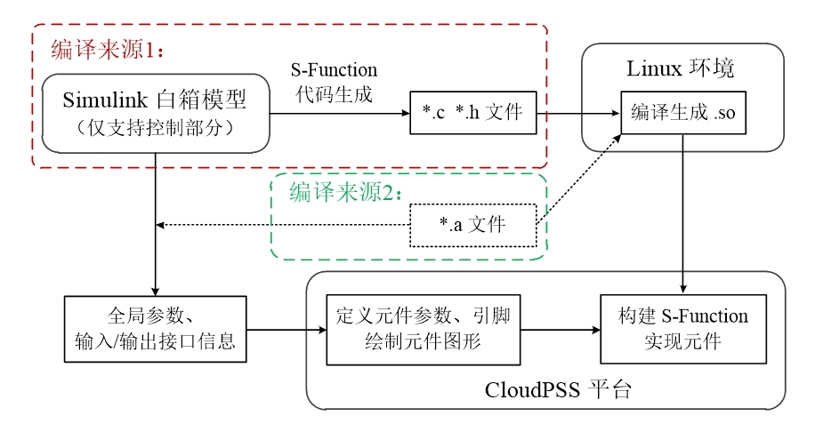

 
::: info
CloudPSS SimStudio 支持将封装的二进制模型导入平台，构建 S-Function 元件。
:::

## 为什么使用 S-Function 实现  

- 控制模型构建方便、高效，可降低模型搭建和参数校验的时间成本。  
  
- 控制策略与真实控制器的保持高度一致，仿真结果更接近实际情况。  
  
- 控制器开发者不需要公开具体的控制策略和核心算法，具备保密性。

## 适用的二进制模型  

Linux 64 位系统环境下编译生成的 `.so` 文件。  

### 编译来源：  

1. MATLAB/Simulink 编译生成S-Function时自动生成的代码文件。  

2. 用户自定义函数和接口的二进制文件。  

## S-Function 实现的整体流程

用户可将 Simulink 白箱模型封装成 S-Function 子系统，利用 MATLAB 的自动代码生成功能，得到 `.c` 和 `.h` 文件，在 Linux 环境中编译生成 `.so` 文件；也可以提供包含自定义函数和接口的二进制文件，在Linux 环境中再编译，生成 `.so` 文件。  

用户需要获取 S-Function 子系统或自定义二进制文件的`全局参数`、`输入/输出接口信息`，并根据信息构建CloudPSS的前台元件，即定义元件的`参数`、`引脚`和`图形`。  

导入 `.so` 文件，与前台元件关联后，即完成 S-Function 元件的构建。

## 具体步骤

若编译来源是 **MATLAB/Simulink 白箱模型**，从[步骤1](#步骤1)开始；若编译来源是**用户自定义函数和接口的二进制文件**，跳过步骤1，从[步骤2](#步骤2)开始。

### 步骤1：将 Simulink 模型封装为 S-Function 并自动生成代码

#### a. 模型设置为模型设置为固定步长，解算器设置为discrete，确保模型在当前设置下能正常运行。

### 步骤2：在 Linux 环境编译生成 .so 文件

