 
::: info
CloudPSS SimStudio 支持将封装的二进制模型导入平台，构建 S-Function 元件。
:::

## 为什么使用 S-Function 实现  

- 控制模型构建方便、高效，可降低模型搭建和参数校验的时间成本。  
  
- 控制策略与真实控制器的保持高度一致，仿真结果更接近实际情况。  
  
- 控制器开发者不需要公开具体的控制策略和核心算法，具备保密性。


## 适用的二进制模型  

Linux 64 位系统环境下编译生成的 `.so` 文件。  

### 编译来源：  

1. MATLAB/Simulink 编译生成 S-Function 时自动生成的代码文件。  

2. 用户自定义函数和接口的代码文件。  

## S-Function 实现的整体流程

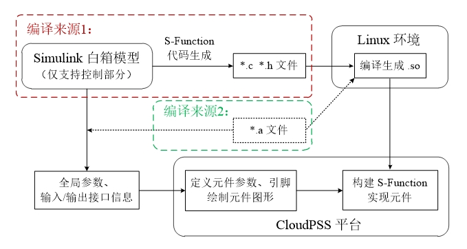

用户可将 Simulink 白箱模型封装成 S-Function 子系统，利用 MATLAB 的自动代码生成功能，得到 `.c` 和 `.h` 文件，在 Linux 环境中编译生成 `.so` 文件；也可以提供包含自定义函数和接口的二进制文件，在Linux 环境中再编译，生成 `.so` 文件。  

用户需要获取 S-Function 子系统或自定义代码文件的`全局参数`、`输入/输出接口信息`，并根据信息构建 CloudPSS 的前台元件，即定义元件的`参数`、`引脚`和`图形`。  

导入 `.so` 文件，与前台元件关联后，即完成 S-Function 元件的构建。

## 具体步骤

若编译来源是 **MATLAB/Simulink 自动生成代码**，从 [步骤 1](#步骤1) 开始；若编译来源是**用户自定义函数和接口代码**，从 [步骤 2-b](#步骤2-b) 开始。

### 步骤 1<span id = "步骤1"></span>：将 Simulink 模型封装为 S-Function 并自动生成代码

#### a. 解算器设置

模型设置为固定步长，解算器设置为 `discrete`，确保模型在当前设置下能正常运行。  

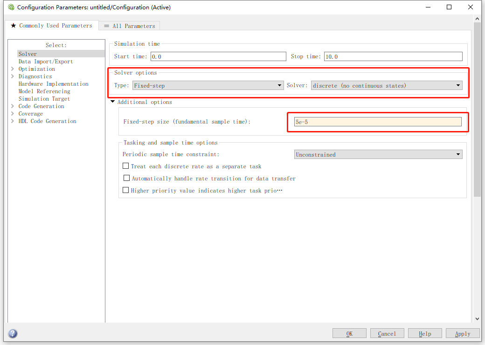

CloudPSS 中的系统均为离散系统，因此建议 S-Function 也使用离散解算器。
:::warning
**若 S-Function 子系统中存在难以离散化的连续状态，可选用连续积分解算器，目前支持的有 ode1、ode2、ode3、ode4、ode5 和 ode8**，不同的积分方式会影响仿真结果准确度和仿真计算时间。
:::

#### b. 子系统封装

将控制模型封装为一个子系统。子系统中可以引用全局参数，若子系统的顶层有参数封装，并且希望这些参数在生成 S-Function 后可调，请将这些参数也通过全局参数定义，否则将被视为固定值而不可调。  

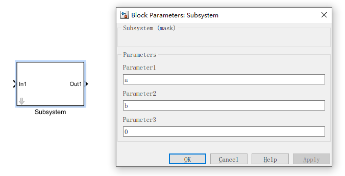  

例如上图中，`Parameter1` 与 `Parameter2` 分别用全局参数 `a` 和 `b` 定义，则在生成 S-Function 后，这两个参数仍可在子系统顶层设置，而 `Parameter3` 为固定值 `0`，在生成 S-Function 时将以固定值写入。
:::warning
S-Function 参数必须以字母开头（不能是数字或下划线），目前仅支持 **double** 型，若是一个矩阵，在 CloudPSS 中对应表格型参数。
:::

#### c. 生成 S-Function  

右键子系统，依次选择 `C/C++ Code`、`Generate S-Function` 选项。

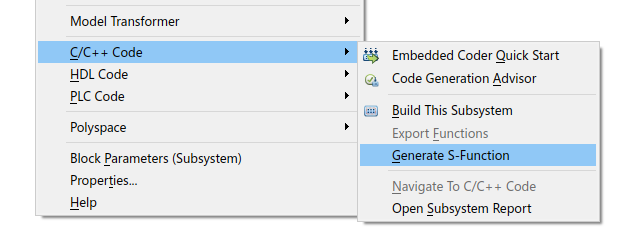  

#### d. 设置 S-Function 参数

勾选列出的全局参数中需要可调的，未勾选的参数将以固定值写入。

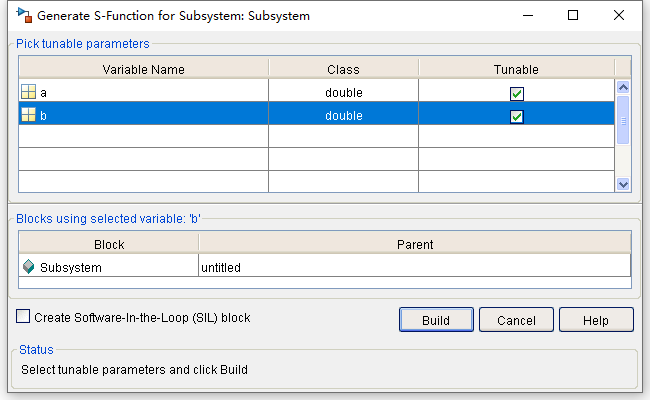  

#### e. S-Function 自动代码生成

自动代码生成，`sfcn_rtw` 文件夹中包含 `.c` 与 `.h` 文件。

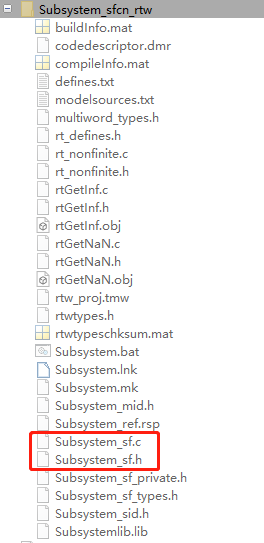 

:::tip
若提示无编译器，则下载并安装一个 **MingGW64** 编译器，流程可参考：  ->https://zhuanlan.zhihu.com/p/359962279?ivk_sa=1024320u<-
:::

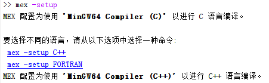 

### 步骤 2：在 Linux 环境编译生成 .so 文件

#### a. 对于编译来源 1：MATLAB/Simulink 自动生成的代码文件

在 [步骤 1](#步骤1) 生成的 `sfcn_rtw` 文件夹中找到以 S-Function 名称命名的 `.c` 文件，在 #include 之后添加如下接口定义并保存：
```c
#define ssSetInputPortVectorDimension(S, port, d)   \
  (ssSetInputPortWidth(S, port, d))
#define ssSetOutputPortVectorDimension(S, port, d)   \
  (ssSetOutputPortWidth(S, port, d))
```
:::warning
此函数定义是为识别 S-Function 的输入输出引脚，若每个输入输出引脚维数均为 1，则不用添加；若有引脚维数大于 1，则必须添加。
:::

将 `sfcn_rtw` 文件夹复制到 Linux 环境，在其路径下输入以下编译命令：

```
gcc -Wall -DRT -DRT_MALLOC -fPIC -lm -shared *.c -o xxxx.so
```  
:::warning
`xxxx` 为用户自定义的 `.so` 文件名，与内部函数名（S-Function 名）无关。Linux 环境必须是 64 位系统。
:::

如报错缺少 `.h` 头文件，需要手动添加。不同版本的 MATLAB 所调用的头文件不同，获取路径可参考：

```
安装路径\MATLAB\Rxxxxx\simulink\include
安装路径\MATLAB\Rxxxxx\extern\include
安装路径\MATLAB\Rxxxxx\rtw\c\src
```  
:::tip
`xxxxx` 为 MATLAB 版本。
:::  
  
#### b. 对于编译来源 2：用户自定义函数和接口的代码文件<span id = "步骤2-b"></span>

将代码文件 `.cpp` 复制到 Linux 环境，使用以下指令编译：  

```
gcc -Wall -fPIC -s -lm -shared -DRT xx1.cpp xx2.cpp -o xx.so
```

对于已经编译为 `.a` 的文件，使用以下指令编译：  

```
gcc -Wall -fPIC -s -lm -shared xx.a -o xx.so -u <entry_name>
```
:::tip
`<entry_name>`是入口函数名。
:::

### 步骤 3：根据全局参数和输入输出接口信息构建 S-Function 实现元件  

#### a. 参数引脚列表定义  

打开空白 S-Function 模型模板，在`接口标签页`参数列表添加参数，引脚列表添加引脚，并绘制元件图形。参数键名必须与 S-Function 引用的全局参数名一致；引脚键名不作要求，但顺序必须分别与 S-Function 的输入输出引脚一致。  

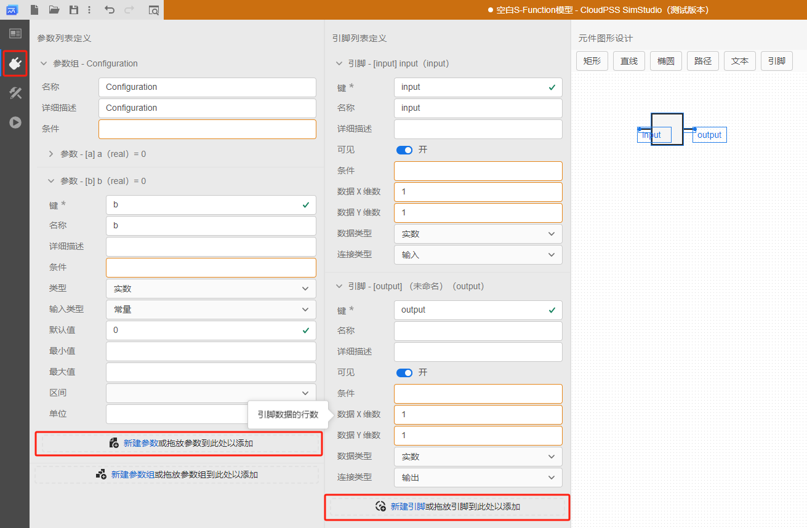   

#### b. 导入 .so 文件  

在`实现标签页`导入步骤2生成的 `.so` 文件，并填写入口函数名。  

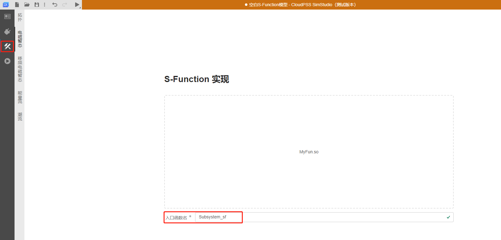   

:::warning
入口函数名是 S-Function 名称，不是 `.so` 的文件名。
:::

#### c. 保存项目，元件添加到模型库中  

## 开环测试  

### 步骤 1：获取 S-Function 正常运行时的输入数据  

#### a. 添加示波器

闭环运行原模型，使用示波器观测 S-Function 所有输入引脚。  

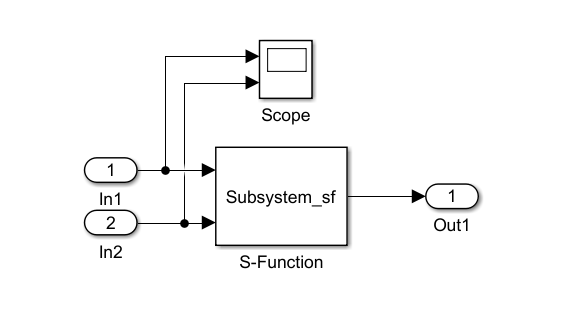   

#### b. 保存数据  

设置示波器保存数据到 MATLAB 工作区。

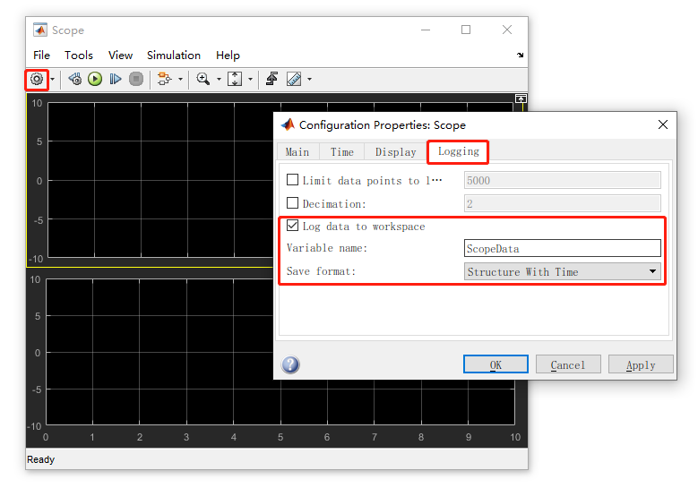   

### 步骤 2：数据处理并导出为 .csv 格式文件 

#### a. 数据处理  

在 MATLAB 中处理示波器保存的数据，将每一路引脚的数据按照第一列时间、第二列数据的方式另存。  

:::tip
每组数据的第一行添加一个索引号，第一列是 `0`，第二列是 `1`（将数据导入 CloudPSS 时的识别需要）。
:::  

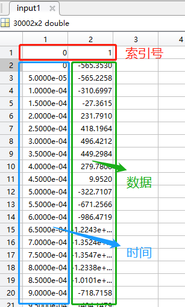   

#### b. 导出 .csv  

使用 `dlmwrite` 命令将每路输入引脚的数据导出为 `.csv` 格式，命令参考如下：

```
dlmwrite('input1.csv', input1, 'delimiter', ',', 'precision', 9);  
```
:::warning
为保证导出的 `.csv` 文件中数据的精度，请使用 `dlmwrite` 而不使用 `csvwrite`。
:::  

### 步骤 3：利用 CloudPSS 自定义曲线元件导入 .csv 格式文件 

#### a. 自定义曲线元件导入 .csv   

使用 **CloudPSS 控制-非线性函数**库中的**自定义曲线**元件，在元件参数面板的`编辑数据`中直接导入刚才生成的 `.csv` 文件。  

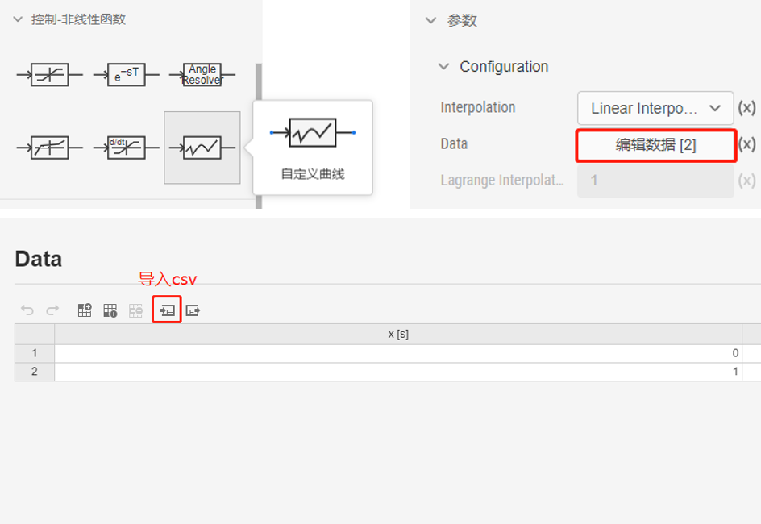   

#### b. 数据输入  

自定义曲线的输入是**控制-基础**库中的**时间输入**元件，输出连到 S-Function 元件的对应引脚。  

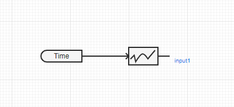     

### 步骤 4：对比开环测试结果  

#### a. 将 S-Function 元件的所有输入引脚都以 .csv 导入的形式输入数据。

#### b. 在运行标签页中，设置与生成 S-Function 时固定步长相同的积分步长。  

#### c. 根据输入数据的长度，设置合适的仿真结束时间，运行仿真得到开环测试结果。  


## 案例介绍   

### 1. 封装白盒模型  

在 Simulink 构建一个三相整流器模型，如下图所示。  

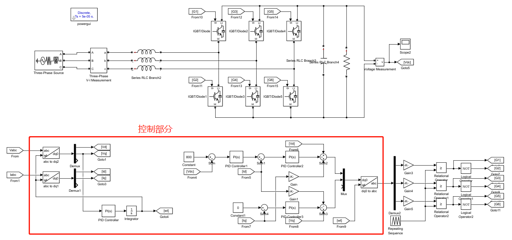  

将控制部分封装成一个子系统，并命名为 `Control` 。子系统有 3 个输入，维数分别是 3、3、1，和 1 个输出，维数是 3。  

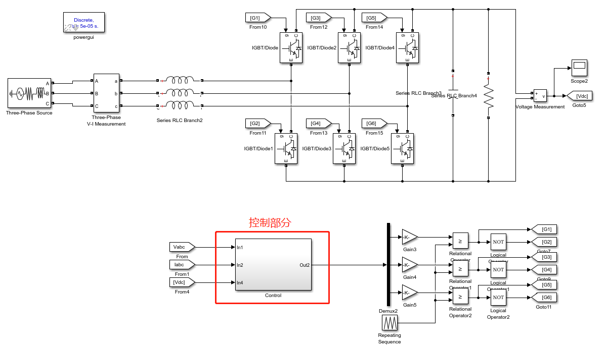  

将子系统中的**锁相环比例系数 `Kp_PLL`**、**锁相环积分系数 `Ki_PLL`**、**电压环比例系数 `Kp_V`**、**电压环积分系数 `Ki_V`**、**电流环比例系数 `Kp_I`**、**电流环积分系数 `Ki_I`**、**直流电压参考值 `Vdc_ref`**、**交流滤波电感值 `Lf`** 定义为全局参数，并在模型初始化页面赋值。  

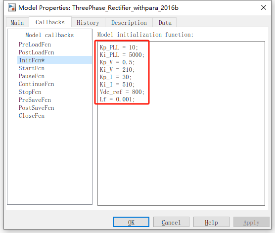  

也可以对子系统进行参数封装后再引用全局参数。若封装后的参数未使用全局参数，将作为固定值写入 S-Function，不可调。  

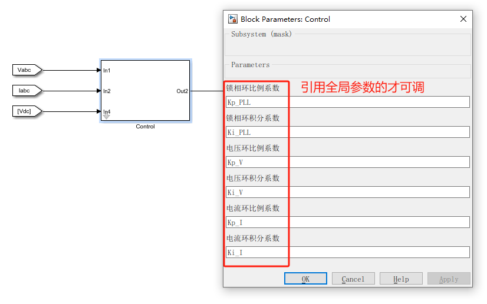   

本案例中的解算器设置如下图所示，固定步长 `50us`，采用 `ode1`（欧拉积分）。运行仿真，确认当前设置下模型无报错。  

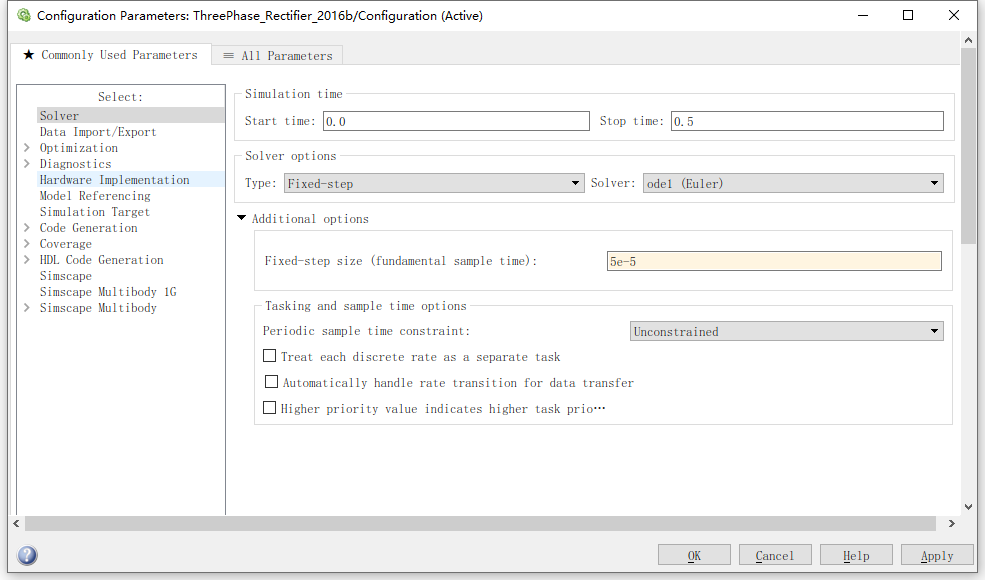   

### 2. 自动代码生成  

右键子系统，选择 `C/C++ Code`，点击 `Generate S-Function`，在弹出的对话框中勾选可调参数，点击 `Build`，开始自动生成代码并编译 S-Function。  

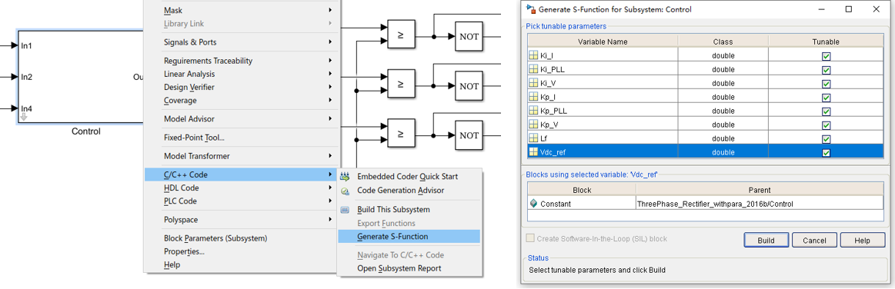   

编译成功后，会弹出封装好的 S-Function 模块，以及自动生成的包含 `.c`、`.h` 文件的 `sfcn_rtw` 文件夹。  

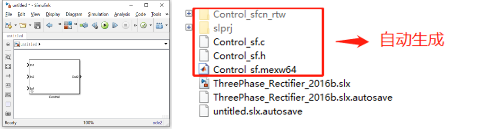   

### 3. 编译生成 .so  

打开 `sfcn_rtw` 文件夹中的 `Control_sf.c` 文件，添加接口函数定义。由于引脚维数不为 1，此步骤不可省略。  

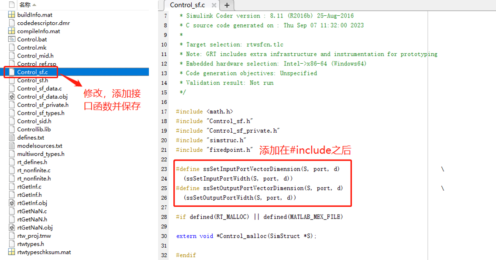   

在 MATLAB 安装路径的 `simulink\include和extern\include` 文件夹中，将所需 `.h` 头文件复制到 `sfcn_rtw` 文件夹。  

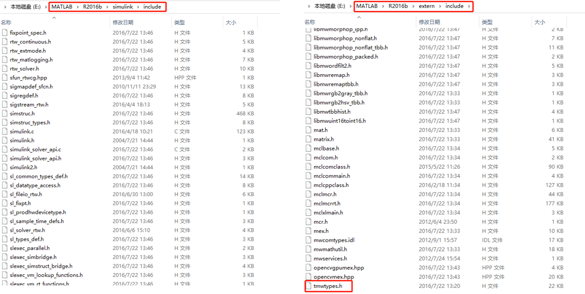   

将整个 `sfcn_rtw` 文件夹复制到 64 位 Linux 系统。  

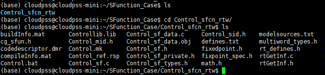   

在路径下输入命令:  

```
gcc -Wall -DRT -DRT_MALLOC -fPIC -lm -shared *.c -o Control.so
```
完成编译。

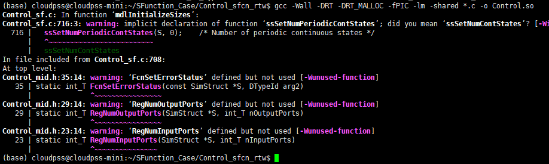   

编译成功后，会在路径下生成 `.so` 文件，将 `.so` 文件复制到本地。   

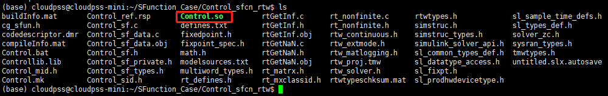   

### 4. 构建前台元件  

在 CloudPSS 平台构建 S-Function 实现的前台元件。  

在`实现标签页`的参数列表定义栏，新建参数组，并添加参数，参数键名与 S-Function 的可调参数名一致，参数类型设为实数，输入类型为常量，默认值可与 Simulink 模型初始化页面的赋值一致。  

在引脚列表定义栏，添加 `input1`、`input2`、`input3` 和 `output1` 引脚，按照数据维数和连接类型设置。  

在参数和引脚定义好后，可点击元件图形设计窗口右上角的`直接导入`按钮，根据引脚类型和数量生成一个默认图形，在默认图形基础上自定义元件图形。  

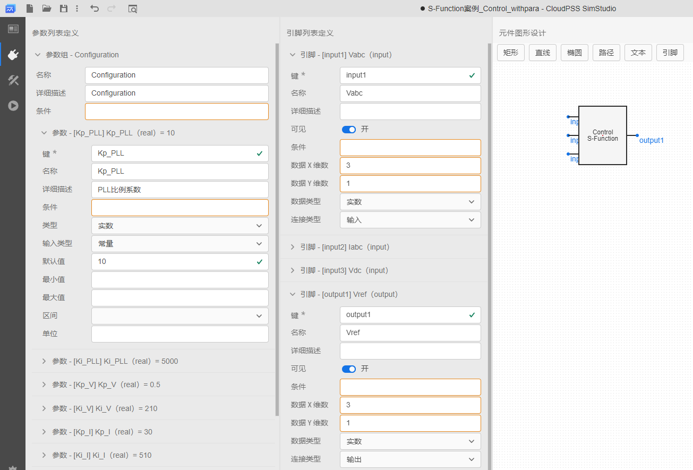   

在实现标签页，导入 `.so` 文件，填写入口函数名。注意，入口函数名不是 `.so` 文件的名称，而是 S-Function 的名称，本案例中是 `Control_sf`。  

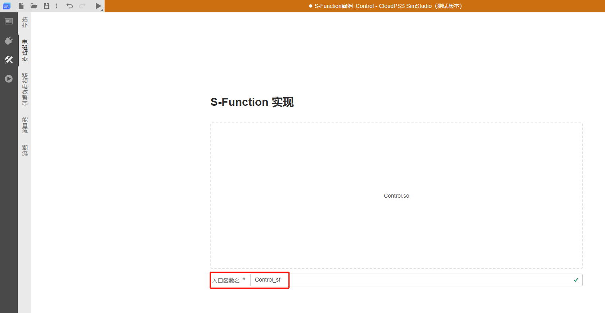   

### 5. 开环测试  

在 Simulink 模型的 S-Function 输入引脚处添加示波器，并设置录波。  

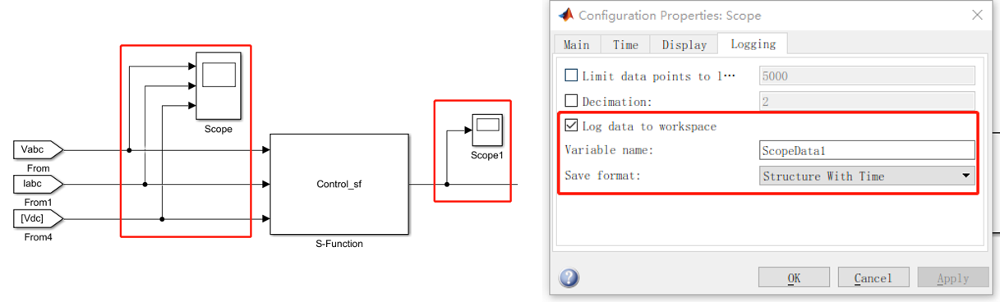   

运行仿真，整理录波数据，将每一路输入引脚处理成第一列时间、第二列数据，并在第一行添加索引。  

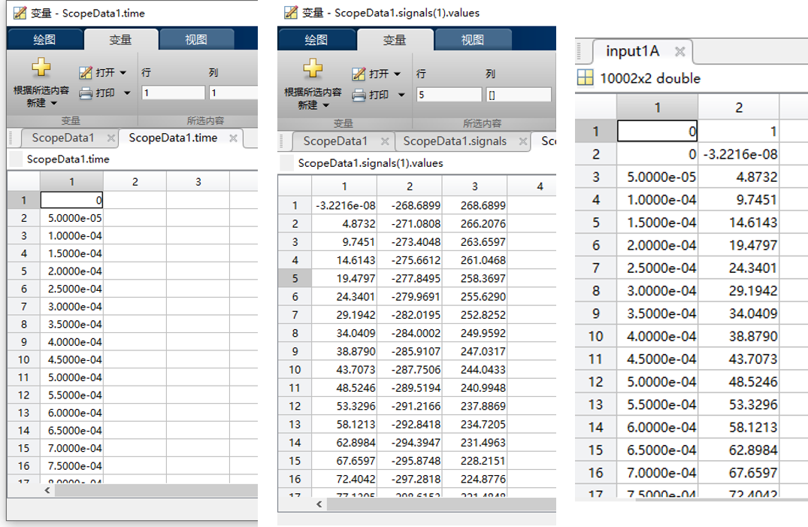  

使用 `dlmwrite` 将整理后的数据导出为 `csv` 文件。  

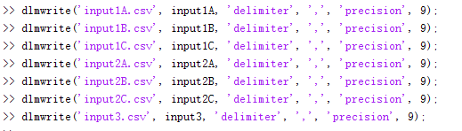  

在 CloudPSS 平台利用**自定义曲线**元件导入每一路输入引脚的数据，导入成功后如下图所示。

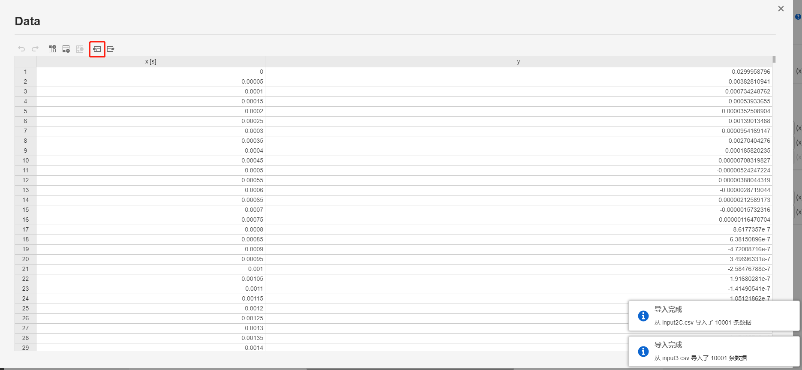  

完成所有输入引脚的数据导入后，开环测试模型如下图所示。  

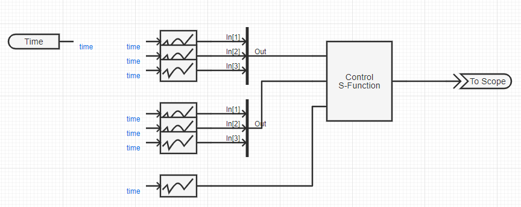   

运行仿真，对比 CloudPSS 与 Simulink 的开环测试结果，验证所构建的 S-Function 元件的正确性。  

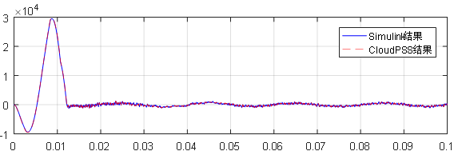   

### 6. 闭环测试  

将 S-Function 元件放入搭建好的电气系统算例，输入引脚连接量测信号，运行仿真完成闭环测试。  

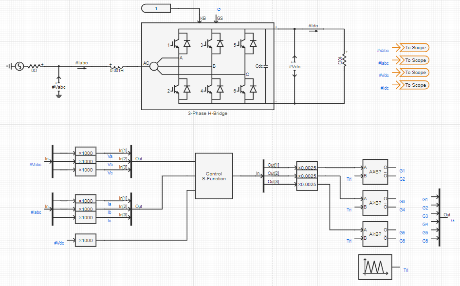   

闭环测试结果如下图所示。  

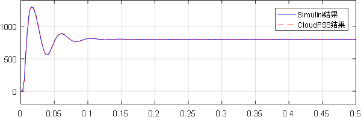   

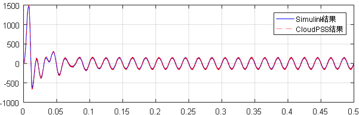   

## 其它使用技巧  

### 1. 控制器采样倍率设置  

S-Function 封装的采样步长固定为生成 S-Function 时控制器子系统的采样步长。在某些应用场景，控制器的采样步长可能与仿真步长不一致。Simulink 中，要求控制器采样步长为仿真步长的整数倍，如仿真步长为 `10us`，而控制器以 `50us`（仿真步长的 `5` 倍）进行采样和计算。  

CloudPSS 中内置了采样倍率参数来应对这种情况。用户可根据控制器需求选择是否需要添加这个参数，当不添加这个参数时，其值默认为 `1`，即控制器采样步长与仿真步长一致。  

该参数键名为：`__SFUNC_STEP`，添加方法如下：

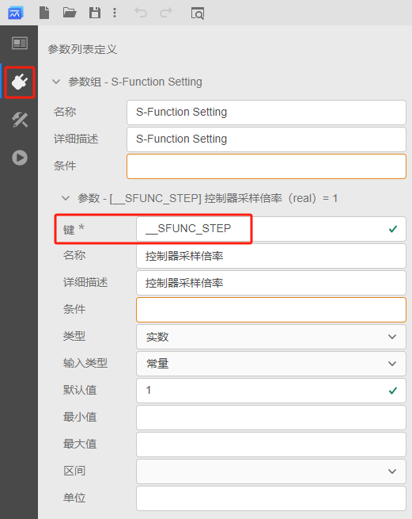   

:::warning
参数以两个下划线开头。为避免系统识别错误，用户自定义的其它全局参数名只能以字母开头，不能以数字或下划线开头。
:::  

### 2. 解算器积分方式选择  

针对 Simulink 中不同阶数的连续积分解算器，CloudPSS 进行了适配，目前支持的有 ode1、ode2、ode3、ode4、ode5 和 ode8。  

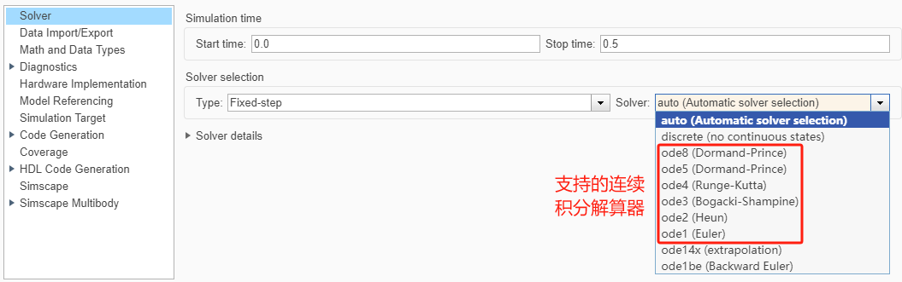   

在 CloudPSS 中，内置了定义解算器类型的参数，参数键名为：`__SFUNC_SOLVER`，参数值为与目标解算器类型同名的字符串。例如，可将该参数定义为选择型参数，其键值分别为 `ode1`、`ode2`、`ode3`、`ode4`、`ode5` 和 `ode8`。  

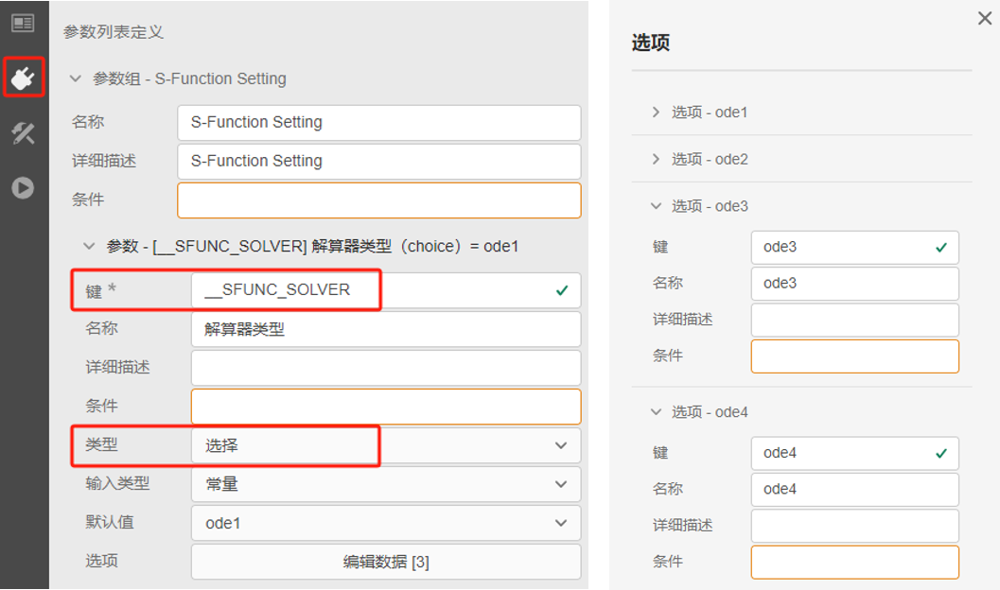   

当模型中不存在连续积分时，解算器默认为离散解算器 `discrete`，该参数的设置无效；当模型中存在连续积分时，该参数值默认为 `ode3`。  

### 3. 矩阵参数输入  

若 S-Function 的全局参数是一个矩阵，在 CloudPSS 中，需要用表格型参数与之对应。  

例如，全局参数 `a` 是一个 1×3 的矩阵，其值为 `[1, 2, 3]`。在 CloudPSS 中构建前台元件时，添加一个表格型参数，在列定义选项中新建 1 个列定义，在默认值选项中添加 3 行，并分别设置为 1、2、3，如下图所示。  

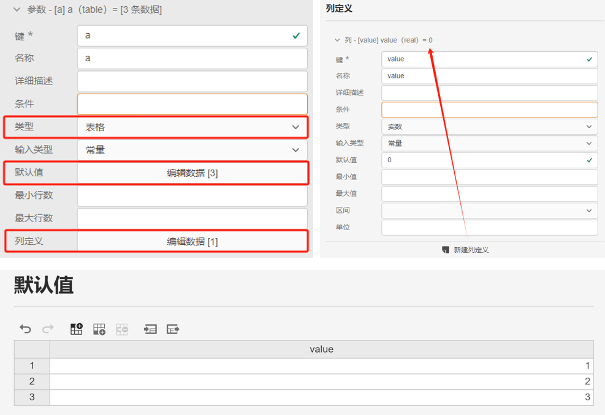   

在元件参数面板设置或修改表格型参数时，也可以点击参数框右侧的`(x)`按钮切换为表达式输入形式，再输入 `[1, 2, 3]`，完成数据编辑。

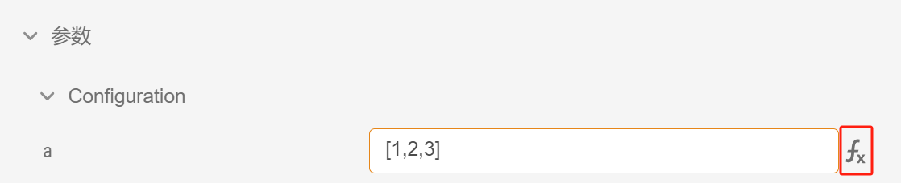  

若全局参数 `a` 是一个 3×3 的矩阵，其值为 `[1, 2, 3; 4, 5, 6; 7, 8, 9]`，则在 CloudPSS 中，按照先行后列的顺序，填入所有矩阵元素。例如，将表格型参数切换为表达式输入形式，再输入 `[1, 2, 3, 4, 5, 6, 7, 8, 9]`。