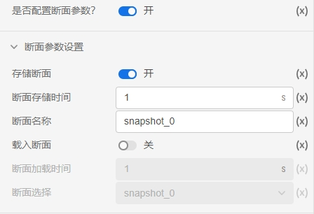
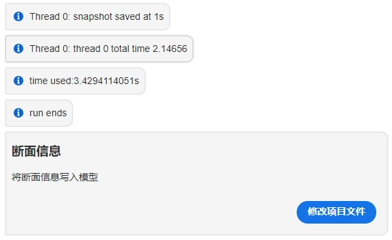
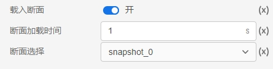
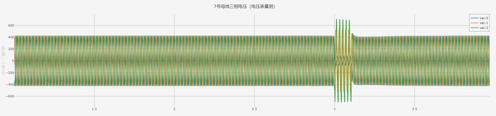

 
 
CloudPSS SimStudio提供了电磁暂态仿真过程中的断面保存和断面导入功能。可在`运行`标签页->`电磁暂态仿真方案`->`断面参数`处设置。

## 断面存储

仿真前，勾选`是否配置断面参数`并填写`断面存储时间`和`断面名称`后，即可在下次电磁暂态仿真到达`断面存储时间`时保存该次仿真在该时刻的全部数据。  

如下图，设置设置`断面存储时间`为1s，点击`开始`。仿真开始后，在仿真结果处看到如下信息，点击修改项目文件，将断面信息写入模型。

::: tip
只有**保存后**的算例项目才可进行断面存储操作。
:::

## 断面导入/载入

仿真前，勾选`载入断面`，并选择所导入的`断面名称`后，系统会将该断面的存储时间自动填入`断面加载时间`时。设置`仿真开始时间`与`断面载入时间`相同，即可直接从`断面加载时间`开始仿真。

如下图，选择断面，`断面加载时间`自动填充为1s。

设置仿真`开始时间`与`断面载入时间`相同，为1s，点击`开始`。仿真开始后，在`系统信息`处看到如下信息，说明断面载入成功。

::: 
Thread 0: snapshot loaded at 1.00005s
::: 

波形窗口中，曲线直接从断面载入时刻开始仿真。  

::: tip
若仿真`开始时间`与`断面载入时间`不一致，则可能会引发错误的断面导入。
:::