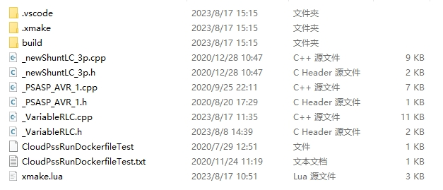
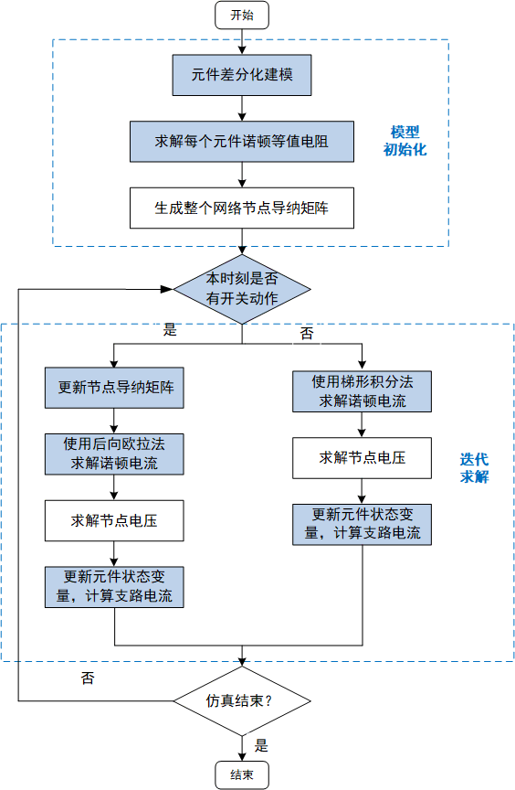
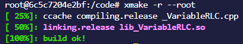
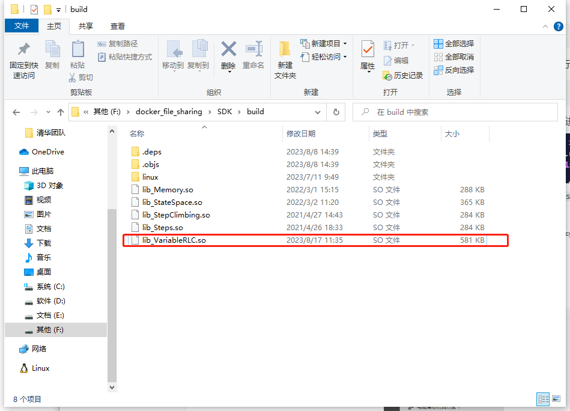
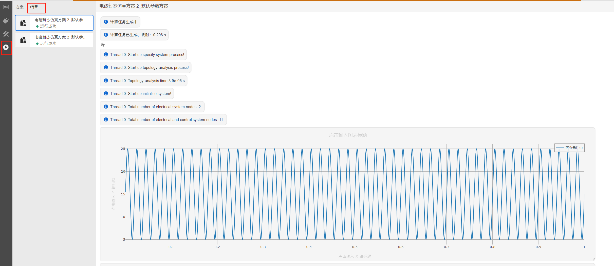

EMTLab Core SDK提供了使用EMTLab仿真内核来自定义电磁暂态仿真元件的功能。EMTLab Core SDK采用C++代码编写，电磁暂态仿真原理详见[电磁暂态仿真原理](docs/zh-hans/EMTLab/EMPT/fundamental/index.md)帮助文档，本文档主要说明使用EMTLab Core SDK编写自定义元件的方法。

## 必要软件
- Docker  
  Docker容器作为编译的环境
- VSCode  
  用于C++编辑器，终端

## EMTLab Core SDK的基本介绍
SDK的目录结构如下图，`build`文件夹下为SDK的编译产物，自定义元件需要用户创建并编写`xxx.h`和`xxx.cpp`文件，`xmake.lua`为编译的相关配置。  

  

EMTLab电磁暂态仿真流程图如下图，其中蓝色框图部分是EMTLab对于每一个元件分别进行处理的部分，即自定义元件时需要详细定义的部分，无色框图部分为后台程序自行计算的步骤。

  

::: tip
为了避免仿真中的数值振荡，EMTLab在开关动作、电阻变化时会采取特殊的处理机制，即CDA过程。CDA过程的本质是做两个半步长的后向欧拉法数值积分。用户可通过本时刻是否有开关动作（或自定义逻辑）进入CDA。
:::

::: info
EMTLab电磁暂态仿真的前三个仿真时步固定进入CDA，共计6个时步的CDA过程。这是为了避免非ramp启动时产生数值振荡。
:::

### 电气元件编写方法
本节以`可变RLC元件`为例，介绍自定义电气元件的编写方法。可变RLC元件需要定义`_VariableRLC.h`和`_VariableRLC.cpp`文件。  

`_VariableRLC.h`文件的定义如下，需要说明的是`Component.h`为所有电气元件的基类，即电气元件均继承自该类，`public`的方法作用见注释，`private`的方法与变量由用户自定义。

```C++
#ifndef _VARIABLERLC_H
#define _VARIABLERLC_H

#include "Component.h"

class _VariableRLC : public Component
{
public:
	_VariableRLC(){};
	~_VariableRLC(){};

	// 元件初始化（定义元件的电气引脚，控制引脚，虚拟引脚，支路信息）
	virtual void initialComponent(int id, string name, Json::Value &root);
	// 计算支路的诺顿等效电阻
	virtual void calculateNortonEquivalentResistance(double time); 
	// 注册共享内存
	virtual int regEMTPParaMem(EMTPMem &);
	// 判断是否进入CDA
	virtual void formcheckNoneInterpolatedSwitchVec(std::vector<std::function<int(double time, double *, double *, double *, double *, std::map<string, vec> &)>> &);
	// 梯形积分法求解诺顿电流
	virtual void formNortonEquivCurrentCalCallVec(std::vector<std::function<int(double time, double *, double *, std::map<string, vec> &)>> &);
	// 后向欧拉法求解诺顿电流
	virtual void formNortonEquivCurrentCDACalCallVec(std::vector<std::function<int(double time, double *, double *, std::map<string, vec> &)>> &);
	// 求解支路电流，更新元件状态变量
	virtual void formBranchCurrentCalCallVec(std::vector<std::function<int(double time, double *, double *, std::map<string, vec> &)>> &funVec);
	
private:
	string IName, VName, RName, LName, CName;
	int DECLAREOUTFLAG(IName), DECLAREOUTFLAG(VName), elementType;
	double resistanceValue;
	double inductanceValue;
	double capacitanceValue;
	bool enableDLeff, enableDCeff;
};

#endif
```
::: tip  
为什么要调用regEMTPParaMem函数来注册内存？  
因为将所有需要复写的状态量写进内存，迭代过程中可以直接对一块公用的内存池进行处理，提高代码运行效率。   
什么变量需要注册内存？  
除了支路电流、支路电压、诺顿等值电流（这些变量已经在后台程序中定义）以外的需要不断迭代更新的量。即有三个条件：1.它会在仿真过程中发生改变。2.在仿真过程中会用到该值的历史量。3.不是支路电流、支路电压、诺顿等值电流这几个变量。
:::

`_VariableRLC.cpp`文件为元件的具体实现代码，本节仅选取元件函数内部关键代码进行说明，元件完整代码请自行查阅。  

`initialComponent`函数为元件的初始化，该方法的具体说明如下：

```C++
void _VariableRLC::initialComponent(int id, string name, Json::Value &root) {
  // nElePort、nCtrlInPort、nCtrlOutPort分别代表电气引脚数量、控制输入引脚数量、控制输出引脚数量
  nElePort = 2;
  nCtrlInPort = 0;
  nCtrlOutPort = 0;
  nOrder = 1;
  mergeRequestNumber = 0;
  
  // 定义电气引脚
  for (int i = 0; i < nElePort; ++i) {
    char nodeName[100];
    sprintf(nodeName, "%d", i);
    // 定义一个tempNode为1*1维的电气引脚
    EMTPNode tempNode(1, 1, root["pin"][nodeName]);
    // eleNode为EMTPNode类型的Vector，使用push_back()在向量的末尾添加这个tempNode。
    eleNode.push_back(tempNode);
  }
  // 定义支路信息
  NodeIdx from;
  from.init(0, 0); // from.init(0, i)代表这条支路的起始点为0号节点的第i维
  NodeIdx to;
  to.init(1, 0); // to.init(1, i)代表这条支路的终止点为1号节点的第i维。
  branchInfo.push_back(EMTPBranchInfo(from, to)); 

  // 获取前台元件参数
  elementType = atoi(root["param"]["Type"].asCString()); // root为该元件的json脚本，内有参数及引脚信息
  // 初始化支路电流、电压等矩阵，必须调用
  initialMatrix();
  // 虚拟引脚的初始化
  DECLAREOUTFLAG(IName) = setOutputVariable(IName, "I", vec(1).zeros(), root);
}
```

`calculateNortonEquivalentResistance`函数计算诺顿等值支路导纳（矩阵），该方法的具体说明如下：

```C++
void _VariableRLC::calculateNortonEquivalentResistance(double time) {
  // RLC元件的诺顿等值支路导纳矩阵为1*1维，通过类型判断，分别求解元件诺顿等值电阻
  switch (elementType) {
    case 0:{
      branchEquivalentConductance(0, 0) = 1.0 / resistanceValue;
      break;
    }
    case 1:{
      branchEquivalentConductance(0, 0) = deltaT / (2.0 * inductanceValue);
      break;
    }
    case 2:{
      branchEquivalentConductance(0, 0) = 2.0 * capacitanceValue * 1e-6 / deltaT;
      break;
    }
  } 
}
```
::: info
EMTLab Core SDK内的电流基本单位为A，电压基本单位为V，电阻基本单位为Ω，电感基本单位为H，电容基本单位为μF，时间基本单位为s，其余基本单位请使用国际单位制基本单位。
:::

`regEMTPParaMem`函数用于注册共享内存，该函数的具体说明如下：

```C++
int _VariableRLC::regEMTPParaMem(EMTPMem &emtpMem){
  // paraPtrMap键值对为 previousInductanceValue:内存指针，内存指针指向的内存的初始数值为0
  emtpMemInfo.paraPtrMap["previousInductanceValue"] = emtpMem.regParaMem(0);
  emtpMemInfo.paraPtrMap["previousCapacitanceValue"] = emtpMem.regParaMem(0);
  return 0;
}
```

`formcheckNoneInterpolatedSwitchVec`函数用于判断是否进入CDA，自定义判断逻辑，此处注意返回值含义：
```C++
return 0; // 没有开关动作，不进入CDA
return 1; //有开关动作，会更改导纳矩阵的稀疏度，进入CDA
return 98765; //有导纳的变换，不会更改导纳矩阵的稀疏度，进入CDA
return 99999; //有导纳的变换，不会更改导纳矩阵的稀疏度，不进入CDA
```

`formNortonEquivCurrentCalCallVec`函数用于计算元件的诺顿等效电流，函数的具体说明如下：

```C++
void _VariableRLC::formNortonEquivCurrentCalCallVec(std::vector<std::function<int(double time, double *, double *, std::map<string, vec> &)>> &funVec) {
  // 必要参数的指针，如支路电流、直流电压、导纳矩阵、诺顿电流等
  // 支路电流、支路电压、诺顿等值电流、诺顿等值导纳矩阵固定从emtpMemInfo中取指针，从nodeMem取值
  int nBranch = getBranchInfoSize();
  int branchCurrentPtr = emtpMemInfo.branchCurrentPtr[0];
  int preLValuePtr = emtpMemInfo.paraPtrMap["previousInductanceValue"].asInt();
  int LPort = inputVariableMap["L_var"].portNum;

  // auto funCall以外的部分都只执行一次,auto funCall以内的部分每个时步都会执行
  auto funCall = [=](double time, double *nodeMem, double *paraMem, std::map<string, vec> &globalParamMap) {
    // 矩阵及向量使用Armadillo库,详见http://arma.sourceforge.net/docs.html
    vec branchCurrent(&nodeMem[branchCurrentPtr], nBranch, false, false);
    vec branchVoltage(&nodeMem[branchVoltagePtr], nBranch, false, false);
    mat branchEquivalentConductance(&nodeMem[branchEquivalentConductancePtr], nBranch, nBranch, false, false);
    vec nortonEquivalentCurrent(&nodeMem[nortonEquivalentCurrentPtr], nBranch, false, false);

    // 采用梯形积分法求解元件的诺顿等效电流
    nortonEquivalentCurrent = branchCurrent + branchEquivalentConductance * branchVoltage;
    paraMem[preLValuePtr] = nodeMem[ctrlInNodeMap[LPort][0]];
    return 0;
  };
  funVec.push_back(funCall);
}
```

`formNortonEquivCurrentCDACalCallVec`函数用于计算CDA过程元件的诺顿等效电流，函数的具体说明如下：

```C++
void _VariableRLC::formNortonEquivCurrentCDACalCallVec(std::vector<std::function<int(double time, double *, double *, std::map<string, vec> &)>> &funVec) {
  // 必要参数的指针
  int branchCurrentPtr = emtpMemInfo.branchCurrentPtr[0]; 

  auto funCall = [=](double time, double *nodeMem, double *paraMem, std::map<string, vec> &globalParamMap) {
    // 设置参数矩阵
    vec branchCurrent(&nodeMem[branchCurrentPtr], nBranch, false, false);
    vec nortonEquivalentCurrent(&nodeMem[nortonEquivalentCurrentPtr], nBranch, false, false);
    
    // 采用半步长的后向欧拉法求解元件的诺顿等效电流
    nortonEquivalentCurrent = branchCurrent;
    paraMem[preLValuePtr] = nodeMem[ctrlInNodeMap[LPort][0]];
    return 0;
  };
  funVec.push_back(funCall);
}
```

`formBranchCurrentCalCallVec`函数用于计算支路电流，函数的具体说明如下：

```C++
void _VariableRLC::formBranchCurrentCalCallVec(std::vector<std::function<int(double time, double *, double *, std::map<string, vec> &)>> &funVec) {
  int nBranch = getBranchInfoSize();
  if (nBranch <= 0) return;
  int branchCurrentPtr = emtpMemInfo.branchCurrentPtr[0];
  int branchVoltagePtr = emtpMemInfo.branchVoltagePtr[0];
  int nortonEquivalentCurrentPtr = emtpMemInfo.nortonEquivalentCurrentPtr[0];
  int branchEquivalentConductancePtr = emtpMemInfo.nortonEquivalentConductancePtr[0];

  auto funCall = [=](double time, double *nodeMem, double *paraMem, std::map<string, vec> &globalParamMap) {
    vec branchCurrent(&nodeMem[branchCurrentPtr], nBranch, false, false);
    vec branchVoltage(&nodeMem[branchVoltagePtr], nBranch, false, false);
    vec nortonEquivalentCurrent(&nodeMem[nortonEquivalentCurrentPtr], nBranch, false, false);
    mat branchEquivalentConductance(&nodeMem[branchEquivalentConductancePtr], nBranch, nBranch, false, false);

    // 支路电流矩阵计算
    branchCurrent = nortonEquivalentCurrent + branchEquivalentConductance * branchVoltage;
    // 设置虚拟引脚输出
    SETOUTVAR(IName, branchCurrent / 1e3);
    return 0;
  };
  funVec.push_back(funCall);
}
```

### 控制元件编写方法
控制元件的编写方法与电气元件类似，但没有CDA过程，实现的函数也与电气元件有所区别，本节仅对控制元件的函数进行说明，具体编写方法请查阅控制元件源代码。

控制元件需要定义`_XXXX.h`和`_XXXX.cpp`文件。`_XXXX.cpp`文件的实现请查看示例代码，本处不在赘述，`_XXXX.h`的说明如下：

```C++
#ifndef _XXXX_H
#define _XXXX_H

#include "CtrlComponent.h" 
#include "CtrlMacro.h" // CtrlMacro.h文件以宏的方式定义了许多传递函数的内核

class _XXXX: public CtrlComponent // CtrlComponent为所有控制元件的基类
{
public:
	_XXXXp(){};
	~_XXXX(){};

  // 元件初始化
	virtual int initialComponent(int id,string name,Json::Value &root);
  // 注册共享内存
	virtual int regEMTPMem(EMTPMem &);
  // 控制元件计算逻辑实现
	virtual void formCalculateCallVec(std::vector<std::function<int(double time,double *,double *,std::map<string,vec>&)>> &);

private:
	double Kp,Ti;
	double Q[2];
};

#endif
```

## 自定义元件调试方法

### 调试前的准备

#### Docker配置

- 共享文件的配置  
为了方便调试，可以将本地的文件挂载到容器里，共享文件方便本地修改。打开Docker Desktop，设置你想要共享的文件路径，如下图所示：  

  

- docker镜像准备  
  docker镜像的获取需询问客服或找相关负责人获取。

#### SDK配置
EMTLab Core SDK的使用为高级功能，SDK的获取需询问客服或找相关负责人获取。  

- 共享文件的配置  
  将SDK文件放在docker设置的共享文件路径下
- 需要调试的元件`.cpp`文件最后加上以下代码  
  ```C++
  extern "C"
  {
      CtrlComponent *_FQExciter1maker()
      {
          return new _FQExciter1;
      }
  }
  ```
  其中`CtrlComponent`是元件继承的`ClassName`，别的`ClassName`还有`Component`，
  `SFAComponent`， `SFACtrlComponent`。需要根据编写的元件类型进行修改，`_FQExciter1maker()`和`_FQExciter1`根据自定义元件类名进行替换（比如`_VariableRLC`)  
- 修改`xmake.lua`文件  
  将`_FQExciter1`替换为自定义元件的类名（比如`_VariableRLC`)  
  ```
  set_targetdir("$(buildir)")
  target("_FQExciter1")
     -- set kind
    set_kind("shared")
    --set_kind("static")
    set_languages("c99","cxx11")
    -- set_symbols("debug")
    add_cxflags("-fPIC")
    -- add files
    add_files("_FQExciter1.cpp")
    set_warnings("all")
    --add_includedirs("inc/")
    add_linkdirs("/usr/local/lib/octave/6.3.0/")
    add_links("CloudPSSCore"); 
  ```
### 自定义元件调试
- 运行docker容器
  ```bash
  docker run -it -v D:\CloudPSS\SDK1/:/code  --add-host=redis.local:10.101.10.46 --add-host=clickhouse.local:10.101.10.46  --privileged=true  registry.xxx/xxx/xxx /bin/bash	
  ```
  其中的`D:\CloudPSS\SDK1`需要更换为共享文件的路径地址，`10.101.10.46`需要更改为提供的ip地址，`registry.xxx/xxx/xxx`需要更改为提供的镜像

- 编译  
  切换到容器的`code`路径，输入`xmake`命令编译文件
  ```bash
  cd code
  xmake -r --root
  ```
如果编译失败，有语法错误，根据终端提示进行修改，最终编译成功图片如下  
  

最终在`.\SDK\build`目录下可以查看到后缀为`.so`的编译产物，如下图所示： 
  

- 构建前端元件  
  此部分详见[自定义电磁暂态仿真元件](docs/zh-hans/EMTLab/EMPT/custom/index.md)帮助文档

- 构建测试算例  
  使用自定义的元件在EMTLab平台构建测试用例，运行测试用例，查看仿真结果
  

- 调试方法
  如果调试的结果不理想，可以在.cpp源码的关键处添加日志代码，在仿真结果中可查看到对应日志
  ```
  debug_logger->warn("test {}", nortonEquivalentCurrent(0));
  ```
  日志代码使用的格式遵循C++的fmt库，可依次将参数填入{}中，更多fmt格式使用方法可参考[fmt开源库](https://github.com/fmtlib/fmt)

:::tip  
更新代码后需重新编译代码，上传.so文件，并在测试用例中更新元件   
:::